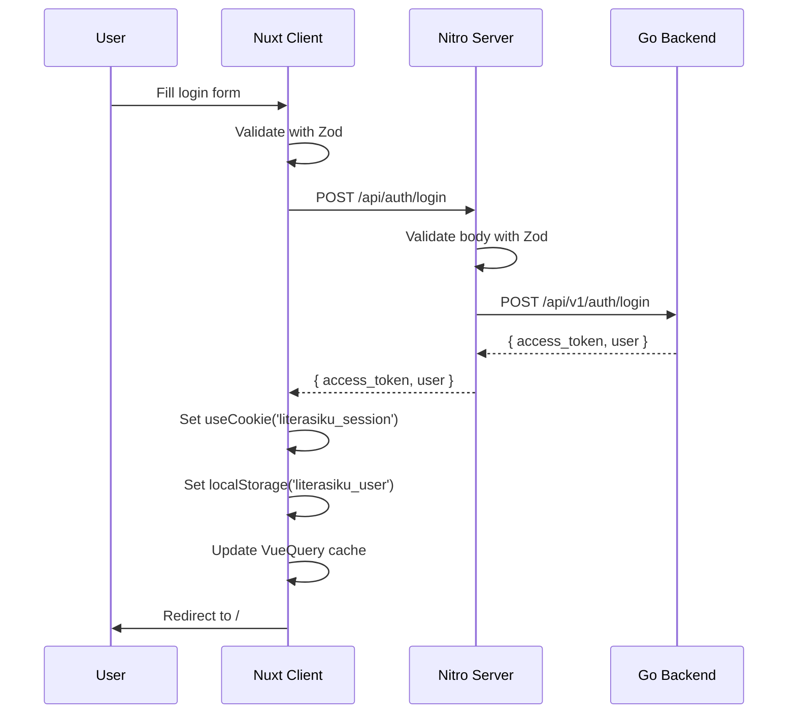
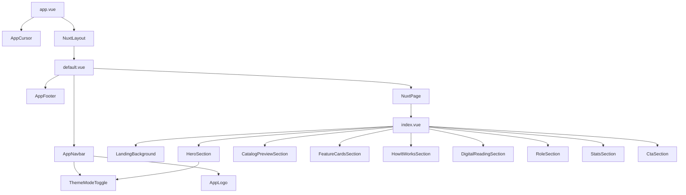
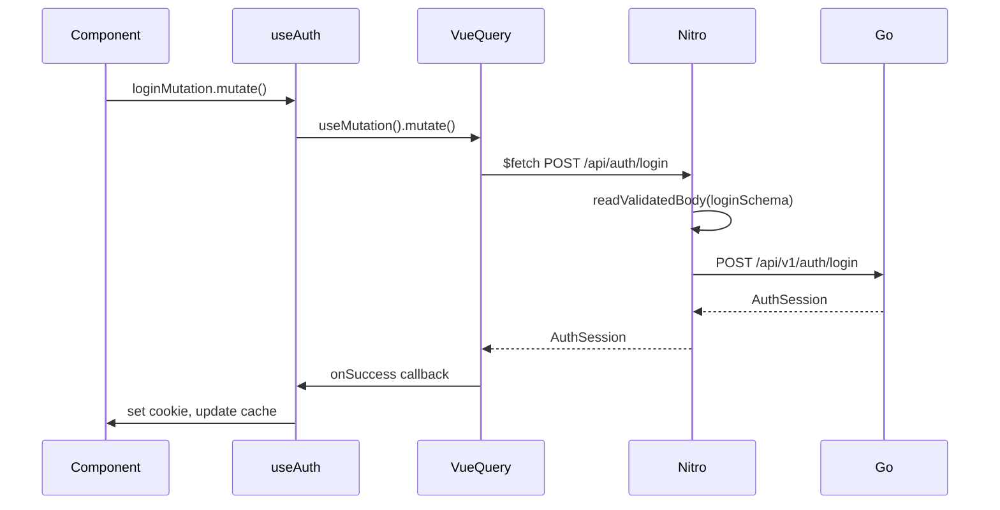

# Technical Audit Report: Literasiku — Client (Nuxt.js)

> **Audit Date:** 2026-06-29  
> **Project:** Literasiku — Digital Library with AI Agent  
> **Scope:** `/client` — Nuxt.js Frontend  
> **Auditor:** Principal Frontend Engineer / Software Architect

---

## Table of Contents

1. [Executive Summary](#1-executive-summary)
2. [Tech Stack](#2-tech-stack)
3. [Project Structure](#3-project-structure)
4. [Nuxt Configuration](#4-nuxt-configuration)
5. [Architecture Analysis](#5-architecture-analysis)
6. [Routing Analysis](#6-routing-analysis)
7. [Layout Analysis](#7-layout-analysis)
8. [Component Analysis](#8-component-analysis)
9. [Composable Analysis](#9-composable-analysis)
10. [State Management](#10-state-management)
11. [API Layer](#11-api-layer)
12. [Authentication](#12-authentication)
13. [Middleware](#13-middleware)
14. [Plugin Analysis](#14-plugin-analysis)
15. [Styling](#15-styling)
16. [UI/UX Analysis](#16-uiux-analysis)
17. [Performance Analysis](#17-performance-analysis)
18. [SEO Analysis](#18-seo-analysis)
19. [Security Analysis](#19-security-analysis)
20. [Forms & Validation](#20-forms--validation)
21. [Error Handling](#21-error-handling)
22. [Logging](#22-logging)
23. [Code Quality](#23-code-quality)
24. [TypeScript Analysis](#24-typescript-analysis)
25. [Accessibility](#25-accessibility)
26. [Internationalization](#26-internationalization)
27. [Testing](#27-testing)
28. [Build & Deployment](#28-build--deployment)
29. [Dependency Analysis](#29-dependency-analysis)
30. [Observability](#30-observability)
31. [Scalability](#31-scalability)
32. [Technical Debt](#32-technical-debt)
33. [Refactoring Opportunity](#33-refactoring-opportunity)
34. [Best Practice Checklist](#34-best-practice-checklist)
35. [Mermaid Diagram](#35-mermaid-diagram)
36. [Production Readiness Score](#36-production-readiness-score)
37. [Final Recommendation](#37-final-recommendation)

---

## 1. Executive Summary

| Aspect | Description |
|---|---|
| **Application Purpose** | Digital library platform with AI-powered chatbot, PDF reader, book catalog, borrowing management, and admin dashboard |
| **Application Type** | SSR Web Application (Nuxt 4) with hybrid rendering |
| **Target Users** | Library members (students/researchers) and administrators |
| **Primary Tech Stack** | Nuxt 4, Vue 3, TypeScript 6, Nuxt UI v4, TailwindCSS 4, TanStack Vue Query, Zod |
| **Project Size** | ~50 source files, ~7,500 lines of code (excluding node_modules and .nuxt) |
| **Complexity** | Medium — well-structured landing page, authentication flow, dashboard layouts; many page stubs yet to be implemented |
| **Pages (implemented)** | 20 route paths, 6 with real content, 14 are empty stubs |
| **Components** | 19 Vue components (shared, feature-specific, layout) |
| **Composables** | 1 custom composable (`useAuth`) |
| **Code Quality** | Above average — clean conventions, good TypeScript usage, well-organized constants, responsive design; significant auth mock data issue and multiple empty pages |

### Key Strengths
- Modern Nuxt 4 + TypeScript 6 stack with excellent developer experience
- Well-organized component hierarchy and separation of concerns
- Beautiful, polished UI with custom cursor, dark mode with view transitions, and parallax effects
- Strong use of Zod schemas for validation with shared type safety
- TanStack Vue Query for robust server state management

### Critical Concerns
- **Hardcoded mock user in `server/api/auth/me.ts`** — returns static data, bypassing the Go backend entirely
- **14 empty page stubs** — majority of admin and dashboard pages lack implementation
- **No test coverage whatsoever**
- **Session token stored in JavaScript-accessible cookie + localStorage** — no HTTP-only cookie
- **Duplicate code** between landing catalog and dashboard catalog components
- **Leftover debug `console.log`** in AppNavbar

---

## 2. Tech Stack

### Core Framework
| Technology | Version | Purpose |
|---|---|---|
| Nuxt | 4.4.8 | Meta-framework for SSR/SSG/CSR |
| Vue | 3.x (bundled) | UI Framework |
| Nitro | 2.13.4 | Server engine (Nuxt 4 built-in) |
| TypeScript | ^6.0.3 | Type safety |
| Node.js | 22 (target) | Runtime |
| Vite | Bundled with Nuxt 4 | Build tool |

### UI & Styling
| Technology | Version | Purpose |
|---|---|---|
| @nuxt/ui | ^4.8.1 | Component library (dashboard, forms, navigation) |
| TailwindCSS | ^4.3.0 | Utility CSS framework |
| @iconify-json/lucide | ^1.2.111 | Icon set (primary) |
| @iconify-json/simple-icons | ^1.2.84 | Icon set (secondary) |
| CSS | Custom | Aurora backgrounds, animations, view transitions |

### State Management & Data Fetching
| Technology | Version | Purpose |
|---|---|---|
| @tanstack/vue-query | ^5.101.0 | Server state (queries, mutations, caching) |
| @vueuse/core | ^14.3.0 | Utility composables (motion, scroll, intersection observer) |

### Validation
| Technology | Version | Purpose |
|---|---|---|
| zod | ^4.4.3 | Schema validation (shared client/server) |

### Animation
| Technology | Version | Purpose |
|---|---|---|
| @vueuse/motion | ^3.0.3 | Scroll-triggered animations (`v-motion`) |

### Logging
| Technology | Version | Purpose |
|---|---|---|
| pino | ^10.3.1 | Server-side structured logging |
| pino-pretty | ^13.1.3 | Pretty-print logs in development |

### AI & Backend Integration (Server-side)
| Technology | Version | Purpose |
|---|---|---|
| @pinecone-database/pinecone | ^8.0.0 | Vector database for RAG |
| langchain | ^1.5.0 | AI orchestration framework |
| pdf-parse | ^2.4.5 | PDF text extraction |

### Linting & Formatting
| Technology | Version | Purpose |
|---|---|---|
| eslint | ^10.4.1 | Linting |
| @nuxt/eslint | ^1.15.2 | Nuxt ESLint integration |
| vue-tsc | ^3.3.3 | TypeScript type-checking for Vue |

### Package Manager
| Technology | Version |
|---|---|
| yarn | 1.22.22 |

---

## 3. Project Structure

```
client/
├── app/
│   ├── app.config.ts              # Nuxt UI theme customization
│   ├── app.vue                    # Root component (SEO meta, layout wrapper)
│   ├── assets/css/main.css        # Global styles, Tailwind, custom themes
│   ├── components/
│   │   ├── AppLogo.vue            # Shared SVG logo component
│   │   ├── auth/
│   │   │   ├── AuthFormCard.vue   # Login/register form with Zod validation
│   │   │   ├── AuthModal.vue      # Modal-based auth (reuses form)
│   │   │   └── AuthPageShell.vue  # Auth page layout shell
│   │   ├── common/
│   │   │   └── AppCursor.vue      # Custom cursor with variant detection
│   │   ├── dashboard/layout/
│   │   │   ├── Navbar.vue         ⚠️ EMPTY — unused placeholder
│   │   │   └── Sidebar.vue        ⚠️ UNUSED — template boilerplate
│   │   ├── landing/
│   │   │   ├── CatalogPreviewSection.vue  # Landing catalog search
│   │   │   ├── CtaSection.vue             # Call-to-action section
│   │   │   ├── DigitalReadingSection.vue  # PDF + AI chatbot preview
│   │   │   ├── FeatureCardsSection.vue    # Feature grid
│   │   │   ├── HeroSection.vue            # Main hero with 3D card effect
│   │   │   ├── HowItWorksSection.vue      # Step workflow (desktop/ mobile)
│   │   │   ├── LandingBackground.vue      # Animated aurora background
│   │   │   ├── RoleSection.vue            # Member vs Admin role cards
│   │   │   └── StatsSection.vue           # Capability highlight cards
│   │   └── layout/
│   │       ├── AppFooter.vue       # Landing page footer
│   │       ├── AppNavbar.vue       # Landing page navbar (scroll-aware)
│   │       ├── DashboardBackground.vue  # Dashboard animated background
│   │       └── ThemeModeToggle.vue       # Dark/light toggle with particles
│   ├── composables/
│   │   └── useAuth.ts              # Auth state, login/register/logout mutations
│   ├── constants/
│   │   ├── catalog.ts              # Book preview data & filter options
│   │   ├── features.ts             # Feature cards data
│   │   ├── footer.ts               # Footer navigation links
│   │   ├── how-it-works.ts         # Step-by-step workflow data
│   │   ├── navigation.ts           # Nav items, admin/user sidebar items
│   │   ├── roles.ts                # Role description data
│   │   └── stats.ts                # Stats highlight data
│   ├── error.vue                   # Custom 404/500 error page with aurora
│   ├── layouts/
│   │   ├── admin.vue               # Admin dashboard layout (role-guarded)
│   │   ├── dashboard.vue           # Member dashboard layout
│   │   └── default.vue             # Landing page layout (navbar + footer)
│   ├── middleware/
│   │   └── auth.global.ts          # Global auth guard middleware
│   ├── pages/
│   │   ├── index.vue               # Landing page (composed of sections)
│   │   ├── auth/
│   │   │   ├── login.vue           # Login page
│   │   │   └── register.vue        # Register page
│   │   ├── dashboard/
│   │   │   ├── index.vue           ⚠️ STUB
│   │   │   ├── katalog/
│   │   │   │   ├── index.vue       # Full catalog with search/filter
│   │   │   │   └── [id].vue        ⚠️ STUB
│   │   │   ├── peminjaman/
│   │   │   │   └── index.vue       ⚠️ STUB
│   │   │   ├── profil/
│   │   │   │   └── index.vue       ⚠️ STUB
│   │   │   └── riwayat/
│   │   │       └── index.vue       ⚠️ STUB
│   │   └── admin/
│   │       ├── index.vue           ⚠️ STUB
│   │       ├── anggota/
│   │       │   ├── index.vue       ⚠️ STUB
│   │       │   └── [id].vue        ⚠️ STUB
│   │       ├── buku/
│   │       │   ├── index.vue       ⚠️ STUB
│   │       │   └── [id]/edit.vue   ⚠️ STUB
│   │       ├── denda/
│   │       │   └── index.vue       ⚠️ STUB
│   │       ├── kategori/
│   │       │   └── index.vue       ⚠️ STUB
│   │       ├── laporan/
│   │       │   └── index.vue       ⚠️ STUB
│   │       └── peminjaman/
│   │           ├── digital.vue     ⚠️ STUB
│   │           └── fisik.vue       ⚠️ STUB
│   ├── plugins/
│   │   └── vue-query.ts            # TanStack VueQuery plugin with SSR hydration
│   └── types/
│       └── landing.ts              # Landing page type definitions
├── public/
│   └── favicon.ico
├── server/
│   ├── api/auth/
│   │   ├── login.post.ts           # Login endpoint → Go backend
│   │   ├── logout.post.ts          # Logout + clear cookie
│   │   ├── me.ts                   ⚠️ MOCK — returns hardcoded user
│   │   └── register.post.ts        # Register → Go backend
│   └── utils/
│       ├── apiCall.ts              # Generic API caller with error handling
│       └── logger.ts               # Pino logger configuration
├── shared/
│   ├── schemas/
│   │   └── auth.schema.ts          # Zod schemas (login, register)
│   └── types/
│       ├── api.ts                  # Generic API response wrapper
│       └── auth.ts                 # AuthUser, AuthSession types
├── nuxt.config.ts
├── tsconfig.json
├── eslint.config.mjs
├── package.json
├── yarn.lock
├── Dockerfile
├── .env / .env.example
├── renovate.json
├── .editorconfig
├── .gitignore
├── README.md
└── .github/workflows/ci.yml
```

### Folder Responsibility

| Folder | Function |
|---|---|
| `app/` | Nuxt 4 app directory — all application code |
| `app/components/` | Vue components organized by domain (auth, landing, layout, common) |
| `app/composables/` | Reusable Vue composables |
| `app/constants/` | Static data, navigation, configuration constants |
| `app/layouts/` | Nuxt layouts (default, dashboard, admin) |
| `app/middleware/` | Route middleware (global auth guard) |
| `app/pages/` | File-based routing pages |
| `app/plugins/` | Vue plugins (VueQuery) |
| `app/types/` | TypeScript type definitions |
| `server/` | Nitro server routes and utilities |
| `server/api/` | API endpoints (auth) |
| `server/utils/` | Server utilities (logger, API caller) |
| `shared/` | Code shared between client and server |
| `public/` | Static assets |
| `.nuxt/` | Auto-generated build artifacts |
| `.github/` | CI/CD workflow |

---

## 4. Nuxt Configuration

**File:** `nuxt.config.ts`

```typescript
export default defineNuxtConfig({
  modules: ['@nuxt/eslint', '@nuxt/ui', '@vueuse/motion/nuxt'],
  devtools: { enabled: true },
  css: ['~/assets/css/main.css'],
  colorMode: { preference: 'light', fallback: 'light', classSuffix: '' },
  ui: {
    theme: {
      colors: ['primary', 'secondary', 'success', 'info', 'warning', 'error', 'neutral'],
      defaultVariants: { color: 'primary', size: 'md' }
    }
  },
  runtimeConfig: {
    // All AI/API keys — public prefix means exposed to client!
    deepseekApiKey: '',
    deepseekFastModel: 'deepseek-v4-flash',
    deepseekThinkingModel: 'deepseek-v4-pro',
    aiDefaultMode: 'fast',
    aiGatewayApiKey: '',
    aiEmbeddingModel: 'openai/text-embedding-3-small',
    pineconeApiKey: '',
    pineconeIndexName: 'literasiku',
    pineconeNamespace: 'default',
    pineconeMemoryNamespace: 'memory',
    memoryEnabled: 'true',
    ragMinScore: '0.3',
    ragMaxReferences: '8',
    goApiBaseUrl: process.env.NUXT_GO_API_BASE_URL || 'http://localhost:8080',
    goInternalApiKey: process.env.NUXT_GO_INTERNAL_API_KEY,
  },
  ssr: true,
  routeRules: { '/': { prerender: false } },
  compatibilityDate: '2025-01-15',
  eslint: { config: { stylistic: { commaDangle: 'never', braceStyle: '1tbs' } } }
})
```

### Key Configuration Findings

| Feature | Status | Notes |
|---|---|---|
| **SSR** | ✅ Enabled | `ssr: true` — full server-side rendering |
| **Modules** | ✅ 3 modules | `@nuxt/eslint`, `@nuxt/ui`, `@vueuse/motion/nuxt` |
| **Devtools** | ✅ Enabled | Should be disabled in production |
| **Route Rules** | ⚠️ Minimal | Only `/` with `{ prerender: false }` — no hybrid routes |
| **Runtime Config** | ⚠️ Public | All keys in `runtimeConfig` (no `private` distinction). API keys are exposed to client-side |
| **Security Config** | ❌ Missing | No CSP, no security headers, no `nitro.security` |
| **Image Optimization** | ❌ Not configured | No `@nuxt/image` module |
| **Font Optimization** | ❌ Not configured | No font loading strategy |
| **Sitemap** | ❌ Not configured | No `@nuxtjs/sitemap` |
| **PWA** | ❌ Not configured | No PWA module |
| **i18n** | ❌ Not configured | No internationalization |
| **Testing** | ❌ Not configured | No `@nuxt/test-utils` |

> **CRITICAL:** `runtimeConfig` without `private` prefix means ALL values are accessible client-side via `useRuntimeConfig()`. API keys should use `runtimeConfig.private` (or `NUXT_SECRET_*` env vars in Nuxt 4) instead.

---

## 5. Architecture Analysis

### Identified Patterns

| Pattern | Status | Evidence |
|---|---|---|
| **Component-Driven** | ✅ Primary | Pages composed of reusable sections |
| **Composable Pattern** | ✅ Used | `useAuth.ts` encapsulating auth logic |
| **Constants Pattern** | ✅ Strong | All static data in `app/constants/` |
| **Feature-Based (partial)** | ✅ Partial | Components grouped by feature (auth/, landing/, layout/, dashboard/) |
| **Repository Pattern** | ⚠️ Partial | `server/utils/apiCall.ts` provides base error handling |
| **Container/Presentational** | ⚠️ Inconsistent | Mix of concerns in some components (CatalogPreviewSection has SEO, filtering, navigation logic) |
| **Atomic Design** | ❌ Not used | No atoms/molecules/organisms hierarchy |
| **Clean Architecture Layers** | ❌ Not applied | No service/repository/DTO layers on client |

### Architecture Assessment

The application follows a **feature-based component architecture** with constants-driven data, which is appropriate for a project of this size. The separation of `shared/` types and schemas between client and server shows good architectural awareness for a Nuxt monolith.

However, several architectural concerns exist:

1. **No client-side service layer** — API calls are made directly in composables via `$fetch` rather than through a centralized API service
2. **Inconsistent data flow** — Some data comes from constants (static mock), some from API, some from hardcoded server mocks
3. **No abstraction between pages and API** — `useAuth.ts` directly calls `$fetch('/api/auth/...')` with no intermediary service
4. **Missing repository pattern** — No typed repository classes for CRUD operations

---

## 6. Routing Analysis

### Page Routes

| Route | File | Layout | SSR | Status | Notes |
|---|---|---|---|---|---|
| `/` | `pages/index.vue` | `default` | ✅ | Implemented | Landing page |
| `/auth/login` | `pages/auth/login.vue` | `default` | ✅ | Implemented | Login form |
| `/auth/register` | `pages/auth/register.vue` | `default` | ✅ | Implemented | Register form |
| `/dashboard` | `pages/dashboard/index.vue` | `dashboard` | ✅ | ⚠️ Stub | Empty title |
| `/dashboard/katalog` | `pages/dashboard/katalog/index.vue` | `dashboard` | ✅ | Implemented | Full catalog |
| `/dashboard/katalog/:id` | `pages/dashboard/katalog/[id].vue` | `dashboard` | ✅ | ⚠️ Stub | Empty |
| `/dashboard/peminjaman` | `pages/dashboard/peminjaman/index.vue` | `dashboard` | ✅ | ⚠️ Stub | Empty |
| `/dashboard/profil` | `pages/dashboard/profil/index.vue` | `dashboard` | ✅ | ⚠️ Stub | Empty |
| `/dashboard/riwayat` | `pages/dashboard/riwayat/index.vue` | `dashboard` | ✅ | ⚠️ Stub | Empty |
| `/admin` | `pages/admin/index.vue` | `admin` | ✅ | ⚠️ Stub | Empty title |
| `/admin/anggota` | `pages/admin/anggota/index.vue` | `admin` | ✅ | ⚠️ Stub | Empty |
| `/admin/anggota/:id` | `pages/admin/anggota/[id].vue` | `admin` | ✅ | ⚠️ Stub | Empty |
| `/admin/buku` | `pages/admin/buku/index.vue` | `admin` | ✅ | ⚠️ Stub | Empty |
| `/admin/buku/:id/edit` | `pages/admin/buku/[id]/edit.vue` | `admin` | ✅ | ⚠️ Stub | Empty |
| `/admin/kategori` | `pages/admin/kategori/index.vue` | `admin` | ✅ | ⚠️ Stub | Empty |
| `/admin/laporan` | `pages/admin/laporan/index.vue` | `admin` | ✅ | ⚠️ Stub | Empty |
| `/admin/denda` | `pages/admin/denda/index.vue` | `admin` | ✅ | ⚠️ Stub | Empty |
| `/admin/peminjaman/digital` | `pages/admin/peminjaman/digital.vue` | `admin` | ✅ | ⚠️ Stub | Empty |
| `/admin/peminjaman/fisik` | `pages/admin/peminjaman/fisik.vue` | `admin` | ✅ | ⚠️ Stub | Empty |

### Route Features

| Feature | Status | Notes |
|---|---|---|
| **Nested Routes** | ✅ Supported | Via file structure |
| **Dynamic Routes** | ✅ Used | `[id].vue` patterns |
| **Route Middleware** | ✅ Global | `auth.global.ts` protects `/dashboard` and `/admin` |
| **Named Routes** | ✅ Auto | Nuxt auto-generates |
| **Lazy Loading** | ✅ Auto | Nuxt pages are auto-code-split |
| **SSR** | ✅ All routes | `ssr: true` |
| **Hybrid Routes** | ❌ Not used | `routeRules` only has `/` |
| **Route Validation** | ❌ Not used | No `validate` in pages |
| **Scroll Behavior** | ⚠️ Custom | `scroll-behavior: smooth` via CSS |

---

## 7. Layout Analysis

### `app/layouts/default.vue`

- **Used by:** Landing page (`/`), auth pages (`/auth/login`, `/auth/register`)
- **Content:** `AppNavbar` (conditional, only on `/`), `<slot />` via `UMain`, `USeparator`, `AppFooter`
- **Conditional rendering:** Navbar and footer only show on landing page (`route.path === '/'`)
- **Issue:** Auth pages (`/auth/login`, `/auth/register`) use `default` layout but **do not** show navbar/footer (conditional check) — auth pages effectively have no chrome. This is intentional but creates empty-looking pages.

### `app/layouts/dashboard.vue`

- **Used by:** All `/dashboard/*` pages
- **Content:** `UDashboardGroup` → `UDashboardSidebar` (with user avatar, navigation), `UDashboardNavbar`, `DashboardBackground`, `<slot />`
- **Navigation:** Uses `NAV_SIDEBAR_USER` from constants for sidebar and `NAV_USER` for dropdown
- **Good:** Uses `UAvatar` with initials computed from user name

### `app/layouts/admin.vue`

- **Used by:** All `/admin/*` pages
- **Content:** Same structure as dashboard but with `NAV_SIDEBAR_ADMIN` navigation
- **Role guard:** Uses `watch` with `immediate: true` to redirect non-admin users to `/dashboard`
- **Issue:** `LazyUDashboardSidebarToggle` (line 80) uses lazy prefix — inconsistent with dashboard layout
- **Issue:** Admin guard uses client-side `watch` — admins see a flash of content before redirect

---

## 8. Component Analysis

### Component Inventory

| Component | Lines | Type | Status |
|---|---|---|---|
| `AppLogo.vue` | 41 | Shared/UI | ✅ Good |
| `AppCursor.vue` | 466 | Common/UI | ✅ Complex but well-implemented |
| `AppNavbar.vue` | 387 | Layout | ✅ Good (scroll-aware, intersection observer) |
| `AppFooter.vue` | 117 | Layout | ✅ Good |
| `ThemeModeToggle.vue` | 259 | Layout/UI | ✅ Excellent (view transitions, particles) |
| `DashboardBackground.vue` | 247 | Layout | ✅ Good (parallax pointer tracking) |
| `LandingBackground.vue` | 474 | Layout | ✅ Excellent (aurora, water wave effects) |
| `AuthPageShell.vue` | 88 | Auth | ✅ Good |
| `AuthFormCard.vue` | 183 | Auth | ✅ Good (Zod, dynamic fields) |
| `AuthModal.vue` | 114 | Auth | ✅ Good (modal variant of auth) |
| `HeroSection.vue` | 640 | Landing | ✅ Excellent (3D card parallax, glow) |
| `CatalogPreviewSection.vue` | 235 | Landing | ⚠️ Duplicate of dashboard catalog |
| `FeatureCardsSection.vue` | 55 | Landing | ✅ Good |
| `HowItWorksSection.vue` | 164 | Landing | ✅ Good (responsive timeline) |
| `DigitalReadingSection.vue` | 186 | Landing | ✅ Good |
| `RoleSection.vue` | 92 | Landing | ✅ Good |
| `StatsSection.vue` | 67 | Landing | ✅ Good |
| `CtaSection.vue` | 35 | Landing | ✅ Good |
| `Navbar.vue` (dashboard) | 9 | Dashboard | ❌ Empty/unused |
| `Sidebar.vue` (dashboard) | 92 | Dashboard | ❌ Unused template |

### Component Analysis Findings

| Concern | Status | Details |
|---|---|---|
| **Duplicate Code** | ⚠️ High | `CatalogPreviewSection.vue` and `dashboard/katalog/index.vue` share ~80% identical template code |
| **God Component** | ⚠️ Medium | `AppCursor.vue` (466 lines) — single component managing cursor state, variant detection, burst effects, and all styling |
| **Unused Components** | ❌ Critical | `dashboard/layout/Navbar.vue` is empty; `dashboard/layout/Sidebar.vue` is a boilerplate template from Nuxt UI, never imported |
| **Component Coupling** | ⚠️ Medium | Landing pages import all sections statically — no dynamic imports |
| **Props** | ✅ Good | Clean prop usage with proper typing |
| **Emits** | ✅ Minimal | Components mostly use navigation/nuxt-link |
| **Slots** | ✅ Used | Layouts use `<slot />`; `UAuthForm` uses `#footer` slot |
| **Teleport** | ✅ Used | `AppCursor.vue` and `ThemeModeToggle.vue` teleport to body |
| **Provide/Inject** | ❌ Not used | Not needed at this scale |

---

## 9. Composable Analysis

### `useAuth` (`app/composables/useAuth.ts`)

**Responsibility:** Complete authentication management

| Feature | Implementation |
|---|---|
| **User Session** | Via `useCookie('literasiku_session')` + `useQuery` for `/api/auth/me` |
| **Login Mutation** | `useMutation` → `POST /api/auth/login` |
| **Register Mutation** | `useMutation` → `POST /api/auth/register` |
| **Logout Mutation** | `useMutation` → `POST /api/auth/logout` |
| **Auth Modal State** | `useState` for modal open/mode |
| **User Cache** | `localStorage.setItem('literasiku_user', ...)` — stores user data in plaintext |
| **Auth Headers** | Returns `Authorization: Bearer <token>` from cookie |

**Issues:**

1. **`localStorage` for user data** — sensitive user information stored in plaintext localStorage; persists even after logout (never cleared)
2. **Mutation `onSuccess` uses `loginMutation.mutateAsync`** in `AuthFormCard` — but `useAuth` only handles `onSuccess` for toast/modal, and the page component handles navigation separately
3. **No token refresh** — if the JWT expires, there is no silent refresh mechanism
4. **`computed()` used with `.value`** — `authQuery.data.value` — technically works but inconsistent with Vue conventions

---

## 10. State Management

### Strategy Overview

| Mechanism | Usage |
|---|---|
| **Pinia** | ❌ Not used |
| **Vuex** | ❌ Not used |
| **TanStack VueQuery** | ✅ Server state (auth, data fetching) |
| **useState** | ✅ Auth modal state (`auth-modal-open`, `auth-modal-mode`, `vue-query`) |
| **useCookie** | ✅ Session token (`literasiku_session`) |
| **localStorage** | ⚠️ User profile cache (`literasiku_user`) |
| **Ref/Reactive** | ✅ Component-local state |
| **Computed** | ✅ Derived state |

### Analysis

The application relies on **TanStack VueQuery** as its primary state manager for server state, which is a modern and appropriate choice. There is no need for Pinia at this scale.

**Concerns:**

1. **SSR Hydration for VueQuery** — Plugin handles dehydration in `app:rendered` hook and hydration in `app:created` hook. This pattern is correct but untested at scale.
2. **localStorage for user data** — `localStorage.setItem('literasiku_user', JSON.stringify(payload.user))` in `useAuth.ts:31` stores user data insecurely and never gets cleared on logout. This is a **security issue**.
3. **No optimistic updates** — Mutations don't use `onMutate` for optimistic UI updates.

---

## 11. API Layer

### Architecture

```
Client ($fetch) → Nitro Server (/api/auth/*) → Go Backend (goApiBaseUrl)
```

### Endpoints

| Endpoint | Method | Purpose |
|---|---|---|
| `/api/auth/login` | POST | Login → Go backend proxy |
| `/api/auth/register` | POST | Register → Go backend proxy |
| `/api/auth/me` | GET | ⚠️ Returns HARDCODED mock data |
| `/api/auth/logout` | POST | Logout → clears cookie, calls Go backend |

### API Utilities (`server/utils/apiCall.ts`)

```typescript
export const apiCall = async <T>(promise: Promise<T>): Promise<[unknown, T | null]> => {
  try {
    return [null, await promise]
  } catch (error) {
    logger.error(error)
    return [error, null]
  }
}
```

**Good:** Go-style error tuple pattern — clean.  
**Issues:**
- No retry logic
- No timeout handling
- No request cancellation through AbortController
- No rate limiting
- No circuit breaker

### Findings

| Feature | Status |
|---|---|
| **Base URL** | ✅ Configured via `runtimeConfig.goApiBaseUrl` |
| **Auth Header** | ⚠️ Inconsistent — login uses no auth, register uses `goInternalApiKey`, me uses cookie |
| **Error Handling** | ✅ Generic `throwError` utility with logging |
| **Timeout** | ❌ Not configured |
| **Retry** | ❌ Not configured |
| **Request Cancellation** | ❌ Not implemented |
| **Response Caching** | ❌ Not configured (TanStack handles client cache) |
| **Interceptors** | ❌ No request/response interceptors |

---

## 12. Authentication

### Flow

```
User → Login Form → /api/auth/login (server) → Go Backend
  → Go Backend returns AuthSession { access_token, user }
  → Client sets cookie `literasiku_session` = access_token
  → Client stores user in localStorage
  → Client sets VueQuery cache for ['auth', 'me']
```

### Session Management

| Mechanism | Details |
|---|---|
| **Token Storage** | `useCookie('literasiku_session')` — accessible to JavaScript |
| **User Cache** | `localStorage.setItem('literasiku_user', ...)` |
| **Auth Check** | `useQuery(['auth', 'me'])` — calls `/api/auth/me` |
| **Route Guard** | Global middleware `auth.global.ts` — checks cookie presence |
| **Role Guard** | Admin layout `watch` — checks `user.role === 'ADMIN'` |

### Findings

| Issue | Severity | Details |
|---|---|---|
| **Mock endpoint** | 🔴 Critical | `server/api/auth/me.ts` returns hardcoded user data — no actual Go backend call |
| **JS-accessible cookie** | 🟠 High | `sameSite: 'lax'` but no `httpOnly`, no `secure` flag |
| **localStorage leak** | 🟠 High | User data persisted in localStorage, never cleared on logout |
| **No token refresh** | 🟠 High | No silent refresh mechanism |
| **Client-side role guard** | 🟡 Medium | Admin layout uses `watch` — flash of content before redirect |
| **Cookie not set server-side** | 🟡 Medium | Login endpoint returns token, client sets cookie manually |

---

## 13. Middleware

### Global Auth Middleware (`app/middleware/auth.global.ts`)

```typescript
export default defineNuxtRouteMiddleware((to) => {
  const isProtected = to.path.startsWith('/dashboard') || to.path.startsWith('/admin')
  if (!isProtected) return
  const session = useCookie<string | null>('literasiku_session')
  if (!session.value) return navigateTo('/auth/login')
})
```

**Assessment:**

| Aspect | Rating | Notes |
|---|---|---|
| **Correctness** | ⚠️ Partial | Only checks cookie existence, not validity. A stale/expired cookie passes the guard |
| **Coverage** | ✅ Good | All `/dashboard/*` and `/admin/*` routes protected |
| **Performance** | ✅ Good | No API call — reads cookie synchronously |
| **Server-side** | ⚠️ Partial | Works on SSR — but cookie check alone is insufficient |
| **Role-based** | ❌ Missing | No admin/role differentiation in middleware (handled in layout via watch) |

### Missing Middleware

- No `guest` middleware (redirect authenticated users from login)
- No `admin` route middleware (role check is in layout)
- No logging/analytics middleware
- No maintenance mode middleware
- No locale middleware

---

## 14. Plugin Analysis

### `app/plugins/vue-query.ts`

| Aspect | Detail |
|---|---|
| **Purpose** | Initialize TanStack VueQuery with SSR hydration support |
| **Dependencies** | `@tanstack/vue-query` |
| **Lifecycle Hook** | `app:rendered` (server) / `app:created` (client) |
| **SSR Compatible** | ✅ Yes — dehydrates on server, hydrates on client |
| **Configuration** | `staleTime: 60000`, `retry: false` |

**Findings:**

1. **No `@tanstack/vue-query-devtools`** — no devtools for debugging queries
2. **`retry: false`** — mutations and queries will not retry on failure. This should be a per-query setting, not global
3. **No query meta** — no metadata for error tracking/analytics

---

## 15. Styling

### Stack
- **TailwindCSS 4** — utility classes
- **Custom CSS** — animations, backgrounds, view transitions
- **Nuxt UI theme** — `app.config.ts` defines colors (sea, cyan, zinc)
- **CSS custom properties** — `--ui-primary`, `--ui-secondary`, etc.

### Dark Mode
- **Implementation:** Nuxt `colorMode` module — class-based (`classSuffix: ''`)
- **Toggle:** `ThemeModeToggle.vue` — sophisticated implementation with `document.startViewTransition` API, particle burst effects, and `prefers-reduced-motion` respect
- **Theme colors:** Defined in `main.css` using `--ui-primary` and `--ui-secondary` variables

### Analysis

| Aspect | Rating | Notes |
|---|---|---|
| **Consistency** | ✅ Excellent | Design tokens via CSS variables, consistent spacing |
| **Responsiveness** | ✅ Excellent | Mobile-first, multiple breakpoints, hamburger menu |
| **Animations** | ✅ Excellent | `v-motion` scroll animations, 3D card effects, aurora backgrounds |
| **Custom Cursor** | ✅ Excellent | Sophisticated variant detection, burst effects, accessible fallback |
| **CSS Architecture** | ⚠️ Partial | Mix of Tailwind, scoped styles, and global CSS |
| **Critical CSS** | ❌ Not configured | No extraction/inlining strategy |
| **Unused CSS** | ⚠️ Likely | Tailwind 4 + many custom classes — no purge audit |

---

## 16. UI/UX Analysis

| Aspect | Rating | Evidence |
|---|---|---|
| **Consistency** | ✅ Excellent | Uniform use of Nuxt UI components, consistent spacing, typography |
| **Accessibility** | ⚠️ Partial | ARIA labels present, semantic HTML, keyboard nav; no screen reader testing |
| **Responsive** | ✅ Excellent | Mobile hamburger, responsive grids, adaptive layouts |
| **Loading States** | ⚠️ Partial | VueQuery `isPending` used in buttons; no skeleton screens |
| **Empty States** | ✅ Good | Catalog has "Koleksi tidak ditemukan" empty state |
| **Error States** | ✅ Good | `UAlert` in auth forms, error.vue for 404/500 |
| **Skeleton** | ⚠️ Partial | Hero section uses skeleton animations as decoration, not real loading |
| **Toast** | ✅ Used | Via `useToast()` in auth composable |
| **Modal** | ✅ Used | `AuthModal.vue` for modal login/register |
| **Form UX** | ✅ Good | Zod validation, field descriptions, error messages |

---

## 17. Performance Analysis

### SSR Performance

| Metric | Assessment |
|---|---|
| **SSR Rendering** | ✅ Good — Nuxt 4 with Nitro 2 |
| **Hydration** | ⚠️ Potential issue — VueQuery hydration on `app:created` |
| **Nitro** | ✅ Built-in, efficient |
| **Payload Size** | ⚠️ Unknown — no bundle analysis |

### Client Performance

| Aspect | Status | Notes |
|---|---|---|
| **Code Splitting** | ✅ Auto | Nuxt auto-splits pages |
| **Lazy Components** | ❌ None | All landing sections imported statically in `index.vue` |
| **Lazy Routes** | ✅ Auto | Nuxt lazy-loads routes by default |
| **Prefetch** | ❌ Not configured | No link prefetch strategy |
| **Image Optimization** | ❌ Not configured | No `@nuxt/image`, no `loading="lazy"` on images |
| **Tree Shaking** | ⚠️ Partial | No tree-shaking configuration |
| **Large Dependencies** | ⚠️ Warning | `langchain` (~2MB+), `@pinecone-database/pinecone` — server-side only, acceptable |
| **Memory Usage** | ⚠️ Unknown | No profiling data available |
| **Web Vitals** | ⚠️ Untracked | No monitoring |

### Performance Red Flags

1. **`requestAnimationFrame` loops** — `AppCursor.vue`, `LandingBackground.vue`, `DashboardBackground.vue`, `HeroSection.vue` all use continuous RAF loops. These could impact battery life and low-end devices.
2. **Static landing imports** — All 9 landing sections imported in `index.vue` eagerly, increasing initial bundle size.
3. **No lazy loading for dashboard routes** — VueQuery will trigger auth check on initial load.
4. **CSS animations with `will-change`** — Multiple background components use `will-change` which triggers GPU composition layers.

---

## 18. SEO Analysis

| Aspect | Status | Details |
|---|---|---|
| **Title** | ✅ Set | Via `useSeoMeta` in `app.vue` and individual pages |
| **Description** | ✅ Set | Via `useSeoMeta` |
| **Open Graph** | ⚠️ Partial | Title and description set, image is `/favicon.ico` |
| **Twitter Card** | ⚠️ Partial | `summary_large_image` set, but image is favicon |
| **Canonical** | ❌ Missing | No canonical URL |
| **Sitemap** | ❌ Missing | No `@nuxtjs/sitemap` |
| **Robots.txt** | ❌ Missing | No robots.txt |
| **JSON-LD** | ❌ Missing | No structured data |
| **Meta per Page** | ⚠️ Partial | Only catalog page and landing set SEO meta |
| **HTML Lang** | ✅ Set | `lang: 'id'` in `app.vue` |
| **Viewport** | ✅ Set | In `useHead` |

**Issues:**
- OG image is a favicon — should be a proper 1200×630 social card
- No structured data (JSON-LD) for books, library, or organization
- Admin/dashboard pages have no SEO meta (acceptable for authenticated pages)
- Landing catalog page uses `useSeoMeta` with title "Katalog Buku - Literasiku" — conflicts with dashboard catalog page which uses the same title

---

## 19. Security Analysis

### Audit Findings

| Issue | Severity | Location | Description |
|---|---|---|---|
| **API Keys exposed to client** | 🔴 Critical | `nuxt.config.ts` | All `runtimeConfig` values are accessible client-side via `useRuntimeConfig()` |
| **Hardcoded user data** | 🔴 Critical | `server/api/auth/me.ts` | Returns static user — no real auth check, no backend validation |
| **localStorage for PII** | 🟠 High | `useAuth.ts:31` | User data (id, name, email, role) stored in localStorage |
| **JS-accessible session cookie** | 🟠 High | `useAuth.ts` | `literasiku_session` cookie has no `httpOnly` or `secure` flag |
| **Mock user bypass** | 🟠 High | `server/api/auth/me.ts` | Returns hardcoded user with `id: 1` — any session cookie gets this user |
| **No CSP headers** | 🟡 Medium | `nuxt.config.ts` | No Content Security Policy configured |
| **Internal API key in authorization** | 🟡 Medium | `server/api/auth/register.post.ts` | `goInternalApiKey` sent as Bearer token to Go backend |
| **Debug console.log** | 🟢 Low | `AppNavbar.vue:35` | `watchEffect(() => console.log('Data user saat ini:', user.value))` |
| **No XSS sanitization** | 🟡 Medium | All inputs | No explicit sanitization of user inputs displayed in UI |
| **No CSRF protection** | 🟡 Medium | All API calls | No CSRF tokens on state-changing requests |
| **No rate limiting** | 🟡 Medium | Auth endpoints | No rate limiting on login/register |

### Recommendations

1. **Use `runtimeConfig.private`** (or `NUXT_SECRET_*` env variables in Nuxt 4) for API keys
2. **Implement real `/api/auth/me`** — call Go backend with the session token
3. **Remove localStorage usage** — store only non-sensitive user info; use VueQuery cache
4. **Add `httpOnly` and `secure` flags** to session cookie
5. **Configure CSP** in Nitro
6. **Add rate limiting** to auth endpoints
7. **Remove debug `console.log`** before production

---

## 20. Forms & Validation

| Form | Schema | Framework | UI |
|---|---|---|---|
| Login | `loginSchema` (Zod) | Zod v4 | `UAuthForm` |
| Register | `registerSchema` (Zod) | Zod v4 | `UAuthForm` |

### Validation Details

| Feature | Status | Notes |
|---|---|---|
| **Email validation** | ✅ `z.string().email()` | With Indonesian error messages |
| **Password length** | ✅ min 8, max 72 | Good length constraints |
| **Username** | ✅ min 3, max 50 | Good |
| **Confirm password** | ✅ `.refine()` | Client-side only — stripped before API call |
| **Full name** | ✅ min 1, max 100 | Good |
| **Error display** | ✅ `UAlert` | Shows first error from API |
| **Loading state** | ✅ `isPending` | Button shows loading |
| **Type safety** | ✅ `z.infer<>` | LoginInput, RegisterInput, RegisterFormInput |

### Issues

1. **Register form fields mismatch** — `AuthFormCard.vue` uses `full_name` and `username` fields; `AuthModal.vue` uses `name` (not `full_name`) and lacks `username` and `confirmPassword`. These are inconsistent.
2. **No server-side validation messages mapping** — Zod errors are not directly shown; only generic `'Periksa kembali data akun yang Anda masukkan.'` in modal
3. **`handleSubmit` in AuthFormCard navigates to `/`** on success — even if user was on another page

---

## 21. Error Handling

| Layer | Status | Details |
|---|---|---|
| **Global Error Page** | ✅ Good | `error.vue` with 404/500 handling, aurora animations |
| **API Errors** | ⚠️ Partial | `throwError` in `server/utils/apiCall.ts` wraps errors; client shows generic messages |
| **Mutation Errors** | ⚠️ Partial | Auth form shows `(error as any).data?.statusMessage` — fragile type casting |
| **Network Errors** | ❌ Not handled | VueQuery `retry: false` — no network error recovery |
| **Unhandled Promise** | ❌ Not detected | No `onUnhandledRejection` handler |
| **404** | ✅ Good | Custom error page with "Halaman Tidak Ditemukan" |
| **500** | ✅ Good | Custom error page with "Terjadi Kesalahan" |
| **Fallback UI** | ⚠️ Partial | Empty states exist for catalog; no error boundaries |

### Issues

1. **Fragile error type casting** — `(error as any).data?.statusMessage` in AuthFormCard.vue (line 74) — should use proper type guards
2. **No global error boundary** — Vue 3 doesn't have native error boundaries; no try-catch at component level
3. **No error reporting** — Errors are only logged via pino server-side; no client error reporting

---

## 22. Logging

| Layer | Tool | Details |
|---|---|---|
| **Server** | Pino | `server/utils/logger.ts` — configured with pino-pretty in dev |
| **Client** | Console | `console.log` in AppNavbar.vue (debug leftover) |
| **Error Monitoring** | ❌ Missing | No Sentry, DataDog, or similar |

### Pino Configuration

```typescript
export const logger = pino({
  level: process.env.LOG_LEVEL ?? 'info',
  transport: process.env.NODE_ENV === 'development'
    ? { target: 'pino-pretty', options: { colorize: true } }
    : undefined,
})
```

**Production concern:** `transport` is `undefined` in production, meaning logs go to stdout in JSON format. This is acceptable for containerized deployments but no log aggregation is configured.

---

## 23. Code Quality

### Principles Assessment

| Principle | Rating | Notes |
|---|---|---|
| **DRY** | ⚠️ Partial | Catalog preview duplicated; auth form fields duplicated between modal and page |
| **KISS** | ✅ Good | Components are straightforward; composables are focused |
| **YAGNI** | ✅ Good | No over-engineering observed |
| **SOLID (S)** | ✅ Good | Single responsibility in most components |
| **SOLID (O)** | ⚠️ Partial | Constants approach limits extensibility |
| **SOLID (L)** | ✅ Good | Components follow Vue patterns |
| **SOLID (I)** | ✅ Good | Small, focused interfaces |
| **SOLID (D)** | ⚠️ Partial | Direct `$fetch` calls without abstractions |

### Specific Issues

| Issue | Severity | Location | Description |
|---|---|---|---|
| **Dead Code** | 🟡 Medium | `components/dashboard/layout/Navbar.vue` | Empty component, never imported |
| **Dead Code** | 🟡 Medium | `components/dashboard/layout/Sidebar.vue` | Boilerplate template, never imported |
| **Magic Numbers** | 🟢 Low | Multiple | Animation durations, delays, thresholds hardcoded |
| **Long Functions** | 🟢 Low | `AppNavbar.vue:30-200` | Section observation logic is extensive |
| **Duplicate Code** | 🟠 High | `CatalogPreviewSection.vue` ↔ `dashboard/katalog/index.vue` | ~80% identical template |
| **Duplicate Code** | 🟡 Medium | `AuthFormCard.vue` ↔ `AuthModal.vue` | Field definitions duplicated |
| **Debug Log** | 🟢 Low | `AppNavbar.vue:35` | Leftover `console.log` |
| **Unused Constants** | 🟢 Low | `features.ts` | `FeatureVisual`, `FeatureStats` data unused in rendered components |

---

## 24. TypeScript Analysis

### Configuration

| Feature | Status |
|---|---|
| **Strict Mode** | ✅ Nuxt 4 defaults to strict |
| **TypeScript 6** | ✅ Latest |
| **vue-tsc** | ✅ Type-checking configured |
| **Path Aliases** | ✅ `~/` (app), `#shared/` (shared), `~~/` (server) |

### Type Usage

| Feature | Status | Notes |
|---|---|---|
| **Interfaces** | ✅ Used | `AuthUser`, `AuthSession`, `NavLinkItem`, etc. |
| **Type Aliases** | ✅ Used | `LoginInput`, `RegisterInput` |
| **Generics** | ⚠️ Partial | `ApiResponse<T>`, `apiCall<T>` — good usage |
| **Enum** | ❌ Not used | String literals used (acceptable) |
| **`any` Usage** | ⚠️ Present | `(error as any)` — type casting in error handling |
| **`unknown` Usage** | ⚠️ Partial | `apiCall` returns `[unknown, T | null]` — good for error tuple |
| **DTO Types** | ✅ Shared | `shared/types/auth.ts` — typed API contracts |
| **Schema Inference** | ✅ Excellent | `z.infer<typeof loginSchema>` |
| **CSS Types** | ⚠️ Partial | Custom CSS property typings in `HeroSection.vue` |

### Issues

1. **Excessive `as any`** — Error handling throughout uses `(error as any)` instead of discriminated unions or type guards
2. **`HeroCardStyle` Record type** — `HeroSection.vue` lines 6-13, overly complex type for CSS properties; could use `React.CSSProperties`-style approach
3. **`AuthFormCard.vue`** — `handleSubmit` parameter typed as `{ data: LoginInput | RegisterFormInput }` but `RegisterFormInput` includes `confirmPassword` which is never sent to API (stripped via `Omit`)
4. **No strict null checks** — `user.value?.full_name ?? ''` patterns suggest non-null assertions could be cleaner

---

## 25. Accessibility

| Criteria | Status | Evidence |
|---|---|---|
| **ARIA Labels** | ✅ Good | `aria-label` on buttons, `aria-hidden` on decorative elements |
| **Keyboard Navigation** | ✅ Good | Nuxt UI components support keyboard nav |
| **Screen Reader** | ⚠️ Partial | Not tested; semantic HTML structure |
| **Semantic HTML** | ✅ Good | `<section>`, `<nav>`, `<main>`, `<h1>`-`<h3>` hierarchy |
| **Focus Management** | ⚠️ Partial | Modal focus trap via Nuxt UI |
| **Color Contrast** | ⚠️ Partial | Custom color tokens not tested against WCAG |
| **Image Alt** | ✅ N/A | No `` tags; SVG icons with `aria-hidden` |
| **Heading Structure** | ✅ Good | Proper heading hierarchy |
| **Reduced Motion** | ✅ Excellent | `prefers-reduced-motion` respected throughout (`usePreferredReducedMotion`) |
| **Custom Cursor** | ✅ Good | Hidden on touch devices, respects reduced motion |

### Issues

1. **No skip-to-content link** — Missing for keyboard users
2. **Color contrast unknown** — Custom colors (`sea-50` to `sea-950`, `cyan` palette) not verified against WCAG AA/AAA
3. **No focus indicators beyond browser defaults** — Custom focus styles not explicitly defined
4. **ARIA live regions** — Not used for dynamic content updates

---

## 26. Internationalization

| Feature | Status |
|---|---|
| **i18n Module** | ❌ Not installed |
| **Translation Files** | ❌ Not present |
| **Language Switch** | ❌ Not implemented |
| **HTML lang** | ✅ Hardcoded to `'id'` |

**Assessment:** The application is Indonesian-only with no i18n support. The `lang: 'id'` attribute is hardcoded in `app.vue`. No translation infrastructure exists.

---

## 27. Testing

| Type | Status | Details |
|---|---|---|
| **Unit Tests** | ❌ Not found | No `*.spec.ts` or `*.test.ts` files |
| **Integration Tests** | ❌ Not found | No test files |
| **E2E Tests** | ❌ Not found | No Playwright/Cypress setup |
| **Vitest** | ❌ Not configured | Not in dependencies |
| **Coverage** | ❌ Not configured | No coverage tooling |
| **nuxt/test-utils** | ❌ Not installed | Not in dependencies |

**Assessment:** The project has **zero test coverage**. No testing framework is configured. The CI pipeline (`ci.yml`) only runs `lint`, `typecheck`, and `build` — no test step.

---

## 28. Build & Deployment

### Docker (`Dockerfile`)

```dockerfile
FROM node:22-alpine AS build
WORKDIR /app
RUN corepack enable
COPY package.json yarn.lock .npmrc ./
RUN yarn install
COPY . ./
RUN yarn build

FROM node:22-alpine
WORKDIR /app
COPY --from=build /app/.output/ ./
ENV PORT=80
ENV HOST=0.0.0.0
EXPOSE 80
CMD ["node", "/app/server/index.mjs"]
```

### CI/CD (`.github/workflows/ci.yml`)

```yaml
on: push
jobs:
  ci:
    runs-on: ubuntu-latest
    strategy:
      matrix:
        node: [22]
    steps:
      - uses: actions/checkout@v6
      - uses: actions/setup-node@v6
        with: { node-version: '${{ matrix.node }}', cache: 'yarn' }
      - run: yarn install --frozen-lockfile
      - run: yarn lint
      - run: yarn typecheck
      - run: yarn build
```

### Assessment

| Aspect | Rating | Notes |
|---|---|---|
| **Dockerfile** | ✅ Good | Multi-stage build, minimal production image |
| **CI/CD** | ⚠️ Partial | Lint + typecheck + build only; no tests, no deployment step |
| **Environment Variables** | ✅ Good | `.env.example` documented, runtime config pattern |
| **Production Build** | ✅ Good | `nuxt build` with Nitro |
| **Deployment Targets** | ❌ Not specified | No Vercel/Netlify/Cloudflare config |

### Issues

1. **`.npmrc` mentioned in COPY** — file doesn't exist in project
2. **No docker-compose** — No orchestration for Go backend + Nuxt stack
3. **No deployment workflow** — CI doesn't publish/push to any registry
4. **No health check** — Dockerfile lacks `HEALTHCHECK` instruction
5. **Single-stage vulnerability** — Build stage dependencies not cleaned (acceptable with multi-stage)

---

## 29. Dependency Analysis

### Core Dependencies

| Package | Version | Purpose | Health | Risk |
|---|---|---|---|---|
| `nuxt` | ^4.4.6 | Framework | ✅ Active | Low |
| `@nuxt/ui` | ^4.8.1 | UI Library | ✅ Active | Low |
| `@tanstack/vue-query` | ^5.101.0 | Server State | ✅ Active | Low |
| `@vueuse/core` | ^14.3.0 | Utilities | ✅ Active | Low |
| `@vueuse/motion` | ^3.0.3 | Animations | ✅ Active | Low |
| `zod` | ^4.4.3 | Validation | ✅ Active | Low |
| `tailwindcss` | ^4.3.0 | CSS | ✅ Active | Low |
| `pino` | ^10.3.1 | Logging | ✅ Active | Low |
| `pino-pretty` | ^13.1.3 | Dev logging | ⚠️ Dev only | Low |

### AI/Backend Dependencies (Server-side)

| Package | Version | Purpose | Health | Risk |
|---|---|---|---|---|
| `langchain` | ^1.5.0 | AI Orchestration | ✅ Active | Medium (large bundle) |
| `@pinecone-database/pinecone` | ^8.0.0 | Vector Database | ✅ Active | Low |
| `pdf-parse` | ^2.4.5 | PDF Extraction | ✅ Active | Low |

### Dev Dependencies

| Package | Version | Purpose | Health | Risk |
|---|---|---|---|---|
| `typescript` | ^6.0.3 | Type System | ✅ Active | Low |
| `eslint` | ^10.4.1 | Linting | ✅ Active | Low |
| `@nuxt/eslint` | ^1.15.2 | ESLint Config | ✅ Active | Low |
| `vue-tsc` | ^3.3.3 | Type Checking | ✅ Active | Low |

### Unused/Redundant Dependencies

| Package | Status | Reason |
|---|---|---|
| `@vueuse/motion` | ✅ Used | `v-motion` directive throughout landing |
| `@vueuse/core` | ✅ Used | `useScroll`, `useIntersectionObserver`, `useEventListener`, etc. |
| All other packages | ✅ Used | Verified in source |

### Size Concerns

| Package | Size (approx) | Notes |
|---|---|---|
| `langchain` | ~2-5MB | Server-side only via Nitro — acceptable |
| `@pinecone-database/pinecone` | ~1MB | Server-side only — acceptable |
| `@nuxt/ui` | ~500KB | Tree-shakeable via Nuxt module |

---

## 30. Observability

| Feature | Status | Notes |
|---|---|---|
| **Health Check** | ⚠️ Server has `/api/health` | Mentioned in README but file not found in codebase |
| **Server Logging** | ✅ Pino | Structured JSON logging server-side |
| **Client Logging** | ❌ None | Only `console.log` debug leftover |
| **Error Monitoring** | ❌ Not configured | No Sentry, Bugsnag, etc. |
| **Performance Monitoring** | ❌ Not configured | No RUM, Web Vitals tracking |
| **Analytics** | ❌ Not configured | No Google Analytics, Plausible, etc. |
| **Metrics** | ❌ Not configured | No Prometheus, OpenTelemetry |
| **Tracing** | ❌ Not configured | No distributed tracing |

---

## 31. Scalability

| Aspect | Rating | Notes |
|---|---|---|
| **Folder Scalability** | ⚠️ Medium | Feature-based grouping is good, but no strict conventions for growing beyond ~50 components |
| **Feature Scalability** | ⚠️ Medium | Adding new features requires creating pages, routes, API endpoints — clear pattern exists |
| **Component Scalability** | ✅ Good | Small focused components, composable pattern |
| **Composable Scalability** | ⚠️ Medium | Only one composable exists; no pattern established for service/repository layer |
| **API Scalability** | ⚠️ Medium | No client-side API service layer — `$fetch` called directly in composables |
| **State Scalability** | ⚠️ Medium | VueQuery is scalable; no Pinia for complex cross-component state |
| **SSR Scalability** | ✅ Good | Nuxt 4 + Nitro 2 horizontally scalable |
| **Team Scalability** | ⚠️ Medium | Good conventions exist but undocumented; TypeScript helps enforce contracts |

---

## 32. Technical Debt

### Critical

| ID | Issue | Location | Impact | Recommendation | Effort |
|---|---|---|---|---|---|
| C-01 | Hardcoded mock user in `/api/auth/me` | `server/api/auth/me.ts` | Authentication is bypassed — any session cookie returns the same user | Implement real Go backend call with token validation | Medium |
| C-02 | API keys exposed to client | `nuxt.config.ts` runtimeConfig | Sensitive keys accessible via `useRuntimeConfig()` client-side | Move keys to `runtimeConfig.private` or use `NUXT_SECRET_*` env vars | Small |

### High

| ID | Issue | Location | Impact | Recommendation | Effort |
|---|---|---|---|---|---|
| H-01 | No tests | Entire project | Zero test coverage prevents safe refactoring | Add Vitest + @nuxt/test-utils; start with auth composable tests | Large |
| H-02 | Duplicate catalog code | `components/landing/CatalogPreviewSection.vue` ↔ `pages/dashboard/katalog/index.vue` | Maintenance burden, inconsistency risk | Extract shared catalog grid into a reusable component | Medium |
| H-03 | localStorage for PII | `composables/useAuth.ts:31` | Sensitive data exposed | Remove localStorage usage; use VueQuery cache only | Small |
| H-04 | JS-accessible session cookie | `composables/useAuth.ts` | XSS risk for session token | Set cookie with `httpOnly: true, secure: true` from server | Medium |
| H-05 | 14 empty page stubs | `pages/dashboard/*`, `pages/admin/*` | 70% of pages are non-functional | Implement pages by priority; or remove stubs | Large |

### Medium

| ID | Issue | Location | Impact | Recommendation | Effort |
|---|---|---|---|---|---|
| M-01 | Debug console.log | `AppNavbar.vue:35` | Production noise, info leak | Remove | Small |
| M-02 | Admin role guard in layout | `layouts/admin.vue:22-31` | Flash of content, client-side bypass risk | Use route middleware with server-side validation | Medium |
| M-03 | Auth form field duplication | `AuthFormCard.vue` vs `AuthModal.vue` | Inconsistency (modal uses `name` field, not `full_name`) | Create shared field definitions | Small |
| M-04 | No CSP headers | `nuxt.config.ts` | XSS vulnerability | Add `nitro.security.csp` configuration | Small |
| M-05 | Error type casting | `AuthFormCard.vue:74` | Fragile error handling | Create typed error response | Small |
| M-06 | Static landing imports | `pages/index.vue` | Larger initial bundle | Use `defineAsyncComponent` for below-fold sections | Medium |
| M-07 | Retry disabled globally | `plugins/vue-query.ts:13` | No network recovery | Enable retry for specific queries | Small |

### Low

| ID | Issue | Location | Impact | Recommendation | Effort |
|---|---|---|---|---|---|
| L-01 | Empty/unused components | `components/dashboard/layout/Navbar.vue`, `Sidebar.vue` | Dead code, confusion | Remove | Small |
| L-02 | Missing CDN/deployment config | Project root | Not production-ready | Add deployment configuration | Small |
| L-03 | No sitemap/robots.txt | All routes | Poor SEO discoverability | Add @nuxtjs/sitemap | Small |
| L-04 | No image optimization | All | Slower page loads | Add @nuxt/image | Medium |
| L-05 | `^` version ranges | `package.json` | Unpredictable dependency upgrades | Lock major versions with `~` | Small |
| L-06 | No docker-compose | Project root | No local stack orchestration | Add docker-compose.yml with Go backend | Small |

---

## 33. Refactoring Opportunities

### P0 — Immediate (Security & Data Integrity)

1. **Fix `/api/auth/me` endpoint** — Replace hardcoded mock with Go backend call
2. **Secure runtime config** — Move API keys to `runtimeConfig.private`
3. **Remove localStorage user cache** — Rely on VueQuery only

### P1 — High Impact (Architecture & Completeness)

4. **Implement dashboard pages** — Start with Profil (read-only) and Peminjaman (list view)
5. **Implement admin pages** — Buku CRUD (most critical admin feature)
6. **Extract shared catalog component** — Refactor `CatalogPreviewSection` and `dashboard/katalog/index.vue` into reusable `CatalogGrid`, `CatalogFilters`, `CatalogCard` components

### P2 — Medium Impact (Quality & Developer Experience)

7. **Add Vitest + @nuxt/test-utils** — Test composables, schemas, and API utility functions
8. **Create API service layer** — Centralize `$fetch` calls with interceptors, error handling, and typed responses
9. **Add lazy loading** — Dynamically import below-fold landing sections
10. **Add CSP security headers** — Configure Nitro security

### P3 — Nice to Have

11. **Add sitemap and robots.txt**
12. **Clean up unused components** — Remove empty Navbar/Sidebar stubs
13. **Standardize auth field definitions** — Share between modal and page

---

## 34. Best Practice Checklist

### ✅ Nuxt Best Practices

| Practice | Status |
|---|---|
| SSR enabled | ✅ |
| useSeoMeta for SEO | ✅ |
| Runtime config for env vars | ✅ (but publicly accessible) |
| Auto-imported composables | ✅ |
| useAsyncData / useFetch | ⚠️ Not used (VueQuery instead) |
| Route middleware | ✅ |
| Error handling (error.vue) | ✅ |
| TypeScript strict mode | ✅ |
| Path aliases (~/, #shared/) | ✅ |
| Shared types between client/server | ✅ |

### ❌ Missing Best Practices

| Practice | Status |
|---|---|
| Testing | ❌ |
| Image optimization | ❌ |
| Security headers | ❌ |
| Sitemap generation | ❌ |
| PWA support | ❌ |
| Bundle analysis | ❌ |
| Performance monitoring | ❌ |
| Lazy loading components | ❌ |
| Critical CSS | ❌ |
| API rate limiting | ❌ |
| CSRF protection | ❌ |
| HTTP-only cookies | ❌ |

---

## 35. Mermaid Diagrams

### Architecture Diagram

```mermaid
graph TD
    subgraph "Client Browser"
        A[Nuxt 4 SSR]
        B[Vue 3 Components]
        C[TanStack VueQuery]
        D[Nuxt UI / TailwindCSS]
    end

    subgraph "Nitro Server"
        E[API Endpoints]
        F[Auth Routes]
        G[AI Routes<br/>(README only)]
        H[Pino Logger]
    end

    subgraph "Backend"
        I[Go API Server]
        J[(PostgreSQL)]
    end

    subgraph "AI Services"
        K[DeepSeek API]
        L[Pinecone Vector DB]
    end

    A --> D
    B --> D
    C --> E
    E --> F
    E --> G
    G --> K
    G --> L
    F --> I
    I --> J
```

### Authentication Flow



### Component Relationship (Landing Page)



### Dashboard Layout

```mermaid
graph TD
    app.vue --> NuxtLayout --> dashboard.vue
    dashboard.vue --> UDashboardGroup
    UDashboardGroup --> UDashboardSidebar
    UDashboardSidebar --> AppLogo
    UDashboardSidebar --> NavigationMenu
    UDashboardSidebar --> Avatar + UserInfo
    UDashboardGroup --> UDashboardNavbar
    UDashboardNavbar --> ThemeModeToggle
    UDashboardNavbar --> DropdownMenu
    UDashboardGroup --> DashboardBackground
    UDashboardGroup --> Slot --> PageContent
```

### Request Flow



---

## 36. Production Readiness Score

| Category | Score | Rationale |
|---|---|---|
| **Architecture** | 65/100 | Good component separation and constants pattern. Missing service layer, no repository pattern. |
| **Maintainability** | 55/100 | Clean code conventions, but 14 empty stubs and duplicated catalog code hurt maintainability. No tests. |
| **Performance** | 60/100 | SSR, code-splitting, good animations. No lazy loading, no image optimization, continuous RAF loops. |
| **Security** | 30/100 | **Critical:** mock auth endpoint, exposed API keys, JS-accessible cookies, localStorage PII. |
| **SEO** | 45/100 | Meta tags set, but no sitemap, no JSON-LD, no canonical, no robots.txt. |
| **Accessibility** | 60/100 | ARIA labels, semantic HTML, reduced motion support. No skip-to-content, unknown contrast ratios. |
| **Testing** | 0/100 | Zero tests. No testing framework configured. |
| **Documentation** | 50/100 | README covers setup and API; no component docs, no architecture docs. |
| **Scalability** | 55/100 | Nuxt 4 scales well horizontally. Client architecture needs service layer for growth. |
| **Deployment** | 50/100 | Dockerfile exists, CI runs checks. No deployment pipeline, no docker-compose. |
| **Developer Experience** | 70/100 | TypeScript, ESLint, auto-imports, path aliases. Missing hot-reload stability concerns. |
| **Code Quality** | 60/100 | Mostly clean code, TypeScript strictness. Duplicate code, dead components, debug log. |
| **Type Safety** | 70/100 | Zod schemas, shared types, interface usage. Excessive `as any` casts. |
| **UI Consistency** | 85/100 | Excellent — Nuxt UI provides consistency, custom theme tokens, responsive design. |
| **Observability** | 20/100 | Server logs via Pino. No client monitoring, no analytics, no error tracking. |

### Overall Score: **52/100**

> **Interpretation:** The project has a solid foundation with excellent UI/UX and modern tooling, but is **not production-ready** due to security issues (mock auth, exposed keys) and lack of critical features (14 empty pages, zero tests).

---

## 37. Final Recommendation

### Kelebihan Utama

1. **Modern Tech Stack** — Nuxt 4 + TypeScript 6 + Nuxt UI v4 + TanStack VueQuery is an excellent combination for 2026
2. **Excellent UI/UX** — Custom cursor, view transitions, dark mode with particles, aurora backgrounds, 3D card effects — clearly a priority
3. **Clean Code Structure** — Feature-based components, constants-driven data, shared types between client/server
4. **Validation with Zod** — Strong schema validation shared between client and server
5. **SSR with VueQuery** — Proper SSR hydration/dehydration for server state

### Kelemahan Utama

1. **Fake Authentication** — The `/api/auth/me` endpoint returns hardcoded data, making the entire auth system a facade
2. **70% Pages are Empty** — 14 out of 20 page routes have no implementation
3. **Zero Tests** — No safety net for refactoring
4. **Client-Side Secrets** — API keys accessible from browser
5. **No Deployment Pipeline** — CI ends at build; no automated deployment

### Risiko Terbesar

1. **Security Breach** — Exposed API keys in runtime config could lead to unauthorized API usage and data breaches
2. **False Sense of Security** — The auth system appears functional but returns mock data; any user with a cookie is authenticated as a single hardcoded user
3. **Technical Debt Accumulation** — Without tests, every new feature increases risk of regressions

### Prioritas Perbaikan

| Priority | Action | Effort | Impact |
|---|---|---|---|
| P0 | Fix `/api/auth/me` to call Go backend | Medium | 🔴 Security |
| P0 | Move API keys to private runtime config | Small | 🔴 Security |
| P0 | Remove localStorage user cache | Small | 🟠 Security |
| P1 | Implement top 5 empty pages (Buku CRUD, Profil, Peminjaman) | Large | 🟢 Business |
| P1 | Add Vitest + test auth flow | Medium | 🟢 Quality |
| P1 | Extract shared catalog component | Medium | 🟡 Code Quality |
| P2 | Add CSP security headers | Small | 🟠 Security |
| P2 | Add lazy loading for landing sections | Medium | 🟡 Performance |
| P3 | Add sitemap + robots.txt | Small | 🟡 SEO |
| P3 | Clean up dead code | Small | 🟢 Maintainability |

### Quick Wins (< 2 hours each)

1. Remove `console.log` in AppNavbar.vue
2. Delete unused `Navbar.vue` and `Sidebar.vue` components
3. Add `httpOnly: true` to session cookie (server-side)
4. Fix register field `name` → `full_name` in AuthModal
5. Add `.npmrc` file mentioned in Dockerfile
6. Add `HEALTHCHECK` to Dockerfile

### Long Term Improvements

1. **API Client Library** — Create a typed API service layer (`~/services/api.ts`) with interceptors, retry, cancellation
2. **Storybook** — Component documentation and visual regression testing
3. **E2E Tests with Playwright** — Critical user flows (auth, catalog, borrowing)
4. **PWA Support** — Offline access for digital reading
5. **Performance Budget** — Bundle size monitoring, Lighthouse CI
6. **Design System Documentation** — Document theme tokens, component usage

### Roadmap

| Phase | Timeline | Focus |
|---|---|---|
| **Phase 1 — Secure** | Week 1 | Fix auth endpoint, secure runtime config, fix cookie security, remove localStorage |
| **Phase 2 — Complete** | Weeks 2-4 | Implement top 5 empty pages (Buku, Profil, Peminjaman) |
| **Phase 3 — Quality** | Weeks 5-6 | Add tests, extract shared components, add CSP |
| **Phase 4 — Polish** | Weeks 7-8 | Add sitemap, analytics, performance monitoring, documentation |

### Estimated Total Effort: **8-10 weeks** for a single developer to reach production readiness

---

> **Disclaimer:** This report is based on static analysis of source code as of 2026-06-29. Runtime behavior, server-side AI routes, and Go backend integration were not tested. Recommendations assume the Go backend is functional and properly secured.
