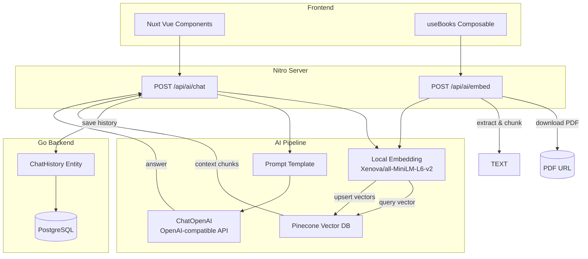
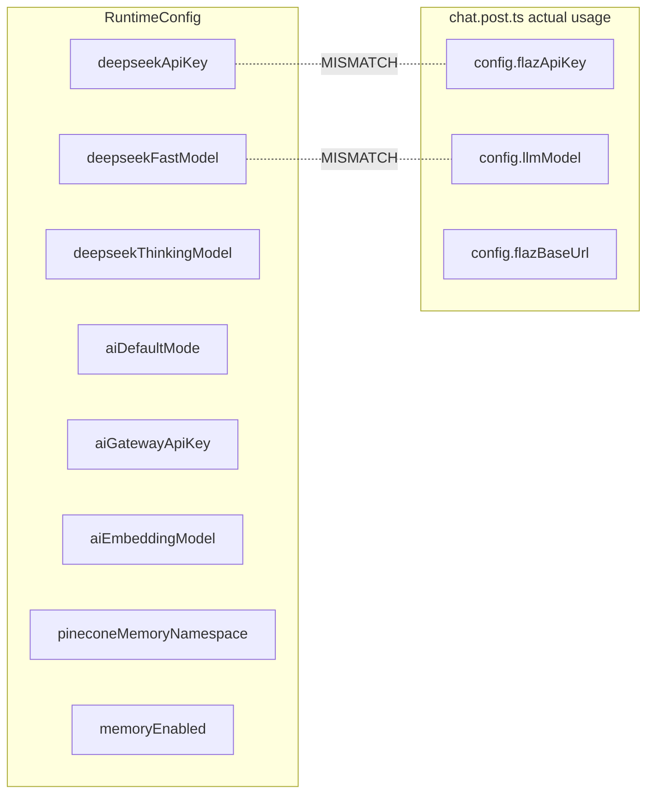
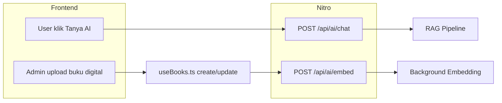
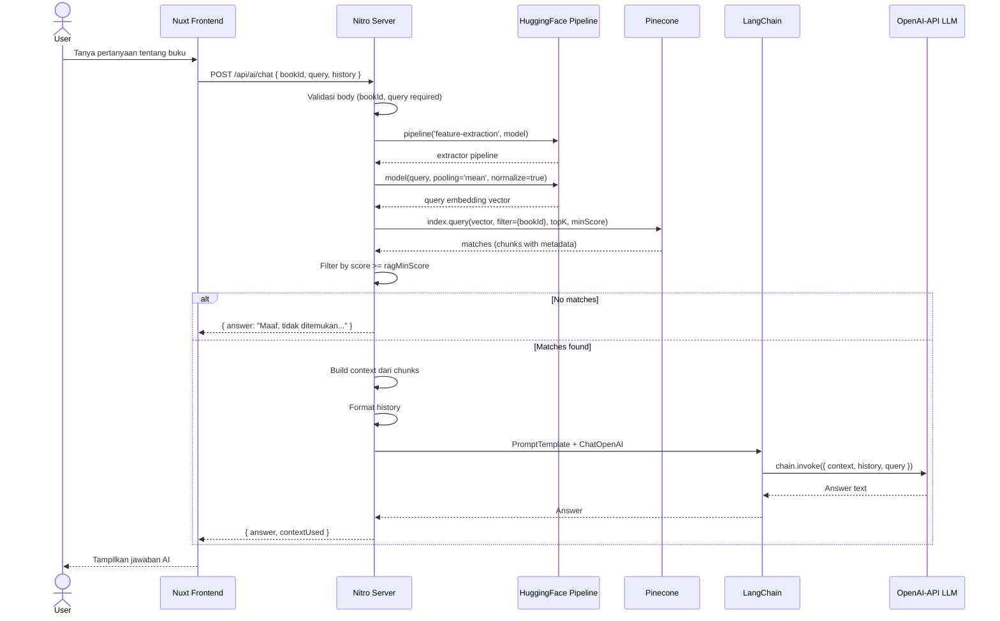
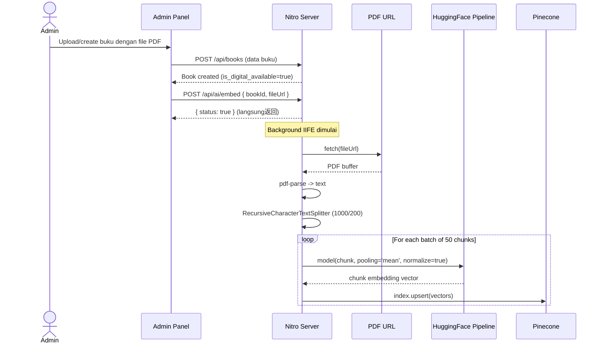
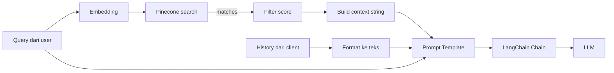
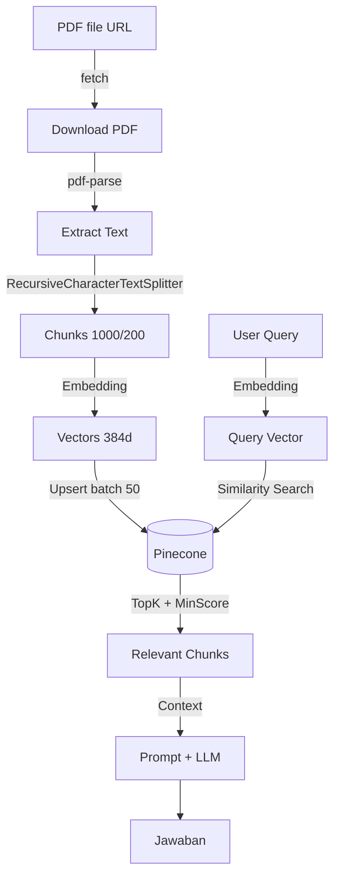
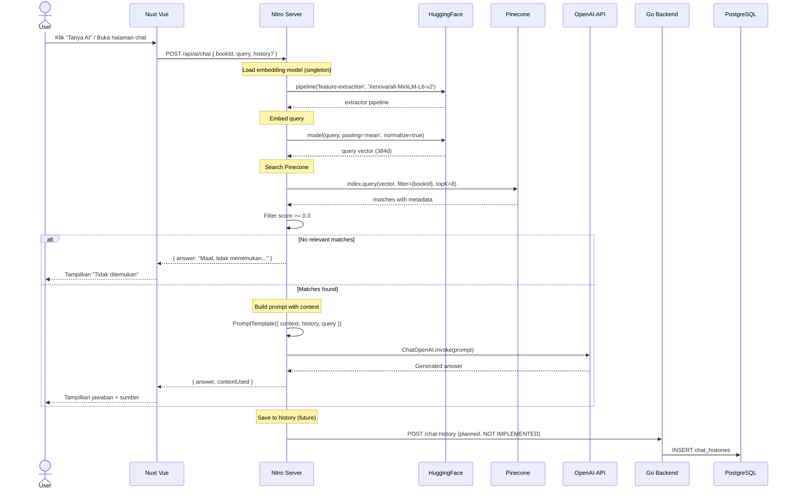

# Analisis Implementasi AI Agent — Literasiku

> **Dokumen ini adalah hasil reverse engineering / audit menyeluruh terhadap implementasi AI Agent yang sudah ada di dalam codebase.**
>
> Dibuat untuk membantu developer baru memahami keseluruhan sistem tanpa harus membaca seluruh source code.

---

## Daftar Isi

1. [Arsitektur](#1-arsitektur)
2. [Provider LLM](#2-provider-llm)
3. [Model yang Digunakan](#3-model-yang-digunakan)
4. [Environment Variable](#4-environment-variable)
5. [Dependency AI](#5-dependency-ai)
6. [Entry Point AI](#6-entry-point-ai)
7. [Request Flow](#7-request-flow)
8. [Prompt Engineering](#8-prompt-engineering)
9. [Memory](#9-memory)
10. [Context Management](#10-context-management)
11. [Tool Calling](#11-tool-calling)
12. [Function Calling](#12-function-calling)
13. [MCP (Model Context Protocol)](#13-mcp-model-context-protocol)
14. [RAG](#14-rag)
15. [Embedding](#15-embedding)
16. [Vector Database](#16-vector-database)
17. [Streaming](#17-streaming)
18. [AI Workflow](#18-ai-workflow)
19. [Error Handling](#19-error-handling)
20. [Logging](#20-logging)
21. [Security](#21-security)
22. [Cost Optimization](#22-cost-optimization)
23. [AI Features](#23-ai-features)
24. [Endpoint AI](#24-endpoint-ai)
25. [Struktur Folder](#25-struktur-folder)
26. [Dependency Graph](#26-dependency-graph)
27. [Sequence Diagram](#27-sequence-diagram)
28. [Kelebihan Arsitektur Saat Ini](#28-kelebihan-arsitektur-saat-ini)
29. [Kekurangan Arsitektur Saat Ini](#29-kekurangan-arsitektur-saat-ini)
30. [Technical Debt](#30-technical-debt)
31. [Missing Features](#31-missing-features)
32. [Improvement Roadmap](#32-improvement-roadmap)

---

## 1. Arsitektur

### Pola Arsitektur

| Aspek | Detail |
|---|---|
| Pola | **Single Agent — RAG Pipeline** |
| Framework | **Nuxt Nitro Server** (bukan framework AI agent terdedikasi) |
| Pendekatan | Request-response sederhana tanpa state machine, graph, atau event-driven |
| Lokasi | 100% di `client/server/api/ai/` (Nitro server-side) |
| Go Backend | Hanya menyimpan riwayat chat (`ChatHistory` entity) — tidak ada logika AI |

### Diagram Arsitektur Tingkat Tinggi



### Keterangan

- **Tidak ada** framework AI agent khusus (LangGraph, CrewAI, Agno, Mastra, dll.)
- **Tidak ada** multi-agent, workflow graph, planner, atau orchestrator
- **Tidak ada** streaming — response dikembalikan sekaligus (synchronous)
- Embedding dijalankan secara lokal di Nitro server (bukan service terpisah)

---

## 2. Provider LLM

### Provider Saat Ini: OpenAI-compatible API (Flaz/DeepSeek)

| Aspek | Detail |
|---|---|
| Package | `@langchain/openai` |
| SDK | LangChain `ChatOpenAI` class |
| Model | `deepseek-v4-flash` (default) |
| Base URL | Dikonfigurasi via `config.flazBaseUrl` |
| API Key | Dikonfigurasi via `config.flazApiKey` |
| Format | OpenAI-compatible chat completions API |

### Provider Lain di Konfigurasi (Tidak Digunakan)

| Provider | Variabel | Status |
|---|---|---|
| DeepSeek (direct) | `NUXT_DEEPSEEK_API_KEY` | **Tidak digunakan** — variabel ditinggalkan |
| AI Gateway | `NUXT_AI_GATEWAY_API_KEY` | **Tidak digunakan** |
| Embedding | `NUXT_AI_EMBEDDING_MODEL` | **Tidak digunakan** — embedding lokal via HuggingFace |

> **Asumsi:** Awalnya proyek menggunakan DeepSeek langsung dan AI Gateway, lalu migrasi ke Flaz (OpenAI-compatible) tanpa membersihkan konfigurasi lama.

---

## 3. Model yang Digunakan

### LLM

| Model | Lokasi Pemanggilan | Digunakan Untuk | Status |
|---|---|---|---|
| `deepseek-v4-flash` | `client/server/api/ai/chat.post.ts:95` | RAG chat, menjawab pertanyaan berdasarkan konteks buku | **Aktif** |

### Embedding

| Model | Lokasi Pemanggilan | Digunakan Untuk | Dimensi | Status |
|---|---|---|---|---|
| `Xenova/all-MiniLM-L6-v2` (q8) | `chat.post.ts:16-17`, `embed.post.ts:16-17` | Feature extraction untuk query & dokumen embedding | 384 | **Aktif** |

> **Asumsi:** Model embedding `openai/text-embedding-3-small` yang tercantum di `.env` dan `nuxt.config.ts` tidak pernah dipakai karena implementasi menggunakan HuggingFace lokal.

---

## 4. Environment Variable

### AI-Related Variables

| Variable | File Asal | Digunakan di | Fungsi | Status |
|---|---|---|---|---|
| `NUXT_DEEPSEEK_API_KEY` | `.env` | `nuxt.config.ts` (runtimeConfig) | API key DeepSeek | **Tidak Digunakan** |
| `NUXT_DEEPSEEK_FAST_MODEL` | `.env` | `nuxt.config.ts` (runtimeConfig) | Nama model fast | **Tidak Digunakan** |
| `NUXT_DEEPSEEK_THINKING_MODEL` | `.env` | `nuxt.config.ts` (runtimeConfig) | Nama model thinking | **Tidak Digunakan** |
| `NUXT_AI_DEFAULT_MODE` | `.env` | `nuxt.config.ts` (runtimeConfig) | Mode default AI | **Tidak Digunakan** |
| `NUXT_AI_GATEWAY_API_KEY` | `.env` | `nuxt.config.ts` (runtimeConfig) | API key AI Gateway | **Tidak Digunakan** |
| `NUXT_AI_EMBEDDING_MODEL` | `.env` | `nuxt.config.ts` (runtimeConfig) | Model embedding eksternal | **Tidak Digunakan** |
| `NUXT_PINECONE_API_KEY` | `.env` | `chat.post.ts:47`, `embed.post.ts:37,81` | API key Pinecone | **Aktif** |
| `NUXT_PINECONE_INDEX_NAME` | `.env` | `chat.post.ts:50`, `embed.post.ts:38,82` | Nama index Pinecone | **Aktif** |
| `NUXT_PINECONE_NAMESPACE` | `.env` | `chat.post.ts:53`, `embed.post.ts:82` | Namespace Pinecone dokumen | **Aktif** |
| `NUXT_PINECONE_MEMORY_NAMESPACE` | `.env` | `nuxt.config.ts` (runtimeConfig) | Namespace memory Pinecone | **Tidak Digunakan** |
| `NUXT_MEMORY_ENABLED` | `.env` | `nuxt.config.ts` (runtimeConfig) | Flag enable/disable memory | **Tidak Digunakan** |
| `NUXT_RAG_MIN_SCORE` | `.env` | `chat.post.ts:68` | Minimum similarity score | **Aktif** |
| `NUXT_RAG_MAX_REFERENCES` | `.env` | `chat.post.ts:56` | Maksimum referensi RAG | **Aktif** |
| `NUXT_GO_API_BASE_URL` | `.env` | `nuxt.config.ts` | Base URL Go backend | **Aktif** |
| `NUXT_GO_INTERNAL_API_KEY` | `.env` | `nuxt.config.ts` | Internal API key Go backend | **Aktif** |

### RuntimeConfig (nuxt.config.ts) vs Real Usage Mismatch



> **Critical Issue:** `chat.post.ts` menggunakan `config.flazApiKey`, `config.llmModel`, dan `config.flazBaseUrl` yang **tidak didefinisikan** di `runtimeConfig` `nuxt.config.ts`. Hal ini akan menyebabkan runtime error karena `useRuntimeConfig()` hanya mengembalikan key yang terdaftar di `runtimeConfig`.

---

## 5. Dependency AI

### Dependency Table

| Package | Versi | Fungsi | Digunakan di | Status |
|---|---|---|---|---|
| `@huggingface/transformers` | `^4.2.0` | Menjalankan model transformer di Node.js (embedding lokal) | `chat.post.ts`, `embed.post.ts` | **Aktif** |
| `@xenova/transformers` | `^2.17.2` | Backend/wasm untuk HuggingFace Transformers | Transitive dependency | **Aktif** |
| `@langchain/core` | `^0.3.75` | PromptTemplate, StringOutputParser, chain pipeline | `chat.post.ts` | **Aktif** |
| `@langchain/openai` | `^0.6.11` | ChatOpenAI — OpenAI-compatible LLM client | `chat.post.ts` | **Aktif** |
| `@langchain/textsplitters` | `^0.1.0` | RecursiveCharacterTextSplitter — chunking PDF | `embed.post.ts` | **Aktif** |
| `langchain` | `^0.3.36` | Meta-package LangChain (mungkin tidak langsung dipanggil) | Transitive | **Parsial** |
| `@pinecone-database/pinecone` | `^8.0.0` | Pinecone v8 SDK — vector DB client | `chat.post.ts`, `embed.post.ts` | **Aktif** |
| `pdf-parse` | `^2.4.5` | Parsing/ekstraksi teks dari PDF | `embed.post.ts` | **Aktif** |
| `pino` | `^10.3.1` | Logging (digunakan oleh apiCall.ts) | `logger.ts`, `apiCall.ts` | **Aktif** |
| `zod` | `^4.4.3` | Validasi schema (belum dipakai untuk AI) | Project-wide | **Belum untuk AI** |

---

## 6. Entry Point AI

### REST API Endpoints

| Method | URL | File | Deskripsi |
|---|---|---|---|
| `POST` | `/api/ai/chat` | `client/server/api/ai/chat.post.ts` | RAG Chat — tanya jawab dengan konteks buku |
| `POST` | `/api/ai/embed` | `client/server/api/ai/embed.post.ts` | Background PDF embedding |

### Entry Point Lain (Non-AI, Tapi Memicu AI)

| Method | URL | File | Trigger |
|---|---|---|---|
| `POST` | `/api/books` | `client/server/api/books/index.post.ts` | Membuat buku → trigger embedding via `useBooks.ts:48-49` |
| `PATCH` | `/api/books/[id]` | `client/server/api/books/[id].patch.ts` | Update buku → trigger embedding via `useBooks.ts:75-76` |

### Alur Entry Point



---

## 7. Request Flow

### Chat Flow (POST /api/ai/chat)



### Embedding Flow (POST /api/ai/embed)



---

## 8. Prompt Engineering

### System Prompt (Hardcoded)

**File:** `client/server/api/ai/chat.post.ts:101-118`

```text
Anda adalah asisten AI perpustakaan cerdas yang membantu anggota memahami isi buku.

Gunakan hanya informasi dari konteks.

Jika jawaban tidak ditemukan, katakan bahwa informasi tidak tersedia.

Konteks:
{context}

Riwayat:
{history}

Pertanyaan:
{query}

Jawaban:
```

### Analisis Prompt

| Aspek | Detail |
|---|---|
| Tipe | **Template Prompt** (LangChain PromptTemplate) |
| Bahasa | Indonesia |
| Struktur | System instruction + Context + History + Query |
| Instruction | "Gunakan hanya informasi dari konteks" — ground on context |
| Fallback | "katakan bahwa informasi tidak tersedia" |
| Dynamic | `{context}`, `{history}`, `{query}` — diisi saat runtime |

### Tidak Ditemukan

- Developer prompt
- User prompt
- Dynamic prompt builder class
- Prompt injection protection
- Structured output instructions
- Few-shot examples
- Chain-of-thought prompting

---

## 9. Memory

### Status: **Implementasi Parsial**

| Aspek | Detail |
|---|---|
| Conversation History | **Parsial** — client mengirim `history[]` di request body `chat.post.ts:86-91`, tapi hanya format teks mentah, bukan query terstruktur |
| Database Memory | **Ada entity** — Go backend punya `ChatHistory` table (user_id, question, book_context, answer, interaction_time) tapi **tidak ada endpoint API untuk menyimpan atau membaca** dari Go backend |
| Session Memory | **Tidak Ada** |
| Summary Memory | **Tidak Ada** |
| Long-term Memory | **Tidak Ada** — `pineconeMemoryNamespace` dan `memoryEnabled` ada di config tapi tidak dipakai |
| Working Memory | **Tidak Ada** |

### ChatHistory Entity (Go Backend)

**File:** `server/database/entities/chat_history.go`

| Field | Type | Keterangan |
|---|---|---|
| `ID` | uint | Primary key |
| `UserID` | uint | Foreign key ke users |
| `DigitalLoanID` | *uint | Foreign key ke digital_loans (nullable) |
| `Question` | text | Pertanyaan user |
| `BookContext` | text | Konteks buku yang digunakan (nullable) |
| `Answer` | text | Jawaban AI |
| `InteractionTime` | time.Time | Waktu interaksi |

**Relation:** User memiliki banyak ChatHistory, DigitalLoan memiliki banyak ChatHistory.

---

## 10. Context Management

### Cara Context Dibangun (chat.post.ts:82-91)



- **Context:** Hanya dari hasil RAG (chunks dari Pinecone yang relevan)
- **History:** Dikirim oleh frontend sebagai array `{role, content}`, diformat mentah
- **Scope:** Per-buku (filter `bookId` di Pinecone query)
- **Tidak ada** summary, tidak ada session management, tidak ada caching

---

## 11. Tool Calling

### Status: **Tidak Ada**

Tidak ada sistem tool calling / function calling yang terimplementasi.

Tools yang **direncanakan** (dari README) tapi **belum ada**:
- Semantic routing
- Memory upsert/search/delete
- PDF status check
- Health check

Tool yang ada hanyalah implicit tools di dalam pipeline:
- Pinecone vector search (hardcoded di chat flow)
- PDF text extraction (hardcoded di embed flow)

---

## 12. Function Calling

### Status: **Tidak Ada**

| Fitur | Status |
|---|---|
| OpenAI Function Calling | **Tidak Ada** |
| Structured Output | **Tidak Ada** — output berupa teks bebas |
| JSON Schema | **Tidak Ada** |
| Tool Calling | **Tidak Ada** |
| MCP Tools | **Tidak Ada** |
| Native Function | **Tidak Ada** |

LLM dipanggil dengan bebas (free text generation) tanpa constraint output.

---

## 13. MCP (Model Context Protocol)

### Status: **Tidak Ditemukan**

Tidak ada implementasi MCP server, MCP client, atau MCP transport di seluruh codebase.

---

## 14. RAG

### Status: **Implementasi Dasar — Aktif**

| Komponen | Detail |
|---|---|
| Loader | PDF di-download via `fetch()` dari `fileUrl` |
| Chunking | `RecursiveCharacterTextSplitter` (chunkSize=1000, overlap=200) |
| Embedding | `Xenova/all-MiniLM-L6-v2` via HuggingFace (lokal) |
| Retriever | Pinecone vector search — `index.query()` |
| Ranking | Filter by `score >= ragMinScore` (default 0.3) |
| Vector Search | Pinecone dengan filter `bookId` |
| Citation | **Tidak Ada** — context disertakan dalam prompt, tapi LLM tidak diinstruksikan untuk memberikan citation |

### Alur RAG



### Kekurangan RAG Saat Ini

- **Citation tidak terstruktur** — `contextUsed` dikembalikan ke frontend tapi LLM tidak menyebut sumber spesifik
- **Chunking statis** — tidak ada dynamic chunking atau optimalisasi berdasarkan konten
- **No reranking** — hanya filter score, tidak ada reranker (Cohere, Cross-Encoder)
- **No hybrid search** — hanya dense vector, tidak ada keyword/BM25
- **No query transformation** — query langsung dipakai tanpa rewriting atau expansion

---

## 15. Embedding

### Detail Embedding

| Aspek | Detail |
|---|---|
| Provider | HuggingFace (lokal di server) |
| Package | `@huggingface/transformers` |
| Pipeline | `feature-extraction` |
| Model | `Xenova/all-MiniLM-L6-v2` |
| Dimensi | 384 |
| Quantization | `q8` (8-bit quantized) |
| Pooling | `mean` |
| Normalization | `true` |
| Cache | `useBrowserCache: false` |
| Lokasi | Singleton pattern — model di-load sekali lalu di-reuse |

### Dimana Digunakan

| File | Tujuan |
|---|---|
| `client/server/api/ai/chat.post.ts` | Embedding query user untuk search di Pinecone |
| `client/server/api/ai/embed.post.ts` | Embedding setiap chunk PDF untuk upsert ke Pinecone |

### Kekurangan

- Embedding dijalankan **synchronous di request thread** — blocking event loop
- **Singleton global** — mungkin bermasalah di concurrent requests
- Dataset `q8` — akurasi lebih rendah dari float32
- Model 384 dimensi — sederhana, kalah dari `text-embedding-3-small` (1536d) atau `mxbai-embed-large` (1024d)

---

## 16. Vector Database

### Detail Pinecone

| Aspek | Detail |
|---|---|
| Provider | **Pinecone** |
| SDK | `@pinecone-database/pinecone` v8 |
| Index Name | `literasiku` (harus dibuat manual) |
| Namespace | `default` (dokumen) |
| Dimensi | 384 (sesuai model embedding) |
| Metadata | `bookId`, `text` |
| Create Index | **Manual** — aplikasi tidak membuat index otomatis |

### Vector Operations

| Operasi | File | Detail |
|---|---|---|
| Query | `chat.post.ts:52-63` | `index.namespace().query({ vector, topK, filter, includeMetadata })` |
| Upsert | `embed.post.ts:107` | `index.upsert({ records: vectors })` per batch 50 |
| Delete | **Tidak Ada** | Tidak ada operasi delete |

---

## 17. Streaming

### Status: **Tidak Ada**

| Fitur | Status |
|---|---|
| SSE (Server-Sent Events) | **Tidak Ada** |
| WebSocket | **Tidak Ada** |
| Chunk streaming | **Tidak Ada** |
| LangChain Stream API | **Tidak Dipakai** — `chain.invoke()` bukan `chain.stream()` |

Response dikembalikan sekaligus setelah LLM selesai menghasilkan seluruh jawaban.

---

## 18. AI Workflow

### Workflow Lengkap Saat Ini

```mermaid
flowchart TD
    START([Start]) --> VALIDATE{Validasi Input}
    VALIDATE -->|Invalid| ERR400[400 Bad Request]
    VALIDATE -->|Valid| LOAD[Load Embedding Model]
    LOAD --> EMB_QUERY[Embed Query]
    EMB_QUERY --> PC_QUERY[Pinecone Similarity Search]
    PC_QUERY --> CHECK{Matches >= MinScore?}
    CHECK -->|No| NO_ANS["Return: 'Tidak menemukan informasi'"]
    CHECK -->|Yes| BUILD_CONTEXT[Build Context from Chunks]
    BUILD_CONTEXT --> FORMAT_HIST[Format History]
    FORMAT_HIST --> INIT_LLM[Init ChatOpenAI]
    INIT_LLM --> BUILD_CHAIN[Build LangChain: Prompt > LLM > Parser]
    BUILD_CHAIN --> INVOKE[chain.invoke(context, history, query)]
    INVOKE --> RESPONSE[Return: answer + contextUsed]
    NO_ANS --> END([End])
    RESPONSE --> END
```

---

## 19. Error Handling

### Status Saat Ini

| Skenario | Penanganan | File |
|---|---|---|
| Missing field | `throwError` → 400 Bad Request | `chat.post.ts:30-35`, `embed.post.ts:29-34` |
| Pinecone config missing | `throwError` → 500 | `embed.post.ts:40-45` |
| Embedding background fail | `console.error()` — silent catch | `embed.post.ts:112-114` |
| PDF download fail | `throw new Error()` — caught di try/catch | `embed.post.ts:51-54` |
| PDF no text | `throw new Error()` — caught di try/catch | `embed.post.ts:67-69` |
| LLM error | **Tidak ada** — unhandled | `chat.post.ts:124` |
| Pinecone error | **Tidak ada** — unhandled | `chat.post.ts:52-63` |
| Timeout | **Tidak ada** |
| Retry | **Tidak ada** |
| Rate limit | **Tidak ada** |
| Provider down | **Tidak ada** fallback |
| Parsing error | **Tidak ada** |

---

## 20. Logging

### Status Saat Ini

| Aspek | Detail |
|---|---|
| Logger | **Pino** — `client/server/utils/logger.ts` |
| Level | Dari `LOG_LEVEL` env (default `info`) |
| Pretty print | Aktif di development |

### AI Logging yang Ada

| Log | File |
|---|---|
| `[AI Embed] Starting background embedding...` | `embed.post.ts:49` |
| `[AI Embed] Parsing PDF...` | `embed.post.ts:59` |
| `[AI Embed] Chunking text...` | `embed.post.ts:71` |
| `[AI Embed] Created {n} chunks.` | `embed.post.ts:78` |
| `[AI Embed] Embedding & Uploading...` | `embed.post.ts:84` |
| `[AI Embed] Upserted batch {n}/{m}` | `embed.post.ts:108` |
| `[AI Embed] Successfully completed...` | `embed.post.ts:111` |
| `[AI Embed] Background embedding failed...` | `embed.post.ts:113` |

### Tidak Ada

- Prompt logging
- Token usage logging
- Cost logging
- Latency tracking
- LangSmith integration
- OpenTelemetry
- Sentry for AI errors

---

## 21. Security

### Analisis

| Aspek | Status | Detail |
|---|---|---|
| Prompt Injection | **Tidak Ada Proteksi** | User query langsung masuk ke prompt template tanpa sanitasi |
| Secret Management | **Risiko Sedang** | API key via env variable (standard), tapi Flaz API key tidak terdefinisi di runtimeConfig (potential runtime error, bukan leak) |
| API Key Exposure | **Aman** | Semua AI key hanya dipakai server-side (Nitro) |
| Rate Limit | **Tidak Ada** | Tidak ada rate limiting di endpoint AI |
| Authentication | **Tidak Ada** | Endpoint AI tidak memeriksa autentikasi user |
| Authorization | **Tidak Ada** | Tidak ada pengecekan hak akses |
| Data Privacy | **Risiko** | `ChatHistory` menyimpan question & answer, belum ada mekanisme data retention / purging |
| PII | **Tidak Ada Proteksi** | Tidak ada PII scrubbing sebelum dikirim ke LLM provider |
| Tool Permission | **N/A** | Tidak ada tool system |
| CORS | **Default** | Mengikuti konfigurasi Nuxt/Nitro |

---

## 22. Cost Optimization

### Status Saat Ini

| Strategi | Status | Detail |
|---|---|---|
| Caching | **Tidak Ada** | Tidak ada cache untuk pertanyaan yang sama |
| Model Routing | **Tidak Ada** | Model statis (`deepseek-v4-flash`) tanpa routing logic |
| Small Model | **Ya** | `Xenova/all-MiniLM-L6-v2` (384d, q8) — efisien |
| Batching | **Parsial** | Embedding di-batch 50 per upsert |
| Streaming | **Tidak Ada** | Menunggu full response — tidak efisien untuk UX |
| Prompt Compression | **Tidak Ada** |
| Context Trimming | **Tidak Ada** | Semua context dari Pinecone dimasukkan tanpa batas token |

---

## 23. AI Features

### Daftar Fitur AI

| Fitur | Status | Detail |
|---|---|---|
| Chat (RAG Q&A) | **Aktif** | Tanya jawab berbasis konten buku |
| PDF Text Extraction | **Aktif** | Ekstraksi teks dari PDF untuk di-index |
| Embedding | **Aktif** | Lokal via HuggingFace |
| Vector Search | **Aktif** | Pinecone similarity search |
| Background Processing | **Aktif** | Embedding berjalan async di background |

### Tidak Ada

| Fitur | Keterangan |
|---|---|
| Multi-Agent | Tidak ada orchestration multi-agent |
| Summarization | Tidak ada endpoint summary khusus |
| Classification | Tidak ada klasifikasi konten |
| Extraction | Tidak ada entity extraction |
| Moderation | Tidak ada content moderation |
| Translation | Tidak ada fitur terjemahan |
| OCR | Tidak ada optical character recognition |
| Image Understanding | Tidak ada vision support |
| Speech/STT/TTS | Tidak ada audio |
| Planning | Tidak ada task planning |
| Reasoning | Tidak ada chain-of-thought |
| Coding | Tidak ada code generation |
| Tool Use | Tidak ada function calling |
| Structured Output | Output teks bebas tanpa schema |

---

## 24. Endpoint AI

### Seluruh Endpoint AI

| Method | URL | Controller File | Request Body | Response |
|---|---|---|---|---|
| `POST` | `/api/ai/chat` | `chat.post.ts` | `{ bookId: string, query: string, history?: Array<{role, content}> }` | `{ status, message, data: { answer, contextUsed } }` |
| `POST` | `/api/ai/embed` | `embed.post.ts` | `{ bookId: string, fileUrl: string }` | `{ status, message, data: { bookId } }` |

### Endpoint yang Direncanakan (dari README) tapi Belum Ada

| Method | URL | Deskripsi |
|---|---|---|
| `POST` | `/api/ai` | AI SDK UI stream |
| `GET` | `/api/ai-sse` | Native SSE streaming |
| `POST` | `/api/embeddings` | Indexing dokumen/chunk |
| `POST` | `/api/pdf/index` | Upload PDF, extract, embed, upsert |
| `GET` | `/api/pdf/status` | Status index PDF |
| `POST` | `/api/memory/upsert` | Simpan memory |
| `GET` | `/api/memory/search` | Semantic search memory |
| `DELETE` | `/api/memory/delete` | Hapus memory |
| `GET` | `/api/health` | Status konfigurasi AI |

---

## 25. Struktur Folder

### Struktur Folder AI Saat Ini

```
client/
├── server/
│   ├── api/
│   │   └── ai/
│   │       ├── chat.post.ts          # RAG Chat endpoint
│   │       └── embed.post.ts         # PDF Embedding endpoint
│   └── utils/
│       ├── apiCall.ts                # throwError helper
│       └── logger.ts                 # Pino logger

server/
├── database/
│   ├── entities/
│   │   └── chat_history.go           # ChatHistory entity (GORM)
│   └── migration.go                  # ChatHistory migration
│   entities/
│   ├── user.go                       # User has ChatHistory relation
│   └── digital_loan.go               # DigitalLoan has ChatHistory relation

client/
├── app/
│   ├── composables/
│   │   └── useBooks.ts               # Trigger AI embedding on book CRUD
│   ├── components/
│   │   └── landing/
│   │       ├── HeroSection.vue       # "Tanya AI" button
│   │       └── DigitalReadingSection.vue  # AI chat mockup
│   ├── constants/
│   │   └── features.ts               # Chatbot feature definition
│   └── app.vue                       # SEO meta "AI Agent"
├── nuxt.config.ts                    # Runtime config AI variables
├── .env                              # AI environment variables
├── .env.example                      # Example env
└── package.json                      # AI dependencies
```

---

## 26. Dependency Graph

```mermaid
flowchart TD
    subgraph Production
        HF[@huggingface/transformers ^4.2.0]
        XF[@xenova/transformers ^2.17.2]
        PC[@pinecone-database/pinecone ^8.0.0]
        LCORE[@langchain/core ^0.3.75]
        LOPENAI[@langchain/openai ^0.6.11]
        LSPLIT[@langchain/textsplitters ^0.1.0]
        LANG[langchain ^0.3.36]
        PDF[pdf-parse ^2.4.5]
        PINO[pino ^10.3.1]
        ZOD[zod ^4.4.3]
    end

    subgraph AI_Chat[AI Chat Endpoint]
        CHAT[chat.post.ts]
        CHAT --> HF
        CHAT --> PC
        CHAT --> LCORE
        CHAT --> LOPENAI
    end

    subgraph AI_Embed[AI Embed Endpoint]
        EMBED[embed.post.ts]
        EMBED --> HF
        EMBED --> PC
        EMBED --> LSPLIT
        EMBED --> PDF
    end

    subgraph Utils
        APICALL[apiCall.ts] --> PINO
    end

    HF --> XF
```

---

## 27. Sequence Diagram

### Full Sequence: User Chat dengan AI



---

## 28. Kelebihan Arsitektur Saat Ini

| Kelebihan | Detail |
|---|---|
| **Sederhana** | Arsitektur single-agent mudah dipahami dan di-debug |
| **Embedding Lokal** | Tidak perlu API call ke provider embedding — lebih murah dan lebih cepat untuk development |
| **Background Embedding** | PDF embedding tidak blocking response |
| **Pinecone Mature** | Menggunakan Pinecone yang mature, scalable, managed service |
| **LangChain Integration** | Menggunakan LangChain yang memudahkan eksperimen dengan berbagai LLM provider |
| **Konfigurasi via Env** | Semua konfigurasi AI via environment variable — baik untuk 12-factor app |
| **Singleton Model** | Embedding model di-load sekali, mengurangi memory/cold start |
| **Batch Upsert** | Embedding di-batch 50 untuk efisiensi |

---

## 29. Kekurangan Arsitektur Saat Ini

| Kekurangan | Detail | Dampak |
|---|---|---|
| **Runtime Config Mismatch** | `chat.post.ts` akses `flazApiKey`, `llmModel`, `flazBaseUrl` yang tidak ada di `runtimeConfig` | **CRASH** — runtime error saat production |
| **Tidak Ada Streaming** | Response dikembalikan sekaligus | UX buruk untuk response panjang |
| **Tidak Ada Tool Calling** | LLM tidak bisa memanggil tools/fungsi | Kemampuan terbatas |
| **Memory tidak Fungsional** | `memoryEnabled=true` tapi tidak ada implementasi | Fitur memory mati |
| **Tidak Ada Authentication** | Endpoint AI tidak protected | Siapa saja bisa chat |
| **No Error Handling LLM** | `chat.post.ts` tidak punya try/catch | Unhandled rejection |
| **No Rate Limiting** | Tidak ada proteksi abuse | Risk of API key abuse |
| **Embedding Blocking** | Embedding di request thread (chat) | Memperlambat response |
| **Global Singleton Risk** | Embedding singleton tanpa lock | Race condition di concurrent requests |
| **Dead Config** | 8 env variables tidak dipakai | Kebingungan developer baru |
| **No Citation Struct** | Citation tidak terstruktur | Tidak bisa verifikasi sumber |
| **No Retry/Fallback** | Provider down = service down | No resilience |
| **No Monitoring/Observability** | Tidak ada tracing AI | Sulit debug |

---

## 30. Technical Debt

| Item | Prioritas | Detail |
|---|---|---|
| **RuntimeConfig mismatch** | **Critical** | `flazApiKey`, `llmModel`, `flazBaseUrl` tidak terdefinisi — harus segera diperbaiki |
| **Dead environment variables** | **High** | 8 env variables tidak dipakai, perlu dibersihkan |
| **No try/catch on LLM call** | **High** | `chain.invoke()` bisa throw tanpa handling |
| **No try/catch on Pinecone query** | **High** | Pinecone query bisa throw tanpa handling |
| **Hardcoded model name** | **Medium** | Model name di-hardcode, tidak pakai config |
| **Unused `@xenova/transformers`** | **Medium** | Package mungkin redundant dengan `@huggingface/transformers` |
| **Global singleton tanpa lock** | **Medium** | Race condition potensial |
| **PDF-parse deprecated API** | **Low** | `new PDFParse().getText()` — perlu diverifikasi kompatibilitas |
| **Zod tidak dipakai untuk AI** | **Low** | Zod sudah ada di project tapi tidak dipakai untuk validasi AI |

---

## 31. Missing Features

### Fitur AI Modern yang Belum Ada

| Fitur | Kategori | Prioritas | Keterangan |
|---|---|---|---|
| **Streaming Response** | Core UX | High | Response real-time, user experience lebih baik |
| **Authentication & Authorization** | Security | High | Endpoint AI harus dilindungi |
| **Rate Limiting** | Security | High | Proteksi API key abuse |
| **Error Handling & Retry** | Reliability | High | Resilience terhadap provider down / timeout |
| **Memory (Long-term)** | Core Feature | High | Menyimpan konteks percakapan antar sesi |
| **Structured Output** | Core Feature | High | Output JSON/info terstruktur untuk frontend |
| **Multi-Agent / Orchestration** | Architecture | Medium | Agent untuk routing, planning, execution |
| **Tool Calling / Function Calling** | Core Feature | Medium | LLM bisa panggil tools (search, database, dll) |
| **RAG Citation** | Core Feature | Medium | LLM menyebut sumber spesifik (page, chunk) |
| **Context Trimming** | Optimization | Medium | Prevent context window overflow |
| **Prompt Injection Protection** | Security | Medium | Sanitasi input user |
| **Monitoring & Observability** | Ops | Medium | Token usage, cost, latency tracking |
| **Caching** | Optimization | Medium | Cache pertanyaan serupa |
| **Model Routing** | Optimization | Medium | Pilih model berdasarkan complexity query |
| **Hybrid Search** | RAG | Medium | Dense + sparse (BM25) untuk RAG lebih akurat |
| **Reranking** | RAG | Medium | Cross-encoder reranking hasil RAG |
| **Query Transformation** | RAG | Low | Query rewriting / expansion |
| **Guardrails** | Security | Low | Content moderation, topic guard |
| **Vision / Image Understanding** | Feature | Low | Analisis gambar buku |
| **Speech / Audio** | Feature | Low | STT/TTS untuk aksesibilitas |
| **MCP Integration** | Protocol | Low | Model Context Protocol untuk tools standar |
| **Planner / ReAct** | Architecture | Low | Multi-step reasoning |
| **Agent Graph** | Architecture | Low | Stateful agent workflow |

---

## 32. Improvement Roadmap

### Priority: High (Immediate — harus diperbaiki sebelum production)

| # | Item | Effort | Impact | Keterangan |
|---|---|---|---|---|
| 1 | **Fix RuntimeConfig Mismatch** | 1 hari | Critical | Tambah `flazApiKey`, `llmModel`, `flazBaseUrl` ke `runtimeConfig` atau ubah kode sesuai config yang ada |
| 2 | **Add try/catch** | 0.5 hari | High | Wrapping LLM call dan Pinecone query dengan error handling |
| 3 | **Add Authentication** | 2 hari | High | Proteksi endpoint AI dengan middleware auth |
| 4 | **Add Rate Limiting** | 1 hari | High | Implementasi rate limiter di endpoint AI |
| 5 | **Implement Streaming (SSE)** | 3 hari | High | Ganti `chain.invoke()` dengan `chain.stream()` + SSE |

### Priority: Medium (Next — untuk production-ready)

| # | Item | Effort | Impact | Keterangan |
|---|---|---|---|---|
| 6 | **Clean dead env variables** | 0.5 hari | Medium | Hapus variabel yang tidak dipakai dari `.env`, `.env.example`, `nuxt.config.ts` |
| 7 | **Implement Memory** | 5 hari | Medium | Endpoint CRUD memory + integrasi ke chat flow |
| 8 | **Add Structured Output** | 2 hari | Medium | JSON Schema / Zod output untuk response AI |
| 9 | **Add RAG Citations** | 3 hari | Medium | Instruction di prompt + structured references di response |
| 10 | **Implement Monitoring** | 3 hari | Medium | Token usage logging, latency tracking, cost calculation |
| 11 | **Add Caching** | 2 hari | Medium | Cache untuk query serupa (Redis / in-memory) |
| 12 | **Model Routing** | 3 hari | Medium | Simple routing: fast model vs thinking model |
| 13 | **Error Resilience** | 2 hari | Medium | Retry logic, fallback provider, timeout handling |

### Priority: Low (Future — untuk enhancement)

| # | Item | Effort | Impact | Keterangan |
|---|---|---|---|---|
| 14 | **Hybrid Search** | 5 hari | Medium | Tambah sparse retrieval (BM25) + fusion |
| 15 | **Reranking** | 3 hari | Medium | Cross-encoder untuk rerank hasil RAG |
| 16 | **Query Transformation** | 2 hari | Low | Query rewriting untuk RAG lebih baik |
| 17 | **Tool Calling** | 5 hari | Medium | Function calling untuk tools (search, database) |
| 18 | **Multi-Agent** | 10 hari | High | Architect multi-agent dengan orchestration |
| 19 | **Guardrails** | 3 hari | Medium | Content moderation, PII detection |
| 20 | **MCP Integration** | 3 hari | Low | MCP server untuk standarisasi tools |
| 21 | **Context Trimming** | 2 hari | Medium | Dynamic context management |
| 22 | **Prompt Injection Protection** | 2 hari | Medium | Input sanitization + injection detection |
| 23 | **Vision/Image** | 5 hari | Low | Analisis gambar sampul/ilustrasi buku |

---

## Lampiran: Daftar Lengkap File AI

| File Path | Peran |
|---|---|
| `client/server/api/ai/chat.post.ts` | RAG Chat endpoint |
| `client/server/api/ai/embed.post.ts` | PDF Background Embedding |
| `client/nuxt.config.ts` | Runtime config AI variables |
| `client/.env` | Environment variables |
| `client/.env.example` | Example environment |
| `client/package.json` | AI dependencies |
| `client/app/composables/useBooks.ts` | Trigger embedding on book CRUD |
| `client/server/utils/apiCall.ts` | Error helper |
| `client/server/utils/logger.ts` | Pino logger |
| `server/database/entities/chat_history.go` | ChatHistory GORM entity |
| `server/database/migration.go` | ChatHistory table migration |
| `server/database/entities/user.go` | User → ChatHistory relation |
| `server/database/entities/digital_loan.go` | DigitalLoan → ChatHistory relation |
| `client/app/components/landing/HeroSection.vue` | "Tanya AI" UI button + insight panel |
| `client/app/constants/features.ts` | Chatbot feature card definition |
| `client/app/app.vue` | SEO meta with "AI Agent" |

---

> **Catatan:** Dokumentasi ini dibuat berdasarkan reverse engineering codebase. Jika ada asumsi, diberi label **Asumsi**. Jika ada implementasi parsial, diberi label **Implementasi Parsial**. Jika ada yang tidak ditemukan, diberi label **Tidak Ditemukan** / **Tidak Ada**.
