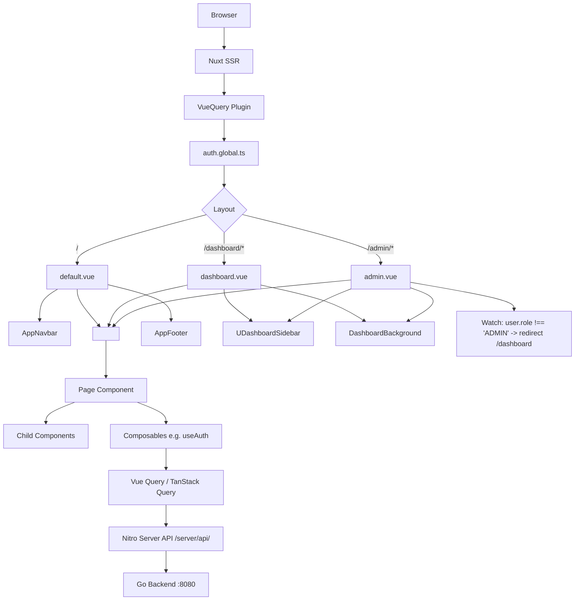
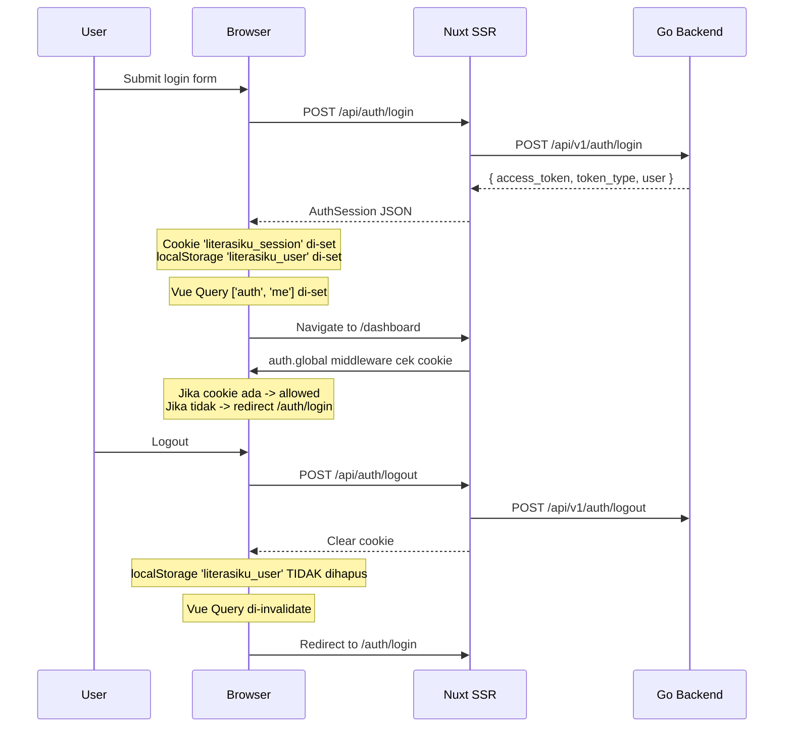
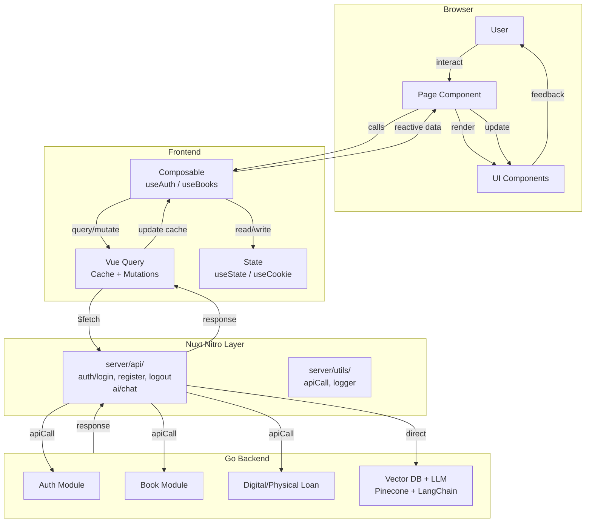

# Analisis Codebase Frontend Nuxt — Literasiku

---

# 1 Executive Summary

**Tujuan Project**: Membangun platform perpustakaan digital (Digital Library) dengan AI Agent yang memungkinkan anggota mencari buku, mengajukan peminjaman fisik/digital, membaca PDF, dan bertanya ke AI chatbot dengan sistem RAG (Retrieval-Augmented Generation) yang dilengkapi sitasi.

**Domain Aplikasi**: Edukasi / Perpustakaan Digital — aplikasi ini melayani dua peran pengguna: Anggota (member) dan Admin perpustakaan.

**Teknologi Utama**:
- Nuxt 4 (`^4.4.6`) dengan SSR
- Vue 3 + TypeScript 6
- Nuxt UI v4 (`@nuxt/ui ^4.8.1`)
- Vue Query (`@tanstack/vue-query ^5.101.0`)
- Zod v4 (`^4.4.3`)
- Tailwind CSS v4 (`^4.3.0`)
- VueUse (`^14.3.0`) + VueUse Motion (`^3.0.3`)
- LangChain + HuggingFace Transformers (client-side embedding)
- Pinecone Vector Database (RAG backend)

**Arsitektur Frontend**: Monorepo dengan Nuxt 4 SSR sebagai lapisan frontend yang juga menyediakan server API proxy (Nitro) untuk berkomunikasi dengan backend Go. Struktur mengikuti konvensi Nuxt 3/4 dengan tambahan folder `shared/` untuk tipe dan skema bersama.

**Tingkat Kompleksitas**: **Medium-High** — UI/UX interaktif dengan animasi kompleks (custom cursor, parallax hero card, theme transition particles, dashboard background), RAG pipeline dengan embedding lokal + Pinecone + LLM, sistem autentikasi JWT, dan sistem peminjaman fisik/digital.

**Kesiapan Production**: **TIDAK SIAP PRODUCTION** — Banyak halaman masih berupa shell kosong, implementasi autentikasi memiliki celah keamanan serius, composable utama (`useBooks`) tidak berfungsi, dan tidak ada testing.

---

# 2 Struktur Project

```text
client/
├── .github/workflows/ci.yml       # CI pipeline
├── app/                            # Aplikasi utama (Nuxt pages dir)
│   ├── app.config.ts               # Konfigurasi UI Nuxt
│   ├── app.vue                     # Root component
│   ├── assets/css/main.css         # CSS utama + Tailwind v4
│   ├── components/                 # Komponen Vue
│   │   ├── AppLogo.vue
│   │   ├── auth/                   # AuthFormCard, AuthModal, AuthPageShell
│   │   ├── common/                 # AppCursor (custom cursor global)
│   │   ├── dashboard/layout/       # Navbar.vue (empty), Sidebar.vue (stub)
│   │   ├── landing/                # 9 section components untuk landing page
│   │   └── layout/                 # AppFooter, AppNavbar, DashboardBackground, ThemeModeToggle
│   ├── composables/                # useAuth, useBooks (incomplete)
│   ├── constants/                  # catalog, features, footer, how-it-works, navigation, roles, stats
│   ├── error.vue                   # Global error page (404/500)
│   ├── layouts/                    # default, dashboard, admin
│   ├── middleware/                  # auth.global.ts
│   ├── pages/                      # Semua route pages
│   │   ├── admin/                  # 9 routes (7 empty)
│   │   ├── auth/                   # login, register
│   │   ├── dashboard/              # 6 routes (4 empty)
│   │   └── index.vue               # Landing page
│   ├── plugins/                    # vue-query.ts
│   └── types/                      # landing.ts
├── Dockerfile                      # Multi-stage build
├── eslint.config.mjs
├── nuxt.config.ts                  # Nuxt configuration
├── package.json
├── public/favicon.ico
├── renovate.json
├── server/                         # Nuxt Nitro server (API proxy)
│   ├── api/auth/                   # login.post, register.post, logout.post
│   └── api/ai/                     # chat.post (RAG pipeline)
│   └── utils/                      # apiCall.ts, logger.ts
├── shared/                         # Shared types + schemas
│   ├── schemas/                    # auth.schema, books.schema (Zod)
│   └── types/                      # api, auth, books
└── tsconfig.json
```

**Fungsi Folder**:

| Folder | Fungsi |
|--------|--------|
| `app/` | Source code utama aplikasi (konvensi Nuxt 3/4 `~/`) |
| `app/components/` | Komponen Vue 3 |
| `app/composables/` | Vue composables untuk business logic |
| `app/constants/` | Data statis untuk landing page |
| `app/layouts/` | Layout aplikasi (default, dashboard, admin) |
| `app/middleware/` | Route middleware (global auth) |
| `app/pages/` | File-based routing |
| `app/plugins/` | Vue/Nuxt plugins (Vue Query) |
| `app/types/` | TypeScript types spesifik landing page |
| `server/` | Nuxt Nitro server (API proxy ke Go backend) |
| `shared/` | Shared types, Zod schemas — sinkron frontend-backend |
| `public/` | Static assets |

---

# 3 Dependency Analysis

## Production Dependencies

| Package | Versi | Fungsi | Penggunaan di Project |
|---------|-------|--------|----------------------|
| `nuxt` | ^4.4.6 | Framework Vue full-stack | SSR, routing, modules |
| `@nuxt/ui` | ^4.8.1 | UI Component Library | Semua komponen UI (`UButton`, `UCard`, `UModal`, `UAuthForm`, dll) |
| `@tanstack/vue-query` | ^5.101.0 | Server state management | `useAuth.ts`, `vue-query.ts` plugin |
| `zod` | ^4.4.3 | Schema validation | `shared/schemas/` — login, register, createBook |
| `@vueuse/core` | ^14.3.0 | Utility composables | `useScroll`, `useMouseInElement`, `usePreferredReducedMotion`, dll |
| `@vueuse/motion` | ^3.0.3 | Animation directives | `v-motion` directives di landing components |
| `tailwindcss` | ^4.3.0 | CSS framework | `main.css` dengan `@import "tailwindcss"` |
| `@iconify-json/lucide` | ^1.2.111 | Icon set | Semua ikon menggunakan `i-lucide-*` |
| `@iconify-json/simple-icons` | ^1.2.84 | Brand icons | Digunakan di Sidebar.vue (stub) |
| `@langchain/core` | ^0.3.75 | LLM framework | Prompt templates, output parsers |
| `@langchain/openai` | ^0.6.11 | OpenAI-compatible LLM | Chat endpoint di server |
| `langchain` | ^0.3.36 | Orchestration | Chains untuk RAG |
| `@huggingface/transformers` | ^4.2.0 | Local ML inference | Embedding lokal `Xenova/all-MiniLM-L6-v2` |
| `@pinecone-database/pinecone` | ^8.0.0 | Vector database | Query RAG context |
| `pino` + `pino-pretty` | ^10/^13 | Logging | Logger di server utils |
| `pdf-parse` | 1.1.1 | PDF parsing | Dependencies terdaftar tapi belum digunakan di kode |

## Dev Dependencies

| Package | Versi | Fungsi |
|---------|-------|--------|
| `@nuxt/eslint` | ^1.15.2 | ESLint integration untuk Nuxt |
| `eslint` | ^10.4.1 | Linter |
| `typescript` | ^6.0.3 | TypeScript compiler |
| `vue-tsc` | ^3.3.3 | Vue TypeScript checker |
| `@types/node` | ^26.0.0 | Node.js type definitions |

## Catatan Penting

- **Tidak ada Axios** — menggunakan `$fetch` bawaan Nuxt dan Nitro
- **Tidak ada Dayjs** — tidak ada dependensi untuk date formatting
- **Tidak ada Pinia** — Belum digunakan; state management via Vue Query + `useState`
- **Tailwind v4** — Tidak menggunakan `tailwind.config.js`; konfigurasi via CSS `@theme`
- **TypeScript 6** — Versi sangat baru; risiko kompatibilitas dengan beberapa library
- **Zod v4** — Juga versi terbaru; API mungkin berbeda dari Zod v3

---

# 4 Nuxt Configuration

## nuxt.config.ts

```typescript
export default defineNuxtConfig({
  modules: ['@nuxt/eslint', '@nuxt/ui', '@vueuse/motion/nuxt'],
  devtools: { enabled: true },
  css: ['~/assets/css/main.css'],
  ssr: true,
  routeRules: { '/': { prerender: false } },
  compatibilityDate: '2025-01-15'
})
```

**Analisis**:

| Aspek | Kondisi | Catatan |
|-------|---------|---------|
| **SSR/CSR** | SSR (default) | Route rules hanya non-prerender untuk `/` |
| **Modules** | ESLint, Nuxt UI, VueUse Motion | Cukup standar |
| **Color Mode** | Preference: `light`, classSuffix: `''` | Menggunakan class-based dark mode |
| **UI Theme** | Colors: `primary`, `secondary`, `success`, `info`, `warning`, `error`, `neutral` | Default variants: `color: primary`, `size: md` |
| **Runtime Config** | 12 variabel: DeepSeek, Pinecone, RAG, Go API | **Tidak semua digunakan** — Lihat ketidaksesuaian di AI chat |
| **ESLint** | Stylistic: commaDangle `never`, braceStyle `1tbs` | |
| **Nitro** | Tidak ada konfigurasi khusus | Menggunakan default |

## app.config.ts

```typescript
export default defineAppConfig({
  ui: {
    colors: {
      primary: 'sea',
      secondary: 'cyan',
      neutral: 'zinc'
    }
  }
})
```

- Primary color: Sea (biru) — custom color scale
- Secondary: Cyan
- Neutral: Zinc

## Runtime Config Issues

**TERDAPAT KETIDAKSESUAIAN**: File `server/api/ai/chat.post.ts` menggunakan:

```typescript
config.flazApiKey      // Tidak ada di runtimeConfig
config.llmModel        // Tidak ada di runtimeConfig
config.flazBaseUrl     // Tidak ada di runtimeConfig
```

Sedangkan `runtimeConfig` di `nuxt.config.ts` mendefinisikan:

```typescript
deepseekApiKey: '',
deepseekFastModel: 'deepseek-v4-flash',
deepseekThinkingModel: 'deepseek-v4-pro',
aiDefaultMode: 'fast',
aiGatewayApiKey: '',
aiEmbeddingModel: 'openai/text-embedding-3-small',
```

**Kesimpulan**: AI chat endpoint akan **runtime error** karena mengakses properti yang tidak terdefinisi di runtimeConfig.

---

# 5 Application Flow



**Startup Sequence**:
1. Browser request masuk → Nuxt SSR
2. `app.vue` di-render: `UApp` → `AppCursor` → `NuxtLayout` → `NuxtPage`
3. Plugin `vue-query.ts` diinstal (VueQueryPlugin)
4. Middleware global `auth.global.ts` dijalankan — cek cookie `literasiku_session`
5. Layout dipilih berdasarkan route (default/dashboard/admin)
6. Page di-render di dalam slot layout
7. Composables seperti `useAuth` menginisialisasi query Vue Query

---

# 6 Routing Analysis

| URL | Page | Layout | Middleware | Auth Required |
|-----|------|--------|------------|---------------|
| `/` | `pages/index.vue` | `default` | - | No |
| `/auth/login` | `pages/auth/login.vue` | `default` | - | No (Guest) |
| `/auth/register` | `pages/auth/register.vue` | `default` | - | No (Guest) |
| `/dashboard` | `pages/dashboard/index.vue` | `dashboard` | `auth.global` | Yes |
| `/dashboard/katalog` | `pages/dashboard/katalog/index.vue` | `dashboard` | `auth.global` | Yes |
| `/dashboard/katalog/:id` | `pages/dashboard/katalog/[id].vue` | `dashboard` | `auth.global` | Yes |
| `/dashboard/peminjaman` | `pages/dashboard/peminjaman/index.vue` | `dashboard` | `auth.global` | Yes |
| `/dashboard/profil` | `pages/dashboard/profil/index.vue` | `dashboard` | `auth.global` | Yes |
| `/dashboard/riwayat` | `pages/dashboard/riwayat/index.vue` | `dashboard` | `auth.global` | Yes |
| `/admin` | `pages/admin/index.vue` | `admin` | `auth.global` | Yes + ADMIN role |
| `/admin/anggota` | `pages/admin/anggota/index.vue` | `admin` | `auth.global` | Yes + ADMIN role |
| `/admin/anggota/:id` | `pages/admin/anggota/[id].vue` | `admin` | `auth.global` | Yes + ADMIN role |
| `/admin/buku` | `pages/admin/buku/index.vue` | `admin` | `auth.global` | Yes + ADMIN role |
| `/admin/buku/:id/edit` | `pages/admin/buku/[id]/edit.vue` | `admin` | `auth.global` | Yes + ADMIN role |
| `/admin/denda` | `pages/admin/denda/index.vue` | `admin` | `auth.global` | Yes + ADMIN role |
| `/admin/kategori` | `pages/admin/kategori/index.vue` | `admin` | `auth.global` | Yes + ADMIN role |
| `/admin/laporan` | `pages/admin/laporan/index.vue` | `admin` | `auth.global` | Yes + ADMIN role |
| `/admin/peminjaman/fisik` | `pages/admin/peminjaman/fisik.vue` | `admin` | `auth.global` | Yes + ADMIN role |
| `/admin/peminjaman/digital` | `pages/admin/peminjaman/digital.vue` | `admin` | `auth.global` | Yes + ADMIN role |

**Masalah Routing**:
- Tidak ada guest middleware untuk redirect user已登录 ke dashboard
- Admin role check dilakukan via `watch` di layout, bukan middleware — bisa delay/race condition
- Halaman 404 tidak ditangani secara eksplisit di routing

---

# 7 Layout Analysis

## `default.vue`
- **Fungsi**: Layout untuk landing page dan halaman publik
- **Komponen**: `AppNavbar` (hanya landing page), `AppFooter` (hanya landing page), `USeparator` (hanya landing page)
- **Slot**: `<slot />` dibungkus `UMain`
- **Catatan**: Halaman auth (`/auth/login`, `/auth/register`) menggunakan layout ini TANPA navbar/footer

## `dashboard.vue`
- **Fungsi**: Layout untuk dashboard anggota
- **Sidebar**: `UDashboardSidebar` dengan `UNavigationMenu` (items: `NAV_SIDEBAR_USER`)
- **Navbar**: `UDashboardNavbar` dengan sidebar toggle + ThemeModeToggle + User dropdown
- **Footer sidebar**: Avatar + nama user + logout button
- **Background**: `DashboardBackground` (parallax animated background)
- **Slot**: `<main>` dengan padding `p-6`
- **Komponen yang tidak digunakan**: `Navbar.vue` dan `Sidebar.vue` di `dashboard/layout/` — file kosong atau stub

## `admin.vue`
- **Fungsi**: Layout untuk dashboard admin
- **Sidebar**: `UDashboardSidebar` dengan `UNavigationMenu` (items: `NAV_SIDEBAR_ADMIN`)
- **Struktur**: Sama dengan dashboard, dengan tambahan label "Admin Panel"
- **Role Guard**: `watch(user, ...)` untuk redirect jika role bukan ADMIN
- **Issue**: Masih menggunakan `LazyUDashboardSidebarToggle` (nama komponen tidak konsisten dengan dashboard layout yang menggunakan `UDashboardSidebarToggle`)

---

# 8 Component Analysis

## Kategori: Auth Components

### `AuthFormCard.vue`
| Aspek | Detail |
|-------|--------|
| **Tujuan** | Form login/register pada halaman terpisah (`/auth/login`, `/auth/register`) |
| **Props** | `mode: 'login' \| 'register'` |
| **Emits** | None (menggunakan `navigateTo` setelah success) |
| **Slots** | None |
| **Dependency** | `useAuth`, `loginSchema`, `registerSchema`, `UAuthForm` |
| **Reusable** | Ya |

### `AuthModal.vue`
| Aspek | Detail |
|-------|--------|
| **Tujuan** | Modal login/register — dipanggil dari manapun via `useAuth().openAuthModal()` |
| **Props** | None |
| **Emits** | None |
| **Dependency** | `useAuth`, `loginSchema`, `registerSchema`, `UModal` |
| **Reusable** | Ya |
| **Issue** | Field name untuk register menggunakan `name` (bukan `full_name` dan `username`) — **tidak konsisten** dengan `AuthFormCard` dan `registerSchema` |

### `AuthPageShell.vue`
- Layout visual untuk halaman auth (background, branding, benefit cards)
- Slot untuk form
- Fully reusable

## Kategori: Landing Components

| Component | Fungsi | Dependency | Catatan |
|-----------|--------|------------|---------|
| `LandingBackground.vue` | Animated aurora background | `usePreferredReducedMotion`, `requestAnimationFrame` | 474 line, kompleks |
| `HeroSection.vue` | Hero section dengan 3D card parallax | `@vueuse/motion`, `usePreferredReducedMotion` | 640 line, sangat kompleks |
| `CatalogPreviewSection.vue` | Preview katalog buku | `BOOKS_PREVIEW`, `CATALOG_FILTERS` | Duplikasi kode dengan dashboard/katalog |
| `FeatureCardsSection.vue` | Grid fitur | `FEATURES` | Sederhana |
| `HowItWorksSection.vue` | Timeline cara kerja | `HOW_IT_WORKS_STEPS` | Desktop horizontal + mobile vertical |
| `DigitalReadingSection.vue` | Mockup PDF reader + AI chat | None | Static mockup |
| `RoleSection.vue` | Dua kartu (Anggota vs Admin) | `ROLES` | Sederhana |
| `StatsSection.vue` | 4 kartu kapabilitas | `STATS`, `capabilityMeta` | |
| `CtaSection.vue` | Call-to-action | None | Sederhana |

## Kategori: Layout Components

| Component | Fungsi | Catatan |
|-----------|--------|---------|
| `AppNavbar.vue` | Navigasi sticky untuk landing page | 387 line, kompleks — scroll spy, intersection observer |
| `AppFooter.vue` | Footer multi-kolom | |
| `DashboardBackground.vue` | Animated parallax background untuk dashboard | Mirip LandingBackground, 247 line |
| `ThemeModeToggle.vue` | Toggle light/dark dengan view transition | 259 line, partikel animasi |

## Kategori: Common Components

| Component | Fungsi | Catatan |
|-----------|--------|---------|
| `AppCursor.vue` | Custom cursor global | 466 line, 11 varian, pointer burst effect |

## Kategori: Empty/Stub Components

| Component | Status |
|-----------|--------|
| `dashboard/layout/Navbar.vue` | Empty — template kosong |
| `dashboard/layout/Sidebar.vue` | Stub — menggunakan dummy data Nuxt UI |
| `dashboard/admin/` | Folder kosong |

---

# 9 Composable Analysis

## `useAuth.ts`

```typescript
export const useAuth = () => {
  const queryClient = useQueryClient()
  const router = useRouter()
  const toast = useToast()
  const session = useCookie<string | null>('literasiku_session', { ... })
  const authModalOpen = useState('auth-modal-open', () => false)
  const authModalMode = useState<'login' | 'register'>('auth-modal-mode', () => 'login')
  // ...
}
```

**State**:
| State | Type | Storage | Description |
|-------|------|---------|-------------|
| `session` | Cookie | `literasiku_session` | JWT access token |
| `authQuery.data` | Vue Query | Cache `['auth', 'me']` | User object dari localStorage |
| `authModalOpen` | `useState` | Memory | Modal auth state |
| `authModalMode` | `useState` | Memory | Mode login/register |

**Business Logic**:
- Login: POST `/api/auth/login` → set cookie + localStorage
- Register: POST `/api/auth/register` → set cookie + localStorage
- Logout: POST `/api/auth/logout` → clear cookie + invalidate query
- Auto-fetch user: Query `['auth', 'me']` dengan artificial 500ms delay, baca dari localStorage

**Caching**: Menggunakan Vue Query dengan queryKey `['auth', 'me']`, staleTime default 60s

**Issues**:
1. **CRITICAL**: User data dibaca dari `localStorage` — rentan XSS. Jika ada script injection, attacker bisa membaca/memanipulasi data user.
2. **Stale user data**: localStorage tidak sync dengan backend — jika user diubah role/di-suspend di server, frontend tidak tahu sampai cache expired.
3. **Artificial delay**: `await new Promise(resolve => setTimeout(resolve, 500))` — tidak ada alasan teknis untuk delay ini.
4. **Logout**: Tidak menghapus localStorage — hanya set query ke null. `literasiku_user` tetap ada.
5. **Login redirect**: Redirect ke `/` setelah login, bukan ke dashboard/admin sesuai role.

## `useBooks.ts`

```typescript
export const useBooks=()=>{
    const queryclient = useQueryClient()
    const toast = useToast()
    const BOOK_KEY='books'

    const booksQuery=useQuery({
        queryKey:[BOOK_KEY]
    })
}
```

**Analysis**: **TIDAK BERFUNGSI** — Ini adalah stub yang:
- Tidak memiliki `queryFn` (akan error runtime)
- Tidak me-return apapun
- Tidak mendefinisikan query parameters
- Tidak ada mutation, invalidate, atau API call

---

# 10 API Integration

## Arsitektur API

```
[Browser] --$fetch--> [Nuxt Nitro /server/api/] --$fetch--> [Go Backend :8080]
```

**Tidak ada Axios** — semua HTTP menggunakan `$fetch` bawaan Nuxt.

## Tabel Endpoint

| API Endpoint (Nuxt) | Method | Go Backend Target | Request Body | Response | Auth |
|---------------------|--------|-------------------|--------------|----------|------|
| `/api/auth/login` | POST | `/api/v1/auth/login` | `LoginInput` (email, password) | `AuthSession` (token + user) | No |
| `/api/auth/register` | POST | `/api/v1/auth/register` | `RegisterInput` | `AuthSession` | Internal API Key |
| `/api/auth/logout` | POST | `/api/v1/auth/logout` | - | `{ success: true }` | Cookie |
| `/api/ai/chat` | POST | Tidak — langsung ke Pinecone + LLM | `{ bookId, query, history }` | `{ answer, contextUsed }` | No |

## Error Handling

`server/utils/apiCall.ts` menyediakan helper pattern `[error, data]` (Go-style):

```typescript
export const apiCall = async <T>(promise: Promise<T>): Promise<[unknown, T | null]> => {
  try {
    return [null, await promise]
  } catch (error) {
    logger.error(error)
    return [error, null]
  }
}
```

## Issues API
1. **No API interceptors**: Tidak ada global error handler untuk `$fetch`
2. **No request/response transformation**: Setiap endpoint perlu manual header management
3. **AI chat endpoint tidak menggunakan `apiCall` helper** — error handling langsung di handler
4. **Hardcoded endpoint**: Go API base URL diambil dari runtimeConfig, tidak ada fallback

---

# 11 Vue Query Analysis

## Plugin Configuration

```typescript
const queryClient = new QueryClient({
  defaultOptions: {
    queries: {
      staleTime: 60000,  // 1 menit
      retry: false       // Tidak ada retry
    }
  }
})
```

## SSR Hydration

Plugin sudah mengimplementasikan SSR hydration dengan benar:
- **Server**: `dehydrate(queryClient)` di hook `app:rendered`
- **Client**: `hydrate(queryClient, vueQueryState.value)` di hook `app:created`

## Query Usage

| Query | queryKey | queryFn | Enabled | Cache Strategy |
|-------|----------|---------|---------|----------------|
| Auth Me | `['auth', 'me']` | Baca dari localStorage | Hanya jika cookie session ada | staleTime 60s |
| Books | `['books']` | **TIDAK ADA** | **Always** (akan error) | - |

## Optimasi Issues

1. **`retry: false`** — Semua query tidak akan retry. Ini berbahaya untuk network glitch sementara.
2. **No staleTime pada auth query** — Menggunakan default 60s yang cukup lama untuk session validation
3. **Tidak ada query untuk books** — Semua data buku masih hardcoded (BOOKS_PREVIEW) bukan dari API
4. **Tidak ada mutation hooks** — `useBooks` tidak memiliki mutation
5. **Tidak ada optimistic updates**
6. **Tidak ada cache invalidation strategy** selain logout

---

# 12 Authentication

## Flow Autentikasi



## Masalah Keamanan Autentikasi

| Issue | Severity | Detail |
|-------|----------|--------|
| **JWT di localStorage** | **CRITICAL** | `localStorage.setItem('literasiku_user', ...)` — rentan XSS |
| **User data dari localStorage** | **HIGH** | `authQuery.queryFn` membaca dari localStorage, bukan dari endpoint `/me` |
| **Tidak ada refresh token** | **HIGH** | Tidak ada mekanisme refresh token; JWT expired tidak tertangani |
| **Cookie + localStorage tidak sinkron** | **MEDIUM** | Cookie bisa expired tapi localStorage masih punya data |
| **Logout tidak hapus localStorage** | **MEDIUM** | `literasiku_user` tetap ada di localStorage setelah logout |
| **Tidak ada role middleware** | **MEDIUM** | Admin role hanya dicek di layout via `watch` |
| **Artificial delay mengaburkan UX** | **LOW** | 500ms delay di auth query hanya untuk UX, tidak realistis |

---

# 13 Middleware

## `auth.global.ts`

```typescript
export default defineNuxtRouteMiddleware((to) => {
  const isProtected =
    to.path.startsWith('/dashboard') ||
    to.path.startsWith('/admin')

  if (!isProtected) return

  const session = useCookie<string | null>('literasiku_session')

  if (!session.value) {
    return navigateTo('/auth/login')
  }
})
```

**Analisis**:
- Global middleware — berjalan untuk setiap route
- Hanya melindungi `/dashboard/*` dan `/admin/*`
- **Tidak ada guest middleware** — user yang sudah login bisa mengakses `/auth/login` dan `/auth/register`
- **Tidak ada admin middleware** — user biasa bisa mengakses `/admin/*` (hanya diblokir di layout via `watch`)
- **Redirect** hanya berdasarkan cookie, bukan validasi token ke backend

**Rekomendasi**:
1. Buat middleware terpisah: `auth.ts`, `guest.ts`, `admin.ts`
2. Validasi token via API `/me` di middleware (atau minimal decode JWT)

---

# 14 State Management

## Global State

| State | Tool | Key | Storage |
|-------|------|-----|---------|
| User session | `useCookie` | `literasiku_session` | Cookie |
| Auth user data | Vue Query | `['auth', 'me']` | Cache + localStorage |
| Auth modal | `useState` | `auth-modal-open` | Memory |
| Auth modal mode | `useState` | `auth-modal-mode` | Memory |
| Vue Query state | `useState` | `vue-query` | SSR hydration |

## Yang Tidak Ada

- **Tidak ada Pinia** — tidak ada store global
- **Tidak ada persistent state** selain cookie dan localStorage manual
- **Tidak ada buku state** — semua data buku hardcoded di constants

**Keputusan Arsitektur**: Proyek ini menggunakan Vue Query untuk server state dan `useState` untuk UI state. Ini cukup untuk aplikasi saat ini, tapi akan menjadi masalah saat aplikasi bertambah kompleks (misalnya: book borrowing flow yang membutuhkan multi-step state).

---

# 15 Form Validation

## Zod Schemas

### `shared/schemas/auth.schema.ts`

```typescript
export const loginSchema = z.object({
  email: z.string().email().max(100),
  password: z.string().min(8).max(72)
})

export const registerSchema = z.object({
  username: z.string().min(3).max(50),
  full_name: z.string().min(1).max(100),
  email: z.string().email().max(100),
  password: z.string().min(8).max(72),
  confirmPassword: z.string().min(8).max(72)
}).refine(data => data.password === data.confirmPassword, {
  message: 'Konfirmasi password tidak sama',
  path: ['confirmPassword']
})
```

### `shared/schemas/books.schema.ts`

```typescript
export const createBookSchema = z.object({
  title: z.string().min(1).max(255),
  author: z.string().min(1).max(100),
  publisher: z.string().max(100).default(''),
  year_published: z.number().int().min(1000).max(2100),
  isbn: z.string().max(20).default(''),
  category_id: z.number().positive(),
  physical_stock: z.number().int().min(0),
  is_physical_available: z.boolean(),
  is_digital_available: z.boolean(),
  status: z.enum(['ACTIVE', 'INACTIVE', 'DAMAGED', 'LOST']).default('ACTIVE')
})

export const updateBookSchema = createBookSchema.partial()
```

## Penggunaan di Komponen

- `AuthFormCard.vue` menggunakan `UAuthForm` dengan `:schema="schema"` — terintegrasi dengan Nuxt UI
- `AuthModal.vue` juga menggunakan `UAuthForm`
- **Books schema tidak digunakan di komponen manapun** — halaman admin buku masih kosong

## Issues

1. **Books schema tidak connected**: Schema sudah lengkap tapi tidak ada form yang menggunakannya
2. **AuthModal field mismatch**: Modal register menggunakan field `name` (bukan `full_name`)
3. **No server-side validation display**: Error dari backend tidak dipetakan ke field spesifik

---

# 16 Shared Folder

## `shared/types/auth.ts`
```typescript
export interface AuthUser {
  id: number;
  username: string;
  full_name: string;
  email: string;
  role: 'USER' | 'ADMIN';
  status: string;
  created_at: string;
}

export interface AuthSession {
  access_token: string;
  token_type: string;
  user: AuthUser;
}
```

## `shared/types/books.ts`
```typescript
export type BookResponse = { id, title, author, publisher, year_published, isbn, category_id, physical_stock, is_physical_available, is_digital_available, status, created_at, updated_at }
export type BooksResponse = { data: BookResponse[], page, limit, total, total_pages }
export type CreateBookRequest = { title, author, publisher, year_published, isbn, category_id, physical_stock, is_physical_available, is_digital_available, status? }
export type UpdateBookRequest = Partial<CreateBookRequest>
```

## `shared/types/api.ts`
```typescript
export interface ApiResponse<T> {
  status: boolean;
  message: string;
  data: T;
}
```

## Sinkronisasi dengan Backend (Go)

Berdasarkan analisis kode backend Go (di `server/`):

| Aspek | Frontend | Backend (Go) | Status |
|-------|----------|---------------|--------|
| Auth User fields | `id, username, full_name, email, role, status, created_at` | Match | ✅ |
| Auth Session | `access_token, token_type, user` | Match | ✅ |
| API Response wrapper | `{ status, message, data }` | Match | ✅ |
| Book fields | Sesuai | Sesuai (book entity) | ✅ |
| Pagination | `page, limit, total, total_pages` | Sesuai | ✅ |
| Book Status | `ACTIVE, INACTIVE, DAMAGED, LOST` | Sesuai | ✅ |

**Kesimpulan**: Tipe data dan schema sinkron dengan backend Go.

---

# 17 Pages Analysis

## Landing Page (`/`)

| Aspek | Detail |
|-------|--------|
| **Tujuan** | Marketing landing page |
| **Components** | 9 section components (Hero → CTA) |
| **API Calls** | None (static data) |
| **State** | `query`, `selectedCategory`, `selectedAvailability` (CatalogPreview) |
| **Loading** | None |
| **Error** | None |

## Auth Pages (`/auth/login`, `/auth/register`)

| Aspek | Detail |
|-------|--------|
| **Tujuan** | Login/register form |
| **Components** | `AuthPageShell`, `AuthFormCard` |
| **API Calls** | `useAuth().loginMutation`, `useAuth().registerMutation` |
| **State** | Form state via `UAuthForm` |
| **Loading** | `submitLabel` computed based on mutation pending |
| **Error** | `UAlert` dengan mutation error message |
| **Navigation** | Redirect ke `/` setelah success |

## Dashboard Pages (6 pages — 4 EMPTY)

| Page | Status | Detail |
|------|--------|--------|
| `/dashboard` | Partial | Hanya judul "Dashboard" |
| `/dashboard/katalog` | Implemented | Catalog dengan filter + search (data hardcoded) |
| `/dashboard/katalog/:id` | **EMPTY** | Template kosong |
| `/dashboard/peminjaman` | **EMPTY** | Template kosong |
| `/dashboard/profil` | **EMPTY** | Template kosong |
| `/dashboard/riwayat` | **EMPTY** | Template kosong |

## Admin Pages (9 pages — 8 EMPTY)

| Page | Status |
|------|--------|
| `/admin` | Partial — hanya judul "Dashboard admin" |
| `/admin/anggota` | **EMPTY** |
| `/admin/anggota/:id` | **EMPTY** |
| `/admin/buku` | **EMPTY** |
| `/admin/buku/:id/edit` | **EMPTY** |
| `/admin/denda` | **EMPTY** |
| `/admin/kategori` | **EMPTY** |
| `/admin/laporan` | **EMPTY** |
| `/admin/peminjaman/fisik` | **EMPTY** |
| `/admin/peminjaman/digital` | **EMPTY** |

**Kesimpulan**: Dari total 20 halaman, hanya 4 yang terimplementasi penuh (landing, login, register, katalog). 1 partial (dashboard index), 1 static preview (landing katalog), 14 masih empty shell.

---

# 18 UI/UX Review

## Consistency
| Aspek | Penilaian |
|-------|-----------|
| CSS Variables | ✅ Menggunakan `--ui-primary`, `--ui-secondary`, `--ui-bg`, dll |
| Color Scheme | ✅ Tema sea/cyan/zinc konsisten |
| Spacing | ✅ `landing-section`, `p-6`, `gap-*` konsisten |
| Typography | ✅ Menggunakan Tailwind default font |
| Button Variants | ✅ `solid`, `soft`, `subtle`, `ghost` konsisten |

## Responsive
- Landing page memiliki breakpoint `sm:`, `lg:` yang baik
- Dashboard layout menggunakan Nuxt UI `UDashboardGroup` yang responsive
- Catalog grid menggunakan `UPageGrid`

## Accessibility
| Aspek | Penilaian |
|-------|-----------|
| Semantic HTML | ⚠️ Sebagian — menggunakan `section[id]` dengan `scroll-margin-top` |
| ARIA Labels | ✅ `aria-label` pada button, `aria-hidden` pada dekorasi |
| Keyboard Navigation | ⚠️ Tidak diuji — custom cursor mungkin mengganggu |
| Focus Management | ⚠️ Tidak ada manajemen fokus khusus |
| Color Contrast | ⚠️ Belum diverifikasi |
| `prefers-reduced-motion` | ✅ Sangat baik — hampir semua animasi punya fallback |

## Loading & Empty States

| State | Implementation |
|-------|----------------|
| Loading | ❌ Tidak ada skeleton loading untuk data fetching |
| Empty | ✅ Catalog memiliki empty state "Koleksi tidak ditemukan" |
| Error | ⚠️ Hanya global error.vue; tidak ada per-page error state |
| Skeleton | ⚠️ Hanya ada di HeroSection sebagai mockup visual, bukan loading state nyata |

## Dark Mode
- ✅ Implementasi via Nuxt UI color mode
- ✅ View transition dengan partikel animasi
- ✅ CSS variables untuk dark variants

## Strength
- **Animasi halus**: `v-motion` dengan staggered delays, parallax effects
- **Responsive navigation**: Mobile hamburger, desktop horizontal
- **Custom cursor**: 11 varian dengan visual feedback
- **Theme transition**: Circular reveal animation

---

# 19 Performance Analysis

## SSR
- ✅ SSR enabled
- ✅ Vue Query hydration (dehydrate/hydrate)
- ❌ Tidak ada route rules untuk static pages

## Bundle Size
- ⚠️ `@huggingface/transformers` — **sangat besar** (~50MB+). Library ini di-import di server route `/api/ai/chat`, hanya dijalankan di Nitro (server-side), jadi aman untuk bundle klien.
- ⚠️ `@langchain/*` packages — Juga besar, hanya di server

## Lazy Loading
- ⚠️ Hanya `LazyUDashboardSidebarToggle` yang menggunakan lazy loading
- ❌ Komponen landing page tidak lazy-loaded (semua di-import statis di `pages/index.vue`)
- ❌ Tidak ada dynamic import untuk komponen berat

## Image Optimization
- ❌ Tidak menggunakan Nuxt Image (`<NuxtImg>`)
- ❌ Hanya favicon yang dioptimasi
- ❌ Tidak ada gambar di aplikasi (semua menggunakan ikon atau CSS gradient)

## Code Splitting
- ✅ Otomatis via Nuxt (per-page)
- ❌ Komponen landing section tidak di-split

## Caching
- ✅ Vue Query staleTime 60s
- ❌ Tidak ada service worker
- ❌ Tidak ada persist query cache

**Rekomendasi**:
1. Lazy load landing section components dengan `defineAsyncComponent`
2. Gunakan Nuxt Image untuk gambar jika ada di masa depan
3. Implementasikan SWR caching pattern lebih agresif

---

# 20 Security Analysis

## Temuan

| Issue | Severity | File | Detail |
|-------|----------|------|--------|
| **JWT di localStorage** | **CRITICAL** | `app/composables/useAuth.ts:25` | `localStorage.getItem('literasiku_user')` — XSS vulnerable |
| **User data tanpa validasi** | **HIGH** | `app/composables/useAuth.ts:27` | `JSON.parse(raw) as AuthUser` — no validation of stored data |
| **Tidak ada refresh token** | **HIGH** | - | JWT expired tidak tertangani |
| **Registrasi tanpa rate limit** | **MEDIUM** | `server/api/auth/register.post.ts` | Tidak ada rate limiting di sisi Nuxt |
| **AI chat tanpa auth** | **MEDIUM** | `server/api/ai/chat.post.ts` | Tidak ada validasi session/token |
| **Debug console.log** | **LOW** | `app/components/layout/AppNavbar.vue:35` | `watchEffect(() => console.log('Data user saat ini:', user.value))` |
| **Internal API Key di log** | **MEDIUM** | `server/utils/logger.ts` | Logger pino bisa log error yang mengandung API key |
| **Tidak ada CSRF protection** | **MEDIUM** | - | Tidak ada token CSRF |

## Tingkat Risiko

| Kategori | Risiko |
|----------|--------|
| XSS | **CRITICAL** — localStorage user data |
| CSRF | **MEDIUM** — Cookie `sameSite: 'lax'` (+ partial protection) |
| JWT Storage | **HIGH** — Cookie + localStorage duplikasi |
| Input Validation | **OK** — Zod validation di semua endpoint |
| Session Management | **HIGH** — Tidak ada refresh token, tidak ada session timeout |

## Rekomendasi Segera

1. **Hapus localStorage user data** — Gunakan endpoint `/api/auth/me` yang divalidasi server
2. **Hapus debug console.log** — Dari AppNavbar.vue
3. **Tambahkan rate limiting** — Untuk auth endpoints
4. **Validasi session di middleware** — Bukan hanya cek cookie

---

# 21 Code Quality

## SOLID Principles

| Principle | Assessment |
|-----------|------------|
| **S**ingle Responsibility | ⚠️ `useAuth` terlalu banyak tanggung jawab (auth logic + modal state + cookie management) |
| **O**pen/Closed | ⚠️ Komponen landing tidak mudah diperluas |
| **L**iskov Substitution | ✅ Tidak ada inheritance issues |
| **I**nterface Segregation | ❌ `FeatureVisual` menggunakan `type: any` |
| **D**ependency Inversion | ⚠️ Composables bergantung pada implementasi konkret (`$fetch`, `useCookie`) |

## DRY (Don't Repeat Yourself)

**Duplikasi ditemukan**:
1. Catalog filter UI di `CatalogPreviewSection.vue` dan `dashboard/katalog/index.vue` — hampir identik
2. Layout dashboard dan admin — hampir identik (bisa digabung dengan slot/configuration)
3. `LandingBackground.vue` dan `DashboardBackground.vue` — pola yang sama, parameter berbeda

## KISS (Keep It Simple)

- ✅ Landing page section components cukup sederhana
- ❌ `AppCursor.vue` (466 line) — sangat kompleks untuk custom cursor
- ❌ `HeroSection.vue` (640 line) — terlalu kompleks untuk satu section
- ❌ `ThemeModeToggle.vue` (259 line) — partikel animasi untuk toggle theme

## Naming Conventions
- ✅ File names: PascalCase untuk components, camelCase untuk composables/utils
- ✅ Consistent icon naming: `i-lucide-*`
- ⚠️ `queryclient` (lowercase) di useBooks — tidak konsisten dengan `queryClient` di useAuth
- ❌ `BooksResponse` vs `BooksQuery` — naming tidak konsisten (singular vs plural)

## Composition API
- ✅ `script setup lang="ts"` di semua komponen
- ✅ `computed`, `ref`, `reactive` digunakan dengan baik
- ⚠️ `useBooks` menggunakan options-like pattern tanpa return

---

# 22 TypeScript Review

## `any` Usage

| File | Line | Usage | Risk |
|------|------|-------|------|
| `shared/types/landing.ts:15` | `type: any` | `FeatureVisual.type` | HIGH — melemahkan type safety |
| `shared/types/landing.ts:17` | `data?: any` | `FeatureVisual.data` | HIGH |
| `app/components/auth/AuthFormCard.vue:74` | `as any` | Error handling | MEDIUM |
| `app/constants/navigation.ts:10` | `user:any, logoutMutation:any` | NAV_USER function | MEDIUM |
| `server/api/ai/chat.post.ts:88` | `as any` | History mapping | MEDIUM |
| `app/composables/useAuth.ts:27` | `as AuthUser` | Unsafe cast | HIGH |

## Type Safety Issues

1. **`FeatureVisual`** menggunakan `type: any` dan `data?: any` — seharusnya discriminated union
2. **`NAV_USER` function parameter** menggunakan `any` untuk user dan logoutMutation
3. **Auth error handling** menggunakan `as any` untuk akses property error
4. **Auth query** menggunakan `JSON.parse(raw) as AuthUser` tanpa validasi

## Strengths

- ✅ Semua shared types didefinisikan dengan baik
- ✅ Zod schema di-infer untuk input types
- ✅ Props didefinisikan dengan `defineProps<{...}>()` (kecuali di error.vue yang masih `Object as () => NuxtError`)
- ✅ Template refs menggunakan `ref<HTMLElement | null>(null)`

---

# 23 Error Handling

## Global Error Page (`app/error.vue`)
- ✅ Menampilkan status code (404/500)
- ✅ Pesan error dalam Bahasa Indonesia
- ✅ Tombol "Kembali ke Beranda"
- ✅ Aurora background animation
- ⚠️ Tidak ada retry button untuk 500 errors

## API Error Handling
- ✅ `apiCall.ts` — pattern `[error, data]` dengan logging
- ✅ `throwError` — createError dengan status code dan message
- ⚠️ Tidak ada global error handler untuk unhandled promise rejections
- ⚠️ Tidak ada retry mechanism (Vue Query `retry: false`)

## Form Error Handling
- ✅ `UAlert` untuk mutation error di auth forms
- ❌ Error tidak di-map ke field spesifik
- ❌ Tidak ada inline validation error messages

## Missing Error States
- ❌ Dashboard pages tidak memiliki error state
- ❌ Catalog page tidak menangani API error (data masih hardcoded)
- ❌ Tidak ada fallback UI saat Vue Query error

---

# 24 Accessibility

## Yang Sudah Baik
- ✅ `aria-hidden="true"` pada semua elemen dekoratif
- ✅ `aria-label` pada button tanpa teks
- ✅ `lang="id"` di HTML
- ✅ `prefers-reduced-motion` — hampir semua animasi punya fallback
- ✅ Semantic `section[id]` untuk navigasi scroll
- ✅ `role="button"` pada elemen interaktif non-button

## Yang Kurang
- ❌ Tidak ada skip-to-content link
- ❌ Custom cursor mungkin mengganggu keyboard users
- ❌ Tidak ada keyboard shortcut documentation
- ❌ Tidak ada focus trap di modal (`AuthModal`)
- ❌ Color contrast belum diverifikasi
- ❌ Tidak ada screen reader announcements untuk dynamic content
- ❌ `USeparator` tanpa label (untuk screen reader)

---

# 25 SEO

## Implementasi

| Aspek | Status | Detail |
|-------|--------|--------|
| `useHead` | ✅ | `app.vue` — viewport, favicon, lang |
| `useSeoMeta` | ✅ | `app.vue` — title, description, og, twitter card |
| Per-page SEO | ⚠️ | Hanya `dashboard/katalog/index.vue` yang punya `useSeoMeta` sendiri |
| Sitemap | ❌ | Tidak ada |
| Robots.txt | ❌ | Tidak ada |
| Canonical URL | ❌ | Tidak ada |
| Structured Data | ❌ | Tidak ada JSON-LD |
| Open Graph Image | ⚠️ | Menggunakan `/favicon.ico` — seharusnya image khusus |

## Issues
1. **Halaman tidak punya unique meta tags** — Setiap halaman perlu title/description sendiri
2. **OG Image tidak optimal** — Favicon tidak ideal untuk social share
3. **Tidak ada sitemap** — Search engine tidak bisa crawl semua halaman
4. **`/dashboard/*` dan `/admin/*`** — Seharusnya `noindex` karena perlu auth

---

# 26 Folder Architecture

## Current Structure Rating: **Good but can improve**

### Strengths
- ✅ Nuxt 4 convention diikuti dengan baik
- ✅ `shared/` untuk shared types/schemas
- ✅ Server API terisolasi di `server/api/`
- ✅ Komponen terkelompok per domain (auth/, landing/, layout/)

### Issues
1. **`types/landing.ts` vs `shared/types/`** — Inconsistent: landing types di `app/types/`, auth/books types di `shared/types/`
2. **`components/dashboard/layout/`** — Berisi stub/empty files yang tidak digunakan
3. **Duplicate layout code** — `dashboard.vue` dan `admin.vue` hampir identik
4. **`constants/` terlalu besar** — 7 file untuk data statis, beberapa bisa digabung

### Rekomendasi Refactor
1. Pindahkan semua types ke `shared/types/`
2. Hapus stub components di `dashboard/layout/`
3. Extract shared layout logic ke composable atau component
4. Gabungkan constants kecil (features.ts, roles.ts, stats.ts → `landing.ts`)

---

# 27 Flow Diagram

## User → Page → Composable → Vue Query → API (Nitro) → Backend (Go)



---

# 28 Code Quality Score

| Aspek | Skor (1-10) | Justifikasi |
|-------|-------------|-------------|
| **Architecture** | 6 | Struktur Nuxt 4 baik, tapi banyak inkonsistensi (types, empty pages) |
| **Maintainability** | 5 | Duplikasi kode cukup banyak, komponen terlalu besar, stub files |
| **Scalability** | 4 | Tidak ada state management terpusat, empty pages tidak siap scale |
| **Performance** | 7 | SSR + Vue Query hydration baik, tapi bundle besar, no code splitting |
| **Security** | 3 | **CRITICAL** issue dengan localStorage JWT, tidak ada refresh token |
| **Accessibility** | 5 | `reduced-motion` baik, tapi keyboard nav, focus management kurang |
| **Code Quality** | 6 | Composition API baik, tapi ada `any`, debug console.log, kode mati |
| **Type Safety** | 5 | Banyak `any`, unsafe casts, unvalidated JSON parse |
| **Documentation** | 2 | Tidak ada JS Docs, hanya README minimal |
| **Testing** | 1 | **Tidak ada test sama sekali** |

**Rata-rata: 4.4/10**

---

# 29 Technical Debt

## Critical

| # | Item | File | Detail |
|---|------|------|--------|
| 1 | **JWT di localStorage** | `app/composables/useAuth.ts` | XSS vulnerability — pindahkan ke httpOnly cookie saja |
| 2 | **AI chat runtimeConfig mismatch** | `server/api/ai/chat.post.ts` | Mengakses `config.flazApiKey` yang tidak ada di runtimeConfig |
| 3 | **useBooks tidak memiliki queryFn** | `app/composables/useBooks.ts` | Akan runtime error saat query dijalankan |

## High

| # | Item | File | Detail |
|---|------|------|--------|
| 4 | **User data tidak divalidasi dari backend** | `app/composables/useAuth.ts:25-27` | Membaca dari localStorage, bukan dari /me endpoint |
| 5 | **AuthModal field mismatch** | `app/components/auth/AuthModal.vue` | Menggunakan `name` bukan `full_name` |
| 6 | **Tidak ada admin middleware** | `app/middleware/auth.global.ts` | Role check hanya via `watch` di layout |
| 7 | **Tidak ada refresh token mechanism** | - | JWT expired tidak tertangani |
| 8 | **Debug console.log** | `app/components/layout/AppNavbar.vue:35` | Mencetak user data ke console |

## Medium

| # | Item | File |
|---|------|------|
| 9 | 14 dari 20 halaman masih empty shell | `app/pages/` |
| 10 | Duplikasi kode catalog filter (3 kali) | `CatalogPreviewSection.vue`, `dashboard/katalog/index.vue`, `CatalogSection` |
| 11 | Duplikasi layout dashboard dan admin | `layouts/dashboard.vue`, `layouts/admin.vue` |
| 12 | Stub components tidak digunakan | `components/dashboard/layout/Navbar.vue`, `Sidebar.vue` |
| 13 | Login redirect ke `/` bukan ke dashboard | `app/components/auth/AuthFormCard.vue:126` |
| 14 | Tidak ada sitemap, robots.txt, canonical | SEO |

## Low

| # | Item | File |
|---|------|------|
| 15 | Artificial 500ms delay di auth query | `app/composables/useAuth.ts:23` |
| 16 | Inconsistent casing: `queryclient` | `app/composables/useBooks.ts:4` |
| 17 | `type: any` di FeatureVisual | `app/types/landing.ts` |
| 18 | Variabel tidak terpakai di useBooks | `app/composables/useBooks.ts:4-5` |
| 19 | Tidak ada error state di dashboard pages | `app/pages/dashboard/` |

---

# 30 Improvement Roadmap

## Quick Wins (Hari 1-2)

1. **Hapus localStorage user data** — Ganti dengan validasi session via `/api/auth/me` endpoint
2. **Hapus console.log** — `AppNavbar.vue:35`
3. **Fix AI chat runtimeConfig** — Sesuaikan key config dengan yang ada di nuxt.config.ts
4. **Fix AuthModal fields** — Gunakan `full_name` dan `username` sesuai schema
5. **Fix login redirect** — Redirect ke `/dashboard` atau `/admin` sesuai role

## 1 Minggu

1. **Implementasi useBooks** — queryFn, mutations, cache invalidation untuk CRUD buku
2. **Buat admin middleware** — Pisahkan middleware per role (auth, guest, admin)
3. **Implementasi halaman admin buku** — Gunakan books.schema untuk form validation
4. **Implementasi halaman dashboard peminjaman** — Tampilkan daftar peminjaman user
5. **Hapus stub components** — Clean up `dashboard/layout/`

## 1 Bulan

1. **Implementasi semua halaman admin** — Anggota, kategori, denda, laporan, peminjaman
2. **Implementasi semua halaman dashboard** — Riwayat, profil, detail katalog
3. **Refactor layout dashboard & admin** — Extract common pattern ke shared component/composable
4. **Tambahkan error boundaries** — Per-page loading/error/empty states
5. **Unit testing setup** — Vitest + Vue Test Utils untuk komponen kritis
6. **Skeleton loading** — Untuk semua data fetching

## 3 Bulan

1. **Refactor authentication** — Implementasi refresh token, httpOnly cookie, /me endpoint
2. **Performance audit** — Bundle analysis, lazy loading, dynamic imports
3. **Accessibility audit** — Keyboard navigation, screen reader, focus management
4. **SEO improvement** — Sitemap, robots.txt, JSON-LD, per-page meta
5. **Integration testing** — E2E dengan Playwright atau Cypress

## 6 Bulan

1. **Pinia integration** — Untuk complex state (multi-step borrowing flow, cart)
2. **PWA support** — Service worker, offline mode untuk PDF reader
3. **Monitoring & logging** — Error tracking (Sentry), performance monitoring
4. **i18n** — Multi-language support
5. **Performance optimization** — Image CDN, streaming SSR, edge caching

---

# 31 Kesimpulan

## Kualitas Frontend

Frontend Literasiku menunjukkan fondasi teknis yang solid dengan pemilihan teknologi modern (Nuxt 4, Nuxt UI v4, Vue Query, Tailwind v4) dan UI/UX yang sangat baik dengan animasi halus, dark mode, dan responsive design. Namun, aplikasi ini **TIDAK SIAP PRODUCTION** karena beberapa alasan kritis:

### Belum Siap Production — Alasan:

1. **🔴 Keamanan**: Penyimpanan JWT di localStorage adalah **celah kritis** yang membuat user data rentan XSS
2. **🔴 AI Chat Tidak Berfungsi**: Runtime config mismatch menyebabkan AI chat endpoint error
3. **🔴 useBooks Stub**: Composable utama untuk operasi buku tidak berfungsi
4. **🟠 70% Halaman Kosong**: 14 dari 20 halaman masih empty shell (semua admin pages, sebagian dashboard)
5. **🟠 Tidak Ada Testing**: Nol test — tidak ada unit, integration, atau E2E
6. **🟠 Debug Code**: Console.log mencetak user data di production

### Yang Sudah Baik:
- ✅ UI/UX sangat polished dengan animasi berkualitas tinggi
- ✅ TypeScript + Zod untuk type safety
- ✅ Vue Query dengan SSR hydration
- ✅ Schema sinkron dengan backend Go
- ✅ Dark mode dengan view transition
- ✅ Aksesibilitas `prefers-reduced-motion` diimplementasi dengan baik

### Prioritas Perbaikan:

| Priority | Action |
|----------|--------|
| 🔴 **P1** | Hapus localStorage JWT, implementasi /me endpoint, fix auth flow |
| 🔴 **P1** | Fix AI chat runtimeConfig — sesuaikan key dengan yang ada |
| 🔴 **P1** | Fix useBooks — implementasi queryFn yang benar |
| 🟠 **P2** | Implementasi halaman admin (prioritas: buku, kategori, anggota) |
| 🟠 **P2** | Implementasi halaman dashboard user (prioritas: peminjaman, riwayat) |
| 🟠 **P2** | Hapus debug code dan stub components |
| 🟡 **P3** | Setup testing infrastructure |
| 🟡 **P3** | Refactor duplicate layout code |

**Skor Kesiapan Production**: 3/10 — Dengan perbaikan P1 (1-2 hari), bisa naik ke 5/10. Dengan implementasi P2 (1-2 minggu), bisa mencapai 7/10.
