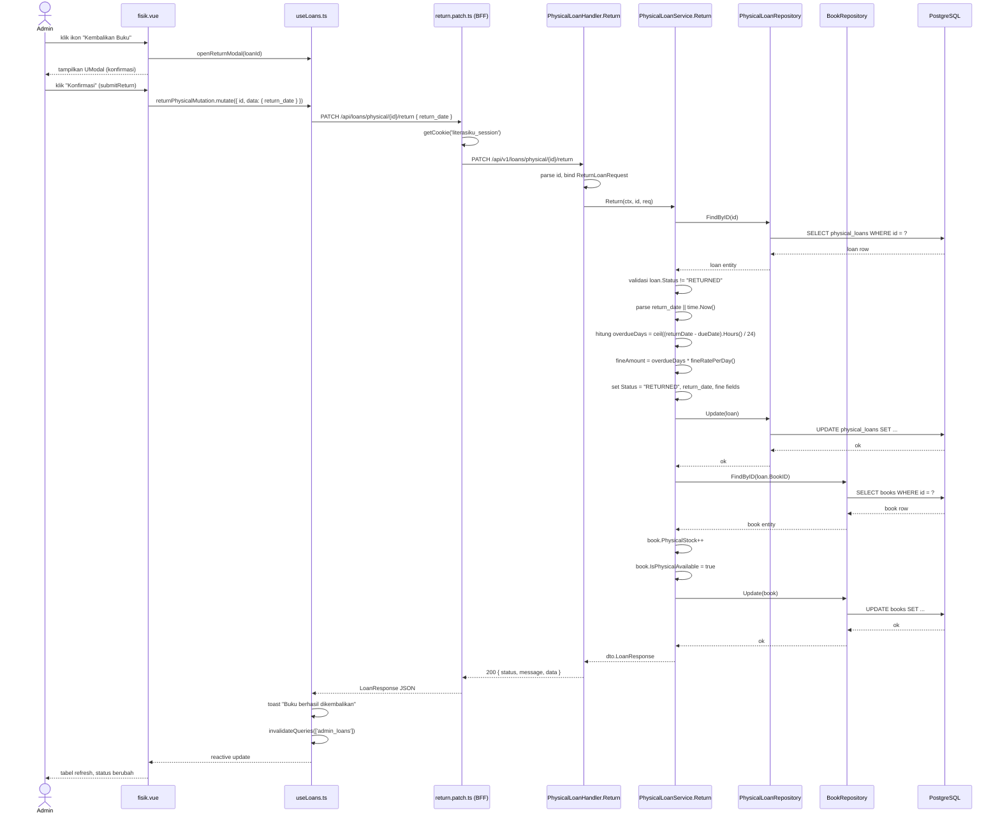

# Catat Pengembalian Buku Fisik

---

## 1. Ringkasan

Sequence ini mencakup proses pengembalian buku fisik oleh Administrator. Admin memilih peminjaman aktif dari daftar, membuka modal konfirmasi dengan opsi tanggal pengembalian (default hari ini), lalu sistem memperbarui status peminjaman menjadi `RETURNED`, menghitung denda otomatis jika terlambat (`overdueDays * FINE_RATE_PER_DAY`), dan mengembalikan stok buku (`PhysicalStock++`).

**Actor:** Administrator (role: `ADMIN`)
**Trigger:** Admin menekan tombol "Kembalikan Buku" pada baris peminjaman dengan status `BORROWED` atau `OVERDUE` di halaman `/admin/peminjaman/fisik`.

---

## 2. Precondition & Postcondition

| Kondisi | Sebelum (Precondition) | Sesudah (Postcondition) |
|---|---|---|
| Sukses | Loan exists, status `BORROWED` atau `OVERDUE`. `PhysicalStock >= 0`. | Loan status → `RETURNED`. `return_date` terisi. Jika overdue → `fine_amount` terhitung, `fine_status = UNPAID`. `book.PhysicalStock++`. |
| Gagal: loan not found | Loan ID tidak valid. | Response 400: "loan not found". |
| Gagal: already returned | Loan sudah berstatus `RETURNED`. | Response 400: "loan already returned". |
| Gagal: invalid date | `return_date` format tidak sesuai `YYYY-MM-DD`. | Response 400: "invalid return_date format". |

---

## 3. Diagram Sequence



---

## 4. Breakdown per Boundary

### Boundary 1: Tabel Daftar Peminjaman (fisik.vue)

| Aspek | Detail |
|---|---|
| **File** | `pages/admin/peminjaman/fisik.vue` |
| **State** | `page`, `limit`, `status` (ref) — filter di URL select, default `ALL` |
| **Input** | Select filter status (`Semua Status`, `BORROWED`, `RETURNED`, `OVERDUE`, `LOST`) |
| **Data** | `useAllPhysicalLoans({ page, limit, status })` via `useLoans()` — query key `['admin_loans', 'physical', page, limit, status]` |
| **Trigger** | Klik tombol `UTooltip` "Kembalikan Buku" pada baris dengan status `BORROWED` / `OVERDUE` |
| **Function** | `openReturnModal((row.original as any).id)` di `fisik.vue:67` |
| **Transisi** | Modal konfirmasi muncul (`isReturnOpen = true`) |

### Boundary 2: Modal Konfirmasi Pengembalian (fisik.vue)

| Aspek | Detail |
|---|---|
| **File** | `pages/admin/peminjaman/fisik.vue` |
| **State** | `selectedLoanId`, `returnDateInput`, `isReturnOpen` (ref) |
| **Input** | `UInput type="date"` dengan `v-model="returnDateInput"` — default `new Date().toISOString().split('T')[0]` |
| **Trigger** | Klik tombol "Konfirmasi" |
| **Function** | `submitReturn()` di `fisik.vue:73` — panggil `returnPhysicalMutation.mutate({ id, data: { return_date } })` |
| **Transisi** | Jika sukses → toast + tabel refresh. Jika gagal → toast error. |

### Boundary 3: Vue Query Mutation (useLoans.ts)

| Aspek | Detail |
|---|---|
| **File** | `composables/useLoans.ts` |
| **Function** | `returnPhysicalMutation` (line 101-113) — `useMutation` dengan `mutationFn` |
| **API** | `PATCH /api/loans/physical/{id}/return` dengan body `{ return_date?: string }` |
| **onSuccess** | Toast "Buku berhasil dikembalikan", `invalidateQueries({ queryKey: ['admin_loans'] })` |
| **onError** | Toast "Gagal memproses pengembalian" + `err?.data?.message \|\| err.message` |
| **Transisi** | Cache invalidate memicu re-fetch tabel via `useAllPhysicalLoans` |

### Boundary 4: BFF Proxy (return.patch.ts)

| Aspek | Detail |
|---|---|
| **File** | `server/api/loans/physical/[id]/return.patch.ts` |
| **Function** | `defineEventHandler` — baca `id` dari router param, `literasiku_session` dari cookie |
| **Auth** | Forward session sebagai `Authorization: Bearer {session}` header |
| **Target** | `PATCH {goApiBaseUrl}/api/v1/loans/physical/{id}/return` |
| **Response** | Return `res.data` (typecast ke `LoanResponse`) |
| **Transisi** | Error diproses via `throwError(error)` → Nuxt error handler |

### Boundary 5: Go Handler — PhysicalLoanHandler.Return

| Aspek | Detail |
|---|---|
| **File** | `modules/physical_loan/handler/physical_loan_handler.go` |
| **Function** | `Return(ctx *gin.Context)` (line 48-65) |
| **Parsing** | `strconv.ParseUint(ctx.Param("id"))` → `uint(id)`; `ctx.ShouldBindJSON(&req)` → `dto.ReturnLoanRequest` (opsional `return_date`) |
| **Delegasi** | `h.svc.Return(ctx, id, req)` |
| **Response** | Sukses → `200 { status, message, data: dto.LoanResponse }`; Gagal → `400 { status, message }` |

### Boundary 6: Go Service — PhysicalLoanService.Return

| Aspek | Detail |
|---|---|
| **File** | `modules/physical_loan/service/physical_loan_service.go` |
| **Function** | `Return(ctx, loanID, req)` (line 104-148) |
| **Langkah** | ① `FindByID(loanID)` ② validasi `loan.Status != "RETURNED"` ③ parse/fallback `return_date` ④ hitung denda ⑤ `Update(loan)` ⑥ restock buku via `BookRepository` |
| **Side-effect** | `Book.PhysicalStock++`, `Book.IsPhysicalAvailable = true` |

### Boundary 7: Repository Layer

| Aspek | Detail |
|---|---|
| **File** | `modules/physical_loan/repository/physical_loan_repository.go` |
| **Method** | `FindByID(id uint)` (Preload Book & User), `Update(loan)` (gorm `Save`) |
| **File** | `modules/book/repository/book_repository.go` |
| **Method** | `FindByID`, `Update` untuk restock |

---

## 5. Alur Detail End-to-End

| Step | Actor/System | Aksi | File:Line | Detail |
|---|---|---|---|---|
| 1 | Admin | Membuka halaman `/admin/peminjaman/fisik` | `fisik.vue:2-3` | `definePageMeta({ layout: 'admin' })` |
| 2 | fisik.vue | Fetch daftar peminjaman | `useLoans.ts:35-47` | `useAllPhysicalLoans` — query key `['admin_loans', 'physical', page, limit, status]` |
| 3 | fisik.vue | Render tabel dengan status filter | `fisik.vue:111-171` | Tombol "Kembalikan Buku" muncul jika status BORROWED/OVERDUE |
| 4 | Admin | Klik ikon "Kembalikan Buku" | `fisik.vue:150-158` | Trigger `openReturnModal(row.original.id)` |
| 5 | fisik.vue | Buka modal konfirmasi | `fisik.vue:67-71` | `isReturnOpen = true`, `returnDateInput = today` (YYYY-MM-DD) |
| 6 | Admin | Isi/koreksi tanggal (opsional), klik "Konfirmasi" | `fisik.vue:206` | `submitReturn()` dipanggil |
| 7 | fisik.vue | Panggil mutation | `fisik.vue:73-80` | `returnPhysicalMutation.mutate({ id: selectedLoanId, data: { return_date } })` |
| 8 | useLoans.ts | Kirim request PATCH | `useLoans.ts:101-104` | `fetch\`/api/loans/physical/${id}/return\`` dengan method `PATCH`, body `{ return_date }` |
| 9 | return.patch.ts | Baca cookie & proxy | `return.patch.ts:6-8` | `getCookie(event, 'literasiku_session')` → `Authorization: Bearer {session}` |
| 10 | return.patch.ts | Forward ke Go API | `return.patch.ts:11-17` | `PATCH ${goApiBaseUrl}/api/v1/loans/physical/${id}/return` |
| 11 | PhysicalLoanHandler | Parse request | `handler.go:49-56` | Parse param `id` (uint), bind JSON → `ReturnLoanRequest` |
| 12 | PhysicalLoanHandler | Delegasi ke service | `handler.go:58` | `h.svc.Return(ctx, uint(id), req)` |
| 13 | PhysicalLoanService | Find loan by ID | `service.go:105` | `s.loanRepo.FindByID(loanID)` — Preload Book & User |
| 14 | PhysicalLoanService | Validasi already returned | `service.go:113-115` | Jika `loan.Status == "RETURNED"` → return error |
| 15 | PhysicalLoanService | Tentukan return_date | `service.go:117-124` | Jika `req.ReturnDate != ""` parse `YYYY-MM-DD`, fallback `time.Now()` |
| 16 | PhysicalLoanService | Hitung denda (jika overdue) | `service.go:129-133` | `overdueDays = ceil((returnDate - dueDate).Hours() / 24)`; `fineAmount = overdueDays * fineRatePerDay()` |
| 17 | PhysicalLoanService | Update loan | `service.go:135-137` | `s.loanRepo.Update(loan)` — DB: `UPDATE physical_loans SET status='RETURNED', return_date=..., fine_amount=..., fine_status=...` |
| 18 | PhysicalLoanService | Restock buku | `service.go:139-144` | `s.bookRepo.FindByID(loan.BookID)` → `book.PhysicalStock++` → `book.IsPhysicalAvailable = true` → `s.bookRepo.Update(book)` |
| 19 | PhysicalLoanService | Return response | `service.go:146-147` | `toLoanResponse(loan)` → `dto.LoanResponse` dengan fields ter-update |
| 20 | PhysicalLoanHandler | Response sukses | `handler.go:64` | `200 { status: "success", message: "Book returned successfully", data: LoanResponse }` |
| 21 | return.patch.ts | Extract data | `return.patch.ts:24` | `return res?.data!` |
| 22 | useLoans.ts | onSuccess handler | `useLoans.ts:106-109` | Toast sukses, `invalidateQueries(['admin_loans'])` |
| 23 | fisik.vue | Re-fetch tabel | — | Cache invalidate → `useAllPhysicalLoans` re-fetch → tabel re-render dengan status `RETURNED` |

---

## 6. Kontrak Request/Response

### PATCH /api/loans/physical/:id/return

**Path:** `client/server/api/loans/physical/[id]/return.patch.ts`
**Target:** `PATCH /api/v1/loans/physical/:id/return`

| Field | Value |
|---|---|
| **Method** | `PATCH` |
| **Path** | `/api/loans/physical/:id/return` (BFF) → `/api/v1/loans/physical/:id/return` (Go) |
| **Header** | `Cookie: literasiku_session=<jwt>` (BFF membaca & forward sebagai `Authorization: Bearer`) |

**Request Body (optional):**

```json
{
  "return_date": "2026-07-02"
}
```

| Field | Tipe | Required | Deskripsi |
|---|---|---|---|
| `return_date` | string | opsional | Format `YYYY-MM-DD`. Default: `time.Now()` (hari ini). |

**Response Sukses (200):**

```json
{
  "status": "success",
  "message": "Book returned successfully",
  "data": {
    "id": 1,
    "user_id": 3,
    "user_full_name": "Budi Santoso",
    "username": "budi",
    "book_id": 5,
    "book_title": "Pemrograman Go",
    "borrow_date": "2026-06-18T00:00:00Z",
    "due_date": "2026-06-25T00:00:00Z",
    "return_date": "2026-07-02T00:00:00Z",
    "status": "RETURNED",
    "fine_amount": 7000,
    "fine_status": "UNPAID",
    "created_at": "2026-06-18T10:00:00Z"
  }
}
```

**Response Error (400):**

```json
{
  "status": "error",
  "message": "Failed to return book",
  "errors": "loan already returned"
}
```

**Status Codes:**

| Code | Condition |
|---|---|
| `200` | Sukses |
| `400` | Loan not found, already returned, invalid date format |
| `401` | Tidak terautentikasi (missing/invalid JWT) |
| `403` | Bukan role ADMIN |

---

## 7. Error Handling & Edge Case

| Kondisi | Deteksi (File:Line) | Response BE | Handling FE |
|---|---|---|---|
| Loan ID bukan angka | `handler.go:49-52` | 400 "Invalid loan ID" | `throwError` → `onError` toast "Gagal memproses pengembalian" |
| Loan not found | `service.go:107-108` | 400 "loan not found" | Toast error |
| Loan sudah RETURNED | `service.go:113-115` | 400 "loan already returned" | Toast error |
| Format return_date invalid | `service.go:120-124` | 400 "invalid return_date format, use YYYY-MM-DD" | Toast error |
| Tidak terlambat (return_date <= due_date) | — | `fine_status: "NONE"`, `fine_amount: 0` | Tidak ada denda, status normal |
| Terlambat (return_date > due_date) | `service.go:129-133` | `fine_amount = ceil(hours/24) * rate`, `fine_status: "UNPAID"` | Tabel menampilkan badge merah "UNPAID" + nominal denda |
| Stok buku 0 sebelum return | — | Setelah return → `PhysicalStock` jadi 1, `IsPhysicalAvailable` jadi true | — |
| Buku sudah dihapus (soft-delete) | `service.go:139-144` | `bookRepo.FindByID` error → skip restock (log error di `_ = s.bookRepo.Update(book)`) | Loan tetap sukses, stok tidak berubah (edge case jarang) |
| Sesi JWT expired | BFF `return.patch.ts:8` | Response 401 dari Go | Nuxt auth redirect ke login |
| Network error | `useLoans.ts:110-112` | — | Toast "Gagal memproses pengembalian" |

---

## 8. File Terkait

### Frontend
- `client/app/pages/admin/peminjaman/fisik.vue` — Halaman utama, tabel, modal konfirmasi
- `client/app/composables/useLoans.ts` — Vue Query mutations (`returnPhysicalMutation`)
- `client/server/api/loans/physical/[id]/return.patch.ts` — BFF proxy endpoint
- `client/shared/types/loans.ts` — Type `LoanResponse`

### Backend
- `server/modules/physical_loan/handler/physical_loan_handler.go` — Handler `Return`
- `server/modules/physical_loan/service/physical_loan_service.go` — Service `Return` (logika bisnis & fine calc)
- `server/modules/physical_loan/repository/physical_loan_repository.go` — `FindByID`, `Update`
- `server/modules/physical_loan/dto/physical_loan_dto.go` — `ReturnLoanRequest`, `LoanResponse`
- `server/modules/book/repository/book_repository.go` — `FindByID`, `Update` (restock)
- `server/router/router.go` — Route `PATCH /:id/return` (adminOnly group, line 127)

---

## 9. Related Docs

- [../../include/kelola_kategori.md](../../include/kelola_kategori.md) — Manajemen kategori buku
- [kelola_peminjaman.md](kelola_peminjaman.md) — Ringkasan keseluruhan fitur peminjaman (fisik & digital)
- `docs/domains/auth.md` — Autentikasi JWT & role-based access
