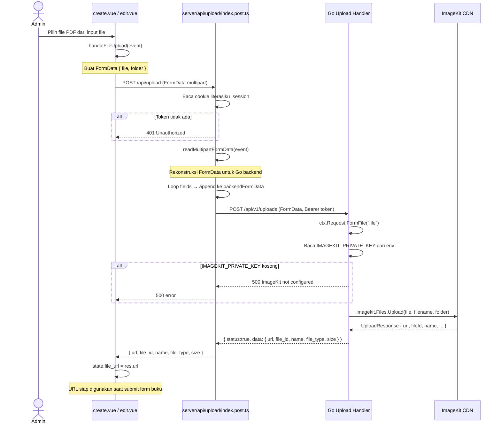

# Sequence 19: Upload File

---

## 1. Ringkasan

Sequence ini mencakup alur unggah file (PDF buku) ke penyimpanan eksternal (ImageKit) yang dilakukan oleh Administrator saat menambah atau mengedit buku. File diunggah dari browser melewati BFF Nuxt yang merekonstruksi `FormData`, diverifikasi otorisasinya, lalu dikirim ke Go API yang mengunggah ke ImageKit CDN. Response berupa URL publik yang kemudian disimpan di field `file_url` buku.

**Actor:** Administrator (role: `ADMIN`)
**Trigger:** Admin memilih file PDF pada form tambah/edit buku (`is_digital_available = true`)

---

## 2. Precondition & Postcondition

| Kondisi | State |
|---|---|
| **Precondition** | Admin sudah login dan berada di halaman `create.vue` atau `edit.vue`. Toggle `is_digital_available` dalam posisi aktif. |
| **Postcondition (Sukses)** | File terunggah ke ImageKit CDN. `state.file_url` berisi URL publik. Toast sukses. |
| **Postcondition (Gagal)** | Toast error ditampilkan. `state.file_url` tidak berubah. Admin bisa upload ulang atau isi URL manual. |
| **Postcondition (Unauthenticated)** | BFF mengembalikan 401. File tidak terunggah. |

---

## 3. Diagram Sequence



---

## 4. Breakdown per Boundary

### Boundary 1: Form Buku (`create.vue` / `edit.vue`)

| Aspek | Detail |
|---|---|
| **File** | `client/app/pages/admin/buku/create.vue:47-71` dan `client/app/pages/admin/buku/[id]/edit.vue:50-74` |
| **State** | `isUploading` (ref false), `state.file_url` (string) |
| **Trigger** | `@change="handleFileUpload"` pada `<UInput type="file" accept="application/pdf">` |
| **Function** | `handleFileUpload(event)` — membaca file dari event target, membuat FormData, memanggil `$fetch('/api/upload', { method: 'POST', body: formData })` |
| **API Call** | `POST /api/upload` dengan `Content-Type: multipart/form-data` (otomatis dari FormData) |
| **On Success** | `state.file_url = res.data.url`; toast "File berhasil diunggah" |
| **On Error** | Toast "Gagal mengunggah file" dengan pesan error dari API |
| **Transisi** | URL file tersimpan di `state.file_url`, siap dikirim bersama payload buku saat submit form |

### Boundary 2: BFF Upload (`server/api/upload/index.post.ts`)

| Aspek | Detail |
|---|---|
| **File** | `client/server/api/upload/index.post.ts:1-58` |
| **Auth** | Baca cookie `literasiku_session` — jika tidak ada, throw 401 via `throwError` |
| **Body Parsing** | `readMultipartFormData(event)` → array `{ name, data, filename, type }` |
| **FormData Rekonstruksi** | Loop setiap field — file field diappend sebagai `Blob` dengan filename; text field diappend sebagai string |
| **Forward** | `$fetch('POST {goApiBaseUrl}/api/v1/uploads', { headers: { Authorization: Bearer {token} }, body: backendFormData })` |
| **Error** | Try-catch → `throwError` dengan status dari Go response |
| **Response** | `return res.data` — hanya data object, tanpa envelope |

### Boundary 3: Go Upload Handler

| Aspek | Detail |
|---|---|
| **File** | `server/modules/upload/handler/upload_handler.go:1-67` |
| **Route** | `POST /api/v1/uploads` — dilindungi `Authenticate` + `AdminOnly` |
| **File Parsing** | `ctx.Request.FormFile("file")` — dapatkan file + header |
| **Folder** | `ctx.DefaultPostForm("folder", "/literasiku/books")` |
| **ImageKit Config** | `os.Getenv("IMAGEKIT_PRIVATE_KEY")` — jika kosong, return 500 |
| **Upload** | `imagekit.NewClient(...).Files.Upload(ctx, imagekit.FileUploadParams{ File, FileName, Folder })` |
| **Response Sukses** | `201 Created`: `{ status:true, data: { url, file_id, name, file_type, size } }` |
| **Response Gagal** | `400` (file parsing error) atau `500` (ImageKit error / missing config) |

---

## 5. Alur Detail End-to-End

1. Admin mengaktifkan toggle `is_digital_available` di form tambah/edit buku → muncul section upload file.
2. Admin klik input file, pilih PDF → `handleFileUpload(event)` terpanggil.
3. Fungsi membuat `FormData` dengan field `file` (dari `event.target.files[0]`) dan `folder` (`/literasiku/books`).
4. `$fetch<any>('/api/upload', { method: 'POST', body: formData })` dikirim ke BFF.
5. BFF `upload/index.post.ts:6-13` membaca cookie `literasiku_session` — abort 401 jika tidak ada.
6. BFF `upload/index.post.ts:16-23` memanggil `readMultipartFormData(event)` — abort 400 jika kosong.
7. BFF `upload/index.post.ts:26-40` mengiterasi hasil `multipartFormData`:
   - Jika `field.name === 'file'` dan `field.filename` ada → append sebagai `Blob` dengan filename.
   - Jika field name lain → append sebagai string.
8. BFF `upload/index.post.ts:43-49` mengirim `POST {goApiBaseUrl}/api/v1/uploads` dengan `Authorization: Bearer {token}` dan `body: backendFormData`.
9. Go handler `upload_handler.go:26-31` membaca file via `ctx.Request.FormFile("file")` — abort 400 jika gagal.
10. Go handler `upload_handler.go:34` membaca folder dari form (default `/literasiku/books`).
11. Go handler `upload_handler.go:36-41` membaca `IMAGEKIT_PRIVATE_KEY` dari env — abort 500 jika kosong.
12. Go handler `upload_handler.go:43-51` inisialisasi ImageKit client dan upload file:
    ```go
    client.Files.Upload(context.Background(), imagekit.FileUploadParams{
        File:     file,
        FileName: header.Filename,
        Folder:   param.NewOpt(folder),
    })
    ```
13. ImageKit mengembalikan response → Go handler mapping ke `{ url, file_id, name, file_type, size }`.
14. Response `201 Created` dikembalikan ke BFF.
15. BFF extract `res.data` dan return ke client.
16. Client menyimpan `res.url` ke `state.file_url`.
17. Toast "File berhasil diunggah" ditampilkan.

---

## 6. Kontrak Request/Response

### POST /api/upload

| Aspek | Detail |
|---|---|
| **Method** | `POST` |
| **Path** | `/api/upload` |
| **Content-Type** | `multipart/form-data` |
| **Header** | `Cookie: literasiku_session=<token>` (otomatis dari browser) |
| **Form Fields** | `file` (File, required, PDF) — file yang akan diunggah; `folder` (string, opsional, default `/literasiku/books`) — direktori di ImageKit |

**Response Sukses (200)**

```json
{
  "url": "https://ik.imagekit.io/literasiku/literasiku/books/pengantar-si_Y7kz2cF6n.pdf",
  "file_id": "63e8f1a2b3c4d5e6f7a8b9c0",
  "name": "pengantar-si_Y7kz2cF6n.pdf",
  "file_type": "pdf",
  "size": 2456789
}
```

**Response Error (400)**

```json
{
  "status": false,
  "message": "Failed to read file",
  "error": "http: no such file"
}
```

**Response Error (401)**

```json
{
  "statusCode": 401,
  "statusMessage": "Unauthorized"
}
```

**Response Error (500) — ImageKit not configured**

```json
{
  "status": false,
  "message": "ImageKit not configured",
  "error": "IMAGEKIT_PRIVATE_KEY is missing"
}
```

---

## 7. Error Handling & Edge Case

### 7.1. Backend Service Errors

| Skenario | Deteksi | HTTP Status | Pesan Error |
|---|---|---|---|
| **Session tidak valid** (BFF) | Cookie `literasiku_session` tidak ada | 401 | `"Unauthorized"` |
| **Tidak ada file** (BFF) | `readMultipartFormData` kosong | 400 | `"No file provided"` |
| **Gagal parsing file** (Go) | `ctx.Request.FormFile("file")` error | 400 | `"Failed to read file"` + detail |
| **ImageKit not configured** (Go) | `IMAGEKIT_PRIVATE_KEY` kosong | 500 | `"ImageKit not configured"` |
| **ImageKit upload gagal** (Go) | `client.Files.Upload` error | 500 | `"Failed to upload file to ImageKit"` + detail |
| **Backend unreachable** (BFF) | `$fetch` ke Go timeout/refused | 500 | `"Failed to upload file to backend"` |

### 7.2. Client-side Error Display

```ts
// create.vue:66-68 dan edit.vue:68-71
try {
  const res = await $fetch<any>('/api/upload', { method: 'POST', body: formData })
  state.file_url = res.data.url
  toast.add({ title: 'File berhasil diunggah', color: 'success', icon: 'i-lucide-check-circle' })
} catch (error: any) {
  toast.add({
    title: 'Gagal mengunggah file',
    description: error?.data?.statusMessage || 'Error',
    color: 'error',
    icon: 'i-lucide-x-circle'
  })
}
```

### 7.3. Edge Cases

| Edge Case | Penanganan |
|---|---|
| **File terlalu besar** | ImageKit memiliki batas ukuran sendiri; error dari ImageKit di-propagate ke client |
| **File bukan PDF** | Input `accept="application/pdf"` membatasi di browser, tapi backend tidak memvalidasi tipe file |
| **Upload sementara navigasi** | Tidak ada guard — navigasi akan mengganggu upload. User harus menunggu upload selesai |
| **Multiple file upload** | Hanya file pertama yang diproses (`event.target.files[0]`) |
| **Folder tidak dikirim** | Go handler menggunakan default `/literasiku/books` |
| **Network error** | `$fetch` throw → catch → toast "Gagal mengunggah file" |
| **Loading state** | `isUploading` ref mencegah multiple upload simultan |

---

## 8. File Terkait

### Frontend

| File | Path (relatif terhadap repo root) |
|---|---|
| Halaman Tambah Buku | `client/app/pages/admin/buku/create.vue` |
| Halaman Edit Buku | `client/app/pages/admin/buku/[id]/edit.vue` |
| BFF Upload | `client/server/api/upload/index.post.ts` |
| Server Utils | `client/server/utils/apiCall.ts` |
| Types API | `client/shared/types/api.ts` |

### Backend

| File | Path (relatif terhadap repo root) |
|---|---|
| Upload Handler | `server/modules/upload/handler/upload_handler.go` |
| Router (route registration) | `server/router/router.go` |
| Auth Middleware | `server/middlewares/authentication.go` |
| Admin RBAC Middleware | `server/middlewares/rbac.go` |
| Response Utils | `server/pkg/utils/response.go` |
| Main Entry (dependency wiring) | `server/cmd/main.go` |

---

## 9. Related Docs

- [kelola_buku.md](../kelola_buku.md) — Dokumen utama CRUD buku (upload file adalah sub-flow dari create/edit buku)
- [include/kelola_kategori.md](../include/kelola_kategori.md) — Manajemen kategori (dependency form buku)
- `server/router/router.go:147-150` — Route registration uploads (Authenticate + AdminOnly)
