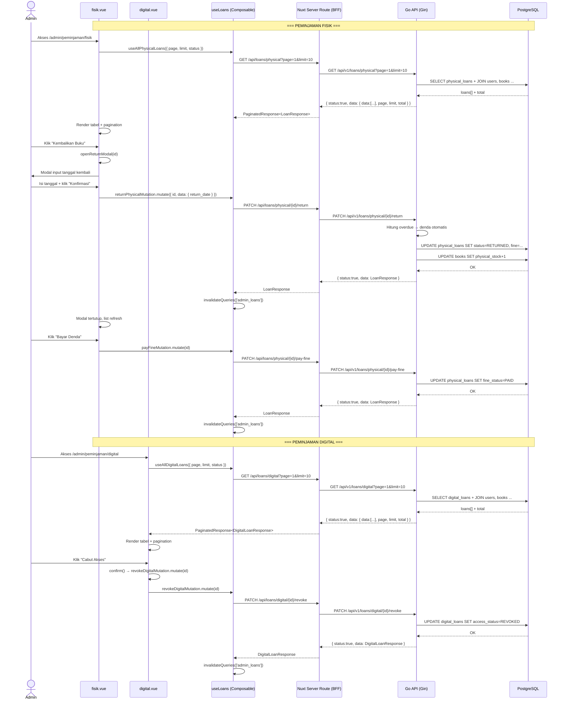

# Sequence: Kelola Peminjaman (Admin)

---

## 1. Ringkasan

Sequence ini mencakup manajemen peminjaman buku fisik dan digital oleh Administrator. Admin dapat melihat daftar peminjaman (fisik dan digital) dengan filter status, memproses pengembalian buku fisik (termasuk kalkulasi denda otomatis), membayarkan denda, serta mencabut akses baca buku digital. Trigger awal adalah navigasi admin ke halaman `/admin/peminjaman/fisik` atau `/admin/peminjaman/digital`.

**Actor:** Administrator (role: `ADMIN`)
**Trigger:** Admin mengakses route `/admin/peminjaman/fisik` atau `/admin/peminjaman/digital`

**Hubungan dengan dokumen lain:**
- Buku yang dipinjam/dikembalikan adalah entitas dari [kelola_buku.md](../kelola_buku.md)
- Status ketersediaan buku (stock fisik, akses digital) berubah saat peminjaman/pengembalian

---

## 2. Precondition & Postcondition

### Peminjaman Fisik

| Kondisi | State |
|---|---|
| **Precondition** | Admin login dengan role `ADMIN`. Route `/admin/peminjaman/fisik` diakses. |
| **Postcondition (List)** | Data peminjaman fisik dari database ditampilkan dengan filter status, pagination. |
| **Postcondition (Return)** | Status pinjam berubah `BORROWED/OVERDUE` → `RETURNED`. Stok buku +1. Jika terlambat, denda terhitung otomatis (`FINE_RATE_PER_DAY × overdue_days`). |
| **Postcondition (Pay Fine)** | `FineStatus` berubah `UNPAID` → `PAID`. |
| **Postcondition (Error)** | Toast error sesuai jenis kegagalan. |

### Peminjaman Digital

| Kondisi | State |
|---|---|
| **Precondition** | Admin login dengan role `ADMIN`. Route `/admin/peminjaman/digital` diakses. |
| **Postcondition (List)** | Data peminjaman digital ditampilkan dengan filter status, pagination. |
| **Postcondition (Revoke)** | `AccessStatus` berubah `ACTIVE` → `REVOKED`. User kehilangan akses baca. |
| **Postcondition (Error)** | Toast error sesuai jenis kegagalan. |

---

## 3. Diagram Sequence



---

## 4. Breakdown per Boundary

### Boundary 1: Peminjaman Fisik (`fisik.vue`)

| Aspek | Detail |
|---|---|
| **File Komponen** | `client/app/pages/admin/peminjaman/fisik.vue:1-213` |
| **Layout** | `admin` |
| **State/Store** | `page` (ref 1), `limit` (ref 10), `status` (ref 'ALL'), `isReturnOpen` (ref false), `selectedLoanId` (ref null), `returnDateInput` (ref '') |
| **Composable** | `useLoans()` → `useAllPhysicalLoans({ page, limit, status })`, `returnPhysicalMutation`, `payFineMutation` |
| **Trigger** | Page mount → query otomatis (TanStack Query); filter status → page reset; aksi return/pay |
| **API Calls** | `GET /api/loans/physical?page=&limit=&status=` via `fetch` (useRequestFetch); `PATCH /api/loans/physical/{id}/return`; `PATCH /api/loans/physical/{id}/pay-fine` |
| **Transisi** | Tidak ada navigasi — semua aksi via modal/mutation di halaman yang sama |

### Boundary 2: Peminjaman Digital (`digital.vue`)

| Aspek | Detail |
|---|---|
| **File Komponen** | `client/app/pages/admin/peminjaman/digital.vue:1-133` |
| **Layout** | `admin` |
| **State/Store** | `page` (ref 1), `limit` (ref 10), `status` (ref 'ALL') |
| **Composable** | `useLoans()` → `useAllDigitalLoans({ page, limit, status })`, `revokeDigitalMutation` |
| **Trigger** | Page mount → query otomatis; filter status → page reset |
| **API Calls** | `GET /api/loans/digital?page=&limit=&status=` via `fetch`; `PATCH /api/loans/digital/{id}/revoke` |
| **Transisi** | Semua aksi inline — revoke via `confirm()` + mutation |

### Boundary 3: Composable `useLoans.ts`

| Aspek | Detail |
|---|---|
| **File** | `client/app/composables/useLoans.ts:1-153` |
| **Query (Admin Physical)** | `useAllPhysicalLoans({ page, limit, status })` → key `['admin_loans', 'physical', ...]` → `fetch('GET /api/loans/physical')` |
| **Query (Admin Digital)** | `useAllDigitalLoans({ page, limit, status })` → key `['admin_loans', 'digital', ...]` → `fetch('GET /api/loans/digital')` |
| **Mutation Return** | `returnPhysicalMutation` → `PATCH /api/loans/physical/{id}/return` → invalidate `['admin_loans']` |
| **Mutation Pay Fine** | `payFineMutation` → `PATCH /api/loans/physical/{id}/pay-fine` → invalidate `['admin_loans']` |
| **Mutation Revoke** | `revokeDigitalMutation` → `PATCH /api/loans/digital/{id}/revoke` → invalidate `['admin_loans']` |
| **Fetch Pattern** | Menggunakan `useRequestFetch()` (custom fetch dengan auth header) — berbeda dengan `useBooks` yang pakai `$fetch` langsung |

### Boundary 4: BFF Server Routes

| Aspek | Detail |
|---|---|
| **Base** | `client/server/api/loans/physical/` dan `client/server/api/loans/digital/` |
| **List** | `index.get.ts` → forward query params + Bearer token dari cookie |
| **Return** | `[id]/return.patch.ts` → forward body + token |
| **Pay Fine** | `[id]/pay-fine.patch.ts` → forward token |
| **Revoke** | `[id]/revoke.patch.ts` → forward token |

### Boundary 5: Backend Go — Physical Loan

| Lapisan | File | Peran |
|---|---|---|
| **Handler** | `server/modules/physical_loan/handler/physical_loan_handler.go:1-139` | Binding JSON, parsing param, delegasi ke service |
| **Service** | `server/modules/physical_loan/service/physical_loan_service.go:1-238` | Logika bisnis: borrow (cek stok, kurangi stock), return (hitung denda, tambah stock), pay fine |
| **Repository** | `server/modules/physical_loan/repository/physical_loan_repository.go` | Akses database `physical_loans` via GORM |

### Boundary 6: Backend Go — Digital Loan

| Lapisan | File | Peran |
|---|---|---|
| **Handler** | `server/modules/digital_loan/handler/digital_loan_handler.go:1-139` | Binding JSON, parsing param, delegasi ke service |
| **Service** | `server/modules/digital_loan/service/digital_loan_service.go:1-195` | Logika bisnis: borrow (cek PDF exists, cek akses aktif), revoke, check access |
| **Repository** | `server/modules/digital_loan/repository/digital_loan_repository.go` | Akses database `digital_loans` via GORM |

---

## 5. Alur Detail End-to-End

### 5.1. Melihat Daftar Peminjaman Fisik

1. Admin mengakses `/admin/peminjaman/fisik` → layout `admin.vue` verifikasi role ADMIN.
2. `fisik.vue:22-23` panggil `useAllPhysicalLoans({ page, limit, status })`.
3. `useLoans.ts:35-47` query key `['admin_loans', 'physical', page, limit, status]` — jika `status === 'ALL'`, parameter tidak dikirim.
4. BFF `loans/physical/index.get.ts` forward ke `{goApiBaseUrl}/api/v1/loans/physical` dengan Bearer token.
5. Go handler `physical_loan_handler.go:67-86` parse `page`, `limit`, `status` → panggil `svc.GetAll()`.
6. Service `physical_loan_service.go:150-162` clamp `page`/`limit`, panggil `loanRepo.FindAll(page, limit, status)`.
7. Repository melakukan query `physical_loans` dengan JOIN `users` dan `books`, filter `status` jika ada, `ORDER BY created_at DESC`, pagination `OFFSET/LIMIT`.
8. Response `PaginatedResponse` → dirender di `UTable` dengan kolom: ID, Peminjam, Buku, Tgl Pinjam, Tenggat, Status, Denda, Aksi.

### 5.2. Filter Status Peminjaman Fisik

Admin memilih status dari `USelect` (ALL / BORROWED / RETURNED / OVERDUE / LOST) → ref `status` berubah → query key berubah → refetch otomatis.

### 5.3. Memproses Pengembalian Buku Fisik

1. Admin klik ikon "Kembalikan" pada pinjaman dengan status `BORROWED` atau `OVERDUE`.
2. `fisik.vue:67-71` → `openReturnModal(id)` → `selectedLoanId = id`, `returnDateInput = hari ini`, `isReturnOpen = true`.
3. Modal muncul dengan input tanggal (default hari ini).
4. Admin klik "Konfirmasi" → `submitReturn()` di `fisik.vue:73-80` → `returnPhysicalMutation.mutate({ id, data: { return_date } })`.
5. `useLoans.ts:101-113` mutation → `fetch('PATCH /api/loans/physical/{id}/return', { body: { return_date } })`.
6. Go handler `physical_loan_handler.go:48-65` → parsing `id` dari param, bind `ReturnLoanRequest` → `svc.Return()`.
7. Service `physical_loan_service.go:104-148`:
   - Cek loan exists, cek belum return (`status != 'RETURNED'`).
   - Parse `return_date` (format `YYYY-MM-DD`), default ke `time.Now()`.
   - Set `Status = "RETURNED"`, `ReturnDate = parsed`.
   - Jika `returnDate > DueDate`: hitung `overdueDays = ceil(selisih jam / 24)`, `FineAmount = overdueDays × fineRatePerDay()` (default 1000/hari, dari env `FINE_RATE_PER_DAY`), `FineStatus = "UNPAID"`.
   - `loanRepo.Update(loan)`.
   - `bookRepo.FindByID(loan.BookID)` → `PhysicalStock++`, `IsPhysicalAvailable = true` → `bookRepo.Update(book)`.
8. `onSuccess`: invalidate `['admin_loans']`, toast "Buku berhasil dikembalikan", modal tertutup.

### 5.4. Membayar Denda

1. Admin klik ikon "Bayar Denda" pada pinjaman dengan `fine_status === 'UNPAID'`.
2. `fisik.vue:82-84` → `payFineMutation.mutate(id)`.
3. `useLoans.ts:115-126` mutation → `fetch('PATCH /api/loans/physical/{id}/pay-fine')`.
4. Go handler `physical_loan_handler.go:125-139` → `svc.PayFine(id)`.
5. Service `physical_loan_service.go:190-207`: cek loan exists, cek `FineStatus === "UNPAID"`, set `FineStatus = "PAID"`, `loanRepo.Update(loan)`.
6. `onSuccess`: invalidate `['admin_loans']`, toast "Denda berhasil dibayar".

### 5.5. Melihat Daftar Peminjaman Digital

1. Admin mengakses `/admin/peminjaman/digital` → layout `admin.vue` verifikasi role.
2. `digital.vue:21-22` panggil `useAllDigitalLoans({ page, limit, status })`.
3. `useLoans.ts:49-61` query key `['admin_loans', 'digital', page, limit, status]`.
4. BFF → Go handler `digital_loan_handler.go:64-83` → `svc.GetAll()`.
5. Sama seperti fisik, dengan tabel kolom: ID, Peminjam, Buku, Tgl Mulai, Tgl Berakhir, Status, Aksi.

### 5.6. Mencabut Akses Digital

1. Admin klik ikon "Cabut Akses" (merah, icon ban) pada pinjaman dengan `access_status === 'ACTIVE'`.
2. `digital.vue:51-55` → `revokeAccess(id)` → `confirm('...')` → `revokeDigitalMutation.mutate(id)`.
3. `useLoans.ts:128-139` mutation → `fetch('PATCH /api/loans/digital/{id}/revoke')`.
4. Go handler `digital_loan_handler.go:48-62` → `svc.Revoke(id)`.
5. Service `digital_loan_service.go:94-114`: cek loan exists, cek `AccessStatus === "ACTIVE"`, set `AccessStatus = "REVOKED"`, `loanRepo.Update(loan)`.
6. `onSuccess`: invalidate `['admin_loans']`, toast "Akses digital berhasil dicabut".

---

## 6. Kontrak Request/Response

### GET /api/loans/physical (List Fisik — Admin)

| Aspek | Detail |
|---|---|
| **Method** | `GET` |
| **Path** | `/api/loans/physical` |
| **Header** | `Cookie: literasiku_session=<token>` |
| **Query Params** | `page` (int, default 1), `limit` (int, default 10), `status` (string: ALL/BORROWED/RETURNED/OVERDUE/LOST) |
| **Response Sukses (200)** | `{ status:true, data: { data: LoanResponse[], page, limit, total, total_pages } }` |

### PATCH /api/loans/physical/:id/return

| Aspek | Detail |
|---|---|
| **Method** | `PATCH` |
| **Path** | `/api/loans/physical/:id/return` |
| **Header** | `Cookie: literasiku_session=<token>` |
| **Request Body** | `{ "return_date": "2026-07-10" }` (opsional, format `YYYY-MM-DD`, default hari ini) |
| **Response Sukses (200)** | `{ status:true, message:"Book returned successfully", data: LoanResponse }` |
| **Response Error (400)** | Loan sudah return, return_date format invalid, loan not found |

### PATCH /api/loans/physical/:id/pay-fine

| Aspek | Detail |
|---|---|
| **Method** | `PATCH` |
| **Path** | `/api/loans/physical/:id/pay-fine` |
| **Header** | `Cookie: literasiku_session=<token>` |
| **Response Sukses (200)** | `{ status:true, message:"Fine paid successfully", data: LoanResponse }` |
| **Response Error (400)** | Tidak ada denda unpaid, loan not found |

### GET /api/loans/digital (List Digital — Admin)

| Aspek | Detail |
|---|---|
| **Method** | `GET` |
| **Path** | `/api/loans/digital` |
| **Header** | `Cookie: literasiku_session=<token>` |
| **Query Params** | `page` (int, default 1), `limit` (int, default 10), `status` (string: ALL/ACTIVE/EXPIRED/REVOKED) |
| **Response Sukses (200)** | `{ status:true, data: { data: DigitalLoanResponse[], page, limit, total, total_pages } }` |

### PATCH /api/loans/digital/:id/revoke

| Aspek | Detail |
|---|---|
| **Method** | `PATCH` |
| **Path** | `/api/loans/digital/:id/revoke` |
| **Header** | `Cookie: literasiku_session=<token>` |
| **Response Sukses (200)** | `{ status:true, message:"Access revoked successfully", data: DigitalLoanResponse }` |
| **Response Error (400)** | Loan tidak aktif, loan not found |

### LoanResponse Shape (Fisik)

```json
{
  "id": 1,
  "user_id": 5,
  "user_full_name": "Budi Santoso",
  "username": "budi",
  "book_id": 10,
  "book_title": "Pengantar Sistem Informasi",
  "borrow_date": "2026-06-28T10:00:00Z",
  "due_date": "2026-07-05T10:00:00Z",
  "return_date": "2026-07-10T10:00:00Z",
  "status": "RETURNED",
  "fine_amount": 5000,
  "fine_status": "UNPAID",
  "created_at": "2026-06-28T10:00:00Z"
}
```

### DigitalLoanResponse Shape (Digital)

```json
{
  "id": 2,
  "user_id": 5,
  "user_full_name": "Budi Santoso",
  "username": "budi",
  "book_id": 10,
  "book_title": "Pengantar Sistem Informasi",
  "start_date": "2026-07-01T10:00:00Z",
  "end_date": "2026-07-08T10:00:00Z",
  "access_status": "ACTIVE",
  "created_at": "2026-07-01T10:00:00Z"
}
```

---

## 7. Error Handling & Edge Case

### 7.1. Backend Service Errors

| Skenario | Deteksi | HTTP Status | Pesan Error |
|---|---|---|---|
| **Loan tidak ditemukan** | `loanRepo.FindByID` → `gorm.ErrRecordNotFound` | 404 / 400 | `"loan not found"` |
| **Buku sudah dikembalikan** (Return) | `loan.Status == "RETURNED"` | 400 | `"loan already returned"` |
| **Format return_date invalid** (Return) | `time.Parse("2006-01-02", ...)` error | 400 | `"invalid return_date format, use YYYY-MM-DD"` |
| **Tidak ada denda unpaid** (Pay Fine) | `loan.FineStatus != "UNPAID"` | 400 | `"no unpaid fine for this loan"` |
| **Loan digital tidak aktif** (Revoke) | `loan.AccessStatus != "ACTIVE"` | 400 | `"loan is not active"` |
| **ID tidak valid** | `strconv.ParseUint` error | 400 | `"Invalid loan ID"` |

### 7.2. Client-side Error Display

```ts
// useLoans.ts — pola konsisten untuk semua mutation
onError: (err: any) => {
  toast.add({
    title: 'Gagal memproses pengembalian', // atau sesuai konteks
    description: err?.data?.message || err.message,
    color: 'error',
    icon: 'i-lucide-alert-circle'
  })
}
```

### 7.3. Edge Cases

| Edge Case | Penanganan |
|---|---|
| **Buku dikembalikan tepat waktu** | Tidak ada denda — `FineAmount = 0`, `FineStatus = "NONE"` |
| **Buku dikembalikan terlambat** | Denda = `ceil(overdue_days) × 1000` (atau `FINE_RATE_PER_DAY` env) |
| **Overdue fraksional (1.5 hari)** | `math.Ceil` → 2 hari denda |
| **Return tanpa tanggal** | Default `time.Now()` |
| **Stock buku nol setelah return** | `IsPhysicalAvailable = true` (selalu di-set true saat return) |
| **Pay fine tanpa denda** | Dicegah service — `FineStatus != "UNPAID"` |
| **Revoke loan yang sudah expired** | Dicegah service — `AccessStatus != "ACTIVE"` |
| **Query limit > 100** | Service clamp ke 100 (fisik) / 10 (default) untuk digital tidak ada clamp eksplisit di service GetAll |
| **Page < 1** | Service reset ke 1 |

---

## 8. File Terkait

### Frontend

| File | Path (relatif terhadap repo root) |
|---|---|
| Halaman Peminjaman Fisik | `client/app/pages/admin/peminjaman/fisik.vue` |
| Halaman Peminjaman Digital | `client/app/pages/admin/peminjaman/digital.vue` |
| Composable Loans | `client/app/composables/useLoans.ts` |
| Types Loans (FE) | `client/shared/types/loans.ts` |
| Schema Loans (Zod) | `client/shared/schemas/loans.schema.ts` |
| BFF Physical List | `client/server/api/loans/physical/index.get.ts` |
| BFF Physical Return | `client/server/api/loans/physical/[id]/return.patch.ts` |
| BFF Physical Pay Fine | `client/server/api/loans/physical/[id]/pay-fine.patch.ts` |
| BFF Digital List | `client/server/api/loans/digital/index.get.ts` |
| BFF Digital Revoke | `client/server/api/loans/digital/[id]/revoke.patch.ts` |

### Backend

| File | Path (relatif terhadap repo root) |
|---|---|
| Physical Loan Handler | `server/modules/physical_loan/handler/physical_loan_handler.go` |
| Physical Loan Service | `server/modules/physical_loan/service/physical_loan_service.go` |
| Physical Loan Repository | `server/modules/physical_loan/repository/physical_loan_repository.go` |
| Physical Loan DTO | `server/modules/physical_loan/dto/physical_loan_dto.go` |
| Digital Loan Handler | `server/modules/digital_loan/handler/digital_loan_handler.go` |
| Digital Loan Service | `server/modules/digital_loan/service/digital_loan_service.go` |
| Digital Loan Repository | `server/modules/digital_loan/repository/digital_loan_repository.go` |
| Digital Loan DTO | `server/modules/digital_loan/dto/digital_loan_dto.go` |
| Router | `server/router/router.go` |
| Auth Middleware | `server/middlewares/authentication.go` |
| Admin RBAC Middleware | `server/middlewares/rbac.go` |
| Response Utils | `server/pkg/utils/response.go` |

---

## 9. Related Docs

- [kelola_buku.md](../kelola_buku.md) — Dokumen utama CRUD buku (peminjaman mengubah stok/status ketersediaan buku)
- [include/kelola_kategori.md](../include/kelola_kategori.md) — Manajemen kategori buku
- [extends/file-upload.md](file-upload.md) — Upload file PDF (dibutuhkan untuk akses digital)
- `server/router/router.go:115-145` — Route registration untuk physical & digital loans
