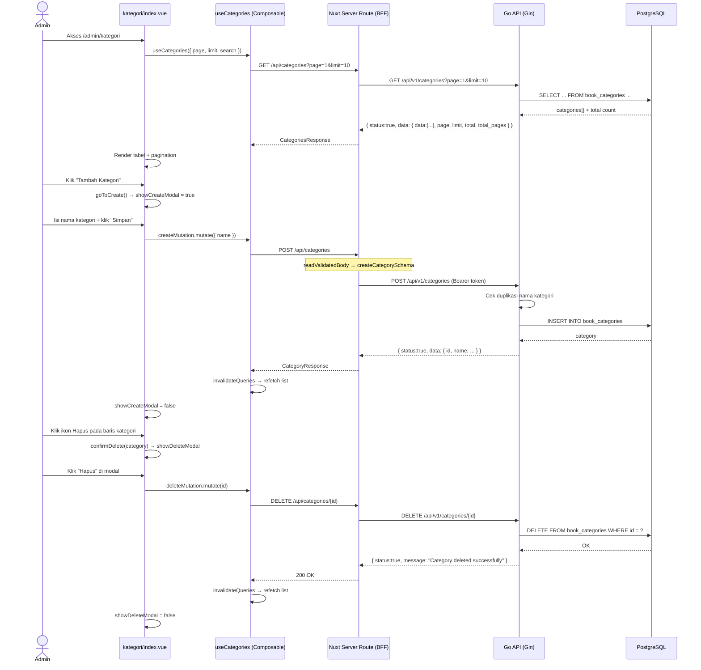

# Sequence: Kelola Kategori (Admin)

---

## 1. Ringkasan

Sequence ini mencakup operasi CRUD untuk manajemen kategori buku perpustakaan yang dilakukan oleh Administrator. Kategori digunakan sebagai label klasifikasi buku — setiap buku harus memiliki satu kategori. Admin dapat melihat daftar kategori dengan pencarian, menambah kategori baru, mengedit nama kategori, dan menghapus kategori. Trigger awal adalah navigasi admin ke halaman `/admin/kategori`.

**Actor:** Administrator (role: `ADMIN`)
**Trigger:** Admin mengakses route `/admin/kategori`

---

## 2. Precondition & Postcondition

| Kondisi | State |
|---|---|
| **Precondition** | Admin sudah login dengan cookie `literasiku_session` valid dan `user.role === 'ADMIN'`. Middleware global (`auth.global.ts`) memastikan session ada; layout `admin.vue` memverifikasi role. |
| **Postcondition (List)** | Data kategori dari database ditampilkan dalam tabel dengan pagination. |
| **Postcondition (Create)** | Kategori baru tersimpan di tabel `book_categories`. List kategori auto-refresh. Modal create tertutup. |
| **Postcondition (Update)** | Nama kategori di-update di tabel `book_categories`. (Update mutation tersedia di composable namun belum di-wire ke UI halaman.) |
| **Postcondition (Delete)** | Kategori dihapus dari tabel `book_categories` (soft-delete via GORM). List kategori auto-refresh. Modal delete tertutup. |
| **Postcondition (Error)** | Toast error ditampilkan sesuai jenis kegagalan. |

---

## 3. Diagram Sequence



---

## 4. Breakdown per Boundary

### Boundary 1: Halaman Kategori (`kategori/index.vue`)

| Aspek | Detail |
|---|---|
| **File Komponen** | `client/app/pages/admin/kategori/index.vue:1-214` |
| **Layout** | `admin` (`client/app/layouts/admin.vue`) — memverifikasi `user.role === 'ADMIN'` via watcher |
| **State/Store** | `page` (ref 1), `limit` (ref 10), `search` (ref ''), `showDeleteModal` (ref false), `deleteTarget` (ref null), `showCreateModal` (ref false), `createState` (reactive `{ name: '' }`) |
| **Composable** | `useCategories({ page, limit, search })` → `categories`, `total`, `totalPages`, `isLoading`, `createMutation`, `deleteMutation` |
| **Trigger** | Page mount → query otomatis via TanStack Query; search langsung trigger refetch (tanpa debounce, tidak ada watch) |
| **API Call** | `GET /api/categories?page=&limit=&search=` via `$fetch` di `useCategories` |
| **Transisi** | "Tambah Kategori" → `goToCreate()` → `showCreateModal = true`; "Hapus" → `confirmDelete(category)` → `showDeleteModal = true`; "Edit" → `goToEdit(id)` → `router.push('/admin/kategori/${id}/edit')` (halaman edit belum tersedia) |

### Boundary 2: Create Modal (Inline di `kategori/index.vue`)

| Aspek | Detail |
|---|---|
| **Trigger** | Klik "Tambah Kategori" → `goToCreate()` di `kategori/index.vue:50-53` |
| **Form** | Satu field: `name` (text, required, max 50 karakter) |
| **Schema** | `createCategorySchema` dari `shared/schemas/categories.schema.ts` — `z.string().min(1).max(50)` |
| **Aksi** | `executeCreate()` di `kategori/index.vue:55-60` → `createMutation.mutate({ name: createState.name })` |
| **API** | `POST /api/categories` via BFF `server/api/categories/index.post.ts` |
| **On Success** | Invalidate query `['categories']`, toast "Kategori berhasil dibuat", modal tertutup |
| **On Error** | Toast "Gagal membuat kategori" dengan pesan error dari API |

### Boundary 3: Delete Modal (Inline di `kategori/index.vue`)

| Aspek | Detail |
|---|---|
| **Trigger** | Klik ikon Hapus → `confirmDelete(category)` di `kategori/index.vue:30-33` |
| **Aksi** | `executeDelete()` di `kategori/index.vue:35-43` → `deleteMutation.mutate(deleteTarget.id)` |
| **API** | `DELETE /api/categories/{id}` via BFF `server/api/categories/[id].delete.ts` |
| **On Success** | Invalidate query `['categories']`, toast "Kategori berhasil dihapus", modal tertutup |
| **On Error** | Toast "Gagal menghapus kategori" dengan pesan error |

### Boundary 4: BFF Server Routes (Nuxt Nitro)

| Aspek | Detail |
|---|---|
| **File** | `client/server/api/categories/index.get.ts`, `index.post.ts`, `[id].patch.ts`, `[id].delete.ts` |
| **GET /api/categories** | Public. Forward query params ke `{goApiBaseUrl}/api/v1/categories`. |
| **POST /api/categories** | Protected: baca cookie `literasiku_session`, validasi dengan `createCategorySchema`, forward dengan Bearer token. |
| **PATCH /api/categories/:id** | Protected: baca cookie, validasi dengan `updateCategorySchema`, forward dengan token. |
| **DELETE /api/categories/:id** | Protected: baca cookie, forward dengan token. |

### Boundary 5: Backend Go (Handler → Service → Repository)

| Lapisan | File | Peran |
|---|---|---|
| **Handler** | `server/modules/category/handler/category_handler.go:1-152` | Binding JSON, parse param, delegasi ke service, mapping error ke HTTP status |
| **Service** | `server/modules/category/service/category_service.go:1-109` | Validasi bisnis (cek duplikasi nama), orchestrasi CRUD |
| **Repository** | `server/modules/category/repository/category_repository.go:1-74` | Akses database `book_categories` via GORM |

---

## 5. Alur Detail End-to-End

### 5.1. Melihat Daftar Kategori

1. Admin mengakses `/admin/kategori`. Middleware global `auth.global.ts:4-16` mengecek cookie `literasiku_session`, layout `admin.vue:23-33` memverifikasi `user.role === 'ADMIN'`.
2. `kategori/index.vue:14-18` memanggil `useCategories({ page, limit, search })`.
3. `useCategories.ts:12-22` menjalankan `useQuery` dengan key `['categories', page, limit, search]`, memanggil `$fetch<CategoriesResponse>('/api/categories', { query: { page, limit, search } })`.
4. BFF `server/api/categories/index.get.ts:5-25` meneruskan query params ke `{goApiBaseUrl}/api/v1/categories?page=...`.
5. Go handler `category_handler.go:68-91` membaca `page`, `limit`, `search` dari query string.
6. Service `category_service.go:61-72` menjalankan `categoryRepo.FindAll(page, limit, search)`, dengan clamping `page` dan `limit`.
7. Repository `category_repository.go:38-56` menjalankan query dengan `ILIKE` untuk search (filter `name`), pagination `OFFSET/LIMIT`, dan `ORDER BY created_at DESC`.
8. Response dikembalikan sebagai `PaginatedResponse` → dikirim ke client → dirender di `UTable`.

### 5.2. Mencari Kategori

1. Admin mengetik di input search → `search` ref berubah.
2. Query key `['categories', page, limit, search]` berubah → TanStack Query otomatis refetch.
3. Tidak ada debounce — refetch terjadi setiap perubahan (perhatikan bahwa buku menggunakan debounce 400ms, tetapi kategori tidak).

### 5.3. Menambah Kategori

1. Admin klik "Tambah Kategori" → `goToCreate()` di `kategori/index.vue:50-53` → `showCreateModal = true`, `createState.name = ''`.
2. Modal create muncul dengan form `name`.
3. Admin isi nama kategori → klik "Simpan".
4. `executeCreate()` di `kategori/index.vue:55-60` → `createMutation.mutate({ name: createState.name })`.
5. `useCategories.ts:24-36` mutation → `$fetch('POST /api/categories', { body: input })`.
6. BFF `server/api/categories/index.post.ts:6-27` validasi body dengan `createCategorySchema`, baca cookie session, forward ke Go API.
7. Go handler `category_handler.go:30-47` bind JSON ke `dto.CategoryRequest { Name: string }`, panggil `categoryService.Create()`.
8. Service `category_service.go:30-48`:
   - Cek duplikasi nama via `categoryRepo.ExistsByName(req.Name, nil)`.
   - Jika sudah ada, return error `"category name already exists"`.
   - Build entity `BookCategory { Name: req.Name }`.
   - `categoryRepo.Create(category)` → GORM INSERT ke `book_categories`.
   - Re-fetch `categoryRepo.FindByID(category.ID)` untuk response lengkap.
9. Response `http.StatusCreated` → BFF extract `res.data` → client `onSuccess`.
10. `useCategories.ts:29-32`: invalidate query key `['categories']`, toast sukses, modal tertutup.

### 5.4. Menghapus Kategori

1. Admin klik ikon Hapus → `confirmDelete(category)` di `kategori/index.vue:30-33` → `deleteTarget = category`, `showDeleteModal = true`.
2. Modal konfirmasi muncul dengan nama kategori yang akan dihapus.
3. Admin klik "Hapus" → `executeDelete()` di `kategori/index.vue:35-43` → `deleteMutation.mutate(deleteTarget.id)`.
4. `useCategories.ts:52-63` mutation → `$fetch('DELETE /api/categories/${id}')`.
5. BFF `server/api/categories/[id].delete.ts:4-23` forward ke `DELETE /api/v1/categories/{id}` dengan token.
6. Go service `category_service.go:100-109`: cek kategori exists, `categoryRepo.Delete(id)` → `db.Delete(&entities.BookCategory{}, id)`.
7. GORM soft-delete — record tidak benar-benar dihapus, `deleted_at` di-set.
8. `onSuccess`: invalidate query `['categories']`, toast sukses, modal ditutup.

### 5.5. Edit Kategori

> **Catatan:** Update mutation (`updateMutation`) tersedia di `useCategories.ts:38-49` dan BFF `PATCH /api/categories/{id}` sudah siap. Namun, halaman `kategori/index.vue` belum memiliki form edit yang berfungsi — tombol Edit di tabel memanggil `goToEdit(id)` yang me-redirect ke `/admin/kategori/${id}/edit`, tetapi halaman tersebut belum dibuat.

Alur yang sudah siap secara infrastruktur:

1. `useCategories.ts:38-49` mutation → `$fetch('PATCH /api/categories/{id}', { body: { name } })`.
2. BFF `server/api/categories/[id].patch.ts` validasi body dengan `updateCategorySchema`.
3. Go service `category_service.go:74-98`: cek kategori exists, cek duplikasi nama (dengan exclude ID sendiri), update `category.Name`, `categoryRepo.Update(category)`.

---

## 6. Kontrak Request/Response

### GET /api/categories (List)

| Aspek | Detail |
|---|---|
| **Method** | `GET` |
| **Path** | `/api/categories` |
| **Header** | Tidak perlu auth (public) |
| **Query Params** | `page` (int, default 1), `limit` (int, default 10, max 100), `search` (string) |
| **Response Sukses (200)** | `{ status: true, message: "Categories retrieved successfully", data: { data: CategoryResponse[], page, limit, total, total_pages } }` |

### POST /api/categories (Create)

| Aspek | Detail |
|---|---|
| **Method** | `POST` |
| **Path** | `/api/categories` |
| **Header** | `Cookie: literasiku_session=<token>` (BFF forward sebagai Bearer) |
| **Request Body** | `{ "name": "string (1-50 chars)" }` |
| **Response Sukses (201)** | `{ status: true, message: "Category created successfully", data: CategoryResponse }` |
| **Response Error (400)** | Nama kategori sudah ada; field tidak valid |
| **Response Error (401)** | Token session tidak valid |

### PATCH /api/categories/:id (Update)

| Aspek | Detail |
|---|---|
| **Method** | `PATCH` |
| **Path** | `/api/categories/:id` |
| **Header** | `Cookie: literasiku_session=<token>` |
| **Request Body** | `{ "name": "string (1-50 chars)" }` |
| **Response Sukses (200)** | `{ status: true, message: "Category updated successfully", data: CategoryResponse }` |
| **Response Error (400)** | Nama kategori sudah ada |
| **Response Error (404)** | Kategori tidak ditemukan |

### DELETE /api/categories/:id (Delete)

| Aspek | Detail |
|---|---|
| **Method** | `DELETE` |
| **Path** | `/api/categories/:id` |
| **Header** | `Cookie: literasiku_session=<token>` |
| **Response Sukses (200)** | `{ status: true, message: "Category deleted successfully", data: null }` |
| **Response Error (404)** | Kategori tidak ditemukan |
| **Response Error (500)** | Gagal menghapus (constraint foreign key dari tabel books) |

### CategoryResponse Shape

```json
{
  "id": 1,
  "name": "Sains & Teknologi",
  "created_at": "2026-07-02T10:00:00Z",
  "updated_at": "2026-07-02T10:00:00Z"
}
```

---

## 7. Error Handling & Edge Case

### 7.1. Backend Service Errors

| Skenario | Deteksi | HTTP Status | Pesan Error |
|---|---|---|---|
| **Nama kategori duplikat** (Create) | `categoryRepo.ExistsByName(name, nil)` → true | 400 | `"category name already exists"` |
| **Nama kategori duplikat** (Update, nama berubah) | `categoryRepo.ExistsByName(name, &id)` → true | 400 | `"category name already exists"` |
| **Kategori tidak ditemukan** (GetByID / Update / Delete) | `categoryRepo.FindByID` → `gorm.ErrRecordNotFound` | 404 | `"category not found"` |
| **Body tidak valid** (binding error) | `ctx.ShouldBindJSON` → error | 400 | `"Failed to parse request"` + detail |
| **ID tidak valid** (not a number) | `strconv.ParseUint` → error | 400 | `"Invalid category ID"` |

### 7.2. Client-side Error Display

```ts
// useCategories.ts — setiap mutation punya onError
onError: (err: any) => {
  toast.add({
    title: 'Gagal membuat kategori',
    description: err?.data?.message || err.message,
    color: 'error',
    icon: 'i-lucide-alert-circle'
  })
}
```

Catatan: error description di `useCategories.ts` membaca `err?.data?.message` (berbeda dengan `useBooks.ts` yang membaca `error?.data?.statusMessage`). Ini inkonsistensi kecil — keduanya tetap berfungsi namun priority field berbeda.

### 7.3. Edge Cases

| Edge Case | Penanganan |
|---|---|
| **Search kosong** | Tidak ada filter ILIKE, return semua kategori |
| **Nama kategori sama persis (case-sensitive)** | DB `uniqueIndex` + `ExistsByName` mencegah duplikasi |
| **Delete kategori yang memiliki buku** | GORM `OnDelete:RESTRICT` di relasi `Book.CategoryID` mencegah delete; error 500 |
| **Input nama melebihi 50 karakter** | Zod `max(50)` mencegah di client; Go binding `max=50` mencegah di server |
| **Query limit > 100** | Service memotong ke 100 |
| **Page < 1** | Service reset ke 1 |
| **Halaman edit belum tersedia** | Tombol Edit di tabel me-redirect ke `/admin/kategori/{id}/edit` yang belum memiliki page |

---

## 8. File Terkait

### Frontend

| File | Path (relatif terhadap repo root) |
|---|---|
| Halaman Kategori | `client/app/pages/admin/kategori/index.vue` |
| Layout Admin | `client/app/layouts/admin.vue` |
| Composable Kategori | `client/app/composables/useCategories.ts` |
| Schema Kategori (Zod) | `client/shared/schemas/categories.schema.ts` |
| Types Kategori (FE) | `client/shared/types/categories.ts` |
| BFF GET List | `client/server/api/categories/index.get.ts` |
| BFF POST Create | `client/server/api/categories/index.post.ts` |
| BFF PATCH Update | `client/server/api/categories/[id].patch.ts` |
| BFF DELETE | `client/server/api/categories/[id].delete.ts` |
| Server Utils | `client/server/utils/apiCall.ts` |
| Middleware Auth Global | `client/app/middleware/auth.global.ts` |

### Backend

| File | Path (relatif terhadap repo root) |
|---|---|
| Category Handler | `server/modules/category/handler/category_handler.go` |
| Category Service | `server/modules/category/service/category_service.go` |
| Category Repository | `server/modules/category/repository/category_repository.go` |
| Category DTO | `server/modules/category/dto/category_dto.go` |
| Category Entity | `server/database/entities/book_category.go` |
| Router | `server/router/router.go` |
| Auth Middleware | `server/middlewares/authentication.go` |
| Admin RBAC Middleware | `server/middlewares/rbac.go` |
| Response Utils | `server/pkg/utils/response.go` |
| Main Entry | `server/cmd/main.go` |

---

## 9. Related Docs

- [../../../register.md](../../../register.md) — Alur autentikasi (session cookie pattern)
- [kelola_buku.md](../kelola_buku.md) — Manajemen buku (dependency: buku membutuhkan kategori saat create/edit)
- [extends/file-upload.md](../extends/file-upload.md) — Upload file PDF ke ImageKit
- `server/router/router.go:70-82` — Route registration untuk categories (public GET, admin-only POST/PATCH/DELETE)
