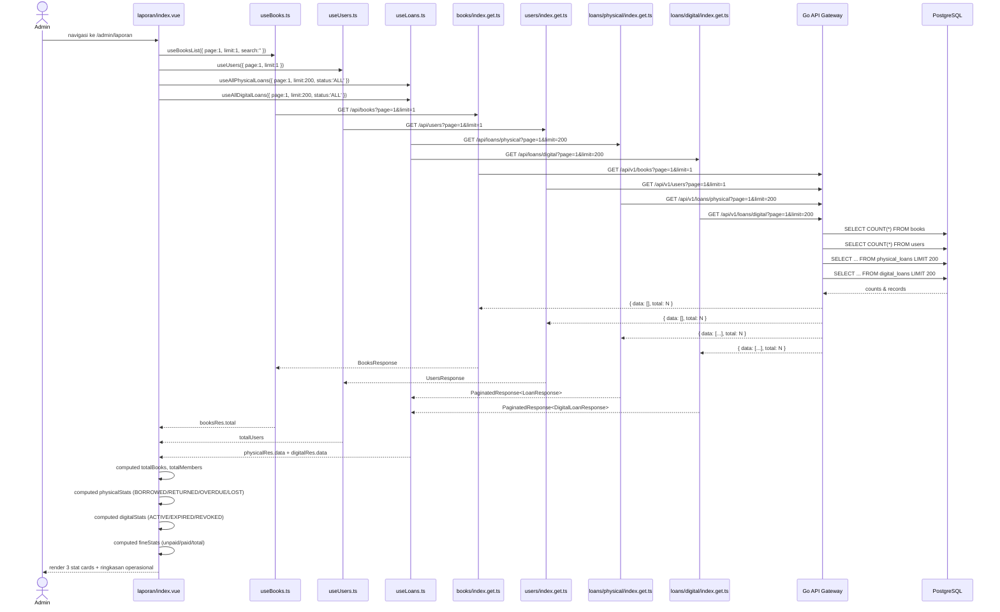

# Lihat Riwayat dan Laporan Peminjaman

---

## 1. Ringkasan

Sequence ini mencakup proses Administrator melihat laporan dan analitik sirkulasi perpustakaan di halaman `/admin/laporan`. Sistem menampilkan ringkasan statistik dari 4 sumber data paralel (buku, anggota, peminjaman fisik, peminjaman digital) dengan agregasi client-side. Admin dapat melihat breakdown status peminjaman fisik/digital, kinerja pembayaran denda, ringkasan operasional, serta mengekspor data ke CSV.

**Actor:** Administrator (role: `ADMIN`)
**Trigger:** Admin mengakses route `/admin/laporan`

---

## 2. Precondition & Postcondition

| Kondisi | Sebelum (Precondition) | Sesudah (Postcondition) |
|---|---|---|
| Sukses | Admin terautentikasi. Data buku, anggota, dan peminjaman tersedia di database. | 4 card statistik + ringkasan operasional dirender. |
| Gagal (data kosong) | Database kosong (belum ada buku/anggota/peminjaman). | Card dengan nilai 0 atau fallback. |

---

## 3. Diagram Sequence



---

## 4. Breakdown per Boundary

### Boundary 1: Halaman Laporan (laporan/index.vue)

| Aspek | Detail |
|---|---|
| **File** | `pages/admin/laporan/index.vue` |
| **Layout** | `admin` |
| **State** | `page` (ref 1), `limitList` (ref 200) |
| **Loading** | `isLoading` — true selama salah satu query loans masih loading |
| **Skeleton** | 3 card placeholder dengan `animate-pulse` saat loading |

### Boundary 2: useBooks.ts — Total Buku

| Aspek | Detail |
|---|---|
| **File** | `composables/useBooks.ts` |
| **Query** | `useBooksList({ page:1, limit:1, search:'' })` — hanya butuh `total`, tidak perlu data |
| **Key** | `['books', 'list', 1, 1, '']` |
| **Output** | `totalBooks = booksRes.value?.total \|\| 0` (computed) |

### Boundary 3: useUsers.ts — Total Anggota

| Aspek | Detail |
|---|---|
| **File** | `composables/useUsers.ts` |
| **Query** | `useUsers({ page:1, limit:1 })` — hanya butuh `total` |
| **Key** | `['users', 1, 1, undefined, undefined]` |
| **Output** | `totalMembers = totalUsers.value \|\| 0` (computed dari `total`) |

### Boundary 4: useLoans.ts — Semua Peminjaman Fisik

| Aspek | Detail |
|---|---|
| **File** | `composables/useLoans.ts` |
| **Query** | `useAllPhysicalLoans({ page:1, limit:200, status:'ALL' })` — butuh semua data untuk agregasi |
| **Key** | `['admin_loans', 'physical', 1, 200, 'ALL']` |
| **Agregasi** | `physicalStats` computed: filter by `status` (BORROWED/RETURNED/OVERDUE/LOST) + hitung persentase |
| **Denda** | `fineStats` computed: total `fine_amount` group by `fine_status` (UNPAID/PAID) |

### Boundary 5: useLoans.ts — Semua Peminjaman Digital

| Aspek | Detail |
|---|---|
| **File** | `composables/useLoans.ts` |
| **Query** | `useAllDigitalLoans({ page:1, limit:200, status:'ALL' })` |
| **Key** | `['admin_loans', 'digital', 1, 200, 'ALL']` |
| **Agregasi** | `digitalStats` computed: filter by `access_status` (ACTIVE/EXPIRED/REVOKED) |

### Boundary 6: BFF Proxies

| Endpoint | File | Auth | Target Go |
|---|---|---|---|
| `GET /api/books?page=1&limit=1` | `books/index.get.ts` | Public | `GET /api/v1/books` |
| `GET /api/users?page=1&limit=1` | `users/index.get.ts` | Bearer session | `GET /api/v1/users` (admin) |
| `GET /api/loans/physical?page=1&limit=200` | `loans/physical/index.get.ts` | Bearer session | `GET /api/v1/loans/physical` (admin) |
| `GET /api/loans/digital?page=1&limit=200` | `loans/digital/index.get.ts` | Bearer session | `GET /api/v1/loans/digital` (admin) |

### Boundary 7: CSV Export

| Aspek | Detail |
|---|---|
| **File** | `laporan/index.vue:72-126` |
| **Function** | `exportToCSV()` — murni client-side, tanpa API tambahan |
| **Data** | Gabung `physicalRes.data` + `digitalRes.data` → mapping field seragam |
| **Format** | CSV dengan BOM UTF-8 (`\uFEFF`), header Indonesia, delimiter koma |
| **Download** | `document.createElement('a')` + `click()` — file `laporan_sirkulasi_YYYY-MM-DD.csv` |
| **Edge case** | Jika tidak ada data → `alert('Tidak ada data peminjaman untuk diekspor')` |

---

## 5. Alur Detail End-to-End

| Step | Actor/System | Aksi | File:Line | Detail |
|---|---|---|---|---|
| 1 | Admin | Navigasi ke `/admin/laporan` | `index.vue:2-4` | Admin layout |
| 2 | index.vue | Init 4 queries parallel | `index.vue:10-28` | books (limit 1), users (limit 1), physical loans (limit 200), digital loans (limit 200) |
| 3 | BFF Books | Proxy GET /books | `books/index.get.ts:5-25` | `GET /api/v1/books?page=1&limit=1` — public |
| 4 | BFF Users | Proxy GET /users | `users/index.get.ts:5-29` | `GET /api/v1/users?page=1&limit=1` — admin auth |
| 5 | BFF Loans Phys | Proxy GET /loans/physical | `loans/physical/index.get.ts` | `GET /api/v1/loans/physical?page=1&limit=200` — admin auth |
| 6 | BFF Loans Dig | Proxy GET /loans/digital | `loans/digital/index.get.ts` | `GET /api/v1/loans/digital?page=1&limit=200` — admin auth |
| 7 | Go API | Query DB | — | Count books, count users, select all loans |
| 8 | index.vue | Compute stats | `index.vue:30-33` | `totalBooks`, `totalMembers`, `totalPhysical`, `totalDigital` |
| 9 | index.vue | Compute physicalStats | `index.vue:37-45` | Filter by status + hitung persentase |
| 10 | index.vue | Compute digitalStats | `index.vue:47-54` | Filter by access_status |
| 11 | index.vue | Compute fineStats | `index.vue:56-61` | Sum fine_amount by fine_status |
| 12 | index.vue | Render | `index.vue:146-300` | Skeleton → 3 stat cards + ringkasan operasional |
| 13 | Admin | Klik "Ekspor Laporan (CSV)" | `index.vue:137-143` | `exportToCSV()` |
| 14 | index.vue | Generate CSV | `index.vue:72-126` | Gabung data fisik + digital, format CSV, download |

---

## 6. Kontrak Request/Response

### GET /api/books?page=1&limit=1

**Path:** `client/server/api/books/index.get.ts`
**Digunakan untuk:** Mendapatkan `total` buku (data tidak dipakai)

**Response Sukses (200):**

```json
{
  "status": "success",
  "message": "Books retrieved successfully",
  "data": {
    "data": [],
    "page": 1,
    "limit": 1,
    "total": 150,
    "total_pages": 150
  }
}
```

### GET /api/users?page=1&limit=1

**Path:** `client/server/api/users/index.get.ts`
**Auth:** Required (ADMIN)

**Response Sukses (200):**

```json
{
  "status": "success",
  "message": "Users retrieved successfully",
  "data": {
    "data": [],
    "page": 1,
    "limit": 1,
    "total": 50,
    "total_pages": 50
  }
}
```

### GET /api/loans/physical?page=1&limit=200

**Path:** `client/server/api/loans/physical/index.get.ts`
**Auth:** Required (ADMIN)

**Response Sukses (200):**

```json
{
  "status": "success",
  "message": "Loans retrieved successfully",
  "data": {
    "data": [
      { "id": 1, "status": "BORROWED", "fine_amount": 0, "fine_status": "NONE", ... }
    ],
    "page": 1,
    "limit": 200,
    "total": 120,
    "total_pages": 1
  }
}
```

### GET /api/loans/digital?page=1&limit=200

**Path:** `client/server/api/loans/digital/index.get.ts`
**Auth:** Required (ADMIN)

**Response Sukses (200):**

```json
{
  "status": "success",
  "message": "Loans retrieved successfully",
  "data": {
    "data": [
      { "id": 1, "access_status": "ACTIVE", ... }
    ],
    "page": 1,
    "limit": 200,
    "total": 80,
    "total_pages": 1
  }
}
```

**Error Codes (semua endpoint admin):**

| Code | Condition |
|---|---|
| `200` | Sukses |
| `401` | Tidak terautentikasi |
| `403` | Bukan role ADMIN (kecuali /books yang public) |
| `500` | Database error |

---

## 7. Error Handling & Edge Case

| Kondisi | Deteksi | Handling |
|---|---|---|
| Database kosong | Semua query return `total: 0` | Card menampilkan 0, progress bar 0%, CSV tidak bisa diekspor (alert) |
| Satu query gagal (misal users API error) | Vue Query error | `totalMembers` jadi `0`, tidak ada toast error eksplisit |
| Semua query loading | `isLoading` computed | 3 skeleton card animasi |
| Limit 200 tidak cukup menampung semua data | — | Loan > 200 tidak masuk statistik (limitasi, bukan error eksplisit) |
| CSV tidak ada data | `index.vue:101-104` | `alert('Tidak ada data peminjaman untuk diekspor')` |
| Nilai fine_amount null/undefined | `index.vue:58-59` | `reduce` dengan `0` fallback |

---

## 8. File Terkait

### Frontend
- `client/app/pages/admin/laporan/index.vue` — Halaman laporan & analitik (302 baris)
- `client/app/composables/useBooks.ts` — `useBooksList` (query total buku)
- `client/app/composables/useUsers.ts` — `useUsers` (query total anggota)
- `client/app/composables/useLoans.ts` — `useAllPhysicalLoans`, `useAllDigitalLoans`
- `client/server/api/books/index.get.ts` — BFF proxy GET /books
- `client/server/api/users/index.get.ts` — BFF proxy GET /users (admin)
- `client/server/api/loans/physical/index.get.ts` — BFF proxy GET /loans/physical (admin)
- `client/server/api/loans/digital/index.get.ts` — BFF proxy GET /loans/digital (admin)

### Backend
- `server/modules/book/handler/book_handler.go` — `GetAll`
- `server/modules/user/handler/user_handler.go` — `GetAll`
- `server/modules/physical_loan/handler/physical_loan_handler.go` — `GetAll`
- `server/modules/digital_loan/handler/digital_loan_handler.go` — `GetAll`
- `server/router/router.go` — Route `GET /users` (admin, line 109), `GET /loans/physical` (admin, line 126), `GET /loans/digital` (admin, line 143), `GET /books` (public, line 59)

---

## 9. Related Docs

- [../anggota/cari_katalog.md](../anggota/cari_katalog.md) — Jelajahi katalog (data buku)
- [../anggota/pinjam_fisik.md](../anggota/pinjam_fisik.md) — Peminjaman fisik (data status fisik)
- [../anggota/pinjam_digital.md](../anggota/pinjam_digital.md) — Peminjaman digital (data status digital)
- [kelola_anggota.md](kelola_anggota.md) — Kelola anggota (data user)
- [../register.md](../register.md) — Alur autentikasi
