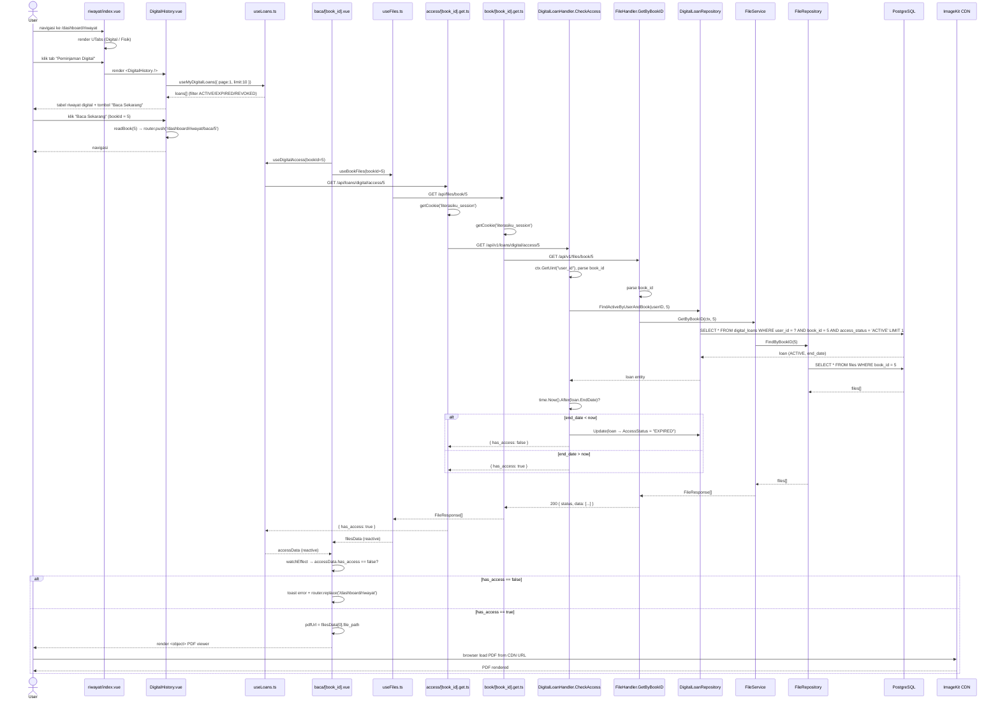

# Baca Buku Digital

---

## 1. Ringkasan

Sequence ini mencakup proses User membaca buku digital melalui halaman reader. User melihat daftar akses digital di tab "Peminjaman Digital" halaman riwayat, memilih buku dengan status `ACTIVE`, lalu sistem memverifikasi akses (cek masa berlaku, auto-expire jika kedaluwarsa), mengambil URL file PDF dari ImageKit, dan merender PDF viewer. File PDF di-load langsung dari CDN (tidak melalui BFF/API).

**Actor:** User (role: `USER`, sudah login)
**Trigger:** User menekan tombol "Baca Sekarang" pada baris peminjaman digital dengan status `ACTIVE` di halaman `/dashboard/riwayat`

---

## 2. Precondition & Postcondition

| Kondisi | Sebelum (Precondition) | Sesudah (Postcondition) |
|---|---|---|
| Sukses | User memiliki digital loan `ACTIVE` untuk buku ini, `end_date > NOW()`, buku punya file PDF. | PDF viewer render dengan URL dari ImageKit. |
| Gagal: akses tidak aktif | Loan tidak ditemukan atau `access_status != ACTIVE` atau `end_date < NOW()`. | Toast error "Akses Ditolak", redirect ke `/dashboard/riwayat`. Side-effect: auto-expire loan. |
| Gagal: file tidak ditemukan | Akses valid tapi buku tidak punya `file_path`. | `UAlert` "File Tidak Ditemukan" ditampilkan. |

---

## 3. Diagram Sequence



---

## 4. Breakdown per Boundary

### Boundary 1: Halaman Riwayat (riwayat/index.vue)

| Aspek | Detail |
|---|---|
| **File** | `pages/dashboard/riwayat/index.vue` |
| **Layout** | `dashboard` |
| **Komponen** | `UTabs` dengan 2 tab: `Peminjaman Digital` (slot #digital) dan `Peminjaman Fisik` (slot #physical) |
| **Digital slot** | Merender `DigitalHistory.vue` |

### Boundary 2: DigitalHistory.vue

| Aspek | Detail |
|---|---|
| **File** | `components/dashboard/user/riwayat/DigitalHistory.vue` |
| **State** | `page` (ref 1), `limit` (ref 10) |
| **Data** | `useMyDigitalLoans({ page, limit })` — query key `['loans', 'digital', 'my', page, limit]` |
| **Tabel** | Kolom: ID Pinjam, Judul Buku, Tgl Mulai, Tgl Berakhir, Status Akses (badge), Aksi |
| **Status** | `ACTIVE` → hijau (success), `EXPIRED` → netral, `REVOKED` → merah (error) |
| **Tombol** | "Baca Sekarang" muncul jika `access_status === 'ACTIVE'` |
| **Trigger** | Klik "Baca Sekarang" → `readBook(bookId)` → `router.push(/dashboard/riwayat/baca/${book_id})` |
| **Transisi** | Navigasi ke halaman reader |

### Boundary 3: Halaman Baca (baca/[book_id].vue)

| Aspek | Detail |
|---|---|
| **File** | `pages/dashboard/riwayat/baca/[book_id].vue` |
| **Layout** | `dashboard` |
| **Route param** | `book_id` (number) |
| **Parallel queries** | `useDigitalAccess(bookId)` + `useBookFiles(bookId)` — diinit bersamaan |
| **Watch effect** | `watchEffect` — jika `accessData.has_access === false` → toast error + `router.replace('/dashboard/riwayat')` |
| **PDF URL** | `filesData[0].file_path` — langsung dari ImageKit CDN |
| **Render** | `<object :data="pdfUrl" type="application/pdf">` — full-height viewer |
| **Fallback** | Jika browser tidak support PDF → link download; jika `!pdfUrl` → `UAlert` warning |

### Boundary 4: useLoans.ts — useDigitalAccess

| Aspek | Detail |
|---|---|
| **File** | `composables/useLoans.ts:63-69` |
| **Query** | `useQuery` dengan key `['loans', 'digital', 'access', bookId]` |
| **API** | `GET /api/loans/digital/access/{bookId}` |
| **enabled** | `computed(() => !!bookId.value)` — hanya fetch jika id valid |

### Boundary 5: useFiles.ts — useBookFiles

| Aspek | Detail |
|---|---|
| **File** | `composables/useFiles.ts` |
| **Query** | `useQuery` dengan key `['files', 'book', bookId]` |
| **API** | `GET /api/files/book/{bookId}` |
| **enabled** | `computed(() => !!bookId.value)` |
| **Response** | `FileResponse[]` — array file (biasanya 1 file PDF per buku) |

### Boundary 6: BFF — GET /api/loans/digital/access/:book_id

| Aspek | Detail |
|---|---|
| **File** | `server/api/loans/digital/access/[book_id].get.ts` |
| **Auth** | `getCookie(event, 'literasiku_session')` → `Authorization: Bearer {session}` |
| **Target** | `GET ${goApiBaseUrl}/api/v1/loans/digital/access/${bookId}` |
| **Response** | `{ has_access: boolean }` |

### Boundary 7: BFF — GET /api/files/book/:book_id

| Aspek | Detail |
|---|---|
| **File** | `server/api/files/book/[book_id].get.ts` |
| **Auth** | Sama — forward cookie ke Bearer header |
| **Target** | `GET ${goApiBaseUrl}/api/v1/files/book/${bookId}` |
| **Response** | `FileResponse[]` (array, fallback `[]` jika null) |

### Boundary 8: Go Handler — DigitalLoanHandler.CheckAccess

| Aspek | Detail |
|---|---|
| **File** | `modules/digital_loan/handler/digital_loan_handler.go:122-139` |
| **Auth** | `ctx.GetUint("user_id")` dari middleware |
| **Delegasi** | `h.svc.CheckAccess(ctx, userID, bookID)` |
| **Response** | `200 { status, message, data: { has_access: bool } }` |

### Boundary 9: Go Service — DigitalLoanService.CheckAccess

| Aspek | Detail |
|---|---|
| **File** | `modules/digital_loan/service/digital_loan_service.go:156-167` |
| **Logic** | ① `FindActiveByUserAndBook` — cari loan `ACTIVE` ② jika not found → `false` ③ jika `end_date < NOW()` → auto-set `EXPIRED`, Update, `false` ④ jika valid → `true` |
| **Side-effect** | Auto-expire loan yang kedaluwarsa saat dicek |

### Boundary 10: Go Handler — FileHandler.GetByBookID

| Aspek | Detail |
|---|---|
| **File** | `modules/file/handler/file_handler.go:68-85` |
| **Delegasi** | `h.fileService.GetByBookID(ctx, bookID)` |
| **Response** | `200 { status, message, data: FileResponse[] }` |

### Boundary 11: Go Service — FileService.GetByBookID

| Aspek | Detail |
|---|---|
| **File** | `modules/file/service/file_service.go:80-88` |
| **Validasi** | `bookRepo.FindByID(bookID)` — pastikan buku exist |
| **Query** | `fileRepo.FindByBookID(bookID)` |

---

## 5. Alur Detail End-to-End

| Step | Actor/System | Aksi | File:Line | Detail |
|---|---|---|---|---|
| 1 | User | Navigasi ke `/dashboard/riwayat` | `riwayat/index.vue:5-7` | Dashboard layout |
| 2 | riwayat.vue | Render tabs | `index.vue:40-51` | Default tab pertama → Digital |
| 3 | DigitalHistory | Init query | `DigitalHistory.vue:8` | `useMyDigitalLoans({ page: 1, limit: 10 })` |
| 4 | DigitalHistory | Render tabel | `DigitalHistory.vue:46-84` | Setiap baris `ACTIVE` punya tombol "Baca Sekarang" |
| 5 | User | Klik "Baca Sekarang" | `DigitalHistory.vue:66-73` | Tombol untuk `access_status === 'ACTIVE'` |
| 6 | DigitalHistory | Navigasi | `DigitalHistory.vue:40-42` | `router.push('/dashboard/riwayat/baca/' + book_id)` |
| 7 | baca.vue | Ambil param & init queries | `baca/[book_id].vue:8-16` | `useDigitalAccess(bookId)` + `useBookFiles(bookId)` parallel |
| 8 | BFF access | Proxy cek akses | `access/[book_id].get.ts:4-22` | Forward JWT, GET Go API |
| 9 | BFF files | Proxy file list | `book/[book_id].get.ts:5-23` | Forward JWT, GET Go API |
| 10 | G CheckAccess | Find active loan | `handler.go:122-138` → `service.go:156-160` | `FindActiveByUserAndBook(userID, bookID)` |
| 11 | G CheckAccess | Cek expired | `service.go:161-165` | Jika `end_date < NOW()` → set `EXPIRED`, return `false` |
| 12 | G FileHandler | Get files by book | `handler.go:68-85` → `service.go:80-88` | Validasi book exist → `FindByBookID` |
| 13 | BacaVue | Watch effect | `baca/[book_id].vue:22-33` | Jika `has_access === false` → toast + redirect |
| 14 | BacaVue | Ambil PDF URL | `baca/[book_id].vue:35-40` | `filesData[0]?.file_path` |
| 15 | BacaVue | Render PDF | `baca/[book_id].vue:74-80` | `<object>` tag dengan `data=pdfUrl` |
| 16 | Browser | Load PDF dari CDN | — | Browser fetch langsung dari ImageKit URL |
| 17 | User | Membaca PDF | — | Viewer interaktif (scroll, zoom, dll) |

---

## 6. Kontrak Request/Response

### GET /api/loans/digital/access/:book_id

**Path:** `client/server/api/loans/digital/access/[book_id].get.ts`
**Target:** `GET /api/v1/loans/digital/access/:book_id`
**Auth:** Required (JWT, role USER atau ADMIN)

**Response Sukses (200):**

```json
{
  "status": "success",
  "message": "Access checked successfully",
  "data": {
    "has_access": true
  }
}
```

**Response Error:**

| Code | Condition |
|---|---|
| `200` | Sukses (selalu 200, `has_access` false jika tidak punya akses) |
| `400` | Invalid book ID |
| `401` | Tidak terautentikasi |

### GET /api/files/book/:book_id

**Path:** `client/server/api/files/book/[book_id].get.ts`
**Target:** `GET /api/v1/files/book/:book_id`
**Auth:** Required (JWT, role USER atau ADMIN)

**Response Sukses (200):**

```json
{
  "status": "success",
  "message": "Files retrieved successfully",
  "data": [
    {
      "id": 1,
      "book_id": 5,
      "file_path": "https://ik.imagekit.io/literasiku/books/pemrograman-go.pdf",
      "file_name": "pemrograman-go.pdf",
      "file_size": 2457600,
      "upload_date": "2026-06-01T00:00:00Z",
      "status": "ACTIVE",
      "created_at": "2026-06-01T10:00:00Z",
      "updated_at": "2026-06-01T10:00:00Z"
    }
  ]
}
```

**Response Error:**

| Code | Condition |
|---|---|
| `200` | Sukses |
| `400` | Invalid book ID |
| `404` | Book not found |
| `500` | Database error |
| `401` | Tidak terautentikasi |

---

## 7. Error Handling & Edge Case

| Kondisi | Deteksi (File:Line) | Response BE | Handling FE |
|---|---|---|---|
| Tidak punya akses aktif | `service.go:158-160` | `has_access: false` | `watchEffect` → toast "Akses Ditolak" + redirect riwayat |
| Akses kedaluwarsa (end_date < now) | `service.go:161-165` | Auto-update ke `EXPIRED`, return `false` | Sama seperti di atas |
| Book ID bukan angka | `handler.go:126-130` | 400 "Invalid book ID" | toast error + redirect (error from BFF) |
| Buku tidak ditemukan (file endpoint) | `file/service.go:81-85` | 404 "book not found" | Data files kosong → `pdfUrl = null` → `UAlert` "File Tidak Ditemukan" |
| File PDF tidak ada | `baca/[book_id].vue:82-89` | — (BE return empty array) | `UAlert` warning "File Tidak Ditemukan" |
| Browser tidak support PDF | `baca/[book_id].vue:76-79` | — (client-side) | Fallback link download |
| Network error (salah satu query) | Vue Query error | — | Tidak ada toast eksplisit — loading spinner hilang, konten tidak muncul |
| Access loading masih berjalan | `baca/[book_id].vue:69-71` | — | Loading spinner |
| Multiple file records | — | BE return array | FE ambil `filesData.value[0]` — file pertama |

---

## 8. File Terkait

### Frontend
- `client/app/pages/dashboard/riwayat/index.vue` — Halaman riwayat dengan tab digital/fisik
- `client/app/components/dashboard/user/riwayat/DigitalHistory.vue` — Tabel riwayat peminjaman digital + tombol "Baca Sekarang"
- `client/app/pages/dashboard/riwayat/baca/[book_id].vue` — Halaman reader PDF
- `client/app/composables/useLoans.ts` — `useDigitalAccess` query (line 63-69)
- `client/app/composables/useFiles.ts` — `useBookFiles` query
- `client/server/api/loans/digital/access/[book_id].get.ts` — BFF cek akses
- `client/server/api/files/book/[book_id].get.ts` — BFF ambil file PDF
- `client/shared/types/loans.ts` — `DigitalLoanResponse`
- `client/shared/types/files.ts` — `FileResponse`

### Backend
- `server/modules/digital_loan/handler/digital_loan_handler.go` — Handler `CheckAccess` (line 122-139)
- `server/modules/digital_loan/service/digital_loan_service.go` — Service `CheckAccess` (line 156-167, auto-expire)
- `server/modules/digital_loan/repository/digital_loan_repository.go` — `FindActiveByUserAndBook`, `Update`
- `server/modules/file/handler/file_handler.go` — Handler `GetByBookID` (line 68-85)
- `server/modules/file/service/file_service.go` — Service `GetByBookID` (line 80-88)
- `server/modules/file/repository/file_repository.go` — `FindByBookID`
- `server/router/router.go` — Route `GET /files/book/:book_id` (auth, line 88), `GET /loans/digital/access/:book_id` (auth, line 138)

---

## 9. Related Docs

- [pinjam_digital.md](pinjam_digital.md) — Peminjaman akses digital (prasyarat sebelum baca)
- [cari_katalog.md](cari_katalog.md) — Jelajahi katalog (temukan buku digital)
- [../admin/kelola_buku/extends/kelola_peminjaman.md](../admin/kelola_buku/extends/kelola_peminjaman.md) — Ringkasan peminjaman digital (revoke)
- [../admin/kelola_buku/extends/file-upload.md](../admin/kelola_buku/extends/file-upload.md) — Upload file PDF ke ImageKit (prasyarat)
- [../register.md](../register.md) — Alur autentikasi
