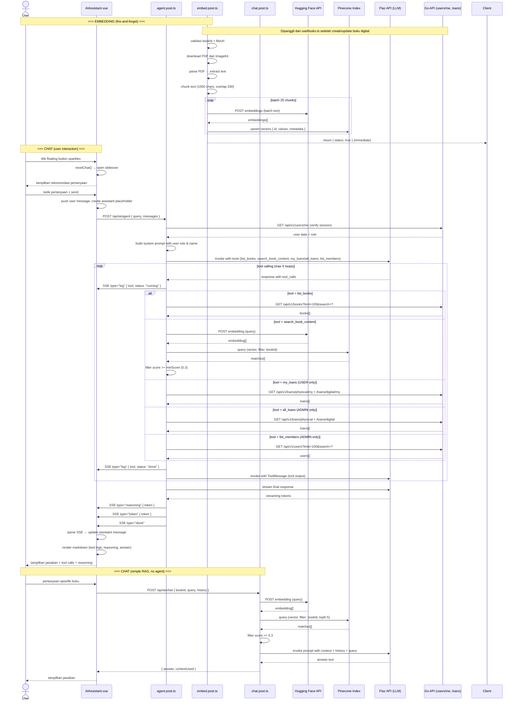

# Bertanya ke Chatbot

---

## 1. Ringkasan

Sequence ini mencakup interaksi User dengan asisten AI "Lixi — Teman Membacamu" melalui panel slideover yang tersedia di seluruh halaman dashboard. User dapat bertanya tentang katalog buku, konten buku digital (RAG), status peminjaman, dan operasional perpustakaan. Sistem menggunakan arsitektur agentic dengan tool calling: query di-embed via Hugging Face, pencarian semantik di Pinecone, dan jawaban di-generate oleh LLM (Flaz API / OpenAI-compatible) dengan konteks dari buku digital serta data real-time dari database.

**Actor:** User (role: `USER` atau `ADMIN`, sudah login)
**Trigger:** User menekan floating button sparkles (kanan bawah) → panel Lixi terbuka → User mengirim pertanyaan

---

## 2. Precondition & Postcondition

| Kondisi | Sebelum (Precondition) | Sesudah (Postcondition) |
|---|---|---|
| Sukses | User terautentikasi. Pinecone terisi embedding buku (jika tanya konten). | Jawaban ditampilkan di panel chat. Jika menggunakan tools, tool log ditampilkan. |
| Gagal: tidak login | Session JWT tidak valid. | 401 "Unauthorized" — error di panel chat. |
| Gagal: embedding tidak ada | Buku belum di-embed (embed.post belum dipanggil). | RAG return kosong → LLM jawab "tidak menemukan informasi relevan". |
| Gagal: API eksternal down | Hugging Face / Pinecone / Flaz API error. | Error message di panel chat + tombol "Coba Lagi". |

---

## 3. Diagram Sequence



---

## 4. Breakdown per Boundary

### Boundary 1: AI Assistant Panel (AIAssistant.vue)

| Aspek | Detail |
|---|---|
| **File** | `components/layout/AIAssistant.vue` |
| **State** | `isOpen` (slideover), `messages[]` (ChatMessage), `isLoading`, `streamStarted`, `inputMessage` |
| **Trigger** | Floating button sparkles → `toggleIsAIOpen()` → `resetChat()` |
| **Input** | `UInput` + form submit → `sendMessage(text)` |
| **Streaming** | `fetch('/api/ai/agent', { method: 'POST', body: { query, messages } })` → SSE reader via `response.body.getReader()` |
| **SSE events** | `log` (tool call status), `reasoning` (internal monolog), `token` (jawaban), `done`, `error` |
| **Rendering** | Markdown via `marked` + `DOMPurify`; reasoning & tool calls di collapsible sections |
| **Heuristics** | `splitMergedContent()` — memisah reasoning dari answer jika LLM tidak kirim `reasoning` event terpisah (stopgap) |
| **Edge cases** | `retryLastMessage()` untuk error, skeleton loading saat stream belum mulai |

### Boundary 2: BFF Agent — POST /api/ai/agent

| Aspek | Detail |
|---|---|
| **File** | `server/api/ai/agent.post.ts` |
| **Auth** | `getCookie(event, 'literasiku_session')` → `GET /api/v1/users/me` untuk verifikasi + dapatkan role |
| **Output** | SSE stream (`text/event-stream`) — bukan JSON response biasa |
| **Tools** | Dinamis berdasarkan role: USER (list_books, search_book_content, my_loans), ADMIN (+ all_loans, list_members) |
| **Tool loop** | Maks 5 iterasi; tiap tool call → invoke → ToolMessage → loop lagi |
| **Final stream** | Setelah tool loop selesai, stream final answer dari LLM |

### Boundary 3: Tools (agent.post.ts internal functions)

| Tool | File function | API dipanggil | Deskripsi |
|---|---|---|---|
| `list_books` | `listBooksTool(search, config)` | `GET /api/v1/books?limit=100&search=?` (Go public) | Cari buku by keyword |
| `search_book_content` | `searchBookContentTool(bookId, query, config)` | HF embedding + Pinecone query (filter: bookId) | RAG — cari konten dalam buku |
| `my_loans` | `myLoansTool(session, config)` | `GET /api/v1/loans/physical/my` + `/loans/digital/my` (Go auth) | Riwayat pribadi user |
| `all_loans` | `allLoansTool(status, session, config)` | `GET /api/v1/loans/physical` + `/loans/digital` (Go admin) | Semua transaksi |
| `list_members` | `listMembersTool(search, session, config)` | `GET /api/v1/users?limit=100&search=?` (Go admin) | Daftar anggota |

### Boundary 4: BFF Simple Chat — POST /api/ai/chat

| Aspek | Detail |
|---|---|
| **File** | `server/api/ai/chat.post.ts` |
| **Input** | `{ bookId, query, history }` |
| **Flow** | Embed query → Pinecone query (filter bookId, topK 5, minScore 0.3) → build context → LLM prompt → answer |
| **Output** | JSON `{ status, data: { answer, contextUsed } }` — non-streaming |

### Boundary 5: BFF Embedding — POST /api/ai/embed

| Aspek | Detail |
|---|---|
| **File** | `server/api/ai/embed.post.ts` |
| **Trigger** | Fire-and-forget dari `useBooks.ts` setelah create/update buku dengan `is_digital_available && file_url` |
| **Flow** | Download PDF → parse (`pdf-parse`) → chunk (`RecursiveCharacterTextSplitter`, 1000/200) → batch embed via HF → upsert ke Pinecone |
| **Batch** | 25 chunk per batch |
| **Response** | Immediate `{ status: true }` — proses background via IIFE |

---

## 5. Alur Detail End-to-End

| Step | Actor/System | Aksi | File:Line | Detail |
|---|---|---|---|---|
| **EMBEDDING** | | | | |
| 1 | useBooks.ts | Trigger embed | `useBooks.ts:48-49` | `$fetch('/api/ai/embed', { body: { bookId, fileUrl } }).catch(e => console.error(e))` — fire-and-forget |
| 2 | embed.post.ts | Validasi | `embed.post.ts:26-31` | `bookId` dan `fileUrl` required |
| 3 | embed.post.ts | Background process | `embed.post.ts:45-109` | IIFE async tanpa await |
| 4 | embed.post.ts | Download PDF | `embed.post.ts:49-55` | `fetch(body.fileUrl)` → `arrayBuffer` → `Buffer` |
| 5 | embed.post.ts | Parse text | `embed.post.ts:59-63` | `PDFParse` → `getText()` |
| 6 | embed.post.ts | Chunk | `embed.post.ts:70-76` | `RecursiveCharacterTextSplitter({ chunkSize: 1000, chunkOverlap: 200 })` |
| 7 | embed.post.ts | Embed & upsert | `embed.post.ts:83-103` | Loop batch 25: HF embed → Pinecone upsert |
| 8 | embed.post.ts | Return | `embed.post.ts:111-117` | Immediate response (background still running) |
| **AGENT CHAT** | | | | |
| 9 | User | Klik floating button | `AIAssistant.vue:243-249` | `toggleIsAIOpen()` |
| 10 | AIAssistant | Reset & open | `AIAssistant.vue:226-229` | `isOpen = true`, `resetChat()` |
| 11 | AIAssistant | Render UI | `AIAssistant.vue:259-283` | Rekomendasi pertanyaan berdasarkan role |
| 12 | User | Kirim pertanyaan | `AIAssistant.vue:109` | `sendMessage(text)` |
| 13 | AIAssistant | Push user msg | `AIAssistant.vue:114` | `messages.push({ role: 'user', content })` |
| 14 | AIAssistant | Create placeholder | `AIAssistant.vue:119-128` | Assistant message dengan `toolCalls:[]`, `content:''` |
| 15 | AIAssistant | Fetch agent | `AIAssistant.vue:131-140` | `POST /api/ai/agent { query, messages }` |
| 16 | agent.post.ts | Validate query | `agent.post.ts:179-184` | `body.query` required |
| 17 | agent.post.ts | Verify user | `agent.post.ts:186-200` | `getCookie → GET /api/v1/users/me` |
| 18 | agent.post.ts | Init SSE | `agent.post.ts:202-207` | `res.writeHead(200, { 'Content-Type': 'text/event-stream' })` |
| 19 | agent.post.ts | Build prompt | `agent.post.ts:288-314` | System prompt with user role, name, route list |
| 20 | agent.post.ts | Select tools | `agent.post.ts:214-281` | USER: 3 tools, ADMIN: 5 tools |
| 21 | agent.post.ts | Tool loop | `agent.post.ts:335-377` | Max 5 iterations |
| 22 | agent.post.ts | Invoke LLM | `agent.post.ts:336` | `llm.invoke(messages)` with tool binding |
| 23 | agent.post.ts | Send SSE log | `agent.post.ts:345` | `sendSSE('log', { tool, status: 'running' })` |
| 24 | agent.post.ts | Execute tool | `agent.post.ts:349-361` | list_books → Go API; search_book_content → HF+Pinecone; my_loans/all_loans → Go API; list_members → Go API |
| 25 | agent.post.ts | Send SSE log done | `agent.post.ts:366` | `sendSSE('log', { tool, status: 'done' })` |
| 26 | agent.post.ts | Push ToolMessage | `agent.post.ts:368-371` | Tool result ke message history |
| 27 | agent.post.ts | Stream final answer | `agent.post.ts:379-399` | `finalLlm.stream(messages)` → SSE `reasoning` + `token` |
| 28 | agent.post.ts | Send done | `agent.post.ts:400` | `sendSSE('done', {})` |
| 29 | AIAssistant | Read SSE stream | `AIAssistant.vue:146-204` | `reader.read()` loop, parse `data:` lines |
| 30 | AIAssistant | Update tool calls | `AIAssistant.vue:167-176` | `assistantMessage.toolCalls` push/update status |
| 31 | AIAssistant | Update reasoning | `AIAssistant.vue:177-181` | `assistantMessage.reasoning += data.token` |
| 32 | AIAssistant | Update content | `AIAssistant.vue:182-193` | `assistantMessage.content += data.token` |
| 33 | AIAssistant | Render markdown | `AIAssistant.vue:389-393` | `v-html="renderMarkdown(content)"` |
| 34 | User | Lihat jawaban | — | Jawaban dengan tool logs, reasoning collapsible, markdown dengan link navigasi |

---

## 6. Kontrak Request/Response

### POST /api/ai/chat

**Path:** `server/api/ai/chat.post.ts`
**Auth:** Tidak ada (internal endpoint — tidak dicek langsung, tapi hanya dipanggil dari FE terautentikasi)

**Request Body:**

```json
{
  "bookId": 5,
  "query": "Apa yang dibahas di bab 3?",
  "history": [
    { "role": "user", "content": "Halo" },
    { "role": "assistant", "content": "Halo! Ada yang bisa saya bantu?" }
  ]
}
```

**Response Sukses (200):**

```json
{
  "status": true,
  "message": "Berhasil mendapatkan jawaban AI",
  "data": {
    "answer": "Bab 3 membahas tentang struktur data array dan slice di Go...",
    "contextUsed": [
      "Array adalah tipe data...",
      "Slice adalah reference ke array..."
    ]
  }
}
```

**Response Error (400/500):**

```json
{
  "status": false,
  "statusMessage": "bookId and query are required"
}
```

### POST /api/ai/agent

**Path:** `server/api/ai/agent.post.ts`
**Auth:** Session cookie (`literasiku_session`) — diverifikasi via `GET /api/v1/users/me`

**Request Body:**

```json
{
  "query": "Tampilkan buku digital yang bisa dibaca",
  "messages": [
    { "role": "user", "content": "Halo" },
    { "role": "assistant", "content": "Halo! Ada yang bisa saya bantu?" }
  ]
}
```

**Response:** SSE Stream (`text/event-stream`)

| Event | Data | Deskripsi |
|---|---|---|
| `log` | `{ type: "log", tool: "list_books", args: {...}, status: "running" }` | Tool call dimulai |
| `log` | `{ type: "log", tool: "list_books", status: "done" }` | Tool call selesai |
| `reasoning` | `{ type: "reasoning", token: "Saya akan..." }` | Internal monolog LLM |
| `token` | `{ type: "token", token: "Berikut" }` | Token jawaban |
| `done` | `{ type: "done" }` | Stream selesai |
| `error` | `{ type: "error", message: "..." }` | Error |

### POST /api/ai/embed

**Path:** `server/api/ai/embed.post.ts`
**Auth:** Tidak ada (internal, fire-and-forget)

**Request Body:**

```json
{
  "bookId": 5,
  "fileUrl": "https://ik.imagekit.io/literasiku/books/pemrograman-go.pdf"
}
```

**Response (200) — immediate:**

```json
{
  "status": true,
  "message": "Background embedding process started successfully",
  "data": { "bookId": 5 }
}
```

**Response Error (400/500):**

```json
{
  "status": false,
  "statusMessage": "bookId and fileUrl are required"
}
```

**Background errors (logged only):**

| Kondisi | Log |
|---|---|
| PDF download gagal | `[AI Embed] Background embedding failed: Failed to download PDF` |
| PDF tidak punya text | `[AI Embed] Background embedding failed: No text found in PDF` |
| HF API error | `[AI Embed] Background embedding failed: Gagal memanggil Hugging Face Cloud Inference API` |

---

## 7. Error Handling & Edge Case

| Kondisi | Deteksi | Handling |
|---|---|---|
| Session invalid / expired | `agent.post.ts:195-200` | `throwError` 401 → FE catch → `assistantMessage.isError = true` + tombol "Coba Lagi" |
| Query kosong | `agent.post.ts:179-184` | 400 "Query is required" |
| Tool execution gagal | `agent.post.ts:362-363` | ToolOutput = `Error: {message}` → LLM informed via ToolMessage |
| Tool loop > 5 iterasi | `agent.post.ts:335-377` | Loop break, lanjut ke final stream dengan message history saat ini |
| SSE connection broken | `AIAssistant.vue:155` | `reader.read()` → `done` → stream ended |
| HF Inference API down | `getCloudEmbeddings` catch | Throw error → tool output error → LLM informed |
| Pinecone query error | `searchBookContentTool` catch | Tool output error message |
| PDF parsing error | `embed.post.ts:59-63` | Log error, background gagal |
| Tidak ada context relevan (RAG kosong) | `chat.post.ts:63-71` | Default answer "Maaf, tidak menemukan informasi relevan" |
| Skor similarity di bawah threshold | `chat.post.ts:57-61` / `agent.post.ts:64-68` | Filter `m.score >= config.ragMinScore` (default 0.3) |
| LLM streaming error | `agent.post.ts:401-403` | Send SSE `error` type |
| Split heuristics gagal memisah reasoning | `AIAssistant.vue:69-88` | Fallback: seluruh konten dianggap answer, reasoning kosong |
| Markdown render error | `AIAssistant.vue:231-238` | Fallback ke plain text |

---

## 8. File Terkait

### Frontend Components
- `client/app/components/layout/AIAssistant.vue` — Panel chat Lixi (slideover, SSE reader, markdown render)
- `client/app/pages/dashboard/riwayat/baca/[book_id].vue` — Halaman reader PDF (konteks penggunaan)

### BFF / Nuxt Server API
- `client/server/api/ai/agent.post.ts` — Agent endpoint (SSE, tool calling, RAG, streaming)
- `client/server/api/ai/chat.post.ts` — Simple RAG chat (non-streaming, book-specific)
- `client/server/api/ai/embed.post.ts` — Background embedding pipeline

### Backend (Go API — dipanggil oleh tools)
- `server/modules/book/handler/book_handler.go` — `GetAll` (list_books tool)
- `server/modules/physical_loan/handler/physical_loan_handler.go` — `GetMyLoans`, `GetAll` (my_loans, all_loans tools)
- `server/modules/digital_loan/handler/digital_loan_handler.go` — `GetMyLoans`, `GetAll` (my_loans, all_loans tools)
- `server/modules/user/handler/user_handler.go` — `Me`, `GetAll` (my_loans auth check, list_members tool)

### Client Composables
- `client/app/composables/useBooks.ts` — Trigger `POST /api/ai/embed` setelah create/update buku (line 48-49)

---

## 9. Related Docs

- [../../baca_digital.md](../../baca_digital.md) — Baca buku digital (konteks penggunaan AI chat di reader page)
- [../../pinjam_digital.md](../../pinjam_digital.md) — Peminjaman akses digital (prasyarat akses konten)
- [../../cari_katalog.md](../../cari_katalog.md) — Jelajahi katalog (list_books tool)
- [../../../admin/kelola_buku/extends/file-upload.md](../../../admin/kelola_buku/extends/file-upload.md) — Upload file PDF (prasyarat embedding)
- [../../../admin/kelola_buku/kelola_buku.md](../../../admin/kelola_buku/kelola_buku.md) — Create/update buku (trigger embedding)
- [../../../register.md](../../../register.md) — Alur autentikasi (session cookie pattern)
