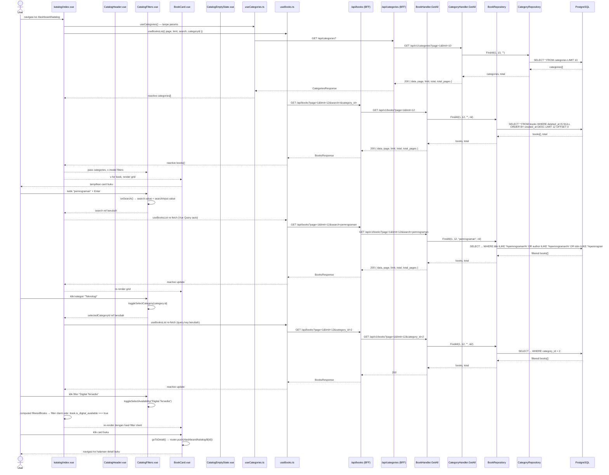

# Cari dan Lihat Katalog Buku

---

## 1. Ringkasan

Sequence ini mencakup proses User (anggota perpustakaan) menjelajahi katalog buku di halaman `/dashboard/katalog`. User dapat melihat daftar buku dalam grid, mencari berdasarkan judul/penulis/ISBN, memfilter berdasarkan kategori atau ketersediaan (fisik/digital), serta navigasi halaman. Data kategori dan buku bersifat public dari sisi API.

**Actor:** User (role: `USER`, sudah login)
**Trigger:** User mengakses route `/dashboard/katalog`

---

## 2. Precondition & Postcondition

| Kondisi | Sebelum (Precondition) | Sesudah (Postcondition) |
|---|---|---|
| Sukses | User terautentikasi (dashboard layout). | Grid buku tampil dengan data dari BE. Kategori dan filter siap digunakan. |
| Gagal (data kosong) | Tidak ada buku yang cocok dengan filter. | `CatalogEmptyState` ditampilkan. |
| Gagal (network) | Koneksi terputus atau API error. | Vue Query error state, toast/gagal render (tidak ada data). |

---

## 3. Diagram Sequence



---

## 4. Breakdown per Boundary

### Boundary 1: Halaman Utama Katalog (katalog/index.vue)

| Aspek | Detail |
|---|---|
| **File** | `pages/dashboard/katalog/index.vue` |
| **Layout** | `dashboard` (`definePageMeta`) |
| **State** | `page` (ref 1), `limit` (ref 12), `search` (ref ''), `selectedCategoryId` (ref undefined), `selectedAvailability` (ref 'Semua') |
| **Composables** | `useCategories()` tanpa params → `categories[]`; `useBooksList({page, limit, search, categoryId})` → `booksData`, `isBooksLoading` |
| **Filter client** | `filteredBooks` computed — filter `books` berdasarkan `selectedAvailability`: cek `physical_stock > 0` atau `is_digital_available` |
| **Render** | Grid via `UPageGrid` + `BookCard` v-for, atau `CatalogEmptyState` jika kosong |

### Boundary 2: CatalogHeader.vue

| Aspek | Detail |
|---|---|
| **File** | `components/dashboard/user/CatalogHeader.vue` |
| **Fungsi** | Hero section dengan judul "Cari Koleksi Buku Literasiku" dan deskripsi. murni visual. |
| **Animasi** | `v-motion` fade-in, `usePreferredReducedMotion` untuk aksesibilitas |

### Boundary 3: CatalogFilters.vue

| Aspek | Detail |
|---|---|
| **File** | `components/dashboard/user/CatalogFilters.vue` |
| **Props** | `categories: CategoryResponse[]` |
| **v-model** | `search`, `categoryId` (number atau undefined), `availability` (string) |
| **Search** | `UInput` dengan `@keyup.enter="onSearch"` + tombol "Terapkan Pencarian" |
| **Category** | Tombol toggle per kategori; klik kategori terpilih → set ke `undefined` (deselect) |
| **Availability** | Tombol toggle: `Semua`, `Fisik Tersedia`, `Digital Tersedia` |
| **Animasi** | `v-motion` fade-in dengan delay 90ms |
| **Trigger** | `onSearch()` → `search.value = searchInput.value`; `toggleSelectCategory(id)` → toggle `selectedCategory` |
| **Transisi** | Perubahan `search` atau `categoryId` memicu re-fetch `useBooksList` (query key berubah). Perubahan `availability` hanya filter client-side. |

### Boundary 4: BookCard.vue

| Aspek | Detail |
|---|---|
| **File** | `components/dashboard/user/BookCard.vue` |
| **Props** | `book: BookResponse`, `index: number` |
| **Display** | Cover placeholder (icon), judul, author/publisher/year, badge fisik (`Fisik Tersedia`/`Fisik Kosong`), badge digital (`Digital Tersedia`) |
| **Animasi** | `v-motion` staggered masuk (delay `index * 70ms`), hover efek translate + shadow |
| **Trigger** | Klik card → `goToDetail()` → `router.push('/dashboard/katalog/${id}')` |
| **Transisi** | Navigasi ke halaman detail buku |

### Boundary 5: CatalogEmptyState.vue

| Aspek | Detail |
|---|---|
| **File** | `components/dashboard/user/CatalogEmptyState.vue` |
| **Display** | Icon `search-x`, heading "Koleksi tidak ditemukan", petunjuk ganti filter |
| **Trigger** | Muncul saat `filteredBooks.length === 0` |

### Boundary 6: useBooks.ts (Vue Query)

| Aspek | Detail |
|---|---|
| **File** | `composables/useBooks.ts` |
| **Function** | `useBooksList(params)` — query key `['books', 'list', page, limit, search, categoryId]` |
| **API call** | `$fetch<BooksResponse>('/api/books', { query: { page, limit, search, category_id } })` |
| **Behavior** | Auto re-fetch saat query key berubah (page, search, categoryId) |

### Boundary 7: useCategories.ts (Vue Query)

| Aspek | Detail |
|---|---|
| **File** | `composables/useCategories.ts` |
| **Function** | Dipanggil tanpa params dari catalog → `$fetch('/api/categories?')` (default page=1, limit=10) |
| **Returns** | `categories`, `total`, `totalPages`, `isLoading`, `isError` |
| **Behavior** | Caching via query key `['categories', undefined, undefined, undefined]` |

### Boundary 8: BFF Proxy — GET /api/books

| Aspek | Detail |
|---|---|
| **File** | `server/api/books/index.get.ts` |
| **Params** | Query: `page`, `limit`, `search`, `category_id` — diteruskan ke Go API |
| **Target** | `GET ${goApiBaseUrl}/api/v1/books?${params}` |
| **Auth** | Tidak ada auth header (endpoint public) |
| **Response** | Return `res.data` (typecast `BooksResponse`) |

### Boundary 9: BFF Proxy — GET /api/categories

| Aspek | Detail |
|---|---|
| **File** | `server/api/categories/index.get.ts` |
| **Params** | Query: `page`, `limit`, `search` — diteruskan ke Go API |
| **Target** | `GET ${goApiBaseUrl}/api/v1/categories?${params}` |
| **Auth** | Tidak ada auth header (endpoint public) |
| **Response** | Return `res.data` (typecast `CategoriesResponse`) |

### Boundary 10: Go Handler — BookHandler.GetAll

| Aspek | Detail |
|---|---|
| **File** | `modules/book/handler/book_handler.go:69-101` |
| **Parsing** | `page` (default 1), `limit` (default 10), `search` (string), `category_id` (opsional, parsed ke *uint) |
| **Delegasi** | `h.bookService.GetAll(ctx, page, limit, search, categoryID)` |
| **Response** | `200 { status, message, data: PaginatedResponse }` |

### Boundary 11: Go Service — BookService.GetAll

| Aspek | Detail |
|---|---|
| **File** | `modules/book/service/book_service.go:89-100` |
| **Validasi** | Clamp page (min 1), limit (min 1, max 100) |
| **Delegasi** | `s.bookRepo.FindAll(page, limit, search, categoryID)` |

### Boundary 12: Book Repository — FindAll

| Aspek | Detail |
|---|---|
| **File** | `modules/book/repository/book_repository.go:38-60` |
| **Search** | `title ILIKE '%search%' OR author ILIKE '%search%' OR isbn ILIKE '%search%'` (case-insensitive, PostgreSQL ILIKE) |
| **Category** | `WHERE category_id = ?` jika `categoryID != nil` |
| **Sort** | `created_at DESC` |
| **Pagination** | `OFFSET (page-1)*limit LIMIT limit` + `COUNT` total |

### Boundary 13: Category Handler — GetAll

| Aspek | Detail |
|---|---|
| **File** | `modules/category/handler/category_handler.go:68-91` |
| **Response** | `200 { status, message, data: PaginatedResponse }` dengan `CategoryResponse[]` |

---

## 5. Alur Detail End-to-End

| Step | Actor/System | Aksi | File:Line | Detail |
|---|---|---|---|---|
| 1 | User | Navigasi ke `/dashboard/katalog` | `index.vue:7-9` | Dashboard layout + SEO meta |
| 2 | index.vue | Init composables | `index.vue:16-17` | `useCategories()` dan `useBooksList({...})` |
| 3 | useCategories.ts | Fetch categories | `useCategories.ts:12-22` | `$fetch('/api/categories?')` — query key `['categories', undef, undef, undef]` |
| 4 | categories BFF | Proxy ke Go | `categories/index.get.ts:5-24` | `GET /api/v1/categories?page=1&limit=10` |
| 5 | CategoryHandler | Parse & delegasi | `handler.go:68-73` | `GetAll(ctx, page=1, limit=10, search="")` |
| 6 | CategoryService | Delegasi ke repo | — | `s.categoryRepo.FindAll(1, 10, "")` |
| 7 | DB | Query categories | — | `SELECT * FROM categories LIMIT 10` |
| 8 | useBooks.ts | Fetch books | `useBooks.ts:14-26` | `$fetch('/api/books?page=1&limit=12')` — query key `['books','list',1,12,'',undef]` |
| 9 | books BFF | Proxy ke Go | `books/index.get.ts:5-25` | `GET /api/v1/books?page=1&limit=12` |
| 10 | BookHandler | Parse & delegasi | `handler.go:69-83` | `GetAll(ctx, page=1, limit=12, search="", categoryID=nil)` |
| 11 | BookService | Validate & delegasi | `service.go:89-99` | `s.bookRepo.FindAll(1, 12, "", nil)` |
| 12 | BookRepo | Query books | `repository.go:38-60` | `SELECT ... FROM books WHERE deleted_at IS NULL ORDER BY created_at DESC LIMIT 12 OFFSET 0` |
| 13 | DB | Return data | — | books[] + total count |
| 14 | index.vue | Render | `index.vue:48-86` | Header → Filters → Grid/EmptyState → Pagination |
| 15 | User | Ketik pencarian + Enter | `CatalogFilters.vue:49-54` | `onSearch()` set `search.value = searchInput.value` |
| 16 | useBooks.ts | Auto re-fetch | — | Query key berubah → `GET /api/books?page=1&limit=12&search=xxx` |
| 17 | BookRepo | Filtered search | `repository.go:44-47` | `WHERE title ILIKE '%xxx%' OR author ILIKE '%xxx%' OR isbn ILIKE '%xxx%'` |
| 18 | User | Klik kategori "Teknologi" | `CatalogFilters.vue:30-32` | `toggleSelectCategory(2)` → `selectedCategoryId = 2` |
| 19 | useBooks.ts | Auto re-fetch | — | Query key berubah → `GET /api/books?page=1&limit=12&category_id=2` |
| 20 | BookRepo | Filtered category | `repository.go:49-51` | `WHERE category_id = 2` |
| 21 | User | Klik "Digital Tersedia" | `CatalogFilters.vue:34-36` | `toggleSelectAvailability("Digital Tersedia")` |
| 22 | index.vue | Client filter | `index.vue:35-45` | `filteredBooks = books.filter(b => b.is_digital_available)` — tanpa API call |
| 23 | User | Klik card buku | `BookCard.vue:15-17` | `goToDetail()` → `router.push('/dashboard/katalog/' + book.id)` |
| 24 | Router | Navigasi detail | — | Pindah ke halaman `/dashboard/katalog/:id` |

---

## 6. Kontrak Request/Response

### GET /api/books

**Path:** `client/server/api/books/index.get.ts`
**Target:** `GET /api/v1/books`
**Auth:** Public (tanpa header)

**Query Parameters:**

| Field | Tipe | Required | Default | Deskripsi |
|---|---|---|---|---|
| `page` | int | opsional | `1` | Halaman |
| `limit` | int | opsional | `12` (FE) / `10` (Go default) | Items per halaman |
| `search` | string | opsional | — | Pencarian ILIKE (title, author, isbn) |
| `category_id` | int | opsional | — | Filter kategori |

**Response Sukses (200):**

```json
{
  "status": "success",
  "message": "Books retrieved successfully",
  "data": {
    "data": [
      {
        "id": 5,
        "title": "Pemrograman Go",
        "author": "Budi Santoso",
        "publisher": "Teknologi Press",
        "year_published": 2024,
        "isbn": "978-123-456-7890",
        "category_id": 2,
        "physical_stock": 3,
        "is_physical_available": true,
        "is_digital_available": true,
        "status": "ACTIVE",
        "file_url": "https://ik.imagekit.io/literasiku/books/abc.pdf",
        "created_at": "2026-06-01T10:00:00Z",
        "updated_at": "2026-06-15T08:30:00Z"
      }
    ],
    "page": 1,
    "limit": 12,
    "total": 25,
    "total_pages": 3
  }
}
```

**Response Error (500):**

```json
{
  "status": "error",
  "message": "Failed to get books"
}
```

**Status Codes:**

| Code | Condition |
|---|---|
| `200` | Sukses |
| `500` | Database error |

### GET /api/categories

**Path:** `client/server/api/categories/index.get.ts`
**Target:** `GET /api/v1/categories`
**Auth:** Public (tanpa header)

**Query Parameters:**

| Field | Tipe | Required | Default | Deskripsi |
|---|---|---|---|---|
| `page` | int | opsional | `1` | Halaman |
| `limit` | int | opsional | `10` | Items per halaman |
| `search` | string | opsional | — | Pencarian ILIKE (name) |

**Response Sukses (200):**

```json
{
  "status": "success",
  "message": "Categories retrieved successfully",
  "data": {
    "data": [
      { "id": 1, "name": "Teknologi", "created_at": "...", "updated_at": "..." },
      { "id": 2, "name": "Sastra", "created_at": "...", "updated_at": "..." }
    ],
    "page": 1,
    "limit": 10,
    "total": 4,
    "total_pages": 1
  }
}
```

**Response Error (500):**

```json
{
  "status": "error",
  "message": "Failed to get categories"
}
```

---

## 7. Error Handling & Edge Case

| Kondisi | Deteksi (File:Line) | Response BE | Handling FE |
|---|---|---|---|
| Search tidak ada hasil | `BookRepository.FindAll` return data kosong | 200 dengan `data: []` | `filteredBooks.length === 0` → `CatalogEmptyState` |
| Kategori tidak punya buku | Sama seperti di atas | 200 dengan `data: []` | `CatalogEmptyState` ditampilkan |
| Network error API | `useBooks.ts:17` / `useCategories.ts:20` | — | Vue Query error → data undefined → grid kosong, tidak ada toast eksplisit |
| Page/limit invalid | `BookService.GetAll:90-97` | Clamp: page min 1, limit min 1 max 100 | — |
| Category ID tidak valid (bukan angka) | `BookHandler.GetAll:76-80` | categoryID tetap nil (di-skip) | Semua kategori ditampilkan |
| Filter availability = "Fisik Tersedia" | `index.vue:37-38` | — (client-side) | `filteredBooks = books.filter(b => b.physical_stock > 0)` |
| Filter availability = "Digital Tersedia" | `index.vue:40-41` | — (client-side) | `filteredBooks = books.filter(b => b.is_digital_available)` |
| Pagination hidden saat filter | `index.vue:76` | — | Pagination hanya muncul jika `total > 0 && selectedAvailability === 'Semua'` |
| Kategori > 10 | `useCategories()` tanpa params | Hanya return page 1 (10 items) | Kategori tidak lengkap di filter — limitasi, bukan error |
| Soft-deleted buku | GORM `deleted_at` | Buku dengan `deleted_at IS NOT NULL` tidak muncul | Tidak terlihat di hasil |

---

## 8. File Terkait

### Frontend
- `client/app/pages/dashboard/katalog/index.vue` — Halaman utama katalog
- `client/app/components/dashboard/user/CatalogHeader.vue` — Hero section
- `client/app/components/dashboard/user/CatalogFilters.vue` — Filter panel (search, category, availability)
- `client/app/components/dashboard/user/BookCard.vue` — Card buku (dengan animasi & navigasi detail)
- `client/app/components/dashboard/user/CatalogEmptyState.vue` — Empty state
- `client/app/composables/useBooks.ts` — Vue Query untuk books (`useBooksList`)
- `client/app/composables/useCategories.ts` — Vue Query untuk categories
- `client/app/constants/catalog.ts` — Static preview data (tidak dipakai di halaman ini)
- `client/server/api/books/index.get.ts` — BFF proxy GET /books
- `client/server/api/categories/index.get.ts` — BFF proxy GET /categories
- `client/shared/types/books.ts` — `BookResponse`, `BooksResponse`
- `client/shared/types/categories.ts` — `CategoryResponse`, `CategoriesResponse`
- `client/shared/types/api.ts` — `ApiResponse`, `PaginatedResponse`

### Backend
- `server/modules/book/handler/book_handler.go` — `GetAll` (handler)
- `server/modules/book/service/book_service.go` — `GetAll` (service, clamp + delegasi)
- `server/modules/book/repository/book_repository.go` — `FindAll` (query ILIKE + filter category)
- `server/modules/book/dto/book_dto.go` — `BookResponse`, `PaginatedResponse`
- `server/modules/category/handler/category_handler.go` — `GetAll` (handler)
- `server/router/router.go` — Route `GET /books` (public, line 59), `GET /categories` (public, line 73)

---

## 9. Related Docs

- [../admin/kelola_buku/extends/catat_pengembalian.md](../admin/kelola_buku/extends/catat_pengembalian.md) — Pengembalian buku fisik (mengubah stok)
- [../admin/kelola_buku/kelola_buku.md](../admin/kelola_buku/kelola_buku.md) — Manajemen buku oleh admin (CRUD + file upload)
- [../register.md](../register.md) — Alur registrasi user
- `docs/domains/catalog.md` — Domain catalog FE/BE (bila ada)
