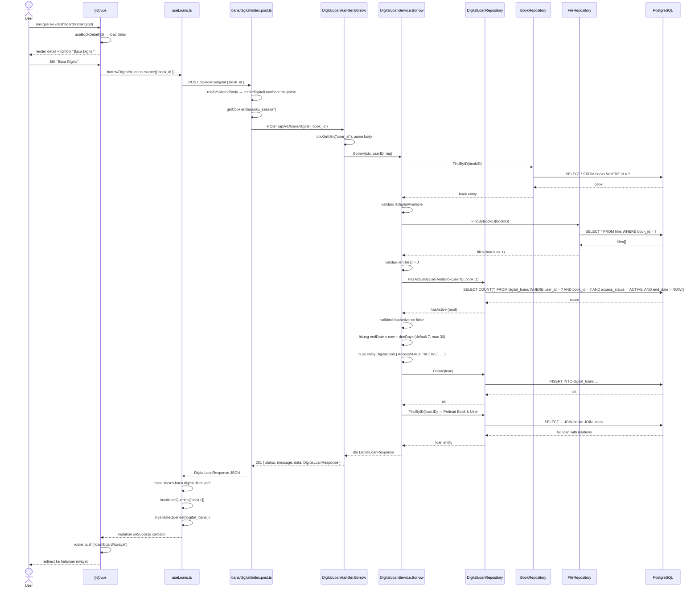

# Ajukan Peminjaman Buku Digital

---

## 1. Ringkasan

Sequence ini mencakup proses peminjaman akses baca buku digital oleh User dari halaman detail buku. User melihat tombol "Baca Digital" jika buku tersedia dalam format digital, menekannya, lalu sistem membuat record akses digital dengan status `ACTIVE`, durasi terbatas (default 7 hari), dan mengarahkan User ke halaman riwayat. Berbeda dengan buku fisik, peminjaman digital tidak mengurangi stok dan tidak memiliki batas jumlah peminjam simultan — tetapi User hanya bisa memiliki satu akses aktif per buku.

**Actor:** User (role: `USER`, sudah login)
**Trigger:** User menekan tombol "Baca Digital" di halaman `/dashboard/katalog/:id`

---

## 2. Precondition & Postcondition

| Kondisi | Sebelum (Precondition) | Sesudah (Postcondition) |
|---|---|---|
| Sukses | Buku exist, `IsDigitalAvailable = true`, buku punya file PDF, user tidak punya akses aktif untuk buku ini. | DigitalLoan created (`AccessStatus: ACTIVE`, `StartDate: now`, `EndDate: now + dueDays`). User redirect ke `/dashboard/riwayat`. |
| Gagal: tidak tersedia digital | `IsDigitalAvailable = false`. | Response 400 "book is not available in digital format". |
| Gagal: tidak ada file PDF | Buku tidak punya `file_url` / file terkait. | Response 400 "no PDF file found for this book". |
| Gagal: sudah punya akses | User sudah punya loan `ACTIVE` untuk buku ini dan `end_date > NOW()`. | Response 400 "you already have active access to this book". |

---

## 3. Diagram Sequence



---

## 4. Breakdown per Boundary

### Boundary 1: Detail Buku ([id].vue)

| Aspek | Detail |
|---|---|
| **File** | `pages/dashboard/katalog/[id].vue` |
| **Layout** | `dashboard` |
| **Data** | `useBookDetail(id)` — query key `['books', 'detail', id]` |
| **Tombol** | "Baca Digital" muncul jika `book.is_digital_available` (warna `primary`, icon `book-open`) |
| **Trigger** | Klik "Baca Digital" → `onBorrowDigital()` |
| **Function** | `onBorrowDigital()` di `[id].vue:32-41` |
| **Transisi** | Mutasi → toast + redirect ke `/dashboard/riwayat` jika sukses |

### Boundary 2: useLoans.ts — borrowDigitalMutation

| Aspek | Detail |
|---|---|
| **File** | `composables/useLoans.ts` |
| **Function** | `borrowDigitalMutation` (line 86-99) — `useMutation` |
| **API** | `POST /api/loans/digital` dengan body `CreateDigitalLoanInput` (`{ book_id, due_days? }`) |
| **Input FE** | `{ book_id: book.value.id }` — tanpa `due_days` (default 7 di BE) |
| **onSuccess** | Toast "Akses baca digital diberikan", `invalidateQueries(['books'])`, `invalidateQueries(['digital_loans'])` |
| **onError** | Toast "Gagal mendapatkan akses digital" + `err?.data?.message \|\| err.message` |
| **Transisi** | Callback `onSuccess` di `[id].vue` → `router.push('/dashboard/riwayat')` |

### Boundary 3: BFF — POST /api/loans/digital

| Aspek | Detail |
|---|---|
| **File** | `server/api/loans/digital/index.post.ts` |
| **Validasi** | `readValidatedBody(event, createDigitalLoanSchema.parse)` — zod `{ book_id: z.number().min(1), due_days?: z.number().min(1).max(30) }` |
| **Auth** | `getCookie(event, 'literasiku_session')` → `Authorization: Bearer {session}` |
| **Target** | `POST ${goApiBaseUrl}/api/v1/loans/digital` dengan body JSON |
| **Response** | Return `res.data` (typecast `DigitalLoanResponse`) |

### Boundary 4: Go Handler — DigitalLoanHandler.Borrow

| Aspek | Detail |
|---|---|
| **File** | `modules/digital_loan/handler/digital_loan_handler.go:30-46` |
| **Auth context** | `ctx.GetUint("user_id")` — diset oleh middleware `Authenticate` |
| **Parsing** | `ctx.ShouldBindJSON(&req)` → `dto.CreateDigitalLoanRequest` |
| **Delegasi** | `h.svc.Borrow(ctx, userID, req)` |
| **Response** | Sukses → `201 { status, message, data: DigitalLoanResponse }`; Gagal → `400 { status, message, errors }` |

### Boundary 5: Go Service — DigitalLoanService.Borrow

| Aspek | Detail |
|---|---|
| **File** | `modules/digital_loan/service/digital_loan_service.go:40-92` |
| **Validasi bertahap** | ① `bookRepo.FindByID` → book not found ② `IsDigitalAvailable` → tidak tersedia digital ③ `fileRepo.FindByBookID` → tidak ada PDF ④ `HasActiveByUserAndBook` → sudah punya akses aktif |
| **Due days** | `dueDays = req.DueDays`; jika `<= 0` → default 7; max 30 (binding) |
| **Entity** | `AccessStatus: "ACTIVE"`, `StartDate: now`, `EndDate: now + dueDays` |
| **Tanpa side-effect** | Tidak ada perubahan stok buku (digital unlimited) |
| **Return** | `FindByID(loan.ID)` untuk preload Book & User → `toLoanResponse()` |

### Boundary 6: DigitalLoanRepository

| Aspek | Detail |
|---|---|
| **File** | `modules/digital_loan/repository/digital_loan_repository.go` |
| **Method** | `HasActiveByUserAndBook(userID, bookID)` — count `access_status = 'ACTIVE' AND end_date > NOW()` (line 69-75) |
| **Method** | `Create(loan)` — `r.db.Create(loan)` (line 26-28) |
| **Method** | `FindByID(id)` — Preload `Book` & `User` (line 30-34) |

### Boundary 7: FileRepository (validasi PDF exists)

| Aspek | Detail |
|---|---|
| **File** | `modules/file/repository/file_repository.go` |
| **Method** | `FindByBookID(bookID)` — cari file PDF terkait buku |
| **Fungsi** | Memastikan buku benar-benar punya file digital sebelum memberi akses |

---

## 5. Alur Detail End-to-End

| Step | Actor/System | Aksi | File:Line | Detail |
|---|---|---|---|---|
| 1 | User | Navigasi ke `/dashboard/katalog/{id}` | `[id].vue:4-6` | Dashboard layout |
| 2 | [id].vue | Fetch detail buku | `[id].vue:12-15` | `useBookDetail(id)` → query key `['books','detail',id]` |
| 3 | [id].vue | Render | `[id].vue:87-95` | Tombol "Baca Digital" jika `book.is_digital_available` |
| 4 | User | Klik "Baca Digital" | `[id].vue:88-95` | Tombol primary, loading state via `borrowDigitalMutation.isPending` |
| 5 | [id].vue | Trigger mutation | `[id].vue:32-41` | `borrowDigitalMutation.mutate({ book_id })` |
| 6 | useLoans.ts | Mutation function | `useLoans.ts:86-89` | `fetch('/api/loans/digital', { method: 'POST', body: { book_id } })` |
| 7 | BFF | Validasi body | `index.post.ts:7` | Zod `createDigitalLoanSchema.parse` |
| 8 | BFF | Baca session cookie | `index.post.ts:9` | `getCookie(event, 'literasiku_session')` |
| 9 | BFF | Proxy ke Go | `index.post.ts:12-18` | `POST /api/v1/loans/digital` dengan `Authorization: Bearer {session}` |
| 10 | Go Router | Auth middleware | `router.go:132` | `Authenticate(deps.JWTService)` → set `user_id` |
| 11 | DigitalLoanHandler | Extract user & parse | `handler.go:31-37` | `ctx.GetUint("user_id")`, `ctx.ShouldBindJSON(&req)` |
| 12 | DigitalLoanHandler | Delegasi | `handler.go:39` | `h.svc.Borrow(ctx, userID, req)` |
| 13 | DigitalLoanService | Cari buku | `service.go:41` | `s.bookRepo.FindByID(req.BookID)` |
| 14 | DigitalLoanService | Validasi digital | `service.go:49-51` | `IsDigitalAvailable` |
| 15 | DigitalLoanService | Cek file PDF | `service.go:54-57` | `s.fileRepo.FindByBookID(req.BookID)` → `len(files) > 0` |
| 16 | DigitalLoanService | Cek akses duplikat | `service.go:60-66` | `HasActiveByUserAndBook(userID, bookID)` → `access_status = 'ACTIVE' AND end_date > NOW()` |
| 17 | DigitalLoanService | Tentukan durasi | `service.go:68-71` | `dueDays = req.DueDays`; jika 0/negatif → default `7` |
| 18 | DigitalLoanService | Buat entity | `service.go:73-80` | `AccessStatus: "ACTIVE"`, `StartDate: now`, `EndDate: now + dueDays` |
| 19 | DigitalLoanService | Simpan loan | `service.go:82-84` | `s.loanRepo.Create(loan)` → INSERT |
| 20 | DigitalLoanService | Re-fetch dengan relasi | `service.go:86-89` | `s.loanRepo.FindByID(loan.ID)` — Preload Book & User |
| 21 | DigitalLoanService | Return | `service.go:90-91` | `toLoanResponse(full)` → `dto.DigitalLoanResponse` |
| 22 | DigitalLoanHandler | Response 201 | `handler.go:45` | `201 { status: "success", message: "Digital book borrowed successfully", data: DigitalLoanResponse }` |
| 23 | BFF | Extract & return | `index.post.ts:26` | `return res?.data!` |
| 24 | useLoans.ts | onSuccess | `useLoans.ts:92-96` | Toast sukses, `invalidateQueries(['books'])`, `invalidateQueries(['digital_loans'])` |
| 25 | [id].vue | Redirect | `[id].vue:38` | `router.push('/dashboard/riwayat')` |

---

## 6. Kontrak Request/Response

### POST /api/loans/digital

**Path:** `client/server/api/loans/digital/index.post.ts`
**Target:** `POST /api/v1/loans/digital`
**Auth:** Required (JWT dalam `literasiku_session` cookie, role `USER` atau `ADMIN`)

**Request Body:**

```json
{
  "book_id": 5,
  "due_days": 14
}
```

| Field | Tipe | Required | Validasi | Deskripsi |
|---|---|---|---|---|
| `book_id` | number | ya | `z.number().min(1)` (FE) / `binding:"required"` (BE) | ID buku |
| `due_days` | number | opsional | `min(1).max(30)` (FE) / `omitempty,min=1,max=30` (BE) | Durasi akses dalam hari. Default: 7. |

**Response Sukses (201):**

```json
{
  "status": "success",
  "message": "Digital book borrowed successfully",
  "data": {
    "id": 5,
    "user_id": 3,
    "user_full_name": "Budi Santoso",
    "username": "budi",
    "book_id": 5,
    "book_title": "Pemrograman Go",
    "start_date": "2026-07-02T10:00:00Z",
    "end_date": "2026-07-16T10:00:00Z",
    "access_status": "ACTIVE",
    "created_at": "2026-07-02T10:00:00Z"
  }
}
```

**Response Error (400):**

```json
{
  "status": "error",
  "message": "Failed to borrow digital book",
  "errors": "you already have active access to this book"
}
```

**Status Codes:**

| Code | Condition |
|---|---|
| `201` | Sukses |
| `400` | Book not found, not available digital, no PDF file, already has active access, invalid body |
| `401` | Tidak terautentikasi |

---

## 7. Error Handling & Edge Case

| Kondisi | Deteksi (File:Line) | Response BE | Handling FE |
|---|---|---|---|
| Book not found | `service.go:43-45` | 400 "book not found" | Toast error |
| Buku tidak tersedia digital | `service.go:49-51` | 400 "book is not available in digital format" | Toast error (tombol "Baca Digital" tidak muncul jika `!is_digital_available`) |
| File PDF tidak ditemukan | `service.go:54-57` | 400 "no PDF file found for this book" | Toast error (seharusnya jarang terjadi karena tombol hanya muncul jika digital available) |
| User sudah punya akses aktif untuk buku ini | `service.go:64-66` | 400 "you already have active access to this book" | Toast error |
| `book_id` invalid | `index.post.ts:7` (zod) | 400 validation | Toast error |
| `due_days` > 30 | `index.post.ts:7` (zod) / `handler.go:34` (binding) | 400 validation | Toast error |
| JWT tidak ada / expired | `router.go:132` | 401 Unauthorized | Redirect login |
| Buku digital tapi file_url null | `service.go:54-57` | 400 "no PDF file found for this book" | Toast error (inconsistent data) |
| Akses kedaluwarsa (end_date < now) | Dicek di `CheckAccess` service | Dianggap tidak punya akses | User bisa pinjam ulang |
| Network error (Go down) | BFF apiCall | — | Toast "Gagal mendapatkan akses digital" |

---

## 8. File Terkait

### Frontend
- `client/app/pages/dashboard/katalog/[id].vue` — Halaman detail buku & tombol "Baca Digital"
- `client/app/composables/useLoans.ts` — Mutation `borrowDigitalMutation`
- `client/server/api/loans/digital/index.post.ts` — BFF proxy dengan validasi zod
- `client/shared/schemas/loans.schema.ts` — Zod `createDigitalLoanSchema`
- `client/shared/types/loans.ts` — `DigitalLoanResponse`, `CreateDigitalLoanRequest`

### Backend
- `server/modules/digital_loan/handler/digital_loan_handler.go` — Handler `Borrow`
- `server/modules/digital_loan/service/digital_loan_service.go` — Service `Borrow` (3 validasi bertahap)
- `server/modules/digital_loan/repository/digital_loan_repository.go` — `HasActiveByUserAndBook`, `Create`, `FindByID`
- `server/modules/digital_loan/dto/digital_loan_dto.go` — `CreateDigitalLoanRequest`, `DigitalLoanResponse`
- `server/modules/file/repository/file_repository.go` — `FindByBookID` (validasi PDF exists)
- `server/modules/book/repository/book_repository.go` — `FindByID`
- `server/router/router.go` — Route `POST /loans/digital` (auth only, line 135)

---

## 9. Related Docs

- [cari_katalog.md](cari_katalog.md) — Jelajahi katalog (halaman sebelum detail)
- [pinjam_fisik.md](pinjam_fisik.md) — Peminjaman buku fisik (flow parallel dengan perbedaan aturan)
- [../admin/kelola_buku/extends/kelola_peminjaman.md](../admin/kelola_buku/extends/kelola_peminjaman.md) — Ringkasan fitur peminjaman (fisik & digital)
- [../admin/kelola_buku/extends/file-upload.md](../admin/kelola_buku/extends/file-upload.md) — Upload file PDF (prasyarat buku digital)
- [../register.md](../register.md) — Alur autentikasi
