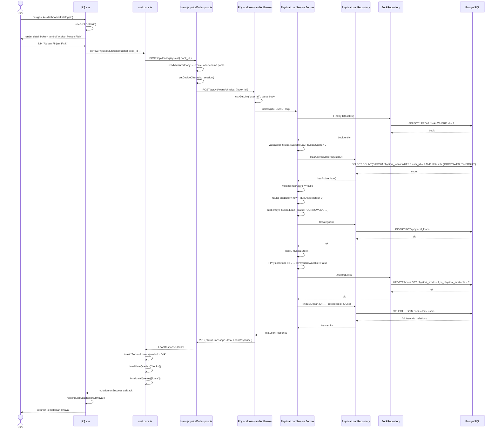

# Ajukan Peminjaman Buku Fisik

---

## 1. Ringkasan

Sequence ini mencakup proses peminjaman buku fisik oleh User dari halaman detail buku. User melihat ketersediaan stok fisik, menekan tombol "Ajukan Pinjam Fisik", lalu sistem membuat record peminjaman dengan status `BORROWED`, mengurangi stok buku (`PhysicalStock--`), dan mengarahkan User ke halaman riwayat peminjaman.

**Actor:** User (role: `USER`, sudah login)
**Trigger:** User menekan tombol "Ajukan Pinjam Fisik" di halaman `/dashboard/katalog/:id`

---

## 2. Precondition & Postcondition

| Kondisi | Sebelum (Precondition) | Sesudah (Postcondition) |
|---|---|---|
| Sukses | Buku exist, `physical_stock > 0`, user tidak punya pinjaman aktif. | Loan created (`status: BORROWED`, `fine_amount: 0`, `fine_status: NONE`). `book.PhysicalStock--`. User redirect ke `/dashboard/riwayat`. |
| Gagal: stok habis | `physical_stock <= 0` atau `is_physical_available = false`. | Response 400 "book is not available for borrowing". |
| Gagal: masih punya pinjaman aktif | User memiliki loan dengan status `BORROWED` atau `OVERDUE`. | Response 400 "you have an active loan that must be returned first". |
| Gagal: buku tidak ditemukan | Book ID tidak valid / soft-deleted. | Response 400 "book not found". |

---

## 3. Diagram Sequence



---

## 4. Breakdown per Boundary

### Boundary 1: Detail Buku ([id].vue)

| Aspek | Detail |
|---|---|
| **File** | `pages/dashboard/katalog/[id].vue` |
| **Layout** | `dashboard` |
| **State** | `id` (computed dari route param), `book` dari `useBookDetail`, `isLoading` |
| **Data** | `useBookDetail(id)` — query key `['books', 'detail', id]` |
| **Display** | Cover (icon), judul, author, kategori, badge stok fisik, badge digital, info detail (penerbit, tahun, ISBN) |
| **Tombol** | "Ajukan Pinjam Fisik" muncul jika `book.physical_stock > 0`; "Baca Digital" jika `book.is_digital_available`; `UAlert` jika keduanya kosong |
| **Trigger** | Klik "Ajukan Pinjam Fisik" → `onBorrowPhysical()` |
| **Function** | `onBorrowPhysical()` di `[id].vue:21-30` |
| **Transisi** | Mutasi → toast + redirect ke `/dashboard/riwayat` jika sukses |

### Boundary 2: useLoans.ts — borrowPhysicalMutation

| Aspek | Detail |
|---|---|
| **File** | `composables/useLoans.ts` |
| **Function** | `borrowPhysicalMutation` (line 71-84) — `useMutation` |
| **API** | `POST /api/loans/physical` dengan body `CreateLoanInput` (`{ book_id, due_days? }`) |
| **Input FE** | `{ book_id: book.value.id }` — tanpa `due_days` (default 7 di BE) |
| **onSuccess** | Toast "Berhasil meminjam buku fisik", `invalidateQueries(['books'])`, `invalidateQueries(['loans'])` |
| **onError** | Toast "Gagal meminjam buku" + `err?.data?.message \|\| err.message` |
| **Transisi** | Callback `onSuccess` di `[id].vue` → `router.push('/dashboard/riwayat')` |

### Boundary 3: BFF — POST /api/loans/physical

| Aspek | Detail |
|---|---|
| **File** | `server/api/loans/physical/index.post.ts` |
| **Validasi** | `readValidatedBody(event, createLoanSchema.parse)` — zod `{ book_id: z.number().min(1), due_days?: z.number().min(1).max(60) }` |
| **Auth** | `getCookie(event, 'literasiku_session')` → `Authorization: Bearer {session}` |
| **Target** | `POST ${goApiBaseUrl}/api/v1/loans/physical` dengan body JSON |
| **Response** | Return `res.data` (typecast `LoanResponse`) |

### Boundary 4: Go Handler — PhysicalLoanHandler.Borrow

| Aspek | Detail |
|---|---|
| **File** | `modules/physical_loan/handler/physical_loan_handler.go:30-46` |
| **Auth context** | `ctx.GetUint("user_id")` — diset oleh middleware `Authenticate` |
| **Parsing** | `ctx.ShouldBindJSON(&req)` → `dto.CreateLoanRequest` (wajib `book_id`, opsional `due_days`) |
| **Delegasi** | `h.svc.Borrow(ctx, userID, req)` |
| **Response** | Sukses → `201 { status, message, data: LoanResponse }`; Gagal → `400 { status, message, errors }` |

### Boundary 5: Go Service — PhysicalLoanService.Borrow

| Aspek | Detail |
|---|---|
| **File** | `modules/physical_loan/service/physical_loan_service.go:46-101` |
| **Validasi bertahap** | ① `bookRepo.FindByID` → book not found ② `IsPhysicalAvailable && PhysicalStock > 0` → not available ③ `HasActiveByUserID` → ada pinjaman aktif |
| **Due days** | `dueDays = req.DueDays`; jika `<= 0` → default 7 hari |
| **Side-effect** | `book.PhysicalStock--`; jika `== 0` → `IsPhysicalAvailable = false`; `bookRepo.Update(book)` |
| **Return** | `FindByID(loan.ID)` untuk preload Book & User → `toLoanResponse()` |

### Boundary 6: PhysicalLoanRepository

| Aspek | Detail |
|---|---|
| **File** | `modules/physical_loan/repository/physical_loan_repository.go` |
| **Method** | `HasActiveByUserID(userID)` — count loan `BORROWED`/`OVERDUE` (line 68-74) |
| **Method** | `Create(loan)` — `r.db.Create(loan)` (line 25-27) |
| **Method** | `FindByID(id)` — Preload `Book` & `User` (line 29-36) |

### Boundary 7: BookRepository (side-effect update)

| Aspek | Detail |
|---|---|
| **File** | `modules/book/repository/book_repository.go` |
| **Method** | `FindByID(id)` — `r.db.First(&book, id)` (line 29-36) |
| **Method** | `Update(book)` — `r.db.Save(book)` (line 62-64) |

---

## 5. Alur Detail End-to-End

| Step | Actor/System | Aksi | File:Line | Detail |
|---|---|---|---|---|
| 1 | User | Navigasi ke `/dashboard/katalog/{id}` | `[id].vue:4-6` | Dashboard layout |
| 2 | [id].vue | Fetch detail buku | `[id].vue:12-15` | `useBookDetail(id)` → query key `['books','detail',id]` |
| 3 | [id].vue | Render halaman | `[id].vue:69-142` | Detail buku + tombol aksi berdasarkan ketersediaan |
| 4 | User | Klik "Ajukan Pinjam Fisik" | `[id].vue:97-106` | Tombol muncul jika `book.physical_stock > 0` |
| 5 | [id].vue | Trigger mutation | `[id].vue:21-30` | `borrowPhysicalMutation.mutate({ book_id })` dengan `onSuccess → router.push('/dashboard/riwayat')` |
| 6 | useLoans.ts | Mutation function | `useLoans.ts:72-74` | `fetch('/api/loans/physical', { method: 'POST', body: { book_id } })` |
| 7 | BFF | Validasi body | `index.post.ts:7` | Zod `createLoanSchema.parse` → validasi `book_id` min 1, `due_days` opsional 1-60 |
| 8 | BFF | Baca session cookie | `index.post.ts:9` | `getCookie(event, 'literasiku_session')` |
| 9 | BFF | Proxy ke Go | `index.post.ts:12-18` | `POST /api/v1/loans/physical` dengan `Authorization: Bearer {session}` |
| 10 | Go Router | Auth middleware | `router.go:116` | `Authenticate(deps.JWTService)` → set `user_id` di context |
| 11 | PhysicalLoanHandler | Extract user & parse | `handler.go:31-37` | `ctx.GetUint("user_id")`, `ctx.ShouldBindJSON(&req)` |
| 12 | PhysicalLoanHandler | Delegasi ke service | `handler.go:39` | `h.svc.Borrow(ctx, userID, req)` |
| 13 | PhysicalLoanService | Cari buku | `service.go:47` | `s.bookRepo.FindByID(req.BookID)` |
| 14 | PhysicalLoanService | Validasi ketersediaan | `service.go:55-57` | Cek `IsPhysicalAvailable && PhysicalStock > 0` |
| 15 | PhysicalLoanService | Cek pinjaman aktif | `service.go:59-65` | `s.loanRepo.HasActiveByUserID(userID)` — count `BORROWED`/`OVERDUE` |
| 16 | PhysicalLoanService | Tentukan durasi | `service.go:67-70` | `dueDays = req.DueDays`; jika 0/negatif → default `7` |
| 17 | PhysicalLoanService | Buat entity loan | `service.go:72-81` | `Status: "BORROWED"`, `BorrowDate: now`, `DueDate: now + dueDays`, `FineAmount: 0`, `FineStatus: "NONE"` |
| 18 | PhysicalLoanService | Simpan loan | `service.go:83-85` | `s.loanRepo.Create(loan)` → INSERT |
| 19 | PhysicalLoanService | Kurangi stok | `service.go:88-91` | `book.PhysicalStock--`; jika 0 → `book.IsPhysicalAvailable = false` |
| 20 | PhysicalLoanService | Update buku | `service.go:92-94` | `s.bookRepo.Update(book)` → UPDATE |
| 21 | PhysicalLoanService | Re-fetch dengan relasi | `service.go:96-99` | `s.loanRepo.FindByID(loan.ID)` — Preload Book & User |
| 22 | PhysicalLoanService | Return response | `service.go:100-101` | `toLoanResponse(full)` → `dto.LoanResponse` |
| 23 | PhysicalLoanHandler | Response 201 | `handler.go:45` | `201 { status: "success", message: "Book borrowed successfully", data: LoanResponse }` |
| 24 | BFF | Extract & return | `index.post.ts:26` | `return res?.data!` |
| 25 | useLoans.ts | onSuccess | `useLoans.ts:76-80` | Toast sukses, `invalidateQueries(['books'])`, `invalidateQueries(['loans'])` |
| 26 | [id].vue | Redirect | `[id].vue:27` | `router.push('/dashboard/riwayat')` |

---

## 6. Kontrak Request/Response

### POST /api/loans/physical

**Path:** `client/server/api/loans/physical/index.post.ts`
**Target:** `POST /api/v1/loans/physical`
**Auth:** Required (JWT dalam `literasiku_session` cookie, role `USER` atau `ADMIN`)

**Request Body:**

```json
{
  "book_id": 5,
  "due_days": 7
}
```

| Field | Tipe | Required | Validasi | Deskripsi |
|---|---|---|---|---|
| `book_id` | number | ya | `z.number().min(1)` (FE) / `binding:"required"` (BE) | ID buku yang akan dipinjam |
| `due_days` | number | opsional | `min(1).max(60)` (FE) / `omitempty,min=1,max=60` (BE) | Lama peminjaman dalam hari. Default: 7. |

**Response Sukses (201):**

```json
{
  "status": "success",
  "message": "Book borrowed successfully",
  "data": {
    "id": 10,
    "user_id": 3,
    "user_full_name": "Budi Santoso",
    "username": "budi",
    "book_id": 5,
    "book_title": "Pemrograman Go",
    "borrow_date": "2026-07-02T10:00:00Z",
    "due_date": "2026-07-09T10:00:00Z",
    "return_date": null,
    "status": "BORROWED",
    "fine_amount": 0,
    "fine_status": "NONE",
    "created_at": "2026-07-02T10:00:00Z"
  }
}
```

**Response Error (400):**

```json
{
  "status": "error",
  "message": "Failed to borrow book",
  "errors": "book is not available for borrowing"
}
```

**Status Codes:**

| Code | Condition |
|---|---|
| `201` | Sukses |
| `400` | Book not found, not available, active loan exists, invalid request body |
| `401` | Tidak terautentikasi (missing/invalid JWT) |

---

## 7. Error Handling & Edge Case

| Kondisi | Deteksi (File:Line) | Response BE | Handling FE |
|---|---|---|---|
| Book not found | `service.go:49-50` | 400 "book not found" | Toast "Gagal meminjam buku: book not found" |
| Stok buku habis / tidak tersedia | `service.go:55-57` | 400 "book is not available for borrowing" | Toast "Gagal meminjam buku: book is not available..." |
| User masih punya pinjaman aktif | `service.go:63-65` | 400 "you have an active loan that must be returned first" | Toast "Gagal meminjam buku: you have an active loan..." |
| `book_id` invalid (0/negatif) | `index.post.ts:7` (zod) / `handler.go:34` (binding) | 400 "Failed to parse request" / zod validation error | Toast dengan deskripsi error |
| `due_days` di luar range (1-60) | `index.post.ts:7` (zod) / `handler.go:34` (binding) | 400 validation error | Toast error |
| JWT tidak ada / expired | `router.go:116` (middleware) | 401 Unauthorized | Redirect ke login (dashboard layout) |
| Network error (Go down) | `index.post.ts:11-20` (apiCall) | — | Toast "Gagal meminjam buku" + error network |
| Stok jadi 0 setelah pinjam | `service.go:89-91` | Side-effect: `IsPhysicalAvailable = false` | Tombol "Ajukan Pinjam Fisik" hilang di render ulang |
| due_days tidak dikirim FE | `service.go:67-70` | Default ke 7 hari | — |

---

## 8. File Terkait

### Frontend
- `client/app/pages/dashboard/katalog/[id].vue` — Halaman detail buku & tombol pinjam
- `client/app/composables/useLoans.ts` — Mutation `borrowPhysicalMutation`
- `client/server/api/loans/physical/index.post.ts` — BFF proxy dengan validasi zod
- `client/shared/schemas/loans.schema.ts` — Zod `createLoanSchema`
- `client/shared/types/loans.ts` — `LoanResponse`, `CreateLoanRequest`

### Backend
- `server/modules/physical_loan/handler/physical_loan_handler.go` — Handler `Borrow`
- `server/modules/physical_loan/service/physical_loan_service.go` — Service `Borrow` (logika bisnis + stock side-effect)
- `server/modules/physical_loan/repository/physical_loan_repository.go` — `HasActiveByUserID`, `Create`, `FindByID`
- `server/modules/physical_loan/dto/physical_loan_dto.go` — `CreateLoanRequest`, `LoanResponse`
- `server/modules/book/repository/book_repository.go` — `FindByID`, `Update` (stock decrement)
- `server/router/router.go` — Route `POST /loans/physical` (auth only, line 119)

---

## 9. Related Docs

- [cari_katalog.md](cari_katalog.md) — Jelajahi katalog (halaman sebelum detail)
- [../admin/kelola_buku/extends/catat_pengembalian.md](../admin/kelola_buku/extends/catat_pengembalian.md) — Pengembalian buku fisik (alur kebalikan)
- [../admin/kelola_buku/kelola_buku.md](../admin/kelola_buku/kelola_buku.md) — Manajemen buku oleh admin
- [../register.md](../register.md) — Alur registrasi & autentikasi user
