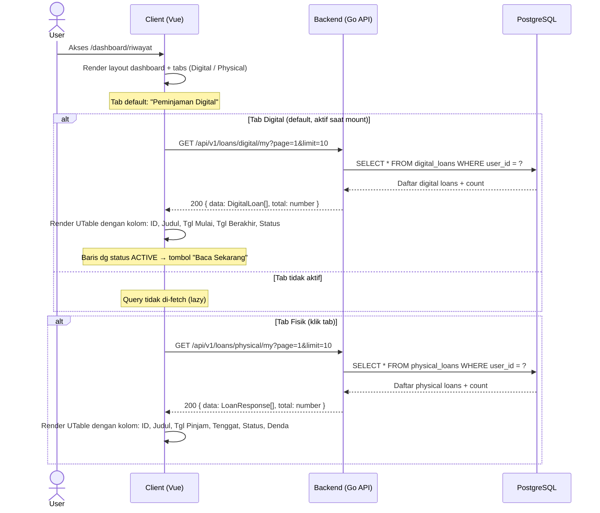
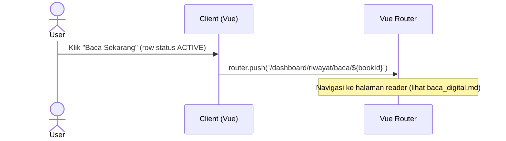

# Lihat Riwayat Peminjaman Saya

---

## 1. Ringkasan

Sequence ini mencakup proses User melihat riwayat peminjaman buku fisik dan digital di halaman `/dashboard/riwayat`. Halaman menampilkan dua tab: "Peminjaman Digital" (daftar akses baca digital) dan "Peminjaman Fisik" (daftar peminjaman buku fisik). Masing-masing tab melakukan request API terpisah secara paralel saat aktif. User dapat melihat status, denda (fisik), dan membuka buku digital yang masih aktif.

**Actor:** User (role: `USER`, sudah login)
**Trigger:** User mengakses route `/dashboard/riwayat`

---

## 2. Precondition & Postcondition

| Kondisi | Sebelum (Precondition) | Sesudah (Postcondition) |
|---|---|---|
| Sukses | User terautentikasi (dashboard layout). | Tabel riwayat tampil per tab dengan data dari BE. |
| Gagal (data kosong) | Tidak ada riwayat peminjaman. | Tabel kosong (tanpa data). |
| Gagal (network) | Koneksi terputus atau API error. | Vue Query error state (loading terus atau tidak render). |

---

## 3. Bagan

### 3.1. Inisialisasi Halaman

### 3.2. Navigasi ke Halaman Baca Digital

---

## 4. Langkah Detail

### 4.1. Load Halaman Riwayat
1. User mengakses `/dashboard/riwayat` → Vue render `DashboardUserRiwayat` dengan komponen `UTabs`.
2. Tab default: "Peminjaman Digital" (slot `#digital` → `DigitalHistory.vue`).
   - `DigitalHistory.vue` memanggil `useMyDigitalLoans({ page, limit })` via composable `useLoans()`.
   - Query key: `['loans', 'digital', 'my', page, limit]`.
   - Endpoint: `GET /api/v1/loans/digital/my?page=<page>&limit=<limit>`.
   - Response shape: `PaginatedResponse<DigitalLoanResponse>`.
   - Kolom tabel: `ID Pinjam`, `Judul Buku`, `Tgl Mulai`, `Tgl Berakhir`, `Status Akses`.
3. Tab "Peminjaman Fisik" (slot `#physical` → `PhysicalHistory.vue`).
   - `PhysicalHistory.vue` memanggil `useMyPhysicalLoans({ page, limit })`.
   - Query key: `['loans', 'physical', 'my', page, limit]`.
   - Endpoint: `GET /api/v1/loans/physical/my?page=<page>&limit=<limit>`.
   - Response shape: `PaginatedResponse<LoanResponse>`.
   - Kolom tabel: `ID Pinjam`, `Judul Buku`, `Tgl Pinjam`, `Tenggat Waktu`, `Status`, `Denda`.

### 4.2. Navigasi ke Reader Digital
- Baris digital loan dengan `access_status = 'ACTIVE'` menampilkan tombol "Baca Sekarang".
- Klik tombol → `router.push('/dashboard/riwayat/baca/' + bookId)`.
- Navigasi ke `baca_digital.md` flow.

### 4.3. Fitur Pagination
- Masing-masing tabel memiliki `UPagination` di bagian bawah.
- `page` dan `limit` di-refresh via Vue Query saat berubah (query key dependency).

---

## 5. Boundary

| Aspek | Detail |
|---|---|
| **Actor** | User (role: `USER`, sudah login) |
| **Trigger** | User mengakses route `/dashboard/riwayat` |
| **Primary Flow** | Lihat daftar akses digital → Lihat daftar pinjaman fisik → (opsional) navigasi ke reader |
| **API Calls** | `GET /api/v1/loans/digital/my` (auth, query: page, limit), `GET /api/v1/loans/physical/my` (auth, query: page, limit) |
| **Framework** | Vue 3 (Nuxt) dengan `@tanstack/vue-query` untuk fetching + caching |
| **FE Component** | `client/app/pages/dashboard/riwayat/index.vue`, `PhysicalHistory.vue`, `DigitalHistory.vue` |
| **FE Composable** | `client/app/composables/useLoans.ts` — `useMyPhysicalLoans`, `useMyDigitalLoans` (line 11, 23) |
| **BE Handler** | `PhysicalLoanHandler.GetMyLoans` (`server/modules/physical_loan/handler/`), `DigitalLoanHandler.GetMyLoans` (`server/modules/digital_loan/handler/`) |
| **BE Route** | `server/router/router.go` — `GET /loans/physical/my` (auth, line 120), `GET /loans/digital/my` (auth, line 136) |
| **Pagination** | Client-side `UPagination` + server-side `LIMIT`/`OFFSET` via query params |

---

## 6. Related Docs

- [baca_digital.md](baca_digital.md) — Baca buku digital (navigasi dari tombol "Baca Sekarang")
- [pinjam_digital.md](pinjam_digital.md) — Ajukan peminjaman digital (mengisi riwayat digital)
- [pinjam_fisik.md](pinjam_fisik.md) — Ajukan peminjaman fisik (mengisi riwayat fisik)
- [../admin/kelola_buku/extends/catat_pengembalian.md](../admin/kelola_buku/extends/catat_pengembalian.md) — Pengembalian buku fisik (mengubah status riwayat fisik)
- [login.md](../login.md) — Alur autentikasi
