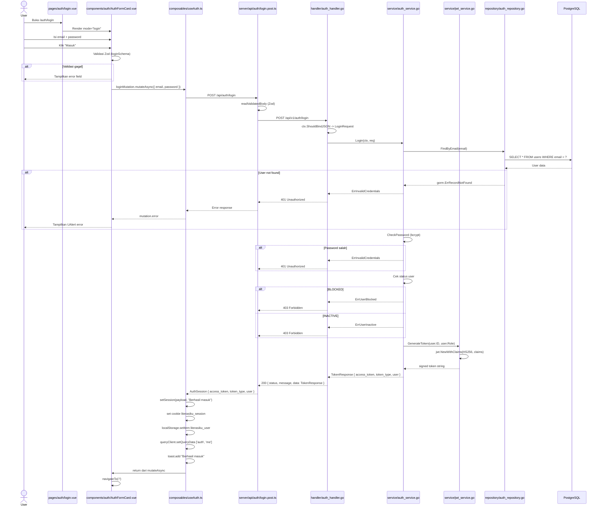
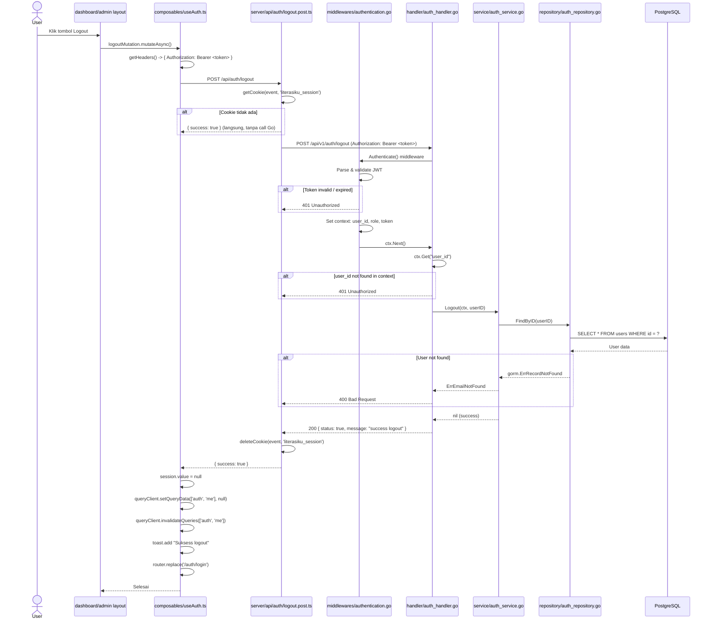

# Sequence 02: Login Anggota

## 1. Ringkasan

Pengguna (anggota atau admin) memasukkan email dan password untuk mendapatkan akses ke halaman terproteksi (dashboard/admin). Proses ini menghasilkan JWT `access_token` yang disimpan sebagai cookie HTTP (`literasiku_session`) dan digunakan sebagai header `Authorization` untuk seluruh request terautentikasi selanjutnya. Trigger dimulai dari halaman `/auth/login` atau dari `AuthModal` yang muncul di berbagai halaman publik.

**Actor:** Anggota (USER), Admin (ADMIN)

**Trigger:** User mengisi form login & menekan tombol "Masuk"

---

## 2. Precondition & Postcondition

### Precondition
- User belum memiliki session valid (`literasiku_session` cookie tidak ada atau expired)
- User berada di halaman `/auth/login` atau modal login terbuka
- Backend Go API dan database PostgreSQL berjalan
- User sudah terdaftar dengan status `ACTIVE`

### Postcondition — Sukses
- Cookie `literasiku_session` terisi JWT access token
- `localStorage` menyimpan data user (`literasiku_user`)
- Query cache `['auth', 'me']` terisi data user
- Toast sukses "Berhasil masuk" muncul
- User diarahkan ke halaman `/`

### Postcondition — Gagal
- Cookie dan localStorage tidak berubah
- Error message ditampilkan di dalam `UAlert` pada form
- User tetap di halaman login

---

## 3. Diagram Sequence



---

## 4. Breakdown per Boundary

### Boundary 1: Halaman Login

| Atribut | Detail |
|---------|--------|
| **File komponen** | `pages/auth/login.vue` |
| **Komponen anak** | `components/auth/AuthPageShell.vue` (layout + hero section), `components/auth/AuthFormCard.vue` (form) |
| **State/store** | Tidak ada state lokal; delegasi penuh ke `AuthFormCard` |

Halaman ini hanya menyusun layout shell dan menempatkan form login di kolom kanan.

**Trigger aksi:** Tidak ada — halaman bersifat deklaratif.

**Transisi:** Render selesai → user melihat form login di Boundary 2.

---

### Boundary 2: Form Login (AuthFormCard)

| Atribut | Detail |
|---------|--------|
| **File komponen** | `components/auth/AuthFormCard.vue` |
| **State/store** | `useAuth()` → `loginMutation`, `registerMutation` |
| **Input yang ditampilkan** | Email (`type=email`), Password (`type=password`) |
| **Validasi frontend** | `loginSchema` dari `shared/schemas/auth.schema.ts` via Zod |

**Field definitions:**
```ts
// components/auth/AuthFormCard.vue:17-31
[
  { name: 'email',    type: 'email',    label: 'Email',     placeholder: 'nama@kampus.ac.id', required: true },
  { name: 'password', type: 'password', label: 'Kata sandi', placeholder: 'Minimal 8 karakter', required: true }
]
```

**Trigger aksi:** User menekan tombol "Masuk" → event `@submit` fires → `handleSubmit(event)` dipanggil.

```ts
// components/auth/AuthFormCard.vue:119-127
const handleSubmit = async (event: { data: LoginInput | RegisterFormInput }) => {
  if (isLogin.value) {
    await loginMutation.mutateAsync(event.data as LoginInput)
  }
  await navigateTo('/')
}
```

**API yang dipanggil:** `POST /api/auth/login` via `loginMutation` (didefinisikan di `useAuth.ts:44-49`).

**Kondisi transisi ke boundary berikutnya:**
- **Sukses:** `loginMutation.onSuccess` → `setSession()` → navigasi ke `/`
- **Gagal:** `mutationError` dievaluasi → `UAlert` menampilkan pesan error → user tetap di form

---

### Boundary 3: Composable Auth (useAuth.ts)

| Atribut | Detail |
|---------|--------|
| **File** | `composables/useAuth.ts` |
| **Session cookie** | `useCookie<string | null>('literasiku_session', { sameSite: 'lax' })` |
| **Query cache** | Vue Query key `['auth', 'me']` |
| **Toast** | `useToast()` dari Nuxt UI |

**Fungsi utama:**

| Fungsi | Path | Peran |
|--------|------|-------|
| `loginMutation` | `useAuth.ts:44-49` | Mutation TanStack Vue Query → `$fetch('/api/auth/login', POST)` |
| `setSession` | `useAuth.ts:32-42` | Menyimpan token ke cookie, user ke localStorage, update cache, toast |

**API yang dipanggil:** `POST /api/auth/login` (body: `LoginInput`)

**Kondisi transisi:** Hasil mutation dikembalikan ke `AuthFormCard` untuk navigasi.

---

### Boundary 4: Nuxt BFF (Server Route)

| Atribut | Detail |
|---------|--------|
| **File** | `server/api/auth/login.post.ts` |
| **Validasi kedua** | `readValidatedBody(event, loginSchema.parse)` — Zod parsing di sisi server |

**Fungsi:**

```ts
// server/api/auth/login.post.ts:6-25
export default defineEventHandler(async (event): Promise<AuthSession> => {
  const body = await readValidatedBody(event, loginSchema.parse)
  const config = useRuntimeConfig(event)
  const [error, res] = await apiCall(
    $fetch<ApiResponse<AuthSession>>(`${config.goApiBaseUrl}/api/v1/auth/login`, {
      method: 'POST',
      body: body,
      headers: { 'Content-Type': 'application/json' }
    })
  )
  if (error) { throwError(error) }
  return res?.data!
})
```

**API yang dipanggil:** `POST {goApiBaseUrl}/api/v1/auth/login` → Go Gin API

**Error handling:** `apiCall` menangkap error → `throwError` melempar `createError` Nuxt dengan statusCode dan statusMessage dari response Go API.

---

### Boundary 5: Go Handler — auth_handler.go

| Atribut | Detail |
|---------|--------|
| **File** | `server/modules/auth/handler/auth_handler.go` |
| **Method** | `Login(ctx *gin.Context)` (line 53-77) |
| **Binding** | `ctx.ShouldBindJSON(&req)` → `dto.LoginRequest` |

**Alur:**
1. Bind JSON body ke `LoginRequest`
2. Jika binding gagal → `400 BadRequest` dengan message `"failed to get data from body"`
3. Panggil `authService.Login(ctx, req)`
4. Jika error → mapping status code (`400`/`401`/`403`)
5. Sukses → `200 OK` dengan `TokenResponse`

---

### Boundary 6: Go Service — auth_service.go

| Atribut | Detail |
|---------|--------|
| **File** | `server/modules/auth/service/auth_service.go` |
| **Method** | `Login(ctx, req)` (line 72-102) |

**Step-by-step:**
1. `authRepo.FindByEmail(req.Email)` → cari user di DB
2. Jika tidak ditemukan → `ErrInvalidCredentials` (abstraction: tidak memberi tahu email mana yang salah)
3. `helpers.CheckPassword(user.PasswordHash, req.Password)` → bcrypt compare
4. Jika password salah → `ErrInvalidCredentials`
5. Cek `user.Status`:
   - `"BLOCKED"` → `ErrUserBlocked`
   - `"INACTIVE"` → `ErrUserInactive`
6. `jwtService.GenerateToken(user.ID, user.Role)` → buat JWT
7. Return `TokenResponse{AccessToken, TokenType, User}`

---

### Boundary 7: JWT Service — jwt_service.go

| Atribut | Detail |
|---------|--------|
| **File** | `server/modules/auth/service/jwt_service.go` |
| **Method** | `GenerateToken(userID uint, role string)` (line 45-61) |

**Proses:**
1. Buat `jwtCustomClaim` berisi `user_id`, `role`, `Issuer: "literasiku"`, `IssuedAt: now`
2. Sign dengan HMAC-SHA256 menggunakan `JWT_SECRET` dari environment
3. Return signed token string

---

### Boundary 8: Go Repository — auth_repository.go

| Atribut | Detail |
|---------|--------|
| **File** | `server/modules/auth/repository/auth_repository.go` |
| **Method** | `FindByEmail(email string)` (line 33-42) |

**Query:** `SELECT * FROM users WHERE email = ?` via GORM `First()`
**Return:** `*entities.User` atau `gorm.ErrRecordNotFound`

---

## 5. Alur Detail End-to-End

| Step | Pelaku | Aksi | File:Function |
|------|--------|------|---------------|
| 1 | User | Buka URL `/auth/login` | Browser navigation |
| 2 | FE | Render `AuthPageShell` + `AuthFormCard(mode="login")` | `pages/auth/login.vue` |
| 3 | User | Isi form email & password | `components/auth/AuthFormCard.vue` |
| 4 | FE | Validasi Zod client-side via `UAuthForm` | `shared/schemas/auth.schema.ts` `loginSchema` |
| 5 | User | Klik tombol "Masuk" | `components/auth/AuthFormCard.vue` template |
| 6 | FE | Emit `@submit` → panggil `handleSubmit` | `components/auth/AuthFormCard.vue:119` |
| 7 | FE | `loginMutation.mutateAsync(event.data)` | `composables/useAuth.ts:44-49` |
| 8 | FE | `$fetch('/api/auth/login', { method: 'POST', body })` | `composables/useAuth.ts:45-48` |
| 9 | Nuxt | `readValidatedBody(event, loginSchema.parse)` | `server/api/auth/login.post.ts:7` |
| 10 | Nuxt | `$fetch` ke Go API `${goApiBaseUrl}/api/v1/auth/login` | `server/api/auth/login.post.ts:11-17` |
| 11 | Gin | Binding JSON → `LoginRequest` | `server/modules/auth/handler/auth_handler.go:54-55` |
| 12 | Gin | Panggil `authService.Login(ctx, req)` | `server/modules/auth/handler/auth_handler.go:61` |
| 13 | Service | `authRepo.FindByEmail(req.Email)` | `server/modules/auth/service/auth_service.go:73` |
| 14 | Repo | `db.Where("email = ?").First(&user)` | `server/modules/auth/repository/auth_repository.go:35` |
| 15 | DB | Kembalikan data user | PostgreSQL |
| 16 | Service | `helpers.CheckPassword(hash, password)` — bcrypt | `server/modules/auth/service/auth_service.go:81` |
| 17 | Service | Cek `user.Status` (ACTIVE/BLOCKED/INACTIVE) | `server/modules/auth/service/auth_service.go:85-90` |
| 18 | Service | `jwtService.GenerateToken(user.ID, user.Role)` | `server/modules/auth/service/auth_service.go:92` |
| 19 | JWT | Buat claims + sign HS256 | `server/modules/auth/service/jwt_service.go:45-61` |
| 20 | Service | Return `TokenResponse` | `server/modules/auth/service/auth_service.go:97-101` |
| 21 | Gin | `200 OK` → `ApiResponse{ status: true, data: TokenResponse }` | `server/modules/auth/handler/auth_handler.go:75-76` |
| 22 | Nuxt | Ekstrak `res.data` → return `AuthSession` | `server/api/auth/login.post.ts:24` |
| 23 | FE | `loginMutation.onSuccess(payload)` → `setSession(payload, "Berhasil masuk")` | `composables/useAuth.ts:49` |
| 24 | FE | `session.value = payload.access_token` (set cookie) | `composables/useAuth.ts:33` |
| 25 | FE | `localStorage.setItem('literasiku_user', JSON.stringify(payload.user))` | `composables/useAuth.ts:36` |
| 26 | FE | `queryClient.setQueryData(['auth', 'me'], payload.user)` | `composables/useAuth.ts:37` |
| 27 | FE | Toast "Berhasil masuk" | `composables/useAuth.ts:41` |
| 28 | FE | `navigateTo('/')` | `components/auth/AuthFormCard.vue:126` |

---

## 6. Kontrak Request/Response

### POST /auth/login

**Endpoint:** `/api/auth/login` (Nuxt BFF) → `/api/v1/auth/login` (Go API)

| Aspek | Detail |
|-------|--------|
| **Method** | `POST` |
| **Path** | `/api/auth/login` |
| **Header wajib** | `Content-Type: application/json` |
| **Request body** | `LoginInput` (Zod) |

#### Request Body (JSON)

```json
{
  "email": "budi@literasiku.test",
  "password": "rahasia123"
}
```

| Field | Tipe | Validasi | Keterangan |
|-------|------|----------|------------|
| `email` | `string` | Email valid, max 100 | Di-lowercase oleh Zod/Go |
| `password` | `string` | 8-72 karakter | Tidak di-log |

#### Response 200 — Sukses

```json
{
  "status": true,
  "message": "success login",
  "data": {
    "access_token": "eyJhbGciOiJIUzI1NiIs...",
    "token_type": "Bearer",
    "user": {
      "id": 1,
      "username": "budi",
      "full_name": "Budi Santoso",
      "email": "budi@literasiku.test",
      "role": "USER",
      "status": "ACTIVE",
      "created_at": "2024-01-01T00:00:00Z"
    }
  }
}
```

Response FE (`AuthSession`):

```json
{
  "access_token": "eyJhbGciOiJIUzI1NiIs...",
  "token_type": "Bearer",
  "user": {
    "id": 1,
    "username": "budi",
    "full_name": "Budi Santoso",
    "email": "budi@literasiku.test",
    "role": "USER",
    "status": "ACTIVE",
    "created_at": "2024-01-01T00:00:00Z"
  }
}
```

#### Response Error

| Status Code | Kondisi | Response |
|-------------|---------|----------|
| **400** | Request body tidak valid (binding error) | `{ "status": false, "message": "failed to get data from body", "error": "Key: 'LoginRequest.Email' Error:..." }` |
| **401** | Email tidak ditemukan / Password salah | `{ "status": false, "message": "failed login", "error": "invalid credentials" }` |
| **403** | User diblokir | `{ "status": false, "message": "failed login", "error": "user account is blocked" }` |
| **403** | User tidak aktif | `{ "status": false, "message": "failed login", "error": "user account is inactive" }` |
| **500** | Backend Go unreachable | Nuxt throw error: `"Gagal terhubung ke backend utama"` |

---

## 7. Error Handling & Edge Case

### Frontend

| Kondisi | Mekanisme | File:Baris | Output |
|---------|-----------|------------|--------|
| Validasi Zod gagal (email invalid) | `UAuthForm` internal validation | `AuthFormCard.vue` via `loginSchema` | Field error di bawah input |
| Validasi Zod gagal (password < 8) | `UAuthForm` internal validation | `AuthFormCard.vue` via `loginSchema` | Field error di bawah input |
| API return error | `loginMutation.error.value` → `computed mutationError` | `AuthFormCard.vue:64-79` | `UAlert` merah dengan icon `circle-alert` |
| Network error (Go down) | `throwError` → `createError` Nuxt | `server/utils/apiCall.ts:12-27` | `UAlert` "Gagal terhubung ke backend utama" |

**Ekstraksi error message** (`AuthFormCard.vue:72-78`):
```ts
(error as any).data?.statusMessage ||   // dari throwError -> createError
(error as any).data?.message ||         // fallback
(error as any).message ||               // fallback
'Terjadi kesalahan, silakan coba lagi.'  // default
```

### Backend

| Kondisi | Deteksi | Response | Status |
|---------|---------|----------|--------|
| Body JSON tidak valid | `ctx.ShouldBindJSON` error | `"failed to get data from body"` | 400 |
| Email tidak ditemukan | `gorm.ErrRecordNotFound` | `"invalid credentials"` | 401 |
| Password salah | `bcrypt.CompareHashAndPassword` error | `"invalid credentials"` | 401 |
| User status `BLOCKED` | `user.Status == "BLOCKED"` | `"user account is blocked"` | 403 |
| User status `INACTIVE` | `user.Status == "INACTIVE"` | `"user account is inactive"` | 403 |
| Gagal generate token | `jwtService.GenerateToken` error | `"failed login"` + error detail | 400 |

> **Catatan keamanan:** Go service sengaja mengabstraksi error "email not found" dan "wrong password" menjadi satu `ErrInvalidCredentials` yang sama untuk mencegah user enumeration via login endpoint.

---

## 8. File Terkait — Login

### Frontend (client/)

| Path | Peran |
|------|-------|
| `app/pages/auth/login.vue` | Entry point halaman login |
| `app/components/auth/AuthPageShell.vue` | Layout luar dengan hero section & benefit cards |
| `app/components/auth/AuthFormCard.vue` | Form login dengan validasi & error handling |
| `app/composables/useAuth.ts` | State management auth (mutation, session, cookie) |
| `shared/schemas/auth.schema.ts` | Zod schema `loginSchema` (validasi email, password) |
| `shared/types/auth.ts` | Type `AuthSession`, `AuthUser` |
| `server/api/auth/login.post.ts` | Nuxt BFF proxy ke Go API |
| `server/utils/apiCall.ts` | Utility `apiCall` + `throwError` untuk error handling BFF |

### Backend (server/)

| Path | Peran |
|------|-------|
| `modules/auth/dto/auth_dto.go` | `LoginRequest`, `TokenResponse`, `UserResponse`, error vars |
| `modules/auth/handler/auth_handler.go` | HTTP handler `Login()` (binding, call service, response) |
| `modules/auth/service/auth_service.go` | Business logic `Login()` (find user, check pass, check status, gen token) |
| `modules/auth/service/jwt_service.go` | `GenerateToken()` (HS256 JWT signing) |
| `modules/auth/repository/auth_repository.go` | `FindByEmail()` (GORM query) |
| `middlewares/authentication.go` | JWT validation middleware (digunakan untuk endpoint terproteksi) |
| `router/router.go` | Route registration `POST /api/v1/auth/login` |
| `pkg/helpers/password.go` | `HashPassword`, `CheckPassword` (bcrypt) |
| `pkg/utils/response.go` | `BuildResponseSuccess`, `BuildResponseFailed` |

---

## 9. Related Docs — Login

| Dokumen | Link |
|---------|------|
| Project Start | `docs/project-start.md` |
| Auth Domain | `docs/domains/auth.md` |
| Sequence Register | `docs/sequence/register.md` |
| Sequence Logout (satu file) | `docs/sequence/login.md#sequence-03-logout` |
| Frontend Architecture | `docs/architecture.md` |

<br>

---

<br>

# Sequence 03: Logout

## 1. Ringkasan

Pengguna yang sudah terautentikasi (anggota atau admin) mengakhiri session aktifnya. Proses ini menghapus cookie `literasiku_session` dari browser, membersihkan cache Vue Query (`['auth', 'me']`), dan mengarahkan user kembali ke halaman login. Logout juga memvalidasi token JWT ke backend Go untuk memastikan user yang logout valid.

**Actor:** Anggota (USER) yang sudah login, Admin (ADMIN) yang sudah login

**Trigger:** User menekan tombol logout (dari dashboard navbar, admin sidebar, atau komponen lain yang memanggil `logoutMutation`)

---

## 2. Precondition & Postcondition

### Precondition
- User memiliki session valid (`literasiku_session` cookie berisi JWT token)
- User sedang berada di halaman terproteksi (`/dashboard/*` atau `/admin/*`)
- Backend Go API berjalan

### Postcondition — Sukses
- Cookie `literasiku_session` terhapus dari browser
- `localStorage` item `literasiku_user` dihapus (oleh Vue Query cache invalidation, jika ada cleanup manual)
- Query cache `['auth', 'me']` di-set ke `null`
- Toast "Suksess logout" muncul
- User diarahkan ke `/auth/login`

### Postcondition — Gagal
- Jika API logout gagal, session tetap dibersihkan di sisi FE (cookie dihapus tetap jalan)
- User tetap diarahkan ke halaman login

---

## 3. Diagram Sequence



---

## 4. Breakdown per Boundary

### Boundary 1: Trigger Logout (Navbar / Layout)

| Atribut | Detail |
|---------|--------|
| **File komponen** | `layouts/dashboard.vue`, `layouts/admin.vue` (atau komponen navbar di dalamnya) |
| **State/store** | `useAuth()` → `logoutMutation` |

Trigger logout bisa berasal dari:
- Tombol logout di sidebar dashboard (`layouts/dashboard.vue`)
- Tombol logout di sidebar admin (`layouts/admin.vue`)
- Tombol logout di `AppNavbar.vue` (jika user sudah login)

**Trigger aksi:** User klik tombol logout → komponen memanggil `logoutMutation.mutateAsync()` dari `useAuth()`.

**Transisi:** Fungsi mutation dijalankan → Boundary 2.

---

### Boundary 2: Composable Auth (useAuth.ts)

| Atribut | Detail |
|---------|--------|
| **File** | `composables/useAuth.ts` |
| **Session cookie** | `useCookie<string | null>('literasiku_session')` |
| **Query cache** | Vue Query key `['auth', 'me']` |

**Fungsi utama:**

| Fungsi | Path | Peran |
|--------|------|-------|
| `logoutMutation` | `useAuth.ts:60-77` | Mutation → `$fetch('/api/auth/logout', POST)` dengan Bearer header |
| `getHeaders()` | `useAuth.ts:16-18` | Membentuk header `Authorization` dari cookie |

**On success flow** (`useAuth.ts:65-76`):
1. `session.value = null` — hapus cookie
2. `queryClient.setQueryData(['auth', 'me'], null)` — reset cache
3. `queryClient.invalidateQueries(['auth', 'me'])` — invalidasi query
4. Toast "Suksess logout"
5. `router.replace('/auth/login')` — redirect

```
Catatan: `router.replace` digunakan (bukan `push`) agar halaman login tidak 
masuk ke history stack — user tidak bisa klik "back" ke dashboard setelah logout.
```

---

### Boundary 3: Nuxt BFF (Server Route)

| Atribut | Detail |
|---------|--------|
| **File** | `server/api/auth/logout.post.ts` |

**Alur:**

```ts
// server/api/auth/logout.post.ts:3-24
export default defineEventHandler(async (event) => {
  const config = useRuntimeConfig(event)
  const token = getCookie(event, 'literasiku_session')

  if (token) {
    await apiCall(
      $fetch(`${config.goApiBaseUrl}/api/v1/auth/logout`, {
        method: 'POST',
        headers: { 'Authorization': `Bearer ${token}` }
      })
    )
  }

  deleteCookie(event, 'literasiku_session', { sameSite: 'lax', path: '/' })
  return { success: true }
})
```

**Detail penting:**
- Jika cookie `literasiku_session` sudah tidak ada, tetap return `{ success: true }` tanpa memanggil Go API (idempotent)
- `deleteCookie` tetap dijalankan meskipun request ke Go API gagal — FE tetap logout
- Error dari Go API di-swallow oleh `apiCall` (tidak di-throw)

---

### Boundary 4: Go Middleware — authentication.go

| Atribut | Detail |
|---------|--------|
| **File** | `server/middlewares/authentication.go` |

Route `POST /api/v1/auth/logout` dilindungi oleh `Authenticate` middleware (definisi di `router/router.go:52-53`):

```go
auth.Use(middlewares.Authenticate(deps.JWTService))
auth.POST("/logout", deps.AuthHandler.Logout)
```

**Alur middleware:**
1. Ambil header `Authorization`
2. Validasi format `Bearer <token>`
3. `jwtService.ValidateToken(tokenString)` — parse & validasi JWT
4. `jwtService.GetUserIDByToken(tokenString)` — ekstrak `user_id` dari claims
5. `jwtService.GetRoleByToken(tokenString)` — ekstrak `role` dari claims
6. Set `ctx.Set("user_id", userID)` dan `ctx.Set("role", role)`
7. Lanjut ke handler

---

### Boundary 5: Go Handler — auth_handler.go

| Atribut | Detail |
|---------|--------|
| **File** | `server/modules/auth/handler/auth_handler.go` |
| **Method** | `Logout(ctx *gin.Context)` (line 79-101) |

**Alur:**
1. `ctx.Get("user_id")` — ambil user_id dari context (di-set oleh middleware)
2. Jika tidak ada → `401 Unauthorized` (token tidak valid)
3. Type assert ke `uint`
4. Jika gagal → `401 Unauthorized`
5. `authService.Logout(ctx, userID)` — verifikasi user exist di DB
6. Sukses → `200 OK` dengan message "success logout"

---

### Boundary 6: Go Service — auth_service.go

| Atribut | Detail |
|---------|--------|
| **File** | `server/modules/auth/service/auth_service.go` |
| **Method** | `Logout(ctx, userID)` (line 104-113) |

**Alur:**
1. `authRepo.FindByID(userID)` — cek apakah user dengan ID tersebut masih ada di DB
2. Jika tidak ditemukan (`gorm.ErrRecordNotFound`) → `ErrEmailNotFound`
3. Jika ditemukan → return `nil` (success)

```
Catatan: Logout service tidak melakukan blacklist token atau delete session 
dari database. Ini adalah logout "stateless" — validasi hanya memastikan user 
masih exist. Invalidasi token sesungguhnya terjadi di sisi FE dengan 
menghapus cookie.
```

---

### Boundary 7: Go Repository — auth_repository.go

| Atribut | Detail |
|---------|--------|
| **File** | `server/modules/auth/repository/auth_repository.go` |
| **Method** | `FindByID(id uint)` (line 44-53) |

**Query:** `SELECT * FROM users WHERE id = ?` via GORM `First()`

---

## 5. Alur Detail End-to-End

| Step | Pelaku | Aksi | File:Function |
|------|--------|------|---------------|
| 1 | User | Klik tombol Logout di navbar/sidebar | Layout dashboard atau admin |
| 2 | FE | Panggil `logoutMutation.mutateAsync()` | `composables/useAuth.ts:60-64` |
| 3 | FE | `getHeaders()` → Bearer token dari cookie | `composables/useAuth.ts:16-18` |
| 4 | FE | `$fetch('/api/auth/logout', { method: 'POST', headers })` | `composables/useAuth.ts:61-64` |
| 5 | Nuxt | Baca `literasiku_session` dari cookie | `server/api/auth/logout.post.ts:5` |
| 6 | Nuxt | `$fetch` ke Go API `${goApiBaseUrl}/api/v1/auth/logout` | `server/api/auth/logout.post.ts:9-14` |
| 7 | Gin | Middleware `Authenticate` jalan duluan | `server/middlewares/authentication.go:13-55` |
| 8 | Middleware | Validasi Header `Authorization: Bearer <token>` | `server/middlewares/authentication.go:15-27` |
| 9 | Middleware | `jwtService.ValidateToken(token)` — parse JWT | `server/middlewares/authentication.go:30-35` |
| 10 | Middleware | `jwtService.GetUserIDByToken(token)` → `userID` | `server/middlewares/authentication.go:37-42` |
| 11 | Middleware | Set `ctx.Set("user_id", userID)` → call `ctx.Next()` | `server/middlewares/authentication.go:51-54` |
| 12 | Gin | Handler `Logout` — ambil `user_id` dari context | `server/modules/auth/handler/auth_handler.go:80-85` |
| 13 | Gin | Type assert `userID` ke `uint` | `server/modules/auth/handler/auth_handler.go:87-91` |
| 14 | Gin | `authService.Logout(ctx, id)` | `server/modules/auth/handler/auth_handler.go:93` |
| 15 | Service | `authRepo.FindByID(userID)` | `server/modules/auth/service/auth_service.go:105` |
| 16 | Repo | `db.Where("id = ?").First(&user)` | `server/modules/auth/repository/auth_repository.go:46` |
| 17 | Service | User ditemukan → return `nil` | `server/modules/auth/service/auth_service.go:112` |
| 18 | Gin | `200 OK` → `{ status: true, message: "success logout" }` | `server/modules/auth/handler/auth_handler.go:99-100` |
| 19 | Nuxt | `deleteCookie(event, 'literasiku_session')` | `server/api/auth/logout.post.ts:18-20` |
| 20 | Nuxt | `return { success: true }` | `server/api/auth/logout.post.ts:23` |
| 21 | FE | `logoutMutation.onSuccess` → `session.value = null` | `composables/useAuth.ts:66` |
| 22 | FE | `queryClient.setQueryData(['auth', 'me'], null)` | `composables/useAuth.ts:67` |
| 23 | FE | `queryClient.invalidateQueries(['auth', 'me'])` | `composables/useAuth.ts:68` |
| 24 | FE | Toast "Suksess logout" | `composables/useAuth.ts:69-73` |
| 25 | FE | `router.replace('/auth/login')` | `composables/useAuth.ts:75` |

---

## 6. Kontrak Request/Response

### POST /auth/logout

**Endpoint:** `/api/auth/logout` (Nuxt BFF) → `/api/v1/auth/logout` (Go API)

| Aspek | Detail |
|-------|--------|
| **Method** | `POST` |
| **Path** | `/api/auth/logout` |
| **Header wajib** | `Authorization: Bearer <access_token>` (dibaca dari cookie oleh BFF) |
| **Request body** | Tidak ada |

#### Response 200 — Sukses

```json
{
  "success": true
}
```

Response dari Go API:

```json
{
  "status": true,
  "message": "success logout",
  "data": null
}
```

#### Response Error

| Status Code | Kondisi | Response |
|-------------|---------|----------|
| **401** | Token tidak ada | `{ "status": false, "message": "failed to proses request", "error": "token not found" }` |
| **401** | Format token invalid (bukan Bearer) | `{ "status": false, "message": "failed to proses request", "error": "token not valid" }` |
| **401** | Token expired / signature invalid | `{ "status": false, "message": "failed to proses request", "error": "token not valid" }` |
| **401** | Token valid tapi `user_id` tidak ada di context | `{ "status": false, "message": "failed logout", "error": "token not valid" }` |
| **400** | User ID tidak ditemukan di DB | `{ "status": false, "message": "failed logout", "error": "email not found" }` |

> **Catatan:** Error dari Go API di-swallow oleh BFF (`apiCall` di `logout.post.ts:8-15`). FE tetap melanjutkan proses logout (hapus cookie, redirect) terlepas dari response Go API.

---

## 7. Error Handling & Edge Case

### Frontend

| Kondisi | Mekanisme | Output |
|---------|-----------|--------|
| API error (Go down / network error) | `apiCall` catch → error tidak di-throw | `logoutMutation.onSuccess` tetap jalan — session dibersihkan |
| Cookie sudah tidak ada | BFF `if (token)` guard → skip call Go API | `deleteCookie` dijalankan, FE logout normal |
| Redirect setelah logout | `router.replace('/auth/login')` | Login page tanpa history stack ke dashboard |

### Backend

| Kondisi | Deteksi | Response | Status |
|---------|---------|----------|--------|
| Header Authorization tidak ada | Middleware `authHeader == ""` | `"token not found"` | 401 |
| Bukan Bearer token | Middleware `!strings.HasPrefix(authHeader, "Bearer ")` | `"token not valid"` | 401 |
| Token expired/invalid | `jwtService.ValidateToken` error | `"token not valid"` | 401 |
| `user_id` tidak ada di context | Handler `!ok` | `"token not valid"` | 401 |
| User sudah dihapus dari DB | `FindByID` → `gorm.ErrRecordNotFound` | `"email not found"` | 400 |

### Route Guard — auth.global.ts

Middleware global ini memastikan user yang sudah logout tidak bisa mengakses halaman terproteksi:

```ts
// middleware/auth.global.ts:3-17
export default defineNuxtRouteMiddleware((to) => {
  const isProtected = to.path.startsWith('/dashboard') || to.path.startsWith('/admin')
  if (!isProtected) return

  const session = useCookie<string | null>('literasiku_session')
  if (!session.value) return navigateTo('/auth/login')
})
```

Setelah logout, jika user mencoba mengakses `/dashboard` atau `/admin`:
1. `auth.global.ts` membaca `literasiku_session` cookie → `null`
2. Redirect ke `/auth/login`

---

## 8. File Terkait — Logout

### Frontend (client/)

| Path | Peran |
|------|-------|
| `app/composables/useAuth.ts` | `logoutMutation`, `getHeaders()`, cleanup session + redirect |
| `app/middleware/auth.global.ts` | Route guard — redirect ke login jika session tidak ada |
| `server/api/auth/logout.post.ts` | Nuxt BFF proxy ke Go API + delete cookie |

### Backend (server/)

| Path | Peran |
|------|-------|
| `modules/auth/dto/auth_dto.go` | Messages & error vars untuk logout |
| `modules/auth/handler/auth_handler.go` | HTTP handler `Logout()` (extract user_id, call service) |
| `modules/auth/service/auth_service.go` | `Logout()` — verifikasi user exist via repo |
| `modules/auth/repository/auth_repository.go` | `FindByID()` — cek user di DB |
| `modules/auth/service/jwt_service.go` | `ValidateToken`, `GetUserIDByToken` (via middleware) |
| `middlewares/authentication.go` | JWT auth middleware untuk route logout |
| `router/router.go` | Route registration `POST /api/v1/auth/logout` (dengan auth middleware) |
| `pkg/utils/response.go` | `BuildResponseSuccess`, `BuildResponseFailed` |

---

## 9. Related Docs — Logout

| Dokumen | Link |
|---------|------|
| Sequence Login (satu file) | `docs/sequence/login.md#sequence-02-login-anggota` |
| Project Start | `docs/project-start.md` |
| Auth Domain | `docs/domains/auth.md` |
| Frontend Architecture | `docs/architecture.md` |
