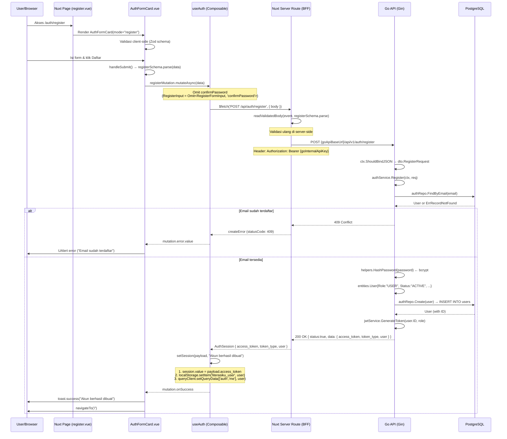
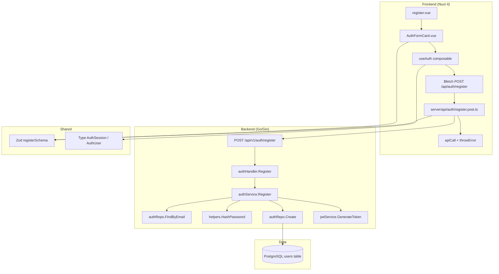

# Sequence: Registrasi User

Dokumen ini menjelaskan alur registrasi user baru di Literasiku secara end-to-end, mulai dari interaksi user di browser hingga penyimpanan data di database. Alur ini mencakup tiga lapisan: **Frontend (Nuxt 4)**, **Backend (Go/Gin)**, dan **koneksi BFF** di antara keduanya.

---

## 1. Flow Diagram



---

## 2. Alur Lengkap

### 2.1. Akses Halaman Register

**File:** `client/app/pages/auth/register.vue:1-10`

Halaman register adalah halaman publik tipis yang hanya merender `AuthPageShell` (dekoratif) dan `AuthFormCard` dengan mode `"register"`. Tidak ada middleware protection untuk route ini — middleware global di `auth.global.ts` hanya melindungi `/dashboard/*` dan `/admin/*`.

```vue
<AuthPageShell>
  <AuthFormCard mode="register" />
</AuthPageShell>
```

### 2.2. Render Form

**File:** `client/app/components/auth/AuthFormCard.vue:1-183`

Ketika `mode === 'register'`, form menampilkan 5 field:

| Field | Type | Label | Validasi (Zod) |
|---|---|---|---|
| `full_name` | text | Nama lengkap | min(1), max(100) |
| `username` | text | Username | min(3), max(50) |
| `email` | email | Email | valid email, max(100) |
| `password` | password | Kata sandi | min(8), max(72) |
| `confirmPassword` | password | Konfirmasi Kata Sandi | min(8), max(72), must match password |

Komponen menggunakan `UAuthForm` dari Nuxt UI yang secara otomatis mengintegrasikan validasi Zod.

### 2.3. Validasi Client-side

**File:** `client/shared/schemas/auth.schema.ts:12-42`

```ts
export const registerSchema = z.object({
  username: z.string().min(3).max(50),
  full_name: z.string().min(1).max(100),
  email: z.string().email().max(100),
  password: z.string().min(8).max(72),
  confirmPassword: z.string().min(8).max(72)
}).refine((data) => data.password === data.confirmPassword, {
  message: 'Konfirmasi password tidak sama',
  path: ['confirmPassword']
})

export type RegisterInput = Omit<RegisterFormInput, 'confirmPassword'>
```

Poin penting: `confirmPassword` di-*strip* secara type-level via `Omit`. Schema yang sama digunakan di server-side untuk validasi ulang.

### 2.4. Submit & Mutation

**File:** `client/app/components/auth/AuthFormCard.vue:119-127`

```ts
const handleSubmit = async (event: { data: LoginInput | RegisterFormInput }) => {
  await registerMutation.mutateAsync(event.data as RegisterFormInput)
  await navigateTo('/')
}
```

**File:** `client/app/composables/useAuth.ts:52-58`

Mutation memanggil server route Nuxt via `$fetch`:

```ts
const registerMutation = useMutation({
  mutationFn: (input: RegisterInput) =>
    $fetch<AuthSession>('/api/auth/register', {
      method: 'POST',
      body: input
    }),
  onSuccess: payload => setSession(payload, 'Akun berhasil dibuat')
})
```

### 2.5. Server Route (BFF Proxy)

**File:** `client/server/api/auth/register.post.ts:1-25`

Nuxt Nitro server route bertindak sebagai **BFF (Backend for Frontend)**: menerima request dari client, mem-validasi ulang, dan memproxynya ke Go API.

```ts
export default defineEventHandler(async (event): Promise<AuthSession> => {
  const body = await readValidatedBody(event, registerSchema.parse)
  const config = useRuntimeConfig(event)

  const [error, res] = await apiCall(
    $fetch<ApiResponse<AuthSession>>(`${config.goApiBaseUrl}/api/v1/auth/register`, {
      method: 'POST',
      body: body,
      headers: {
        'Authorization': `Bearer ${config.goInternalApiKey}`,
        'Content-Type': 'application/json'
      }
    })
  )
  if (error) throwError(error)
  return res?.data!
})
```

**Poin arsitektural:**
- `readValidatedBody` memvalidasi body request dengan schema Zod yang sama (shared schema).
- `goApiBaseUrl` dikonfigurasi di `nuxt.config.ts`, default `http://localhost:8080`.
- `goInternalApiKey` adalah internal secret yang mencegah client langsung memanggil Go API.
- `apiCall` dan `throwError` dari `server/utils/apiCall.ts` menangani error dengan pola tuple safe-call, lalu melempar `createError` dengan status code dan message dari Go.

### 2.6. Go Handler (Transport Layer)

**File:** `server/modules/auth/handler/auth_handler.go:29-51`

```go
func (h *authHandler) Register(ctx *gin.Context) {
    var req dto.RegisterRequest
    if err := ctx.ShouldBindJSON(&req); err != nil {
        ctx.AbortWithStatusJSON(http.StatusBadRequest, utils.BuildResponseFailed(...))
        return
    }
    result, err := h.authService.Register(ctx.Request.Context(), req)
    if err != nil {
        status := http.StatusBadRequest
        switch {
        case errors.Is(err, dto.ErrEmailAlreadyExists):
            status = http.StatusConflict
        }
        ctx.JSON(status, utils.BuildResponseFailed(...))
        return
    }
    ctx.JSON(http.StatusOK, utils.BuildResponseSuccess("success register user", result))
}
```

Handler hanya bertanggung jawab untuk: bind JSON, delegasi ke service, mapping error ke HTTP status, dan mengembalikan response.

**Route registration** di `server/router/router.go:49`:
```go
auth.POST("/register", deps.AuthHandler.Register)  // no middleware — public
```

### 2.7. Go Service (Business Logic)

**File:** `server/modules/auth/service/auth_service.go:33-70`

Urutan logika bisnis registrasi:

1. **Cek duplikasi email** → `authRepo.FindByEmail(req.Email)`
   - Jika ditemukan, return `ErrEmailAlreadyExists` → handler mapping ke HTTP 409.
2. **Hash password** → `helpers.HashPassword(req.Password)` menggunakan bcrypt (`DefaultCost`).
3. **Buat entity User** dengan:
   - `Role: "USER"`, `Status: "ACTIVE"`, field dari request.
4. **Simpan ke database** → `authRepo.Create(user)` → GORM INSERT ke tabel `users`.
5. **Generate JWT** → `jwtService.GenerateToken(user.ID, user.Role)`.
6. **Return `TokenResponse`** → `{ access_token, token_type: "Bearer", user: {...} }`.

### 2.8. Go Repository (Data Access)

**File:** `server/modules/auth/repository/auth_repository.go:26-42`

```go
func (r *authRepository) FindByEmail(email string) (*entities.User, error) {
    var user entities.User
    if err := r.db.Where("email = ?", email).First(&user).Error; err != nil {
        if errors.Is(err, gorm.ErrRecordNotFound) {
            return nil, gorm.ErrRecordNotFound
        }
        return nil, err
    }
    return &user, nil
}

func (r *authRepository) Create(user *entities.User) error {
    return r.db.Create(user).Error
}
```

Operasi GORM langsung ke tabel `users` di PostgreSQL.

### 2.9. JWT Generation

**File:** `server/modules/auth/service/jwt_service.go:45-61`

```go
type jwtCustomClaim struct {
    UserID uint   `json:"user_id"`
    Role   string `json:"role"`
    jwt.RegisteredClaims
}

func (j *jwtService) GenerateToken(userID uint, role string) (string, error) {
    claims := jwtCustomClaim{
        UserID: userID,
        Role:   role,
        RegisteredClaims: jwt.RegisteredClaims{
            Issuer:   "literasiku",
            IssuedAt: jwt.NewNumericDate(time.Now()),
            // No explicit ExpiresAt — token tidak memiliki expiry
        },
    }
    token := jwt.NewWithClaims(jwt.SigningMethodHS256, claims)
    return token.SignedString([]byte(j.secretKey))
}
```

JWT menggunakan HS256 dengan claims: `user_id`, `role`, `iss`, `iat`. Secret key dari env `JWT_SECRET`, fallback `"literasiku-secret-key"`.

### 2.10. Set Session (Client-side)

**File:** `client/app/composables/useAuth.ts:32-42`

Setelah Go mengembalikan `AuthSession`, mutation `onSuccess` memanggil `setSession` yang melakukan tiga hal:

1. **Cookie**: `session.value = payload.access_token` — menulis ke Nuxt cookie `literasiku_session` (sameSite: lax).
2. **localStorage cache**: `localStorage.setItem('literasiku_user', JSON.stringify(payload.user))`.
3. **Vue Query cache**: `queryClient.setQueryData(['auth', 'me'], payload.user)` — langsung hydrate cache tanpa fetch ulang.

Kemudian user di-redirect ke `/` via `navigateTo('/')`.

---

## 3. Skema Database

**Tabel:** `users`

| Column | Type | Constraint | Default |
|---|---|---|---|
| `id` | uint | PK, auto-increment | |
| `role` | varchar(10) | CHECK IN ('ADMIN','USER') | 'USER' |
| `username` | varchar(50) | NOT NULL | |
| `password_hash` | varchar(255) | NOT NULL | |
| `full_name` | varchar(100) | NOT NULL | |
| `email` | varchar(100) | NOT NULL, UNIQUE INDEX | |
| `membership_number` | varchar(20) | UNIQUE INDEX | NULL |
| `identity_number` | varchar(30) | INDEX | NULL |
| `address` | text | | NULL |
| `phone_number` | varchar(20) | | NULL |
| `status` | varchar(10) | CHECK IN ('ACTIVE','INACTIVE','BLOCKED') | 'ACTIVE' |
| `created_at` | timestamptz | | auto |
| `updated_at` | timestamptz | | auto |

---

## 4. Error Handling

### 4.1. Server-side (Go → BFF → Client)

| Skenario | Go HTTP Status | Nuxt createError | Client UI |
|---|---|---|---|
| Body tidak valid (binding error) | 400 Bad Request | 400 | UAlert "failed to get data from body" |
| Email sudah terdaftar | 409 Conflict | 409 | UAlert "failed register user: email already exists" |
| Internal server error | 500 | 500 | UAlert "Gagal terhubung ke backend utama" |

### 4.2. Client-side (UI)

Error mutation diekstrak di `AuthFormCard.vue` via `mutationError` computed:

```ts
(error as any).data?.statusMessage ||
(error as any).data?.message ||
(error as any).message ||
'Terjadi kesalahan, silakan coba lagi.'
```

---

## 5. Response Envelope

Go API konsisten mengembalikan response envelope:

```json
{
  "status": true,
  "message": "success register user",
  "data": {
    "access_token": "eyJhbGciOiJIUzI1NiIsInR5cCI6IkpXVCJ9...",
    "token_type": "Bearer",
    "user": {
      "id": 1,
      "username": "johndoe",
      "full_name": "John Doe",
      "email": "johndoe@example.com",
      "role": "USER",
      "status": "ACTIVE",
      "created_at": "2026-07-02T10:00:00Z"
    }
  }
}
```

Nuxt BFF meng-extract `res.data` dan mengembalikan hanya `AuthSession` ke client, sehingga client menerima:

```ts
interface AuthSession {
  access_token: string;
  token_type: string;
  user: AuthUser;
}
```

---

## 6. Dependency Graph



---

## 7. File Reference

| Layer | File | Path (relatif terhadap repo root) |
|---|---|---|
| **Frontend Page** | register.vue | `client/app/pages/auth/register.vue` |
| **Form Component** | AuthFormCard.vue | `client/app/components/auth/AuthFormCard.vue` |
| **Shell Component** | AuthPageShell.vue | `client/app/components/auth/AuthPageShell.vue` |
| **Auth Composable** | useAuth.ts | `client/app/composables/useAuth.ts` |
| **Zod Schema** | auth.schema.ts | `client/shared/schemas/auth.schema.ts` |
| **Auth Types** | auth.ts | `client/shared/types/auth.ts` |
| **Server Route (BFF)** | register.post.ts | `client/server/api/auth/register.post.ts` |
| **Server Utils** | apiCall.ts | `client/server/utils/apiCall.ts` |
| **Nuxt Config** | nuxt.config.ts | `client/nuxt.config.ts` |
| **Auth Middleware** | auth.global.ts | `client/app/middleware/auth.global.ts` |
| **Go Handler** | auth_handler.go | `server/modules/auth/handler/auth_handler.go` |
| **Go Service** | auth_service.go | `server/modules/auth/service/auth_service.go` |
| **JWT Service** | jwt_service.go | `server/modules/auth/service/jwt_service.go` |
| **Go Repository** | auth_repository.go | `server/modules/auth/repository/auth_repository.go` |
| **Auth DTO** | auth_dto.go | `server/modules/auth/dto/auth_dto.go` |
| **User Entity** | user.go | `server/database/entities/user.go` |
| **Common Entity** | common.go | `server/database/entities/common.go` |
| **Router** | router.go | `server/router/router.go` |
| **Main Entry** | main.go | `server/cmd/main.go` |
| **Go CORS** | cors.go | `server/middlewares/cors.go` |
| **Go Auth Middleware** | authentication.go | `server/middlewares/authentication.go` |
| **Password Helper** | password.go | `server/pkg/helpers/password.go` |
| **Response Utils** | response.go | `server/pkg/utils/response.go` |
| **Database Config** | config.go / database.go | `server/database/config/` |
| **Migration** | migration.go | `server/database/migration.go` |

---

## 8. Catatan Arsitektur

1. **BFF Pattern**: Client tidak pernah langsung memanggil Go API. Semua request melewati Nuxt server routes yang berfungsi sebagai proxy. Ini menyembunyikan URL backend dan memungkinkan penambahan logika server-side tanpa mengubah client.

2. **Internal API Key**: Komunikasi BFF → Go API menggunakan `goInternalApiKey` sebagai Bearer token. Ini mencegah akses publik langsung ke Go API dan memungkinkan identifikasi bahwa request berasal dari BFF yang sah.

3. **Dual Validation**: Request divalidasi dua kali — client-side oleh Zod di `AuthFormCard.vue` (UX instant feedback) dan server-side oleh Zod di `register.post.ts` (security). Go juga melakukan binding validation via Gin.

4. **Token Tanpa Expiry**: JWT yang di-generate tidak memiliki `ExpiresAt`. Ini adalah keputusan arsitektural yang perlu dipertimbangkan untuk production — sebaiknya menambahkan expiry dan refresh token mechanism.

5. **Session Storage**: Token JWT disimpan di cookie (`literasiku_session`) dengan `sameSite: 'lax'`. Data user di-cache di localStorage dan Vue Query cache untuk menghindari fetch ulang di setiap page load.

6. **No Username Uniqueness Check**: Service hanya memeriksa duplikasi email, bukan username. Tabel `users` memiliki unique index di email, tetapi tidak ada constraint unique di kolom `username`.
