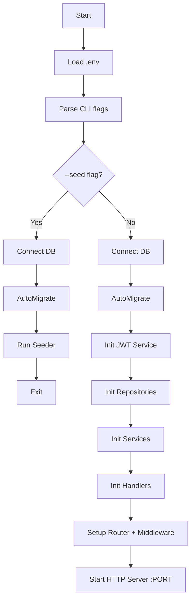
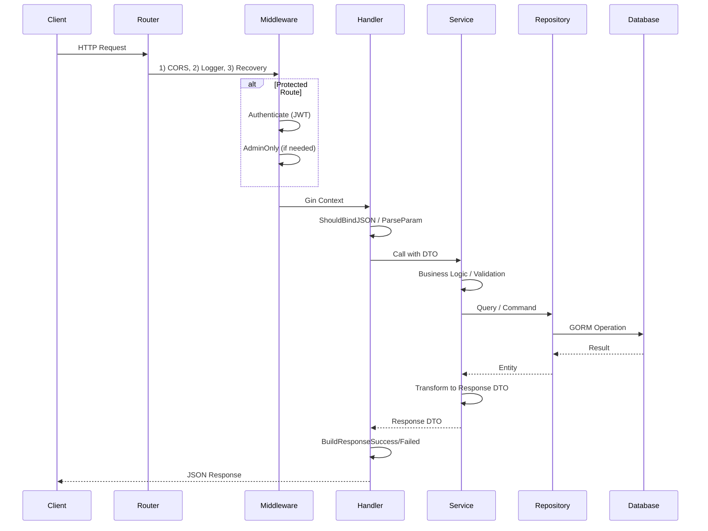

# Analisis Codebase Backend Go Gin — Literasiku

---

# 1 Executive Summary

**Literasiku** adalah sistem manajemen perpustakaan berbasis API REST yang melayani peminjaman buku fisik dan digital. Project ini dibangun menggunakan Go dengan Gin Framework sebagai HTTP router, GORM sebagai ORM, dan PostgreSQL sebagai database.

**Fungsi Utama:**
- Manajemen pengguna (user) dengan role ADMIN dan USER
- Manajemen buku, kategori buku, dan file digital (PDF)
- Peminjaman buku fisik dengan sistem denda keterlambatan
- Peminjaman buku digital dengan akses terbatas waktu
- Otentikasi JWT dan otorisasi berbasis role (RBAC)

**Domain Bisnis:** Perpustakaan digital dan fisik (library management system)

**Teknologi Utama:**
- Go 1.25, Gin v1.10.1, GORM v1.31.1, PostgreSQL, JWT (HS256), bcrypt, godotenv

**Jumlah Module:** 8 module bisnis (auth, book, category, file, digital_loan, physical_loan, user, health)

**Tingkat Kompleksitas:** Medium — arsitektur modular dengan pola Handler → Service → Repository, namun belum diterapkan secara konsisten di semua module.

**Arsitektur:** Monolitik REST API dengan pola layered architecture (Handler → Service → Repository), mendukung deployment di Vercel Serverless dan dedicated server.

---

# 2 Struktur Project

```
server/
│
├── api/
│   └── index.go                    # Entry point untuk Vercel Serverless
│
├── cmd/
│   ├── main.go                     # Entry point untuk server standalone
│   └── seed/
│       └── main.go                 # CLI seeder
│
├── database/
│   ├── config/
│   │   ├── config.go               # Load konfigurasi dari env
│   │   ├── database.go             # Koneksi & pooling PostgreSQL
│   │   └── email.go                # Kosong (placeholder)
│   ├── entities/
│   │   ├── common.go               # Embed struct Timestamp & Authorization
│   │   ├── user.go                 # Model User
│   │   ├── book.go                 # Model Book
│   │   ├── book_category.go        # Model BookCategory
│   │   ├── file.go                 # Model File
│   │   ├── physical_loan.go        # Model PhysicalLoan
│   │   ├── digital_loan.go         # Model DigitalLoan
│   │   └── chat_history.go         # Model ChatHistory
│   ├── migration.go                # AutoMigrate + foreign keys manual
│   ├── seeder.go                   # Orchestrator seeder
│   └── seeders/
│       ├── json/                   # Data seed dalam JSON
│       └── seeds/                  # Logic seeder per entity
│
├── middlewares/
│   ├── authentication.go           # JWT Bearer token validation
│   ├── cors.go                     # CORS middleware
│   └── rbac.go                     # Role-based access (AdminOnly)
│
├── modules/
│   ├── auth/                       # Register, Login, Logout
│   ├── book/                       # CRUD buku
│   ├── category/                   # CRUD kategori
│   ├── file/                       # CRUD file digital
│   ├── health/                     # Health check endpoint
│   ├── physical_loan/              # Peminjaman buku fisik
│   ├── digital_loan/               # Peminjaman buku digital
│   └── user/                       # Manajemen user
│
├── pkg/
│   ├── helpers/
│   │   └── password.go             # bcrypt hash & verify
│   └── utils/
│       └── response.go             # Standard API response builder
│
├── router/
│   └── router.go                   # Definisi seluruh routing
│
├── Dockerfile                      # Multi-stage build (golang:1.25-alpine → scratch)
├── go.mod / go.sum                 # Module & dependency
├── vercel.json                     # Konfigurasi Vercel Serverless
├── .env / .env.example             # Environment variables
├── .air.toml                       # Air live-reload configuration
└── README.md
```

**Fungsi setiap folder:**
- `api/` — Entry point untuk Vercel Serverless (package `handler` dengan fungsi `Handler(w, r)`)
- `cmd/` — Entry point aplikasi standalone dan CLI seeder
- `database/` — Koneksi database, migrasi, entity model, dan seeder
- `middlewares/` — Middleware Gin (auth JWT, CORS, RBAC)
- `modules/` — Business logic per domain (handler, service, repository, dto)
- `pkg/` — Shared utilities (response builder, password helper)
- `router/` — Routing definition dengan dependency injection

---

# 3 Dependency Analysis

```
module github.com/literasiKu
go 1.25
```

| Dependency | Version | Fungsi | Cara Pakai |
|---|---|---|---|
| `github.com/gin-gonic/gin` | v1.10.1 | HTTP framework | Router, middleware, request binding, response JSON |
| `gorm.io/gorm` | v1.31.1 | ORM | Semua operasi database via repository |
| `gorm.io/driver/postgres` | v1.6.0 | Driver PostgreSQL untuk GORM | Koneksi database di `database/config/database.go` |
| `github.com/golang-jwt/jwt/v5` | v5.3.1 | JWT generation & validation | `modules/auth/service/jwt_service.go` — HS256 signing |
| `github.com/joho/godotenv` | v1.5.1 | Load .env file | `database/config/config.go` — loadEnv() |
| `golang.org/x/crypto` | v0.53.0 | bcrypt password hashing | `pkg/helpers/password.go` — HashPassword & CheckPassword |
| `github.com/go-playground/validator/v10` | v10.20.0 | Struct validation (indirect via Gin) | Binding tags di DTO (`required`, `email`, `min`, `max`, dll) |

**Catatan:** Tidak ada dependency untuk structured logging (zap/logrus), Redis, rate limiter, atau task queue. Project hanya bergantung pada standard library `log`.

---

# 4 Application Entry Point

## Entry Point Standalone: `cmd/main.go`

```go
func main() {
    seedFlag := flag.Bool("seed", false, "Run database seeder")
    flag.Parse()

    cfg := config.LoadConfig()
    config.Connect(cfg)
    database.AutoMigrate()
    db := config.GetDB()

    if *seedFlag {
        database.Seeder(db)
        return
    }

    // Dependency Injection manual
    jwtService := authservice.NewJWTService()
    authRepo := authrepo.NewAuthRepository(db)
    authSvc := authservice.NewAuthService(authRepo, jwtService)
    authHandler := handler.NewAuthHandler(authSvc)
    // ... semua module di-inject manual

    app := router.New(router.Deps{...})
    app.Run(":" + cfg.Port)
}
```

## Entry Point Vercel: `api/index.go`

```go
func init() {
    gin.SetMode(gin.ReleaseMode)
    cfg := config.LoadConfig()
    config.Connect(cfg)
    database.AutoMigrate()
    // ... dependency injection sama seperti cmd/main.go
    engine = router.New(router.Deps{...})
}

func Handler(w http.ResponseWriter, r *http.Request) {
    if initErr != nil {
        // return 503
    }
    engine.ServeHTTP(w, r)
}
```

## Flow Diagram



**Masalah:** Duplikasi inisialisasi antara `cmd/main.go` dan `api/index.go`. Perubahan dependency harus diubah di dua tempat.

---

# 5 Configuration

## Sumber Konfigurasi

| Variable | Default | Deskripsi |
|---|---|---|
| `PORT` | `8080` | Port server |
| `APP_ENV` | `development` | Environment mode |
| `DATABASE_URL` | - | Full DSN PostgreSQL (prioritas utama) |
| `DB_HOST` | `localhost` | Host database |
| `DB_PORT` | `5432` | Port database |
| `DB_USER` | `postgres` | User database |
| `DB_PASSWORD` | `` | Password database |
| `DB_NAME` | `literasiku_db` | Nama database |
| `DB_SSLMODE` | `disable` | SSL mode |
| `DB_TIMEZONE` | `Asia/Jakarta` | Timezone |
| `JWT_SECRET` | `literasiku-secret-key` | Secret key JWT (hardcoded fallback!) |
| `FINE_RATE_PER_DAY` | `1000` | Denda per hari keterlambatan |

## Loading Strategy

`config.LoadConfig()` mencari file `.env` secara bertahap:
1. `cwd/.env`
2. `cwd/../.env`
3. `cwd/../../.env`
4. `configDir/../../.env` (relative ke source file)
5. `configDir/../../../.env`

**Masalah:** JWT_SECRET memiliki fallback hardcoded `"literasiku-secret-key"` yang merupakan **critical security issue**.

---

# 6 Routing

| Method | Endpoint | Module | Middleware | Handler |
|---|---|---|---|---|
| GET | `/` | - | - | Root message |
| GET | `/api/v1/health` | health | - | `healthhandler.Health` |
| POST | `/api/v1/auth/register` | auth | - | `AuthHandler.Register` |
| POST | `/api/v1/auth/login` | auth | - | `AuthHandler.Login` |
| POST | `/api/v1/auth/logout` | auth | Authenticate | `AuthHandler.Logout` |
| GET | `/api/v1/books` | book | - | `BookHandler.GetAll` |
| GET | `/api/v1/books/:id` | book | - | `BookHandler.GetByID` |
| POST | `/api/v1/books` | book | Authenticate + AdminOnly | `BookHandler.Create` |
| PATCH | `/api/v1/books/:id` | book | Authenticate + AdminOnly | `BookHandler.Update` |
| DELETE | `/api/v1/books/:id` | book | Authenticate + AdminOnly | `BookHandler.Delete` |
| GET | `/api/v1/categories` | category | - | `CategoryHandler.GetAll` |
| GET | `/api/v1/categories/:id` | category | - | `CategoryHandler.GetByID` |
| POST | `/api/v1/categories` | category | Authenticate + AdminOnly | `CategoryHandler.Create` |
| PATCH | `/api/v1/categories/:id` | category | Authenticate + AdminOnly | `CategoryHandler.Update` |
| DELETE | `/api/v1/categories/:id` | category | Authenticate + AdminOnly | `CategoryHandler.Delete` |
| GET | `/api/v1/files/book/:book_id` | file | Authenticate | `FileHandler.GetByBookID` |
| GET | `/api/v1/files/:id` | file | Authenticate | `FileHandler.GetByID` |
| POST | `/api/v1/files` | file | Authenticate + AdminOnly | `FileHandler.Create` |
| PATCH | `/api/v1/files/:id` | file | Authenticate + AdminOnly | `FileHandler.Update` |
| DELETE | `/api/v1/files/:id` | file | Authenticate + AdminOnly | `FileHandler.Delete` |
| GET | `/api/v1/users/me` | user | Authenticate | `UserHandler.Me` |
| PATCH | `/api/v1/users/me` | user | Authenticate | `UserHandler.UpdateMe` |
| GET | `/api/v1/users` | user | Authenticate + AdminOnly | `UserHandler.GetAll` |
| GET | `/api/v1/users/:id` | user | Authenticate + AdminOnly | `UserHandler.GetByID` |
| PATCH | `/api/v1/users/:id` | user | Authenticate + AdminOnly | `UserHandler.Update` |
| DELETE | `/api/v1/users/:id` | user | Authenticate + AdminOnly | `UserHandler.Delete` |
| POST | `/api/v1/loans/physical` | physical_loan | Authenticate | `PhysicalLoanHandler.Borrow` |
| GET | `/api/v1/loans/physical/my` | physical_loan | Authenticate | `PhysicalLoanHandler.GetMyLoans` |
| GET | `/api/v1/loans/physical/:id` | physical_loan | Authenticate | `PhysicalLoanHandler.GetByID` |
| GET | `/api/v1/loans/physical` | physical_loan | Authenticate + AdminOnly | `PhysicalLoanHandler.GetAll` |
| PATCH | `/api/v1/loans/physical/:id/return` | physical_loan | Authenticate + AdminOnly | `PhysicalLoanHandler.Return` |
| PATCH | `/api/v1/loans/physical/:id/pay-fine` | physical_loan | Authenticate + AdminOnly | `PhysicalLoanHandler.PayFine` |
| POST | `/api/v1/loans/digital` | digital_loan | Authenticate | `DigitalLoanHandler.Borrow` |
| GET | `/api/v1/loans/digital/my` | digital_loan | Authenticate | `DigitalLoanHandler.GetMyLoans` |
| GET | `/api/v1/loans/digital/:id` | digital_loan | Authenticate | `DigitalLoanHandler.GetByID` |
| GET | `/api/v1/loans/digital/access/:book_id` | digital_loan | Authenticate | `DigitalLoanHandler.CheckAccess` |
| GET | `/api/v1/loans/digital` | digital_loan | Authenticate + AdminOnly | `DigitalLoanHandler.GetAll` |
| PATCH | `/api/v1/loans/digital/:id/revoke` | digital_loan | Authenticate + AdminOnly | `DigitalLoanHandler.Revoke` |

---

# 7 Middleware Analysis

## 7.1 CORS Middleware

**File:** `middlewares/cors.go`

```go
func CORSMiddleware() gin.HandlerFunc {
    return func(c *gin.Context) {
        c.Header("Access-Control-Allow-Origin", "*")
        c.Header("Access-Control-Allow-Credentials", "true")
        // ... headers
        if c.Request.Method == http.MethodOptions {
            c.AbortWithStatus(204)
            return
        }
        c.Next()
    }
}
```

**Flow:**
```
Client → CORS Headers → OPTIONS? → Abort 204 → Next()
```

**Masalah:** `Access-Control-Allow-Origin: "*"` bersama `Access-Control-Allow-Credentials: "true"` adalah konfigurasi yang tidak valid menurut spesifikasi CORS (wildcard origin tidak bisa digunakan dengan credentials).

## 7.2 Authentication Middleware

**File:** `middlewares/authentication.go`

```go
func Authenticate(jwtService service.JWTService) gin.HandlerFunc {
    return func(ctx *gin.Context) {
        // 1. Get Authorization header
        // 2. Check "Bearer " prefix
        // 3. Validate token
        // 4. Extract user_id & role
        // 5. Set context: token, user_id, role
        ctx.Next()
    }
}
```

**Flow:**
```
Request → Authorization Header → Empty? → 401
         → No Bearer prefix? → 401
         → Token invalid? → 401
         → Set user_id, role, token di context → Next()
```

## 7.3 RBAC Middleware

**File:** `middlewares/rbac.go`

```go
func AdminOnly() gin.HandlerFunc {
    return func(ctx *gin.Context) {
        if ctx.GetString("role") != "ADMIN" {
            ctx.AbortWithStatusJSON(http.StatusForbidden, ...)
            return
        }
        ctx.Next()
    }
}
```

**Flow:**
```
Request → role == "ADMIN"? → No → 403 Forbidden
                            → Yes → Next()
```

**Masalah:** RBAC hanya mendukung 2 role (`ADMIN`/`USER`), tidak ada hierarki atau permission granular.

---

# 8 Database Analysis

## Engine & Driver
- **Database:** PostgreSQL
- **Driver:** `gorm.io/driver/postgres` v1.6.0
- **Connection:** Global variable `var DB *gorm.DB` di `database/config/database.go`

## Connection Pooling

```go
sqlDB.SetMaxIdleConns(2)
sqlDB.SetMaxOpenConns(5)
sqlDB.SetConnMaxLifetime(5 * time.Minute)
```

**Masalah:** Pool size terlalu kecil (max 5 open connections). Untuk production dengan traffic sedang, ini bisa menjadi bottleneck.

## Migration Strategy

**File:** `database/migration.go`

Menggunakan `db.AutoMigrate()` untuk 7 entity:
- User, BookCategory, Book, File, PhysicalLoan, DigitalLoan, ChatHistory

Foreign key constraints ditambahkan **manual** via ALTER TABLE setelah AutoMigrate, karena GORM `DisableForeignKeyConstraintWhenMigrating: true`.

**Foreign Keys:**
| Table | FK | Reference |
|---|---|---|
| books | category_id → book_categories(id) | ON UPDATE CASCADE, ON DELETE RESTRICT |
| files | book_id → books(id) | ON UPDATE CASCADE, ON DELETE RESTRICT |
| physical_loans | user_id → users(id) | ON UPDATE CASCADE, ON DELETE RESTRICT |
| physical_loans | book_id → books(id) | ON UPDATE CASCADE, ON DELETE RESTRICT |
| digital_loans | user_id → users(id) | ON UPDATE CASCADE, ON DELETE RESTRICT |
| digital_loans | book_id → books(id) | ON UPDATE CASCADE, ON DELETE RESTRICT |
| chat_histories | user_id → users(id) | ON UPDATE CASCADE, ON DELETE RESTRICT |
| chat_histories | digital_loan_id → digital_loans(id) | ON UPDATE CASCADE, ON DELETE SET NULL |

## Entity Relationships

```
User (1) ──< (N) PhysicalLoan
User (1) ──< (N) DigitalLoan
User (1) ──< (N) ChatHistory

BookCategory (1) ──< (N) Book
Book (1) ──< (N) File
Book (1) ──< (N) PhysicalLoan
Book (1) ──< (N) DigitalLoan

DigitalLoan (1) ──< (N) ChatHistory
```

## Seeder

Seeder membaca data dari file JSON di `database/seeders/json/` untuk mengisi data awal: 4 kategori, 3 user (1 admin + 2 user biasa), 8 buku, 4 file PDF.

**Masalah:** Password di file seed JSON dalam bentuk plaintext (`"rahasia123"`). Meskipun di-hash saat seeding, file JSON seharusnya tidak boleh masuk ke repository.

---

# 9 Module Analysis

## 9.1 Auth Module

**Tujuan:** Registrasi, login, dan logout user.

**Struktur:**
```
auth/
├── dto/auth_dto.go
├── handler/auth_handler.go
├── service/auth_service.go
├── service/jwt_service.go
└── repository/auth_repository.go
```

**DTO:**
- `RegisterRequest` — username, password, full_name, email
- `LoginRequest` — email, password
- `TokenResponse` — access_token, token_type, user
- `UserResponse` — id, username, full_name, email, role, status, dll

**Entity:** `entities.User`

**Repository Methods:**
- `Create(user)` — Insert user
- `FindByEmail(email)` — Cari user by email
- `FindByID(id)` — Cari user by ID

**Service Logic:**
- **Register:** Cek email unik → hash password → create user → generate JWT → return token
- **Login:** Find by email → check password → check status (BLOCKED/INACTIVE) → generate JWT → return token
- **Logout:** Validasi user exists (tidak ada blacklist/invalidation token)

**Handler Endpoints:**
- `POST /api/v1/auth/register` → 200/400/409
- `POST /api/v1/auth/login` → 200/401/403
- `POST /api/v1/auth/logout` (Authenticate) → 200/400/401

**Sequence Diagram Register:**
```
Client → POST /auth/register
  → Handler.Register
    → Bind JSON to RegisterRequest
    → Service.Register
      → Repository.FindByEmail (cek duplicate)
      → helpers.HashPassword (bcrypt)
      → Repository.Create (insert user)
      → JWTService.GenerateToken
    ← TokenResponse
  ← 200 JSON
```

**Critical Issue:** Token JWT tidak memiliki expiry (`RegisteredClaims` hanya berisi `Issuer` dan `IssuedAt`, tanpa `ExpiresAt`).

## 9.2 Book Module

**Tujuan:** CRUD buku dengan kategori.

**Struktur:**
```
book/
├── dto/book_dto.go
├── handler/book_handler.go
├── service/book_service.go
└── repository/book_repository.go
```

**DTO:**
- `BookRequest` — title, author, publisher, year_published, isbn, category_id, physical_stock, dll
- `BookResponse` — Semua field buku + timestamp
- `PaginatedResponse` — data, page, limit, total, total_pages

**Repository Methods:**
- `Create`, `FindByID`, `FindAll` (dengan search + filter category + pagination), `Update`, `Delete`, `ExistsByISBN`

**Service Logic:**
- Validasi category exists
- Validasi ISBN unik (jika diisi)
- Pagination dengan limit max 100

**Handler:** 5 endpoint CRUD standar.

## 9.3 Category Module

**Tujuan:** CRUD kategori buku.

**Struktur:** Sama seperti Book (handler, service, repository, dto)

**Unique validation:** Nama kategori harus unik.

## 9.4 File Module

**Tujuan:** Manajemen file digital (PDF) per buku.

**Repository Methods:** `Create`, `FindByID`, `FindByBookID`, `Update`, `Delete`

**Unique:** Tidak ada validasi duplikasi file name per book.

## 9.5 Physical Loan Module

**Tujuan:** Peminjaman buku fisik dengan sistem denda.

**Flow Borrow:**
1. Validasi book exists & available
2. Validasi user tidak punya active loan
3. Create loan dengan status BORROWED
4. Kurangi stock buku

**Flow Return:**
1. Validasi loan exists & belum dikembalikan
2. Hitung denda jika terlambat (FINE_RATE_PER_DAY)
3. Tambah stock buku kembali

**Flow PayFine:** Set FineStatus dari UNPAID menjadi PAID.

**Masalah:**
- Tidak ada validasi ownership — user bisa return/pay fine untuk loan orang lain (hanya dibatasi karena endpoint return/pay-fine adalah admin-only)
- Hitung overdue menggunakan `math.Ceil` — bisa kurang akurat

## 9.6 Digital Loan Module

**Tujuan:** Peminjaman buku digital dengan akses terbatas waktu.

**Flow Borrow:**
1. Validasi book exists & `IsDigitalAvailable`
2. Validasi PDF exists (via FileRepository)
3. Validasi tidak ada active loan untuk book yang sama
4. Create loan dengan `AccessStatus: "ACTIVE"` dan `EndDate` = now + dueDays (default 7)

**Flow CheckAccess:**
1. Cari active loan by user & book
2. Jika `EndDate` sudah lewat → set status EXPIRED → return false
3. Return true jika masih dalam periode

**Masalah:** Tidak ada mekanisme scheduled job untuk auto-expire loan yang kadaluarsa.

## 9.7 User Module

**Tujuan:** Manajemen profil user oleh admin, dan self-profile oleh user.

**Unik:**
- `UpdateMe()` — Set `req.Status = ""` untuk mencegah user mengganti status sendiri (hardcoded)
- `Me()` — Get profile by `user_id` dari token

## 9.8 Health Module

**Sederhana:** Ping database, return status connected/disconnected.

---

# 10 API Documentation

## Health

```
GET /api/v1/health
Response 200: {"status":"ok","service":"literasiku-server","database":"connected"}
Response 503: {"status":"error","service":"literasiku-server","database":"disconnected"}
```

## Auth

### Register
```
POST /api/v1/auth/register
Body: {"username":"budi","password":"rahasia123","full_name":"Budi","email":"budi@test.com"}
Response 200: {"status":true,"message":"success register user","data":{"access_token":"...","token_type":"Bearer","user":{...}}}
Response 400: {"status":false,"message":"failed register user","error":"..."}
Response 409: {"status":false,"message":"failed register user","error":"email already exists"}
```

### Login
```
POST /api/v1/auth/login
Body: {"email":"budi@test.com","password":"rahasia123"}
Response 200: {"status":true,"message":"success login","data":{"access_token":"...","token_type":"Bearer","user":{...}}}
Response 401: invalid credentials
Response 403: user blocked/inactive
```

### Logout
```
POST /api/v1/auth/logout
Header: Authorization: Bearer <token>
Response 200: {"status":true,"message":"success logout","data":null}
```

## Books
```
GET    /api/v1/books?page=1&limit=10&search=go&category_id=1
GET    /api/v1/books/:id
POST   /api/v1/books          [Admin]
PATCH  /api/v1/books/:id      [Admin]
DELETE /api/v1/books/:id      [Admin]
```

## Categories
```
GET    /api/v1/categories?page=1&limit=10&search=teknologi
GET    /api/v1/categories/:id
POST   /api/v1/categories     [Admin]
PATCH  /api/v1/categories/:id [Admin]
DELETE /api/v1/categories/:id [Admin]
```

## Files
```
GET    /api/v1/files/book/:book_id  [Auth]
GET    /api/v1/files/:id            [Auth]
POST   /api/v1/files                [Admin]
PATCH  /api/v1/files/:id            [Admin]
DELETE /api/v1/files/:id            [Admin]
```

## Users
```
GET    /api/v1/users/me        [Auth]
PATCH  /api/v1/users/me        [Auth]
GET    /api/v1/users           [Admin]
GET    /api/v1/users/:id       [Admin]
PATCH  /api/v1/users/:id       [Admin]
DELETE /api/v1/users/:id       [Admin]
```

## Physical Loans
```
POST   /api/v1/loans/physical           [Auth]
GET    /api/v1/loans/physical/my         [Auth]
GET    /api/v1/loans/physical/:id        [Auth]
GET    /api/v1/loans/physical            [Admin]
PATCH  /api/v1/loans/physical/:id/return [Admin]
PATCH  /api/v1/loans/physical/:id/pay-fine [Admin]
```

## Digital Loans
```
POST   /api/v1/loans/digital                    [Auth]
GET    /api/v1/loans/digital/my                  [Auth]
GET    /api/v1/loans/digital/:id                 [Auth]
GET    /api/v1/loans/digital/access/:book_id     [Auth]
GET    /api/v1/loans/digital                     [Admin]
PATCH  /api/v1/loans/digital/:id/revoke          [Admin]
```

---

# 11 DTO Analysis

| Module | Request DTO | Validation Rules |
|---|---|---|
| Auth | `RegisterRequest` | username(3-50), password(8-72), full_name(1-100), email |
| Auth | `LoginRequest` | email, password(8-72) |
| Book | `BookRequest` | title(1-255), author(1-100), publisher(max100), year(1000-2100), isbn(max20), category_id(required), physical_stock(min0), status(oneof) |
| Category | `CategoryRequest` | name(1-50) |
| File | `FileRequest` | book_id(required), file_path(required,max500), file_name(required,max255), file_size(min0), upload_date(required), status(oneof) |
| Digital Loan | `CreateDigitalLoanRequest` | book_id(required), due_days(1-30,omitempty) |
| Physical Loan | `CreateLoanRequest` | book_id(required), due_days(1-60,omitempty) |
| Physical Loan | `ReturnLoanRequest` | return_date(omitempty) |
| User | `UpdateUserRequest` | full_name(1-100), username(1-50), email, phone(max20), status(oneof) — semua optional |

**Response DTO** semuanya menggunakan tag `json` dengan `omitempty` untuk field opsional.

**Masalah:** 
- `FileRequest.UploadDate` bertipe `string` dengan format `"2006-01-02"`. Parsing dilakukan manual di service, seharusnya bisa menggunakan custom validator.
- `RegisterRequest` tidak memiliki validasi `Username` unik di DTO (hanya email yang dicek).

---

# 12 Model Analysis

| Entity | Table | PK | Unique | Indexes | Check Constraints |
|---|---|---|---|---|---|
| User | users | id | email, membership_number | identity_number | role IN ('ADMIN','USER'); status IN ('ACTIVE','INACTIVE','BLOCKED') |
| Book | books | id | isbn | category_id, title, author | status IN ('ACTIVE','INACTIVE','DAMAGED','LOST') |
| BookCategory | book_categories | id | name | - | - |
| File | files | id | - | book_id | status IN ('ACTIVE','INACTIVE') |
| PhysicalLoan | physical_loans | id | - | user_id, book_id | status IN ('BORROWED','RETURNED','OVERDUE','LOST'); fine_status IN ('NONE','UNPAID','PAID') |
| DigitalLoan | digital_loans | id | - | user_id, book_id | access_status IN ('ACTIVE','EXPIRED','REVOKED') |
| ChatHistory | chat_histories | id | - | user_id, digital_loan_id | - |

**Embedded Struct:**
- `Timestamp` — CreatedAt, UpdatedAt (type: `timestamp with time zone`)

**Common Embed:**
```go
type Authorization struct {
    Token string `json:"token" binding:"required"`
    Role  string `json:"role" binding:"required,oneof=user admin"`
}
```
Struktur `Authorization` ada di `entities/common.go` tetapi **tidak digunakan** di kode manapun.

---

# 13 Repository Analysis

Semua repository mengikuti pola yang seragam:

| Method | Pattern | Transaction |
|---|---|---|
| Create | `db.Create(model)` | Tidak ada |
| FindByID | `db.First(&model, id)` | Tidak ada |
| FindAll | `db.Model().Where().Count().Offset().Limit().Order().Find()` | Tidak ada |
| Update | `db.Save(model)` | Tidak ada |
| Delete | `db.Delete(&model{}, id)` | Tidak ada |

**Filtering:**
- Search menggunakan `ILIKE` (PostgreSQL case-insensitive)
- Filter berdasarkan `category_id`, `status`, `role`
- Pagination dengan `Offset` + `Limit`

**Masalah:**
- Tidak ada `Preload` pada BookRepository.FindByID — relasi Category tidak di-load
- Tidak ada transaction pada operasi yang membutuhkan atomicity (misal: Borrow → kurangi stock harus dalam satu transaksi)
- `db.Save(model)` akan menyimpan SEMUA field termasuk zero value. Untuk update partial, ini bisa menghapus data yang tidak sengaja di-set ke zero value
- Tidak ada context propagation ke GORM (`db.WithContext(ctx)`)

---

# 14 Service Layer Analysis

**Pola Umum:**
1. Validasi input
2. Panggil repository
3. Transformasi data
4. Return DTO response

**Dependency antar service:**
- BookService → BookRepository, CategoryRepository
- FileService → FileRepository, BookRepository
- PhysicalLoanService → PhysicalLoanRepository, BookRepository
- DigitalLoanService → DigitalLoanRepository, BookRepository, FileRepository
- AuthService → AuthRepository, JWTService
- CategoryService → CategoryRepository (standalone)
- UserService → UserRepository (standalone)

**Masalah:**
- Tidak ada transaction management — jika `Borrow` berhasil create loan tetapi gagal update stock, data inkonsisten
- Error wrapping tidak konsisten — beberapa menggunakan `fmt.Errorf`, beberapa langsung return error dari repository
- Context (`ctx context.Context`) diterima di parameter service tetapi tidak digunakan di repository layer

---

# 15 Error Handling

## Response Format

```go
type Response struct {
    Status  bool   `json:"status"`
    Message string `json:"message"`
    Error   any    `json:"error,omitempty"`
    Data    any    `json:"data,omitempty"`
    Meta    any    `json:"meta,omitempty"`
}
```

**Success:** `{"status": true, "message": "...", "data": ...}`
**Failed:** `{"status": false, "message": "...", "error": "..."}`

## Kode Status

| Status | Penggunaan |
|---|---|
| 200 | Success (termasuk create di auth handler) |
| 201 | Created (book, category, file, loan) |
| 400 | Bad request / validation error |
| 401 | Unauthorized (token invalid/missing) |
| 403 | Forbidden (role tidak sesuai, user blocked) |
| 404 | Resource not found |
| 409 | Conflict (email/ISBN duplicate) |
| 500 | Internal server error |

**Masalah:**
- Auth handler Register menggunakan status `200` untuk success, bukan `201` — inkonsisten dengan handler lain
- Tidak ada centralized error handler / middleware untuk error handling
- Tidak menggunakan `errors.As` atau `errors.Is` secara konsisten untuk custom error types
- Informasi error terkadang bocor ke client (misal: detail error database)

---

# 16 Authentication

## JWT Implementation

**Algoritma:** HS256 (HMAC-SHA256)

**Claims:**
```go
type jwtCustomClaim struct {
    UserID uint   `json:"user_id"`
    Role   string `json:"role"`
    jwt.RegisteredClaims
}
```

**Critical Security Issues:**
1. **Tidak ada token expiry** — `RegisteredClaims` hanya berisi `Issuer` dan `IssuedAt`. Token tidak akan pernah kadaluarsa.
2. **Hardcoded fallback secret** — Jika `JWT_SECRET` tidak di-set, menggunakan `"literasiku-secret-key"`
3. **Tidak ada refresh token** — Tidak ada mekanisme refresh token atau revoke token
4. **Logout tidak menginvalidasi token** — Fungsi logout hanya mengecek user exists, tidak ada blacklist

## Password

**Hashing:** bcrypt dengan default cost
**Min Length:** 8 karakter (validated)
**Max Length:** 72 karakter (batasan bcrypt)

**Masalah:**
- Tidak ada password strength policy (huruf besar, angka, simbol)
- Password plaintext ada di file JSON seed

---

# 17 Authorization

## RBAC Implementation

Hanya 2 role: `ADMIN` dan `USER`

**Middleware:** `AdminOnly()` — cek `ctx.GetString("role") != "ADMIN"`

**Protected endpoints:**
- Admin: semua POST/PATCH/DELETE pada books, categories, files, users, dan admin-only GET/PATCH pada loans
- User: /me, /my loans, borrow

**Masalah:**
- Tidak ada permission granular — hanya role-based binary check
- Tidak ada ownership check — user bisa melihat loan orang lain jika tahu ID (walaupun endpoint loan by ID dibatasi)
- Module PhysicalLoan dan DigitalLoan tidak memiliki validasi bahwa user hanya bisa melihat loan miliknya sendiri kecuali endpoint `/my` dan admin `GetAll`

---

# 18 Validation

**Validator:** `github.com/go-playground/validator/v10` (terintegrasi dengan Gin `ShouldBindJSON`)

**Coverage:** Semua endpoint write (POST/PATCH) memiliki validasi DTO. Endpoint GET parameter di-parse manual.

**Kekurangan Validasi:**
- `FileRequest.UploadDate` bertipe string, validasi format date dilakukan manual di service
- Tidak ada validasi `Username` unik di register (hanya email yang dicek)
- `ReturnLoanRequest.ReturnDate` — validasi format date manual
- Tidak ada validasi ID parameter di beberapa handler (parse error fallback ke 0)
- Tidak ada validasi `BookID` existence di File DTO (dicek di service, bukan binding)

---

# 19 Logging

**Logger:** Standard library `log`

**Penggunaan:**
- Server startup: `log.Fatalf`, `log.Printf`
- Env loading: `log.Printf("loaded env file: %s", path)`
- Error init di Vercel: `log.Printf("[ERROR] %v", initErr)`

**Masalah:**
- **Tidak ada structured logging** — hanya plain text
- **Tidak ada log level** (info, warn, error, debug)
- **Tidak ada request logging** selain default Gin Logger (yang hanya mencetak ke stdout)
- **Tidak ada correlation ID / request ID**
- **Tidak ada centralized logging service**

---

# 20 Security Analysis

| Kategori | Status | Risiko |
|---|---|---|
| JWT no expiry | Token tidak pernah kadaluarsa | **Critical** |
| Hardcoded JWT secret | Fallback `"literasiku-secret-key"` di kode | **Critical** |
| Password plaintext in seed | Password ada di file JSON repository | **High** |
| SQL Injection | Menggunakan parameterized query GORM (aman) | Low |
| XSS | Gin meng-escape output JSON (default safe) | Low |
| CSRF | Tidak ada protection — API stateless, token-based | Low-Medium |
| Rate Limit | Tidak ada | **Medium** |
| CORS Misconfig | `*` dengan `credentials=true` | **Medium** |
| Mass Assignment | `db.Save(model)` menyimpan semua field | **High** |
| Broken Authentication | Tidak ada token expiry, logout ineffective | **Critical** |
| Broken Access Control | User bisa mengakses loan by ID tanpa ownership check | **Medium** |
| Sensitive Data Exposure | Error stack trace bisa bocor ke response | **Medium** |
| Input Validation | Validasi ada tapi tidak komprehensif | Low-Medium |
| Dependency Vulnerabilities | Tidak ada SCA scanning | Medium |
| No HTTPS enforcement | Tidak ada redirect HTTP→HTTPS | Low (tergantung infra) |
| No Security Headers | Tidak ada CSP, HSTS, X-Frame-Options | Low-Medium |

---

# 21 Performance Analysis

## Database
- **Connection Pool:** Max 5 open connections, 2 idle — terlalu kecil untuk production
- **N+1 Query:** BookRepository.FindByID tidak menggunakan Preload untuk relasi Category
- **Pagination:** Menggunakan `Offset` + `Limit` — tidak efisien untuk dataset besar (full table scan)
- **Index:** Hanya index di foreign key dan kolom yang di-search — masih kurang untuk query kompleks

## Query Optimization
- `FindAll` di Book menggunakan `Count` + `Find` — dua query terpisah
- Tidak ada query caching
- Tidak ada query optimization untuk dashboard/reporting

## Memory
- Tidak ada pagination limit yang ketat di handler (max 100)
- JSON response tanpa field selection — selalu return semua field

## Goroutine
- Tidak ada penggunaan goroutine untuk operasi async
- Tidak ada background job untuk auto-expire digital loans

**Rekomendasi:**
- Implement keyset/cursor-based pagination untuk dataset besar
- Tingkatkan connection pool (min 10-25, max 50-100)
- Gunakan Preload untuk relasi yang sering diakses
- Implement caching layer (Redis) untuk data yang jarang berubah
- Tambah missing indexes (composite index untuk filter umum)

---

# 22 Clean Code Review

## SOLID Principles

| Principle | Assessment |
|---|---|
| **S**ingle Responsibility | Handler, Service, Repository sudah dipisah. Namun beberapa function terlalu panjang. |
| **O**pen/Closed | Interface sudah ada, tapi tidak semua implementasi mudah di-extend. |
| **L**iskov Substitution | Interface sederhana, tidak ada masalah. |
| **I**nterface Segregation | Interface campuran (misal BookRepository punya Create+FindByID+FindAll+Update+Delete+ExistsByISBN) |
| **D**ependency Inversion | ✅ Baik — handler tergantung pada interface service, service pada interface repository |

## Code Smells

1. **Duplikasi inisialisasi** — `cmd/main.go` dan `api/index.go` memiliki kode inisialisasi yang hampir identik
2. **Duplikasi response builder** — Setiap handler menggunakan pola yang sama untuk response
3. **Typo** — `MESSAGE_FAILED_PROSES_REQUEST` seharusnya `PROSES` → `PROSES` (seharusnya PROCESS)
4. **Hardcoded string** — `"ADMIN"`, `"USER"`, `"ACTIVE"`, dll digunakan langsung tanpa konstanta
5. **Empty struct `EmptyObj`** — Didefinisikan tapi tidak digunakan
6. **Email config file kosong** — `database/config/email.go` hanya `package config`

## Naming
- Gunakan `snake_case` untuk JSON (konsisten)
- Package `helpers` dan `utils` terlalu generik
- `dto.MESSAGE_FAILED_PROSES_REQUEST` — typo dan terlalu panjang

## Function Length
- Rata-rata function 15-30 lines — cukup baik
- Beberapa service function >50 lines (misal: PhysicalLoan.Borrow, DigitalLoan.Borrow)

---

# 23 Docker Analysis

**File:** `Dockerfile`

**Stage 1 — Build:**
```dockerfile
FROM golang:1.25-alpine AS build
WORKDIR /app
COPY go.mod go.sum ./
RUN go mod download && go mod verify
COPY . .
RUN CGO_ENABLED=0 GOOS=linux GOARCH=amd64 go build -ldflags="-s -w" -o /app/server .
```

**Stage 2 — Production:**
```dockerfile
FROM scratch
COPY --from=build /etc/ssl/certs/ca-certificates.crt /etc/ssl/certs/
COPY --from=build /app/server /server
EXPOSE 8080
ENTRYPOINT ["/server"]
```

**Analisis:**
- ✅ Multi-stage build (small image size)
- ✅ Static binary (CGO_ENABLED=0)
- ✅ Stripped debug symbols (-ldflags="-s -w")
- ❌ Tidak ada docker-compose.yml
- ❌ Tidak ada healthcheck
- ❌ Tidak ada USER directive (running as root)
- ❌ Tidak ada .dockerignore (seluruh konteks terkirim)
- ❌ Environment variables harus di-set saat runtime (tidak ada fallback documentation)

---

# 24 Deployment Analysis

## Vercel Serverless (`vercel.json`)

```json
{
  "builds": [{"src": "api/index.go", "use": "@vercel/go"}],
  "rewrites": [{"source": "/(.*)", "destination": "/api/index.go"}]
}
```

**Analisis:**
- Menggunakan Vercel Go runtime
- Entry point via `api/index.go` dengan fungsi `Handler(w, r)`
- Masalah: Inisialisasi koneksi database terjadi di `init()` — bisa timeout jika database lambat
- Masalah: Connection pooling tidak optimal di serverless (setiap function instance punya pool sendiri)
- Tidak ada CI/CD pipeline yang terdeteksi di repository

## Production Readiness
- Tidak ada proses build production script
- Tidak ada migration tool (menggunakan AutoMigrate yang destruktif di production)
- Tidak ada backup strategy
- Tidak ada monitoring/alerting

---

# 25 Testing

**Tidak ada test.** Tidak ditemukan satu pun file `*_test.go` di seluruh codebase.

**Ketiadaan:**
- Unit test (handler, service, repository)
- Integration test
- API/E2E test
- Mock setup
- Test coverage

**Rekomendasi:** Minimal test coverage 60% untuk production.

---

# 26 API Flow Diagram



---

# 27 Dependency Graph

```
auth.Handler → auth.Service + auth.Repository + entities.User
book.Handler → book.Service + book.Repository + category.Repository + entities.Book
category.Handler → category.Service + category.Repository + entities.BookCategory
file.Handler → file.Service + file.Repository + book.Repository + entities.File
physical_loan.Handler → physical_loan.Service + physical_loan.Repository + book.Repository + entities.PhysicalLoan
digital_loan.Handler → digital_loan.Service + digital_loan.Repository + book.Repository + file.Repository + entities.DigitalLoan
user.Handler → user.Service + user.Repository + entities.User
health.Handler → config.GetDB()
```

**Shared Dependencies:**
- `pkg/helpers/password.go` — digunakan oleh Auth Service
- `pkg/utils/response.go` — digunakan oleh semua handler
- `middlewares/authentication.go` — menggunakan JWTService dari module auth
- `router/router.go` — menggunakan semua handler dan JWTService

---

# 28 Code Quality Score

| Aspek | Skor (1-10) | Alasan |
|---|---|---|
| **Architecture** | 7/10 | Layered architecture baik, modular, dependency injection via interface. Duplikasi entry point, tidak ada centralized error handler. |
| **Code Quality** | 6/10 | Kode bersih dan mudah dibaca. Ada duplikasi, typo, dan beberapa code smell. |
| **Readability** | 7/10 | Naming cukup jelas, struktur folder rapi. Beberapa function perlu komentar. |
| **Security** | 3/10 | **Critical issues:** JWT no expiry, hardcoded secret, password in seed, no rate limit, CORS misconfig. |
| **Maintainability** | 6/10 | Modular, interface-based. Perubahan perlu diedit di banyak file. Tidak ada test. |
| **Scalability** | 4/10 | Pool size terlalu kecil, no caching, Offset pagination, tidak stateless untuk serverless. |
| **Testing** | 1/10 | **Tidak ada test sama sekali.** |
| **Documentation** | 4/10 | README minimal, tidak ada API docs (OpenAPI/Swagger), kode minim komentar. |
| **Performance** | 5/10 | N+1 potential, small pool, no caching, bisa dioptimasi. |

**Skor Rata-rata:** **4.8 / 10**

---

# 29 Technical Debt

## Critical Priority

| # | Issue | File | Dampak |
|---|---|---|---|
| 1 | JWT token tidak memiliki expiry | `modules/auth/service/jwt_service.go:280-287` | Token berlaku selamanya — jika bocor, akses tidak bisa dicabut |
| 2 | Hardcoded JWT secret fallback | `modules/auth/service/jwt_service.go:273-275` | Jika admin lupa set JWT_SECRET, semua orang bisa generate token valid |
| 3 | Tidak ada test sama sekali | - | Tidak ada regresi safety net |
| 4 | Password plaintext di file JSON seed | `database/seeders/json/users.json` | Ekspos credential di repository |

## High Priority

| # | Issue | File | Dampak |
|---|---|---|---|
| 5 | CORS misconfiguration | `middlewares/cors.go:12-13` | `*` dengan `credentials=true` tidak valid |
| 6 | Tidak ada rate limiting | - | Rentan brute force attack |
| 7 | Tidak ada transaction pada operasi atomic | `modules/physical_loan/service/` | Data inkonsisten jika salah satu operasi gagal |
| 8 | Duplikasi inisialisasi kode | `cmd/main.go` & `api/index.go` | Maintenance burden |
| 9 | Mass assignment via `db.Save()` | Semua repository | Update tidak sengaja bisa menghapus data |
| 10 | Tidak ada validasi ownership loan | `modules/physical_loan/handler/` | User bisa lihat loan orang lain via GetByID |

## Medium Priority

| # | Issue | File | Dampak |
|---|---|---|---|
| 11 | Connection pool terlalu kecil | `database/config/database.go:55-57` | Bottleneck di production |
| 12 | Tidak ada structured logging | - | Debugging & monitoring sulit |
| 13 | Tidak ada Preload di BookRepository.FindByID | `modules/book/repository/` | N+1 query |
| 14 | Tidak ada context propagation ke GORM | Semua repository | Query tidak bisa di-cancel |
| 15 | Auth Register pakai 200 bukan 201 | `modules/auth/handler/` | Inkonsisten dengan handler lain |
| 16 | Tidak ada scheduled job untuk expired loans | - | Digital loan tidak auto-expire |
| 17 | Docker running as root | `Dockerfile` | Security risk |

## Low Priority

| # | Issue | File | Dampak |
|---|---|---|---|
| 18 | Typo `PROSES` → `PROSES` | `modules/auth/dto/` | Minor |
| 19 | File email.go kosong | `database/config/email.go` | Dead code |
| 20 | EmptyObj struct tidak dipakai | `pkg/utils/response.go` | Dead code |
| 21 | Authorization struct tidak dipakai | `entities/common.go` | Dead code |
| 22 | README outdated (contoh run `go run ./cmd/api`) | `README.md` | Minor |

---

# 30 Improvement Roadmap

## Quick Wins (1-3 Hari)

1. **Set JWT expiry** — Tambah `ExpiresAt` di JWT claims (24 jam default)
2. **Hapus hardcoded secret** — Force JWT_SECRET required, remove fallback
3. **Hapus file JSON seed dari repository** — Gunakan environment variable atau vault
4. **Perbaiki CORS config** — Set specific origin, jangan wildcard dengan credentials
5. **Perbaiki typo** `PROSES` → `PROSES`

## 1 Minggu

6. **Tambahkan unit test** minimal untuk service layer (auth, book, category)
7. **Implementasi context propagation** — `db.WithContext(ctx)` di semua repository
8. **Tambahkan rate limiter** — Gin middleware untuk proteksi brute force
9. **Transaction management** — Wrap operasi atomic (borrow/return) dalam database transaction
10. **Perbaiki mass assignment** — Gunakan selective update, bukan `db.Save()`

## 1 Bulan

11. **Tambahkan structured logging** (zap atau zerolog)
12. **Implementasi centralized error handler**
13. **Tambahkan refresh token mechanism**
14. **Tambahkan ownership validation** — User hanya bisa akses resource miliknya sendiri
15. **Scheduled job** untuk auto-expire digital loans (goroutine background atau cron)
16. **Perbaiki pagination** — Implement keyset pagination untuk dataset besar
17. **Optimasi connection pool** — Adjust sesuai kebutuhan production

## 3 Bulan

18. **Refactor entry point** — Hindari duplikasi, buat shared initializer
19. **Tambahkan API documentation** (OpenAPI/Swagger)
20. **Implementasi caching** (Redis) untuk data yang jarang berubah
21. **Tambahkan CI/CD pipeline** — GitHub Actions untuk test + build + deploy
22. **Tambahkan security headers middleware** (CSP, HSTS, X-Frame-Options)
23. **Refactor RBAC** — Implementasi permission granular (bukan hanya binary admin/user)

## 6 Bulan

24. **Evaluasi arsitektur** — Apakah perlu microservices?
25. **Implementasi monitoring & alerting** — Prometheus + Grafana atau similar
26. **Penetration testing**
27. **Migration tool** — Ganti AutoMigrate dengan migration versioning (golang-migrate)
28. **Add performance benchmarking** — Load test dengan k6

---

# 31 Kesimpulan

**Kualitas Backend:** **Belum layak production** dalam kondisi saat ini.

**Kelebihan:**
- Arsitektur modular dengan separation of concerns (Handler → Service → Repository)
- Penggunaan interface untuk dependency injection
- Struktur folder yang rapi dan mudah dipahami
- Multi-stage Docker build dengan image minimal
- Validasi input dasar sudah ada di semua endpoint write
- Mendukung deployment standalone dan Vercel Serverless

**Kelemahan Kritis:**
1. **Security: JWT tanpa expiry + hardcoded secret** — Ini adalah celah keamanan paling kritis. Token yang bocor tidak pernah bisa di-revoke.
2. **Tidak ada test satupun** — Tidak ada safety net untuk refactoring atau penambahan fitur.
3. **Tidak ada transaction management** — Risiko inkonsistensi data pada operasi multi-step.
4. **Tidak ada rate limiting** — Rentan terhadap brute force attack pada endpoint login.
5. **Logout tidak benar-benar logout** — Token tetap valid setelah logout.

**Rekomendasi Prioritas:**
1. Perbaiki JWT security (expiry + remove hardcoded fallback) — **hari ini**
2. Hapus password dari repository — **hari ini**
3. Tambah unit test untuk auth & book — **minggu ini**
4. Implementasi transaction management — **minggu ini**
5. Implementasi rate limiter — **minggu ini**
6. Perbaiki CORS config — **minggu ini**
