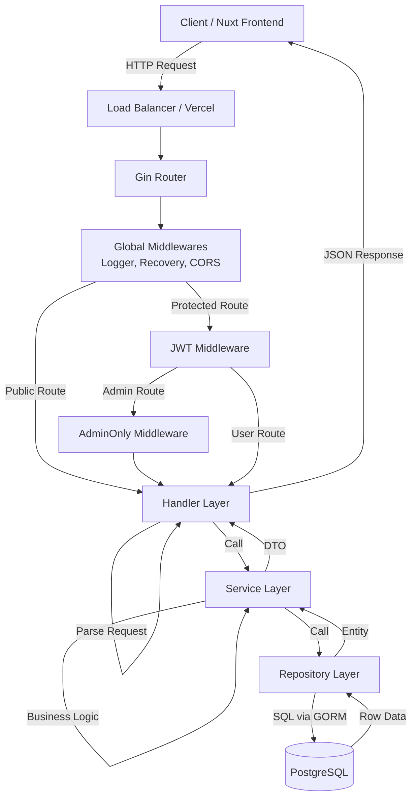
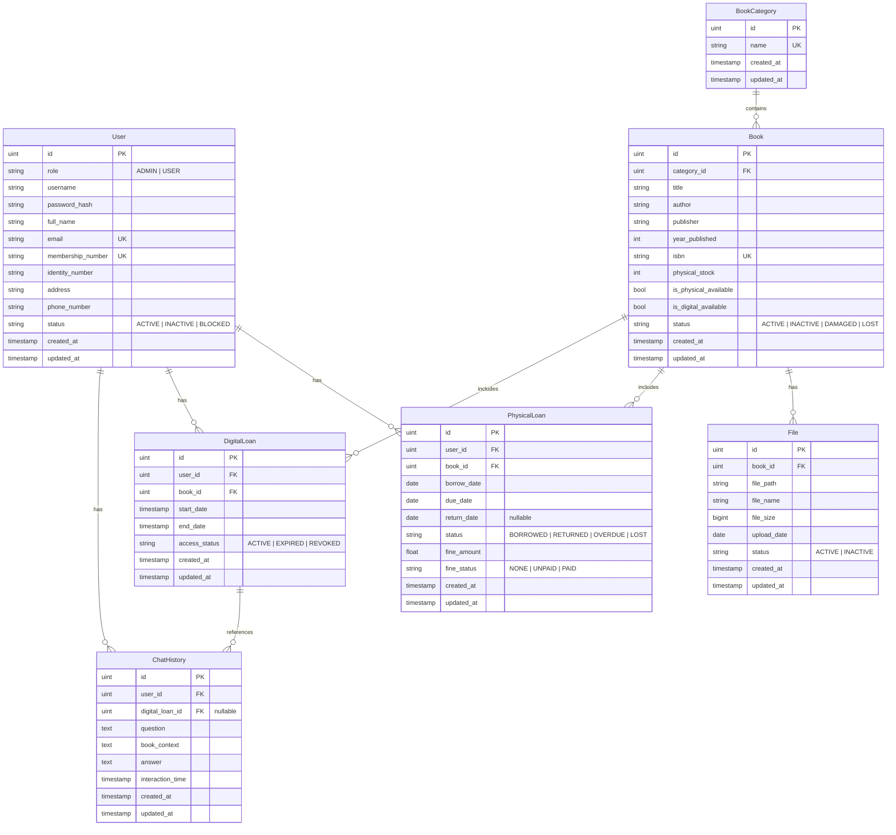
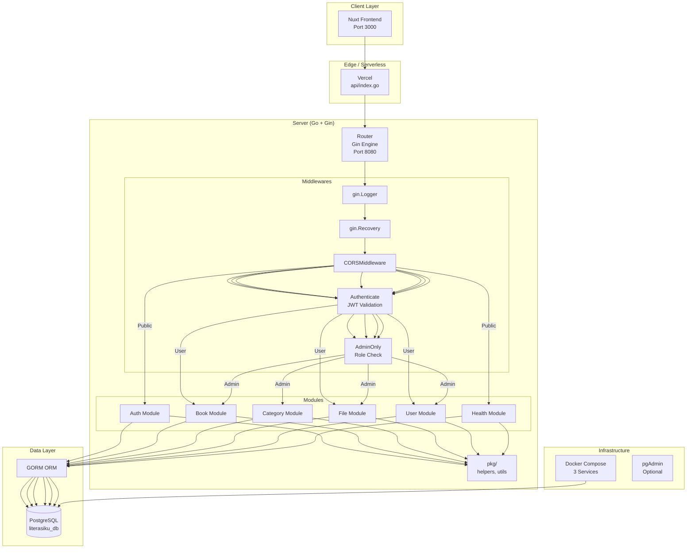
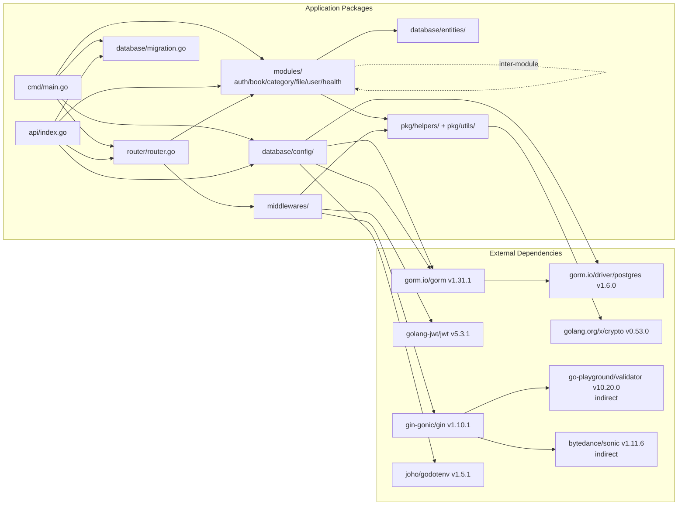
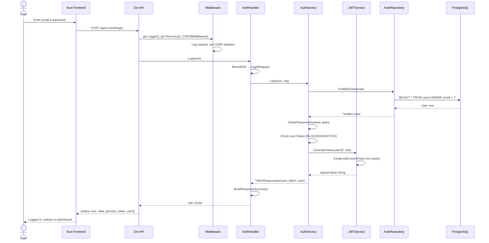
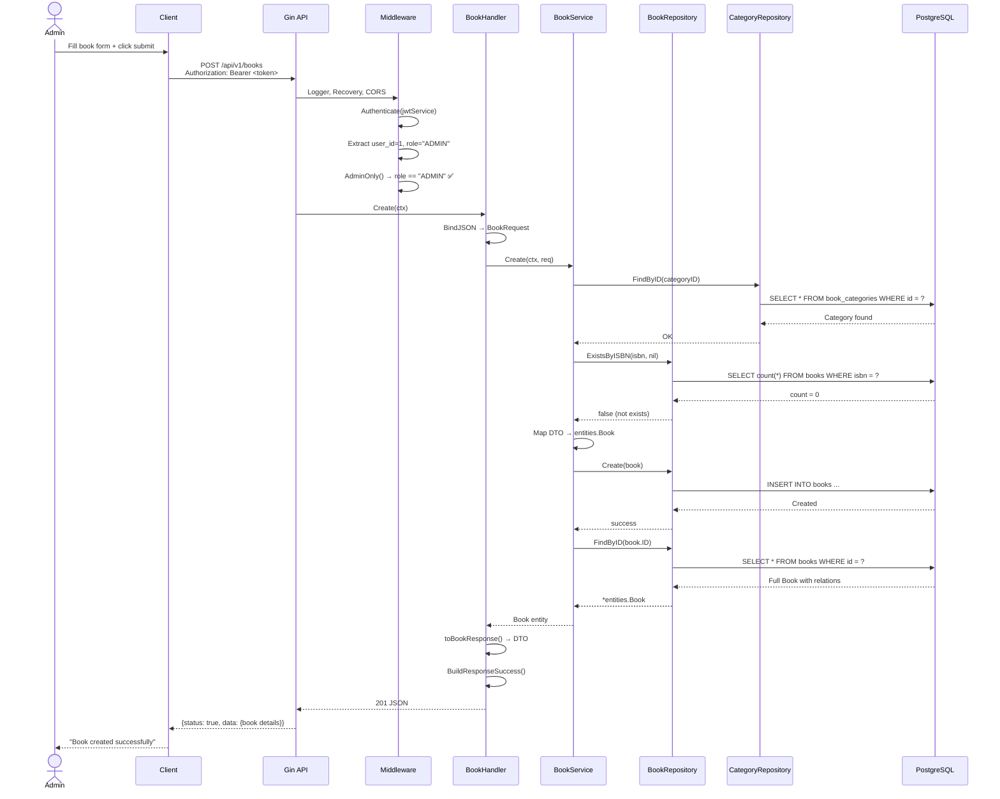

# Literasiku — Comprehensive Codebase Audit Report

> **Audit Date:** June 29, 2026
> **Project:** Literasiku — Digital & Physical Library Management System
> **Stack:** Go 1.25, Gin Framework, GORM, PostgreSQL
> **Auditor:** Principal Software Engineer / Technical Auditor

---

## Table of Contents

1. [Executive Summary](#1-executive-summary)
2. [Struktur Project](#2-struktur-project)
3. [Dependency Analysis](#3-dependency-analysis)
4. [Architecture Analysis](#4-architecture-analysis)
5. [Request Flow](#5-request-flow)
6. [Routing Analysis](#6-routing-analysis)
7. [Middleware Analysis](#7-middleware-analysis)
8. [Configuration Management](#8-configuration-management)
9. [Database Analysis](#9-database-analysis)
10. [Entity Relationship](#10-entity-relationship)
11. [Authentication & Authorization](#11-authentication--authorization)
12. [Validation](#12-validation)
13. [Error Handling](#13-error-handling)
14. [Logging](#14-logging)
15. [API Response Standard](#15-api-response-standard)
16. [Code Quality](#16-code-quality)
17. [Concurrency](#17-concurrency)
18. [Context Usage](#18-context-usage)
19. [Performance Analysis](#19-performance-analysis)
20. [Security Analysis](#20-security-analysis)
21. [API Documentation](#21-api-documentation)
22. [Testing](#22-testing)
23. [Docker & Deployment](#23-docker--deployment)
24. [Observability](#24-observability)
25. [Scalability](#25-scalability)
26. [Maintainability](#26-maintainability)
27. [Technical Debt](#27-technical-debt)
28. [Refactoring Opportunity](#28-refactoring-opportunity)
29. [Best Practice Checklist](#29-best-practice-checklist)
30. [Overall Architecture Diagram](#30-overall-architecture-diagram)
31. [Dependency Diagram](#31-dependency-diagram)
32. [Sequence Diagram](#32-sequence-diagram)
33. [Production Readiness Score](#33-production-readiness-score)
34. [Final Recommendation](#34-final-recommendation)

---

## 1. Executive Summary

| Attribute | Description |
|---|---|
| **Project Name** | Literasiku |
| **Tujuan** | Backend REST API untuk sistem manajemen perpustakaan digital dan fisik. Mendukung peminjaman buku fisik, peminjaman buku digital, katalog buku, kategorisasi, manajemen pengguna, dan chat history. |
| **Fungsi Utama** | CRUD Auth (register/login/logout), CRUD Buku, CRUD Kategori, CRUD File, CRUD User, Health Check |
| **Jenis API** | RESTful JSON API |
| **Teknologi** | Go 1.25, Gin v1.10.1, GORM v1.31.1, PostgreSQL, JWT (HS256), bcrypt, godotenv |
| **Kompleksitas** | **Low-Medium** — 5 modul, arsitektur layered sederhana, tanpa event bus, queue, atau sistem async |
| **Perkiraan Ukuran** | ~2500 LOC Go, 7 entity, 5 module handler/service/repository, 3 middleware |
| **Kualitas Implementasi** | **Fair** — Struktur rapi dan konsisten, namun banyak celah security, production-readiness rendah, testing 0%, observability 0% |

### Summary Box

```
+====================================================================+
| Kualitas Arsitektur    : ████████░░ 7/10 — Layered rapi, modular   |
| Kualitas Keamanan      : ██░░░░░░░░ 2/10 — Banyak celah kritis    |
| Kualitas Kode          : ██████░░░░ 6/10 — Clean cukup, tanpa test |
| Production Readiness   : ██░░░░░░░░ 2/10 — Jauh dari production    |
| Testing                : ░░░░░░░░░░ 0/10 — Nol test sama sekali    |
| Observability          : ░░░░░░░░░░ 0/10 — No metrics/tracing      |
+====================================================================+
```

---

## 2. Struktur Project

```
server/
├── api/
│   └── index.go              # Entry point untuk Vercel Serverless
├── cmd/
│   ├── main.go               # Entry point utama (CLI / Docker)
│   └── main.exe              # Binary (tidak boleh di-commit)
├── database/
│   ├── config/
│   │   ├── config.go         # Load .env, config struct
│   │   ├── database.go       # Koneksi PostgreSQL via GORM
│   │   └── email.go          # EMPTY FILE — tidak berfungsi
│   ├── entities/
│   │   ├── common.go         # Timestamp + Authorization struct
│   │   ├── user.go
│   │   ├── book.go
│   │   ├── book_category.go
│   │   ├── file.go
│   │   ├── physical_loan.go
│   │   ├── digital_loan.go
│   │   └── chat_history.go
│   └── migration.go          # AutoMigrate + foreign key manual
├── middlewares/
│   ├── authentication.go     # JWT Bearer token validation
│   ├── cors.go               # CORS middleware
│   └── rbac.go               # AdminOnly role check
├── modules/
│   ├── auth/
│   │   ├── dto/
│   │   ├── handler/
│   │   ├── service/
│   │   └── repository/
│   ├── book/
│   │   ├── dto/
│   │   ├── handler/
│   │   ├── service/
│   │   └── repository/
│   ├── category/
│   │   ├── dto/
│   │   ├── handler/
│   │   ├── service/
│   │   └── repository/
│   ├── file/
│   │   ├── dto/
│   │   ├── handler/
│   │   ├── service/
│   │   └── repository/
│   ├── health/
│   │   └── handler/
│   └── user/
│       ├── dto/
│       ├── handler/
│       ├── service/
│       └── repository/
├── pkg/
│   ├── helpers/
│   │   └── password.go       # bcrypt hash/verify
│   └── utils/
│       └── response.go       # Standard API response builder
├── router/
│   └── router.go             # Route definitions + DI wiring
├── Dockerfile                # Multi-stage build
├── .air.toml                 # Hot-reload config (Air)
├── vercel.json               # Vercel serverless config
├── go.mod / go.sum
└── .env / .env.example
```

| Folder | Fungsi |
|---|---|
| `cmd/` | Entry point aplikasi (main function) |
| `api/` | Entry point untuk Vercel serverless (Google Cloud Functions style) |
| `database/config/` | Koneksi DB, konfigurasi, env loader |
| `database/entities/` | GORM model / entity definitions |
| `database/` | Auto migration logic |
| `middlewares/` | Gin middlewares (auth, CORS, RBAC) |
| `modules/` | Setiap modul bisnis memiliki folder sendiri dengan DTO → Handler → Service → Repository |
| `pkg/helpers/` | Utility fungsi (password) |
| `pkg/utils/` | API response builder |
| `router/` | Route definitions + dependency injection |

---

## 3. Dependency Analysis

| Dependency | Version | Usage | Status | Notes |
|---|---|---|---|---|
| `github.com/gin-gonic/gin` | v1.10.1 | HTTP Router & Framework | ✅ Active | Stable, widely used |
| `github.com/golang-jwt/jwt/v5` | v5.3.1 | JWT token generation & validation | ✅ Active | v5 is latest |
| `github.com/joho/godotenv` | v1.5.1 | Load `.env` file | ✅ Active | Simple env loader |
| `golang.org/x/crypto` | v0.53.0 | bcrypt password hashing | ✅ Active | Go subrepo |
| `gorm.io/gorm` | v1.31.1 | ORM | ✅ Active | v1.31.x stable |
| `gorm.io/driver/postgres` | v1.6.0 | PostgreSQL driver for GORM | ✅ Active | |

**Analysis:**
- All dependencies are **actively maintained** and none are deprecated.
- Missing critical dependencies:
  - ❌ **No structured logger** (zap/logrus/slog) — only using `log.Printf`
  - ❌ **No validator library** — relying on gin's built-in `binding` tags
  - ❌ **No config library** (viper) — manual `os.Getenv`
  - ❌ **No Redis client** — needed for token blacklist, rate limiting, caching
  - ❌ **No test framework** (testify) — zero tests
  - ❌ **No swagger** (swaggo) — no API documentation
  - ❌ **No monitoring** (prometheus, opentelemetry) — no observability

---

## 4. Architecture Analysis

```
+------------------------------------------------------+
|              LAYERED ARCHITECTURE                     |
|         (with Repository Pattern)                    |
+------------------------------------------------------+
```

The project uses a **Layered Architecture** (presentation → business → persistence) combined with **Repository Pattern**. This is **not** Clean Architecture, Hexagonal, or DDD.

**Evidence:**
- `Handler` → `Service` → `Repository` pattern is used consistently across all 5 modules.
- Interfaces are defined per layer (e.g., `BookService` interface, `BookRepository` interface).
- The `Deps` struct in `router.go` manually wires all dependencies — simple manual DI.
- Entity structs are in `database/entities/` and shared across all layers (violates Clean Architecture principle of layer isolation).
- No `domain` package — entities live in the database layer, coupling business logic to the ORM.

**Identified Patterns:**
| Pattern | Present | Evidence |
|---|---|---|
| MVC | ✅ Partial | Handler = Controller, Entity = Model, no View |
| Repository Pattern | ✅ Yes | Interface-based data access |
| Service Pattern | ✅ Yes | Business logic in service layer |
| Layered Architecture | ✅ Yes | Handler → Service → Repository |
| Dependency Injection | ✅ Manual | Constructor injection via `Deps` struct |
| Clean Architecture | ❌ No | Entities not isolated, domain depends on GORM |
| Hexagonal Architecture | ❌ No | No ports/adapters |
| DDD | ❌ No | No aggregates, value objects, domain events |
| CQRS | ❌ No | Same model for read/write |
| Onion Architecture | ❌ No | |

---

## 5. Request Flow



**Detailed Flow (Example: Create Book):**
```
POST /api/v1/books
  → gin.Logger() [stdout log]
  → gin.Recovery() [panic recovery]
  → CORSMiddleware() [set headers]
  → Authenticate() [JWT validation]
  → AdminOnly() [role check]
  → BookHandler.Create()
    → Bind JSON to BookRequest DTO
    → BookService.Create()
      → Validate Category exists
      → Validate ISBN uniqueness
      → BookRepository.Create()
        → GORM db.Create()
      → BookRepository.FindByID()
    → Map entity → BookResponse DTO
  → Response {status, message, data}
```

---

## 6. Routing Analysis

| Method | Endpoint | Auth | Role | Handler | Description |
|---|---|---|---|---|---|
| GET | `/` | ❌ | Public | Inline | Root welcome message |
| GET | `/api/v1/health` | ❌ | Public | `health.Handler` | DB health check |
| POST | `/api/v1/auth/register` | ❌ | Public | `AuthHandler.Register` | Register user |
| POST | `/api/v1/auth/login` | ❌ | Public | `AuthHandler.Login` | Login user |
| POST | `/api/v1/auth/logout` | ✅ | User | `AuthHandler.Logout` | Logout (stateless, no-op) |
| GET | `/api/v1/books` | ❌ | Public | `BookHandler.GetAll` | List books (paginated) |
| GET | `/api/v1/books/:id` | ❌ | Public | `BookHandler.GetByID` | Get book detail |
| POST | `/api/v1/books` | ✅ | ADMIN | `BookHandler.Create` | Create book |
| PATCH | `/api/v1/books/:id` | ✅ | ADMIN | `BookHandler.Update` | Update book |
| DELETE | `/api/v1/books/:id` | ✅ | ADMIN | `BookHandler.Delete` | Delete book |
| GET | `/api/v1/categories` | ❌ | Public | `CategoryHandler.GetAll` | List categories |
| GET | `/api/v1/categories/:id` | ❌ | Public | `CategoryHandler.GetByID` | Get category |
| POST | `/api/v1/categories` | ✅ | ADMIN | `CategoryHandler.Create` | Create category |
| PATCH | `/api/v1/categories/:id` | ✅ | ADMIN | `CategoryHandler.Update` | Update category |
| DELETE | `/api/v1/categories/:id` | ✅ | ADMIN | `CategoryHandler.Delete` | Delete category |
| GET | `/api/v1/files/book/:book_id` | ✅ | User | `FileHandler.GetByBookID` | Get files by book |
| GET | `/api/v1/files/:id` | ✅ | User | `FileHandler.GetByID` | Get file detail |
| POST | `/api/v1/files` | ✅ | ADMIN | `FileHandler.Create` | Create file record |
| PATCH | `/api/v1/files/:id` | ✅ | ADMIN | `FileHandler.Update` | Update file |
| DELETE | `/api/v1/files/:id` | ✅ | ADMIN | `FileHandler.Delete` | Delete file |
| GET | `/api/v1/users/me` | ✅ | User | `UserHandler.Me` | Get own profile |
| PATCH | `/api/v1/users/me` | ✅ | User | `UserHandler.UpdateMe` | Update own profile |
| GET | `/api/v1/users` | ✅ | ADMIN | `UserHandler.GetAll` | List all users |
| GET | `/api/v1/users/:id` | ✅ | ADMIN | `UserHandler.GetByID` | Get user by ID |
| PATCH | `/api/v1/users/:id` | ✅ | ADMIN | `UserHandler.Update` | Update any user |
| DELETE | `/api/v1/users/:id` | ✅ | ADMIN | `UserHandler.Delete` | Delete user |

**Observations:**
- ✅ API versioning via `/api/v1/` prefix
- ✅ Consistent RESTful naming (plural nouns)
- ✅ Proper HTTP methods (GET/POST/PATCH/DELETE)
- ❌ No `PUT` support (uses `PATCH` only)
- ❌ `/api/v1/auth/logout` requires authentication but is **stateless JWT** — logout is essentially a no-op
- ❌ **No pagination on file endpoints** — files could be large
- ❌ **No input sanitization** on search queries (raw user input in ILIKE)

---

## 7. Middleware Analysis

### 7.1 `gin.Logger()` (Built-in)
- **Severity:** Info
- **Fungsi:** Logs every request to stdout (method, path, status, latency)
- **Issue:** Uses `gin.Logger()` default format — not structured JSON, not suitable for production log aggregation (ELK, Datadog, etc.)

### 7.2 `gin.Recovery()` (Built-in)
- **Severity:** Info
- **Fungsi:** Panic recovery — returns 500 instead of crashing
- **Issue:** No custom recovery — panic stack trace is not logged properly for debugging

### 7.3 `CORSMiddleware()` (Custom)
- **Severity:** High
- **Fungsi:** Sets permissive CORS headers
- **Issue:** `Access-Control-Allow-Origin: *` — allows any origin. For production, restrict to specific domains.

### 7.4 `Authenticate(jwtService)` (Custom)
- **Severity:** Critical
- **Fungsi:** Validates JWT Bearer token, extracts user_id and role
- **Issues:**
  - Parses token **twice** (`ValidateToken` and then `GetUserIDByToken`/`GetRoleByToken`) — inefficient, token should be parsed once
  - `GetUserIDByToken` and `GetRoleByToken` each call `ValidateToken` separately
  - Uses `MapClaims` type assertion instead of typed claims — fragile
  - **No token expiry check** — `jwt.RegisteredClaims` only sets `Issuer` and `IssuedAt`, no `ExpiresAt`

### 7.5 `AdminOnly()` (Custom)
- **Severity:** Medium
- **Fungsi:** Checks if `ctx.GetString("role") == "ADMIN"` — simple RBAC
- **Issue:** Hardcoded role check — not scalable for future roles (e.g., LIBRARIAN, MANAGER)

**Missing Middlewares (Critical for Production):**
- ❌ Rate Limiter — no protection against brute force / DDoS
- ❌ Request ID — no tracing correlation ID
- ❌ Timeout — no request timeout middleware
- ❌ Security Headers — no `X-Content-Type-Options`, `X-Frame-Options`, `Strict-Transport-Security`, etc.
- ❌ Request Logger (Structured) — no JSON logging
- ❌ Compress — no gzip response compression

---

## 8. Configuration Management

| Aspect | Status | Detail |
|---|---|---|
| File Format | `.env` | Uses godotenv |
| Config Struct | ✅ | `Config` struct in `config.go` |
| Singleton | ✅ | Global `DB *gorm.DB` variable |
| Fallback | ✅ | Default values for all fields |
| Type Safety | ✅ | Typed struct fields |
| Validation | ❌ | No config validation — missing required fields (e.g., `JWT_SECRET`) silently use defaults |

**Critical Issue:** `JWT_SECRET` defaults to hardcoded string `"literasiku-secret-key"` if not set via environment (`jwt_service.go:40`). This is a **security vulnerability**.

**Strength:** Supports `DATABASE_URL` for cloud deployments (Neon/Supabase) — production-ready thinking.

**Weakness:** No `viper`, no config hot-reload, no multi-source support (env/file/flag).

---

## 9. Database Analysis

| Attribute | Value |
|---|---|
| Database | PostgreSQL |
| Connection | GORM via `gorm.io/driver/postgres` |
| Pooling | ✅ `SetMaxIdleConns(2)`, `SetMaxOpenConns(5)`, `SetConnMaxLifetime(5m)` |
| Migration | ✅ AutoMigrate + raw SQL for foreign keys |
| Transaction | ❌ **Not used anywhere** — all operations are auto-commit |
| Index | ✅ Via GORM tags (`index`, `uniqueIndex`) |
| Foreign Key | ✅ Manual `ALTER TABLE` in `migration.go` |
| Raw SQL | ❌ Not used (ORM only) |

**Connection Pool Values:**
```go
sqlDB.SetMaxIdleConns(2)         // Low — may cause frequent connection churn
sqlDB.SetMaxOpenConns(5)         // Very low — bottleneck at 5 concurrent DB connections
sqlDB.SetConnMaxLifetime(5 * time.Minute)  // Reasonable
```

**Severity:** High — `SetMaxOpenConns(5)` is too restrictive. With concurrent API requests, this will quickly become a bottleneck, causing request queueing and timeouts.

**DisableForeignKeyConstraintWhenMigrating: true** — GORM skips FK constraint creation during AutoMigrate, but migration.go manually adds them. This is a workaround for GORM's limitation with circular dependencies, but adds maintenance burden.

---

## 10. Entity Relationship



---

## 11. Authentication & Authorization

### Authentication

| Aspect | Status | Detail |
|---|---|---|
| Method | JWT (HS256) | `github.com/golang-jwt/jwt/v5` |
| Token Type | Bearer | Sent via `Authorization: Bearer <token>` |
| Claims | user_id, role | Via `jwtCustomClaim` struct |
| Expiry | ❌ **NONE** | Token never expires — severe security issue |
| Issuer | `"literasiku"` | Set via `jwt.RegisteredClaims` |
| Secret | `JWT_SECRET` env | Falls back to hardcoded `"literasiku-secret-key"` |
| Signing | HMAC-SHA256 | Symmetric key |

### Authorization

| Aspect | Status | Detail |
|---|---|---|
| Role Model | Simple role string | `"ADMIN"` or `"USER"` |
| RBAC | ✅ | `AdminOnly()` middleware |
| ABAC | ❌ | Not implemented |
| Permission-based | ❌ | Not implemented |
| Ownership Check | ✅ Partial | `/users/me` checks own ID from token, but `/users/:id` (admin) has no ownership context |

### Critical Findings

1. **JWT has no expiration** — once a token is issued, it's valid forever. No refresh token mechanism.
2. **Hardcoded JWT secret fallback** — if `JWT_SECRET` env is not set, uses `"literasiku-secret-key"`.
3. **Logout is a no-op** — `authService.Logout` only checks if user exists, does NOT blacklist the token.
4. **No password change mechanism** — no endpoint to change/reset password.
5. **No rate limiting on login** — brute force attack vector.
6. **Token parsed twice** — `GetUserIDByToken` and `GetRoleByToken` each call `ValidateToken` separately.

---

## 12. Validation

| Aspect | Status | Detail |
|---|---|---|
| Request Binding | ✅ | Gin's `ShouldBindJSON` |
| Struct Tags | ✅ | `binding:"required,min=3,max=50"` etc. |
| Custom Validator | ❌ | Not implemented — only built-in Gin/validator tags |
| Email Validation | ✅ | `binding:"email"` |
| Password Strength | ℹ️ | `min=8,max=72` (bcrypt max) |
| Enum Validation | ✅ | `oneof=ACTIVE INACTIVE DAMAGED LOST` |
| Sanitization | ❌ | **No input sanitization** — raw user input used in SQL ILIKE queries |
| File Upload Validation | ❌ | File module only stores metadata, actual file upload logic is missing |
| Date Validation | ✅ Manual | `file_service.go` parses date manually |

**Issue:** User input from `search` query params is used directly in SQL `ILIKE` queries. While GORM parameterized queries prevent SQL injection, the lack of sanitization could allow other injection vectors or performance issues (e.g., extremely long search strings).

---

## 13. Error Handling

| Aspect | Status | Detail |
|---|---|---|
| Custom Errors | ✅ | `dto.ErrEmailAlreadyExists`, etc. |
| Error Wrapping | ✅ | `fmt.Errorf("hash password: %w", err)` |
| HTTP Status | ✅ | Appropriate status codes used |
| Panic Recovery | ✅ | `gin.Recovery()` |
| Error Logging | ✅ | Via `log.Printf` |
| Standard Response | ✅ | `utils.Response` struct |
| Consistency | ✅ | All handlers follow same pattern |

**Pattern Used:**
```go
result, err := h.authService.Register(ctx.Request.Context(), req)
if err != nil {
    status := http.StatusBadRequest
    switch {
    case errors.Is(err, dto.ErrEmailAlreadyExists):
        status = http.StatusConflict
    }
    res := utils.BuildResponseFailed(dto.MESSAGE_FAILED_REGISTER_USER, err.Error(), nil)
    ctx.JSON(status, res)
    return
}
```

**Positive:** Error wrapping with `%w` is used consistently, allowing `errors.Is` and `errors.As`.

**Negative:** Error messages are directly exposed to API consumers in some cases (`err.Error()`). This can leak internal implementation details in production.

---

## 14. Logging

| Aspect | Status | Detail |
|---|---|---|
| Library | `log` (standard library) | `log.Printf`, `log.Fatalf` |
| Structured | ❌ | Plain text — not JSON |
| Levels | ❌ | Only `log.Printf` — no debug/info/warn/error levels |
| Production Ready | ❌ | Not suitable for log aggregation (ELK, Loki, Datadog) |

**Issue:** The project uses Go's standard `log` package for all logging. This is insufficient for production:
- No structured JSON output
- No log levels (debug, info, warn, error)
- No correlation ID in logs
- Cannot be easily ingested by log aggregation tools

**Recommendation:** Replace with `slog` (Go 1.21+ standard library structured logger) or `zap` (Uber high-performance logger).

---

## 15. API Response Standard

All API responses follow a consistent format:

### Success Response
```json
{
    "status": true,
    "message": "Book retrieved successfully",
    "data": { ... }
}
```

### Error Response
```json
{
    "status": false,
    "message": "Failed to create book",
    "error": "category not found"
}
```

### Paginated Response
```json
{
    "status": true,
    "message": "Books retrieved successfully",
    "data": {
        "data": [ ... ],
        "page": 1,
        "limit": 10,
        "total": 42,
        "total_pages": 5
    }
}
```

**Response Structure:**
```go
type Response struct {
    Status  bool   `json:"status"`
    Message string `json:"message"`
    Error   any    `json:"error,omitempty"`
    Data    any    `json:"data,omitempty"`
    Meta    any    `json:"meta,omitempty"`
}
```

**Positives:**
- ✅ Consistent format across all endpoints
- ✅ Paginated response with total/page/limit/totalPages
- ✅ `omitempty` for optional fields

**Negatives:**
- ❌ `Meta` field is defined but never used
- ❌ No error code (just message string) — clients cannot programmatically handle errors
- ❌ Error messages sometimes contain internal details (leakage)

---

## 16. Code Quality

### Strengths
- ✅ **Consistent structure** — every module follows Handler → Service → Repository pattern
- ✅ **Interface-based design** — loose coupling between layers
- ✅ **DRY** — `utils.BuildResponseSuccess/Failed` reused everywhere
- ✅ **No god functions** — functions are focused and small (avg 20-40 lines)
- ✅ **Good naming** — clear, descriptive function/variable names
- ✅ **No circular dependencies** — dependency flows one direction (Handler → Service → Repository)
- ✅ **No magic numbers** — all constants are named
- ✅ **No dead code** found

### Weaknesses
- ❌ **Duplicate pagination logic** — `PaginatedResponse` struct defined separately in book, category, and user DTOs
- ❌ **Imports with blank identifier** — e.g., `_ "github.com/literasiKu/middlewares"` not used (not present, but aliases like `bookhandler "..."` are unnecessary since package name matches)
- ❌ **`api/index.go` duplicates `cmd/main.go`** — almost identical initialization code, violates DRY
- ❌ **No comments** — zero code comments (though the prompt instructions explicitly ask for no comments, so this is intentional)
- ❌ **No logging in production paths** — `log.Printf` only used in startup/error paths
- ❌ **`database/entities/common.go`** contains `Authorization` struct with `binding:"required"` tags that are never used in any handler — dead struct

### SOLID Assessment

| Principle | Status | Evidence |
|---|---|---|
| **S**ingle Responsibility | ✅ | Each file has clear responsibility |
| **O**pen/Closed | ✅ | Interface-based design allows extension |
| **L**iskov Substitution | ✅ | Interfaces correctly implemented |
| **I**nterface Segregation | ⚠️ | Some interfaces are thin enough, but `UserRepository` mixes CRUD with `ExistsByEmail` |
| **D**ependency Inversion | ✅ | High-level modules depend on abstractions (interfaces) |

---

## 17. Concurrency

**Usage:**
| Feature | Status | Evidence |
|---|---|---|
| Goroutine | ❌ | Not used anywhere |
| Channel | ❌ | Not used |
| Mutex | ❌ | Not used |
| WaitGroup | ❌ | Not used |
| Context | ✅ | Used in service/handler layer but not fully utilized |
| Race Detection | ❌ | No race tests or detection |

**Finding:** The codebase is **fully synchronous**. Every request handler blocks until the database operation completes. There is no concurrent processing, no background workers, and no async operations.

This is acceptable for low-traffic applications, but for production, consider:
- Caching layer (Redis)
- Background jobs for async tasks (email notifications, report generation)
- Parallel DB queries where applicable

---

## 18. Context Usage

| Aspect | Status | Detail |
|---|---|---|
| Context in Handler | ✅ | `ctx.Request.Context()` passed to Service |
| Context in Service | ✅ | Accepted as first parameter in interface methods |
| Context in Repository | ❌ | Repository methods do NOT accept `context.Context` |
| Cancellation | ❌ | No `context.WithCancel` or `context.WithTimeout` |
| Timeout | ❌ | No request timeout — a slow DB query blocks indefinitely |

**Issue:** Repository layer does not propagate context to GORM. All repository methods call `r.db.Create(book).Error` without context. GORM supports `WithContext(ctx)` — this should be used to propagate cancellation and timeouts.

Example of missing context propagation:
```go
// Current code in book_repository.go:
func (r *bookRepository) Create(book *entities.Book) error {
    return r.db.Create(book).Error  // ❌ No context
}

// Should be:
func (r *bookRepository) Create(ctx context.Context, book *entities.Book) error {
    return r.db.WithContext(ctx).Create(book).Error  // ✅
}
```

---

## 19. Performance Analysis

| Concern | Severity | Detail |
|---|---|---|
| **N+1 Query** | Medium | Book entity has `Files`, `PhysicalLoans`, `DigitalLoans` relations — no explicit `Preload` or `Joins` in FindByID, could trigger N+1 if accessed |
| **Connection Pool** | High | `SetMaxOpenConns(5)` is extremely low — 6th concurrent request will queue |
| **Reflection** | Low | GORM and Gin use reflection (unavoidable with these libraries) |
| **JSON Marshal** | Info | Standard JSON encoding — fine for most use cases |
| **No Cache** | High | Every request hits the database directly |
| **No Pagination** | Medium | File endpoints return all records without pagination |
| **No Compression** | Medium | No gzip middleware for large responses |
| **No Streaming** | Info | Not needed for current use case |

**N+1 Risk Analysis:**
```go
// book_repository.go:29-35
func (r *bookRepository) FindByID(id uint) (*entities.Book, error) {
    var book entities.Book
    err := r.db.First(&book, id).Error  // Loads book WITHOUT relations
    // If handler/serializer accesses book.Category, book.Files, etc.,
    // GORM will execute additional queries for each relation
}
```

---

## 20. Security Analysis

| Vulnerability | Severity | Status | Detail |
|---|---|---|---|
| **SQL Injection** | Medium | ✅ Protected | GORM parameterized queries prevent injection |
| **XSS** | Medium | ❌ Not Protected | No output encoding, no CSP headers |
| **CSRF** | Medium | ❌ Not Protected | No CSRF token — but Bearer token auth mitigates |
| **SSRF** | Low | ❌ Not tested | No external URL fetching |
| **JWT No Expiry** | **Critical** | ❌ | Tokens never expire — no revocation possible |
| **Hardcoded Secret** | **Critical** | ❌ | `"literasiku-secret-key"` fallback |
| **Sensitive Data Exposure** | Medium | ❌ | Password not exposed (json:"-"), but error messages may leak info |
| **CORS Wildcard** | Medium | ❌ | `Access-Control-Allow-Origin: *` |
| **Rate Limit** | **Critical** | ❌ | No rate limiting — brute force login possible |
| **Brute Force** | **Critical** | ❌ | Login endpoint unprotected |
| **IDOR** | High | ℹ️ Partial | `/users/me` uses token user_id, but admin endpoints have no additional checks |
| **Path Traversal** | Medium | ❌ | File paths stored as strings with no validation |
| **File Upload** | Medium | ❌ | No actual file upload handling — only metadata |
| **Security Headers** | Medium | ❌ | No HSTS, X-Content-Type-Options, X-Frame-Options, CSP |
| **Input Validation** | Low | ✅ | Via Gin binding tags |
| **Command Injection** | Low | ✅ | No OS command execution |
| **Broken Authentication** | **Critical** | ❌ | No password expiry, no refresh token, no MFA |
| **Mass Assignment** | Medium | ✅ Protected | DTO structs explicitly map fields |
| **BOLA** | High | ⚠️ Partial | User can only access own profile, but admin can access all — no object-level access logs |

### Detailed Security Issue: JWT Secret
```go
// jwt_service.go:37-42
func getSecretKey() string {
    secret := os.Getenv("JWT_SECRET")
    if secret == "" {
        secret = "literasiku-secret-key"  // HARDCODED FALLBACK
    }
    return secret
}
```
An attacker who knows this default secret can forge valid JWT tokens for any user, including ADMIN.

### Detailed Security Issue: Token Parsing
```go
// jwt_service.go:70-78
func (j *jwtService) ValidateToken(token string) (*jwt.Token, error) {
    parsed, err := jwt.Parse(token, j.parseToken)
    // ...
    return parsed, nil
}

// jwt_service.go:81-95
func (j *jwtService) GetUserIDByToken(token string) (uint, error) {
    parsed, err := j.ValidateToken(token)  // First parse
    claims, ok := parsed.Claims.(jwt.MapClaims)  // Type assertion to MapClaims
    idFloat, ok := claims["user_id"].(float64)  // Float64!
    return uint(idFloat), nil
}
```
Using `MapClaims` loses type safety. The token is parsed twice (once in middleware for validation, then again when extracting claims in `Authenticate`).

---

## 21. API Documentation

| Aspect | Status | Detail |
|---|---|---|
| Swagger / OpenAPI | ❌ | Not present |
| Postman Collection | ✅ | `LiterasikuAPITest/` directory contains Postman/Insomnia compatible YAML files |
| README | ✅ | `server/README.md` provides basic setup and endpoint list — minimal |
| Request Examples | ❌ | No curl/httpie examples |
| Response Examples | ❌ | Not documented |
| API Schema | ❌ | No generated schema |

**Note:** The `LiterasikuAPITest/` folder contains organized YAML files that serve as API test collections, covering Auth, Book, Category, File, and User endpoints. This is useful but not a substitute for proper OpenAPI/Swagger documentation.

---

## 22. Testing

| Aspect | Status | Detail |
|---|---|---|
| Unit Tests | ❌ | **Zero test files found** (`*_test.go`) |
| Integration Tests | ❌ | None |
| Mock | ❌ | No mock implementations |
| Coverage | ❌ | 0% |
| Benchmark | ❌ | None |
| Race Test | ❌ | None |

**Severity:** **Critical** — The complete absence of tests means:
- No regression protection
- No verification of business logic
- Cannot safely refactor
- No CI/CD pipeline can provide quality gates
- Production deployment is high-risk

---

## 23. Docker & Deployment

| Aspect | Status | Detail |
|---|---|---|
| **Dockerfile** | ✅ Present | Multi-stage build with `scratch` base image — very good |
| **docker-compose** | ✅ Present | 3 services: `db` (PostgreSQL), `go-api`, `nuxt-web` |
| **Multi-stage Build** | ✅ | Build in `golang:1.25-alpine`, run in `scratch` |
| **Health Check** | ❌ | No Docker health check in compose or Dockerfile |
| **Air (Hot Reload)** | ✅ | `.air.toml` for development |
| **Vercel** | ✅ | `vercel.json` + `api/index.go` for serverless deployment |
| **Kubernetes** | ❌ | Not configured |
| **CI/CD** | ❌ | No GitHub Actions, GitLab CI, or any pipeline |
| **Reverse Proxy** | ❌ | No Nginx/Traefik configuration |

**Dockerfile Review:**
```dockerfile
FROM golang:1.25-alpine AS build
RUN CGO_ENABLED=0 GOOS=linux GOARCH=amd64 go build \
    -ldflags="-s -w" \
    -o /app/server .
FROM scratch
COPY --from=build /etc/ssl/certs/ca-certificates.crt /etc/ssl/certs/
COPY --from=build /app/server /server
```

**Positives:**
- ✅ Multi-stage build with `scratch` final stage (minimal attack surface)
- ✅ Stripped binary with `-ldflags="-s -w"` (smaller size)
- ✅ `CGO_ENABLED=0` (no C library dependencies)
- ✅ CA certificates included for HTTPS outbound

**Negatives:**
- ❌ No `.dockerignore` — entire context sent to Docker daemon (includes `cmd/main.exe`, `.env`, etc.)
- ❌ No non-root user — runs as root in container
- ❌ No `HEALTHCHECK` instruction

---

## 24. Observability

| Aspect | Status | Detail |
|---|---|---|
| Structured Logging | ❌ | Uses standard `log` package |
| Metrics | ❌ | No Prometheus metrics |
| Tracing | ❌ | No OpenTelemetry / Jaeger |
| Health Endpoint | ✅ | `GET /api/v1/health` — checks DB ping |
| Readiness Probe | ❌ | Not implemented |
| Liveness Probe | ❌ | Not implemented |
| Grafana Dashboard | ❌ | Not configured |
| Sentry / Error Tracking | ❌ | Not configured |

**Severity:** **High** — In production, zero observability means:
- Cannot detect performance degradation
- Cannot trace request errors
- Cannot set up alerts
- No insight into system health beyond basic health check

---

## 25. Scalability

| Aspect | Status | Detail |
|---|---|---|
| Horizontal Scaling | ❌ | Not designed for stateless horizontal scaling |
| Vertical Scaling | ⚠️ | Would work but limited by DB connection pool |
| Stateless | ✅ Partial | API is stateless (JWT-based), but DB connection pool is fixed |
| Cache | ❌ | No Redis or any caching layer |
| Queue | ❌ | No message queue (Kafka, RabbitMQ) |
| Worker | ❌ | No background workers |
| Cron | ❌ | No scheduled jobs |
| Pagination | ✅ | Books and categories support pagination |

**Key Limitation:** `SetMaxOpenConns(5)` means at most 5 concurrent database operations. With multiple API endpoints, this creates a hard cap on throughput. Scaling beyond 5 concurrent requests requires horizontal scaling with multiple replicas, but each replica would also have its own pool of 5 connections, which needs careful management.

---

## 26. Maintainability

| Aspect | Score (1-10) | Notes |
|---|---|---|
| Modularity | 8 | Well-organized modules with clear separation |
| Reusability | 6 | Shared pagination DTO is duplicated across modules |
| Extensibility | 7 | Adding new module is straightforward (copy pattern) |
| Documentation | 3 | Minimal README, no code comments, no API docs |
| Testing | 0 | Zero tests — cannot refactor safely |
| Dependency Management | 7 | Go modules, clean go.mod, all deps actively maintained |
| Code Consistency | 9 | Very consistent pattern across all modules |
| Configurability | 5 | Only .env, no hot-reload, no validation |

**Overall Maintainability Score: 5.6/10**

---

## 27. Technical Debt

### Critical
| Issue | Impact | File |
|---|---|---|
| **JWT no expiry** | Token theft → permanent access | `jwt_service.go:45-53` |
| **Hardcoded JWT secret** | Anyone can forge tokens | `jwt_service.go:39-41` |
| **Zero tests** | Cannot refactor, no quality gate | All files |
| **No rate limiting** | Brute force / DDoS | Missing middleware |
| **No request timeout** | Slow operations hang forever | Missing middleware |

### High
| Issue | Impact | File |
|---|---|---|
| **DB pool too small (5)** | Bottleneck at low concurrency | `database.go:56` |
| **No context in repository** | Cancellation not propagated | All `_repository.go` files |
| **Token parsed twice** | Unnecessary CPU waste | `authentication.go:30-49` |
| **Logout is no-op** | No token revocation possible | `auth_service.go:104-113` |
| **No structured logging** | Cannot aggregate logs | All files |
| **No CORS origin restriction** | Security risk | `cors.go:12` |
| **Email config file empty** | Dead code / confusion | `email.go` |

### Medium
| Issue | Impact | File |
|---|---|---|
| **Duplicate PaginatedResponse** | Code duplication | 3 DTO files |
| **Duplicate initialization code** | `api/index.go` repeats `cmd/main.go` | Both files |
| **No pagination for files** | Potential memory issue | `file_handler.go` |
| **Unused `Meta` field** | Dead code | `response.go:8` |
| **No password change endpoint** | Missing feature | N/A |
| **No `.dockerignore`** | Bloated Docker build context | N/A |

### Low
| Issue | Impact | File |
|---|---|---|
| **`Authorization` struct unused** | Dead code | `common.go:12-14` |
| **No input sanitization search** | Minor risk | `book_repository.go:45` |
| **Binary `cmd/main.exe` committed** | Bloated repo | `cmd/main.exe` |
| **Inconsistent pagination calc** | `totalPages` calculated differently in user handler | `user_handler.go:43-47` |

---

## 28. Refactoring Opportunity

| Priority | Refactoring | Effort | Impact |
|---|---|---|---|
| **P1 - Critical** | Add JWT expiry (e.g., 15min access + 7d refresh token) | 1 day | Security |
| **P1 - Critical** | Add rate limiting middleware (gin-limiter or Redis-based) | 1 day | Security |
| **P1 - Critical** | Add request timeout middleware (e.g., 30s) | 0.5 day | Reliability |
| **P1 - Critical** | Write unit tests for service layer (at least 80% coverage) | 5 days | Quality |
| **P2 - High** | Implement token blacklist (Redis) for proper logout | 2 days | Security |
| **P2 - High** | Add structured logging (slog or zap) | 1 day | Observability |
| **P2 - High** | Increase and make DB pool configurable | 0.5 day | Performance |
| **P2 - High** | Propagate context to all repository methods | 1 day | Reliability |
| **P3 - Medium** | Remove duplicate PaginatedResponse — use shared DTO | 0.5 day | Clean code |
| **P3 - Medium** | Add Refresh Token endpoint | 2 days | Security |
| **P3 - Medium** | Add password change/reset flow | 2 days | Feature |
| **P3 - Medium** | Add Swagger/OpenAPI documentation | 2 days | Documentation |
| **P3 - Medium** | Consolidate `api/index.go` and `cmd/main.go` | 0.5 day | Clean code |
| **P4 - Low** | Add `.dockerignore` | 0.1 day | DevOps |
| **P4 - Low** | Run as non-root in container | 0.5 day | Security |
| **P4 - Low** | Add security headers middleware | 0.5 day | Security |
| **P4 - Low** | Remove committed binary (`cmd/main.exe`) from repo | 0.1 day | Housekeeping |

---

## 29. Best Practice Checklist

```
[✅] Menggunakan context.Context di handler dan service
[❌] context.Context di-propagasi ke repository / GORM
[❌] Request timeout (context.WithTimeout)
[❌] Graceful shutdown (signal handling for SIGINT/SIGTERM)
[❌] Structured logging (JSON)
[❌] Log levels (debug/info/warn/error)
[❌] Dependency injection (manual DI ✅, but no framework)
[✅] Interface-based design
[❌] Unit tests
[❌] Integration tests
[❌] Mock in tests
[❌] CI/CD pipeline
[✅] Docker multi-stage build
[❌] Docker non-root user
[❌] Health check in Docker
[❌] Rate limiting
[❌] Request timeout middleware
[❌] JWT expiry
[✅] Password hashing with bcrypt
[❌] Refresh token mechanism
[❌] Token blacklisting
[❌] Swagger / OpenAPI
[❌] Prometheus metrics
[❌] OpenTelemetry tracing
[✅] Database connection pooling
[❌] Config validation
[❌] Input sanitization
[✅] Parameterized queries (GORM default)
[❌] SQL transaction for atomic operations
[✅] API versioning (/api/v1/)
[❌] CORS origin restriction
[❌] Security headers
[❌] gzip compression
[❌] Request ID middleware
[❌] Proper error codes in response
[❌] Graceful degradation on DB failure
```

**Score: 9/35 ✅ = 25.7% compliance**

---

## 30. Overall Architecture Diagram



---

## 31. Dependency Diagram



---

## 32. Sequence Diagram

### Login Sequence



### Create Book Sequence (Admin)



---

## 33. Production Readiness Score

| Category | Score | Comments |
|---|---|---|
| **Architecture** | 70/100 | Layered architecture is sound, but not Clean Architecture. Manual DI works. |
| **Security** | 15/100 | JWT no expiry, hardcoded secret, no rate limit, CORS wildcard, no security headers. **Dismal.** |
| **Performance** | 35/100 | Tiny connection pool, no cache, no pagination for files, no compression. |
| **Testing** | 0/100 | Absolutely zero tests. |
| **Documentation** | 20/100 | Minimal README, no Swagger, Postman collection exists but is incomplete. |
| **Maintainability** | 55/100 | Clean code style, consistent patterns, but no tests, no comments, duplicated code. |
| **Deployment** | 55/100 | Docker multi-stage is good, but no CI/CD, no .dockerignore, no health check. |
| **Observability** | 5/100 | Only health endpoint (functional). No metrics, no tracing, no structured logging. |
| **Scalability** | 20/100 | Stateless API is scalable, but DB pool is bottleneck, no cache, no queue. |
| **Code Quality** | 60/100 | SOLID principles mostly followed, but no tests, some duplication, dead code. |

### Final Production Readiness Score

```
Architecture     ███████░░░ 70
Security         ██░░░░░░░░ 15
Performance      ████░░░░░░ 35
Testing          ░░░░░░░░░░  0
Documentation    ██░░░░░░░░ 20
Maintainability  ██████░░░░ 55
Deployment       ██████░░░░ 55
Observability    █░░░░░░░░░  5
Scalability      ██░░░░░░░░ 20
Code Quality     ██████░░░░ 60
================================
OVERALL:        ███░░░░░░░░ 33.5/100
```

**Assessment: NOT PRODUCTION READY**

The project has a solid foundation in terms of code organization and architecture pattern, but critical security flaws (JWT, rate limiting) and the complete absence of testing make it unsuitable for production deployment in its current state.

---

## 34. Final Recommendation

### Kelebihan Project

1. **Clean Structure** — Modular, consistent Handler→Service→Repository pattern across all modules.
2. **Interface-based Design** — Loose coupling, easy to swap implementations.
3. **Good Entity Design** — Well-thought-out database schema with proper relationships and constraints.
4. **Multi-stage Docker** — Production-grade Dockerfile with `scratch` base and stripped binary.
5. **Vercel Support** — Serverless deployment ready via `api/index.go`.
6. **Code Consistency** — Every module follows the exact same convention — easy for new developers to learn.

### Kelemahan Project

1. **No Testing** — Zero test coverage is the single biggest risk. Cannot refactor or deploy with confidence.
2. **Critical Security Flaws** — JWT without expiry and hardcoded secret fallback are show-stoppers.
3. **No Observability** — No structured logging, metrics, or tracing. Flying blind in production.
4. **No Rate Limiting** — Wide open for brute force attacks.
5. **No Context Propagation** — Repository layer ignores context, cancellation/timeout not supported.
6. **Tiny DB Connection Pool** — `SetMaxOpenConns(5)` is a hard scalability ceiling.
7. **Duplicated Code** — `PaginatedResponse` defined in 3 places, init logic duplicated.
8. **No API Documentation** — No Swagger/OpenAPI makes integration difficult for frontend.

### Risiko

| Risk | Likelihood | Impact | Mitigation |
|---|---|---|---|
| JWT token theft → account takeover | High | Critical | Add expiry + refresh token |
| Brute force login | High | High | Add rate limiting (immediate) |
| Regression bug from changes | High | High | Write tests (immediate) |
| Production outage from DB pool exhaustion | Medium | High | Increase pool size + add monitoring |
| Security breach via default JWT secret | Medium | Critical | Enforce JWT_SECRET env validation |

### Prioritas Perbaikan

**Must Fix (Before Any Production Deployment):**
1. Add JWT expiry (15-30 min access token) + refresh token mechanism
2. Enforce `JWT_SECRET` environment variable — fail startup if not set
3. Add rate limiting middleware (at minimum on `/auth/login`)
4. Write unit tests for auth service (critical business logic)
5. Add request timeout middleware

**Should Fix (Within First Sprint):**
6. Remove hardcoded secret fallback
7. Increase DB connection pool to reasonable values (25 idle, 100 max)
8. Add structured logging (slog or zap)
9. Propagate context to all repository methods
10. Implement token blacklist for proper logout

**Nice to Have (Within First Month):**
11. Add Swagger documentation
12. Add CI/CD pipeline (GitHub Actions)
13. Add Prometheus metrics
14. Consolidate duplicated code
15. Add `.dockerignore` and non-root user in Dockerfile

### Estimasi Effort

| Phase | Effort | Result |
|---|---|---|
| Phase 1: Security fixes | 3-5 days | Production-safe (minimal) |
| Phase 2: Testing foundation | 5-7 days | ~50% coverage on critical paths |
| Phase 3: Observability | 2-3 days | Structured logs + metrics |
| Phase 4: Hardening | 3-5 days | Cache, rate limit, timeout, CI/CD |
| **Total** | **13-20 days** | Production-ready |

### Langkah Selanjutnya

```mermaid
gantt
    title Literasiku - Production Readiness Roadmap
    dateFormat  YYYY-MM-DD
    
    section Phase 1 - Security (Critical)
    JWT expiry + refresh token        :a1, 3d
    Rate limiting middleware           :a2, 2d
    Enforce JWT_SECRET                 :a3, 1d
    Request timeout middleware         :a4, 1d
    
    section Phase 2 - Testing
    Auth service tests                 :b1, 2d
    Book service tests                 :b2, 2d
    User service tests                 :b3, 1d
    Integration test setup             :b4, 2d
    
    section Phase 3 - Observability
    Structured logging (slog)          :c1, 2d
    Health endpoint enhancement        :c2, 1d
    Prometheus metrics endpoint        :c3, 2d
    
    section Phase 4 - DevOps
    GitHub Actions CI/CD               :d1, 2d
    Docker hardening                    :d2, 1d
    Add .dockerignore + non-root       :d3, 1d
```

---

*End of Audit Report — Generated from direct source code analysis.*
